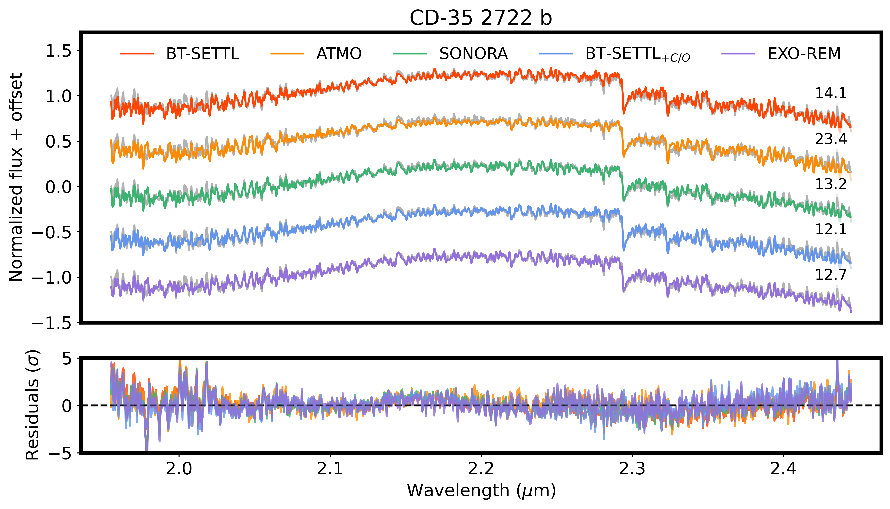
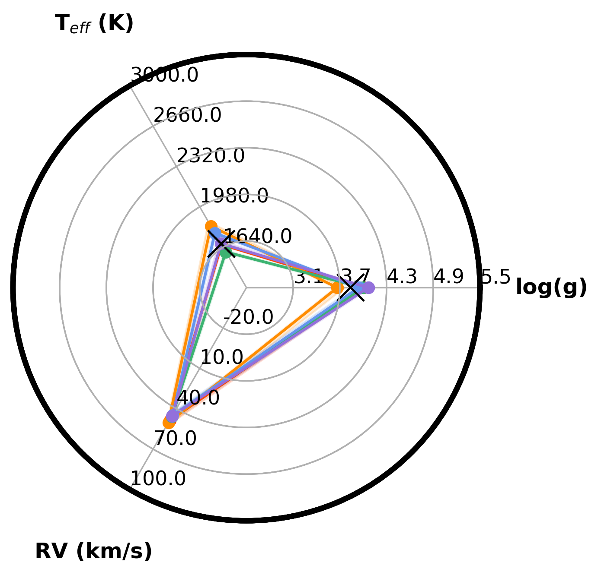

$\newcommand{\ensuremath}{}$
$\newcommand{\xspace}{}$
$\newcommand{\object}[1]{\texttt{#1}}$
$\newcommand{\farcs}{{.}''}$
$\newcommand{\farcm}{{.}'}$
$\newcommand{\arcsec}{''}$
$\newcommand{\arcmin}{'}$
$\newcommand{\ion}[2]{#1#2}$
$\newcommand{\textsc}[1]{\textrm{#1}}$
$\newcommand{\hl}[1]{\textrm{#1}}$
$\newcommand{\footnote}[1]{}$
$\newcommand{\MSun}{\ensuremath{M_{\odot}}\xspace}$
$\newcommand{\MJup}{\ensuremath{M_{\mathrm{Jup}}}\xspace}$
$\newcommand{\RJup}{\ensuremath{R_{\mathrm{Jup}}}\xspace}$
$\newcommand{\Teff}{\ensuremath{T_{\mathrm{e\!f\!f}}}\xspace}$
$\newcommand{\logg}{\ensuremath{\log (g)}\xspace}$
$\newcommand{\met}{\ensuremath{\mathrm{[M/H]}}\xspace}$
$\newcommand{\co}{\ensuremath{\mathrm{C/O}}\xspace}$
$\newcommand{\Av}{\ensuremath{A_{\mathrm{v}}}\xspace}$
$\newcommand{\fsed}{\ensuremath{f_{\mathrm{sed}}}\xspace}$
$\newcommand{\vsini}{\hbox{v \sin (i)}\xspace}$
$\newcommand{\mic}{\ensuremath{\upmu\mathrm{m}}\xspace}$
$\newcommand{\formosa}{\texttt{ForMoSA}\xspace}$
$\newcommand{\sono}{\texttt{Sonora Diamondback}\xspace}$
$\newcommand{\atmo}{\texttt{ATMO}\xspace}$
$\newcommand{\btex}{\texttt{BT-Settl}\xspace}$
$\newcommand{\btse}{\texttt{BT-SETTL_{+ C/O}}\xspace}$
$\newcommand{\exor}{\texttt{Exo-REM}\xspace}$
$\newcommand{\red}[1]{\textcolor{red}{#1}}$
$\newcommand{\theenumi}{\roman{enumi}}$
$\newcommand{\arraystretch}{1.5}$
$\newcommand{\arraystretch}{1.5}$
$\newcommand{\arraystretch}{1.5}$
$\newcommand{\arraystretch}{1.5}$
$\newcommand{\arraystretch}{1.5}$
$\newcommand{\arraystretch}{1.5}$
$\newcommand{\arraystretch}{1.5}$
$\newcommand{\arraystretch}{1.5}$
$\newcommand{\arraystretch}{1.5}$
$\newcommand{\arraystretch}{1.5}$
$\newcommand{\arraystretch}{1.5}$
$\newcommand{\arraystretch}{1.5}$
$\newcommand{\arraystretch}{1.5}$
$\newcommand{\arraystretch}{1.5}$
$\newcommand{\arraystretch}{1.5}$
$\newcommand{\arraystretch}{1.5}$
$\newcommand{\arraystretch}{1.5}$
$\newcommand{\arraystretch}{1.5}$
$\newcommand{\arraystretch}{1.5}$
$\newcommand{\arraystretch}{1.5}$
$\newcommand{\arraystretch}{1.5}$
$\newcommand{\arraystretch}{1.5}$
$\newcommand{\arraystretch}{1.5}$
$\newcommand{\arraystretch}{1.5}$
$\newcommand{\arraystretch}{1.5}$
$\newcommand{\arraystretch}{1.5}$
$\newcommand{\arraystretch}{1.5}$
$\newcommand{\arraystretch}{1.5}$

# The planetary-mass-limit VLT/SINFONI library$\thanks{Based on observations collected at the European Organisation for Astronomical Research in the Southern Hemisphere under ESO programs 092.C-0535(A), 092.C-0803(A), 092.C-0809(A), 093.C-0502(A), and 093.C-0829(A\&B)}$: Spectral extraction and atmospheric characterization via forward modeling

<mark>Appeared on: 2025-07-08</mark> -  _Acceptance date in A&A: 25/06/2025_

P. Palma-Bifani, et al. -- incl., <mark>G. Chauvin</mark>, <mark>M. Ravet</mark>

**Abstract:** Medium-resolution spectra (R $_{\lambda} \sim 1000 - 10 000$ ) at near-infrared wavelengths of young M-L objects enable the study of their atmospheric properties. Specifically, by unveiling a rich set of molecular features related to the atmospheric chemistry and physics. We aim to deepen our understanding of the M-L transition on planetary-mass companions and isolated brown dwarfs, and search for evidence of possible differences between these two populations of objects. To this end, we present a set of 21 VLT/SINFONI K-band ( $1.95 - 2.45 \mathrm{\mu}$ m) observations from five archival programs at R $_{\lambda} \sim 4000$ .We aim to measure the atmospheric properties, like the $\Teff$ , $\logg$ , $\met$ , and $\co$ , to understand the similarities and differences between objects ranging from M5 to L5 in spectral type. We extracted the spectra of these targets with the \texttt{TExTRIS} code. Subsequently, we model them using $\formosa$ , a Bayesian forward modeling tool for spectral analysis, exploring four families of self-consistent atmospheric models: $\atmo$ , $\btex$ , $\exor$ , and $\sono$ . Here we present the spectra of our targets and the derived parameters from the atmospheric modeling. We confirm a drop in $\Teff$ as a function of the spectral type of more than 500 K at the M/L transition. In addition, we report $\co$ measurements for 3 companions (2M 0103 AB b, AB Pic b, and CD-35 2722 b), which add to the growing list of exoplanets with measured $\co$ ratios. The VLT/SINFONI Library highlights two key points.First, there is a critical need to further investigate the discrepancies among grids of spectra generated by self-consistent models, as these models yield varying results and do not uniformly explore the parameter space.Second, we do not observe obvious discrepancies in the K-band spectra between companions and isolated brown dwarfs, which potentially suggests that these super-Jupiter objects formed through a similar process; however, this warrants further investigation.

**Figure 9. -** Best-fit results from each atmospheric grid using the setup of run v07 for the companion CD-35 2722 b.
On the left, we display the observed spectrum (black) and the best-fit models from each grid in the different colors, offset vertically for clarity. The $\chi^2_{red}$ values for each fit are shown on the right, on top of each model fit. The bottom-left panel shows the residuals of each fit.
On the right, a spider plot compares the derived posterior values among the grids, with the light-colored area representing 99.73\% confidence intervals on the posteriors.
For this target, all grids except ATMO perform similarly in terms of $\chi^2_{red}$ and best posterior values. The $\Teff$ values are consistent at approximately 1650 K, while $\logg$ varies between 4.0 and 4.3 dex. (*fig:target_CD-35_2722_b*)

**Figure 10. -** Best spectral fit for each target. Here, the targets are organized by their derived $\Teff$, from hottest at the top to coldest at the bottom. The $\Teff$ and S/N values are shown on the right side of each spectrum. The models are color-coded to indicate the grid that provided the best match to the data, selected based on the lowest $\chi^2_{red}$ value. (*fig:full_res_teff*)

**Figure 7. -** Example of optimal aperture radius selection and spectra rejection criteria using the AB Pic b dataset. In each panel, each color represents a different exposure of AB Pic b.
**Left:** Here, we show the values for the fitted continuum slope between 2.05 and 2.2 $\mic$ as a function of aperture radius. Two distinct domains are observed: for radii smaller than the optimal value, the slope increases steeply; for radii larger than the optimal value, the slope still varies but becomes more stable.
**Center:** Here, we show the signal-to-noise ratio (S/N) estimated within the same wavelength range as in the left panel, plotted as a function of aperture radius. For each observation, we highlighted the maximum S/N value with a square. The aperture radius corresponding to this maximum is our final selected radius each time.
**Right:** Here, we show the derivative of the slope (reported in the left panel) with respect to the aperture radius. Some targets exhibit a non-smooth, decreasing derivative; we reject those epochs. For AB Pic b, this resulted in the rejection of the entire dataset for the second night.
 (*fig:red_radselec*)

