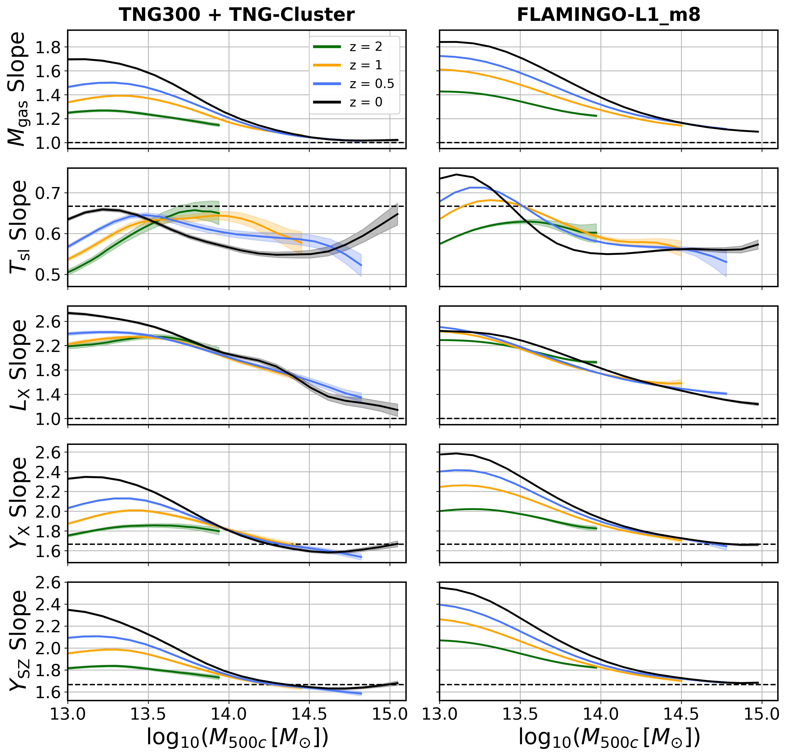
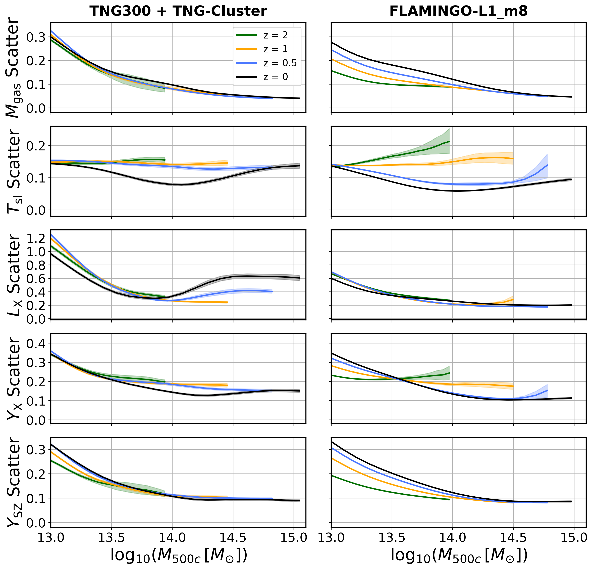

$\newcommand{\ensuremath}{}$
$\newcommand{\xspace}{}$
$\newcommand{\object}[1]{\texttt{#1}}$
$\newcommand{\farcs}{{.}''}$
$\newcommand{\farcm}{{.}'}$
$\newcommand{\arcsec}{''}$
$\newcommand{\arcmin}{'}$
$\newcommand{\ion}[2]{#1#2}$
$\newcommand{\textsc}[1]{\textrm{#1}}$
$\newcommand{\hl}[1]{\textrm{#1}}$
$\newcommand{\footnote}[1]{}$
$\newcommand{\kB}{\ensuremath{  {k_{\rm B}}}}$
$\newcommand{\Rtwohc}{R_{\rm 200c}}$
$\newcommand{\Rhalo}{R_{\rm halo}}$
$\newcommand{\Mtwohc}{M_{\rm 200c}}$
$\newcommand{\Rtwohm}{R_{\rm 200m}}$
$\newcommand{\Mtwohm}{M_{\rm 200m}}$
$\newcommand{\Rfivehc}{R_{\rm 500c}}$
$\newcommand{\Mfivehc}{M_{\rm 500c}}$
$\newcommand{\Mfivehcspec}{M_{\rm 500c,spec}}$
$\newcommand{\Mvir}{M_{\rm vir}}$
$\newcommand{\eg}{{\sl e.g.},}$
$\newcommand{\Rtwoh}{R_{\rm 200c}}$
$\newcommand{\rtwoh}{R_{\rm 200c}}$
$\newcommand{\mtwoh}{M_{\rm 200c}}$
$\newcommand{\Mtwoh}{M_{\rm 200c}}$
$\newcommand{\mfiveh}{M_{\rm 500c}}$
$\newcommand{\LX}{L_{\rm X}}$
$\newcommand{\LXce}{L_{\rm X, ce}}$
$\newcommand{\LXbolce}{L_{\rm X, ce}^{\rm bol}}$
$\newcommand{\LXsoft}{L_{\rm X, soft}}$
$\newcommand{\Mgas}{M_{\rm gas}}$
$\newcommand{\fgas}{f_{\rm gas}}$
$\newcommand{\fb}{f_{\rm b}}$
$\newcommand{\Tsl}{T_{\rm sl}}$
$\newcommand{\Tmw}{T_{\rm mw}}$
$\newcommand{\Tew}{T_{\rm ew}}$
$\newcommand{\Tspec}{T_{\rm spec}}$
$\newcommand{\YX}{Y_{\rm X}}$
$\newcommand{\TX}{T_{\rm X}}$
$\newcommand{\TXce}{T_{\rm X, ce}}$
$\newcommand{\YSZ}{Y_{\rm SZ}}$
$\newcommand{\Yint}{Y^{\rm int}}$
$\newcommand{\mgas}{M_{\rm gas}}$
$\newcommand{\Mstargal}{M_{\star, \rm sat}}$
$\newcommand{\mstargal}{M_{\star, \rm sat}}$
$\newcommand{\MstarBCG}{M_{\star,\rm BCG}}$
$\newcommand{\mstarBCG}{M_{\star,\rm BCG}}$
$\newcommand{\Mr}{M_{\rm r}}$
$\newcommand{\mhalo}{M_{\rm halo}}$
$\newcommand{\Mhalo}{M_{\rm halo}}$
$\newcommand{\mdelta}{M_{\Delta}}$
$\newcommand{\rdelta}{R_{\Delta}}$
$\newcommand{\mgs}{M_{\rm gas/star}}$
$\newcommand{\mdeltags}{{\rm M}_{\Delta,{\rm gas/star }} }$
$\newcommand{\mdeltas}{{\rm M}_{\Delta,{\rm star }} }$
$\newcommand{\mdeltag}{{\rm M}_{\Delta,{\rm gas }} }$
$\newcommand{\rhocrit}{\rho_{\rm crit }}$
$\newcommand{\Mfid}{M_{\rm fid}}$
$\newcommand{\sigmamu}{\ensuremath{\sigma_{\mu}}}$
$\newcommand{\varmu}{\ensuremath{\sigma^2_{\mu}}}$
$\newcommand{\varmus}{\ensuremath{\sigma^2_{\mu \vert \mathbf{s} }}}$
$\newcommand{\sigmamus}{\ensuremath{\sigma_{\mu \vert s }}}$
$\newcommand{\sigmamusvec}{\ensuremath{\sigma_{\mu \vert \mathbf{s} }}}$
$\newcommand{\MassScatter}{\sigma_{\Mfivehc \vert \mathbf{s} }}$
$\newcommand{\MassScatterMgas}{\sigma_{\Mfivehc \vert \Mgas}}$
$\newcommand{\MassScatterTsl}{\sigma_{\Mfivehc \vert \Tsl}}$
$\newcommand{\MassScatterTmw}{\sigma_{\Mfivehc \vert \Tmw}}$
$\newcommand{\MassScatterTX}{\sigma_{\Mfivehc \vert \TX}}$
$\newcommand{\MassScatterT}{\sigma_{\Mfivehc \vert T}}$
$\newcommand{\MassScatterYX}{\sigma_{\Mfivehc \vert \YX}}$
$\newcommand{\MassScatterYSZ}{\sigma_{\Mfivehc \vert \YSZ}}$
$\newcommand{\DeltaSS}{\Delta_{{\rm SS}, a}}$
$\newcommand{\kms}{{\rm   km~s}\ensuremath{^{-1}}}$
$\newcommand{\hinv}{\ensuremath{  h^{-1}}}$
$\newcommand{\msol}{\ensuremath{  {\rm M}_\odot}}$
$\newcommand{\msun}{\ensuremath{  {\rm M}_\odot}}$
$\newcommand{\kpc}{\ensuremath{  {\rm kpc}}}$
$\newcommand{\mpc}{\ensuremath{  {\rm Mpc}}}$
$\newcommand{\gpc}{\ensuremath{  {\rm Gpc}}}$
$\newcommand{\gyr}{\ensuremath{  {\rm Gyr}}}$
$\newcommand{\myr}{\ensuremath{  {\rm Myr}}}$
$\newcommand{\hinvmpc}{\ensuremath{  {\rm h, Mpc^{-1}}}}$
$\newcommand{\kev}{\ensuremath{  {\rm keV}}}$
$\newcommand{\Nsat}{\ensuremath{N_{\rm sat}}}$
$\newcommand{\NSat}{\ensuremath{N_{\rm sat}}}$
$\newcommand{\Mstar}{\ensuremath{M_{\rm \star}}}$
$\newcommand{\Mstarsat}{\ensuremath{M_{\rm \star, sat}}}$
$\newcommand{\MstarsatThresh}{\ensuremath{M_{\rm \star, sat}^{\rm th}}}$
$\newcommand{\Mstartot}{\ensuremath{M_{\rm \star, tot}}}$
$\newcommand{\zformation}{\ensuremath{z_{\rm form}}}$
$\newcommand{\sigmaSat}{\ensuremath{\sigma_{\rm sat, 1D}}}$
$\newcommand{\sigmaSatproj}{\ensuremath{\sigma_{\rm sat, 1D}^{\rm proj}}}$
$\newcommand{\sigmaDM}{\ensuremath{\sigma_{\rm DM}}}$
$\newcommand{\vproj}{\ensuremath{v_{\rm sat}^{\rm proj}}}$
$\newcommand{\mlim}{M_{\rm lim}}$
$\newcommand{\lcdm}{\LambdaCDM}$
$\newcommand{\sigmaeight}{\ensuremath{\sigma_8}}$
$\newcommand{\ns}{\ensuremath{n_{\rm s}}}$
$\newcommand{\omegam}{\ensuremath{\Omega_{\rm m}}}$
$\newcommand{\omegab}{\ensuremath{\Omega_{\rm b}}}$
$\newcommand{\omeganow}{\ensuremath{\Omega_{\rm 0}}}$
$\newcommand{\omegaDE}{\ensuremath{\Omega_{\rm DE}}}$
$\newcommand{\omegaLambda}{\ensuremath{\Omega_{\Lambda}}}$
$\newcommand{\Hnow}{\ensuremath{H_{\rm 0}}}$
$\newcommand{\Seight}{\ensuremath{S_8}}$
$\newcommand{\TNGcombined}{\rm TNG300 + TNG-Cluster}$
$\newcommand{\Flam}{\rm FLAMINGO-L1\_m8}$
$\newcommand{\github}[1]{$
$   \href{#1}{\faGithub}$
$}$
$\newcommand{\thebibliography}{\DeclareRobustCommand{\VAN}[3]{##3}\VANthebibliography}$

# Mass Proxy Quality of Massive Halo Properties in the IllustrisTNG and FLAMINGO Simulations: I. Hot Gas

<mark>Appeared on: 2025-07-08</mark> -  _23 pages, 14 figures_

E. Aljamal, et al. -- incl., <mark>A. Pillepich</mark>, <mark>J. Braspenning</mark>

**Abstract:** We examine scale and redshift dependence of mass-property relations (MPRs) for five hot gas properties of two large group- and cluster-scale halo samples realized by the IllustrisTNG, TNG-Cluster and FLAMINGO cosmological hydrodynamical simulations. For intrinsic properties of i) hot gas mass ( $\Mgas$ ), ii) spectroscopic-like temperature ( $\Tsl$ ), iii) soft-band X-ray luminosity ( $\LX$ ), and iv) X-ray ( $\YX$ ) and v) Sunyaev-Zel'dovich ( $\YSZ$ ) thermal energies, we use MPR parameters to infer mass proxy quality (MPQ) --- the implied scatter in total halo mass conditioned on a property --- for halos with $\Mfivehc \geq 10^{13}\msol$ at redshifts, $z \in \{0, 0.5, 1, 2\}$ .We find: (1) in general, scaling relation slopes and covariance display moderate to strong dependence on halo mass, with redshift dependence secondary;(2) for halos with $\Mfivehc > 10^{14}\msol$ , scalings of $\Mgas$ and $\YSZ$ simplify toward self-similar slope and constant intrinsic scatter (5 and 10 \% , respectively) nearly independent of scale, making both measures ideal for cluster finding and characterization to $z=2$ ;(3) halo mass-conditioned likelihoods of hot gas mass and thermal energy at fixed halo mass closely follow a log-normal form;(4) despite normalization differences ranging up to $0.4$ dex, there is good qualitative, and often quantitative, agreement between the scale-dependent slopes and property covariance of the two simulations. Slopes show appreciable redshift dependence at the group scale, while redshift dependence of the scatter is exhibited by low mass FLAMINGO halos only;(5) property correlations are largely consistent between the simulations, with values that mainly agree with existing empirical measurements.We close with a literature survey placing our MPR slopes and intrinsic scatter estimates into context.

**Figure 14. -** The mass proxy quality, quantified by the implied halo mass scatter (Equation \eqref{eq:mass-proxy-quality}), for the five gas properties within a 3-D aperture of $\Rfivehc$ listed in the legend
    for TNG (solid lines) and FLAMINGO (dashed) halo populations. Shaded regions are $1\sigma$ uncertainties based on $1000$ bootstrap samples.
    We indicate the low redshift mass regimes of groups and clusters as roughly divided by a halo mass of $10^{14}$\msol$$.  All MPQs show moderate to strong mass dependence.  The relative ordering of mass proxy quality is fairly consistent between the two simulation methods, with thermal energy ($\YSZ$, violet) being the best mass proxy below $10^{14.5} $\msol$$ and hot gas mass ($\Mgas$, black) best above this scale, reaching a minimum of $4\%$ halo mass scatter at $10^{15} $\msol$$. See text for further discussion.
 (*fig:MPQzero*)

**Figure 15. -** Halo mass and redshift dependence of the MPR slopes for (top to bottom)
    $\Mgas$, $\Tsl$, $\LX$, $\YX$, $\YSZ$.  The
    KLLR-derived values are shown at redshifts $z = 0$(black), $0.5$(blue), $1.0$(gold), and $2$(green) for TNG (left) and FLAMINGO (right) halo populations. Dotted lines indicate the self-similar slopes given in \S\ref{sec:self-similar-theory}. Note that, by definition, the slope in $\YX$ is the sum of the slopes in $\Mgas$ and $\Tsl$.  (*fig:MPR-slope-plots*)

**Figure 16. -** Halo mass and redshift dependence of the MPR intrinsic scatter values. Format is identical to that of Figure \ref{fig:MPR-slope-plots}. (*fig:MPR-inrinsic-scatter-plots*)

