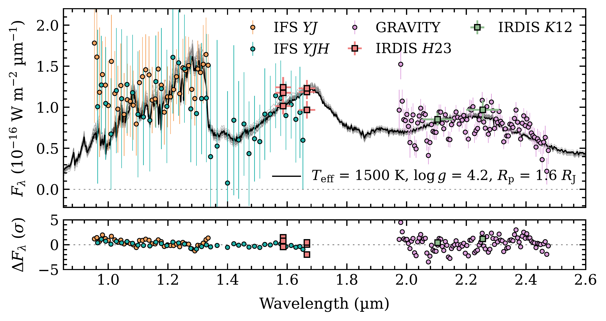

$\newcommand{\ensuremath}{}$
$\newcommand{\xspace}{}$
$\newcommand{\object}[1]{\texttt{#1}}$
$\newcommand{\farcs}{{.}''}$
$\newcommand{\farcm}{{.}'}$
$\newcommand{\arcsec}{''}$
$\newcommand{\arcmin}{'}$
$\newcommand{\ion}[2]{#1#2}$
$\newcommand{\textsc}[1]{\textrm{#1}}$
$\newcommand{\hl}[1]{\textrm{#1}}$
$\newcommand{\footnote}[1]{}$
$\newcommand{\todo}[1]{\textcolor{red}{#1}}$
$\newcommand{\ffdeg}{\mbox{\ensuremath{.\!\!◦}}}$
$\newcommand{\ffarcs}{\mbox{\ensuremath{.\!\!^{\prime\prime}}}}$
$\newcommand{\arraystretch}{1.25}$
$\newcommand{\arraystretch}{1.25}$
$\newcommand{\arraystretch}{1.25}$
$\newcommand{\arraystretch}{1.25}$
$\newcommand{\arraystretch}{1.25}$
$\newcommand{\arraystretch}{1.25}$

# Direct imaging discovery of a young giant planet\\orbiting on Solar System scales

<mark>Appeared on: 2025-07-09</mark> -  _13 pages, 11 figures, accepted for publication in A&A_

T. Stolker, et al. -- incl., <mark>M. Samland</mark>, <mark>M. Benisty</mark>, <mark>W. Brandner</mark>, <mark>G. Chauvin</mark>, <mark>P. Garcia</mark>, <mark>T. Henning</mark>, <mark>L. Kreidberg</mark>, <mark>P. Mollière</mark>

**Abstract:** HD 135344 AB is a young visual binary system that is best known for the protoplanetary disk around the secondary star. The circumstellar environment of the A0-type primary star, on the other hand, is already depleted. HD 135344 A is therefore an ideal target for the exploration of recently formed giant planets because it is not obscured by dust. We searched for and characterized substellar companions to HD 135344 A down to separations of about 10 au. We observed HD 135344 A with VLT/SPHERE in the $H23$ and $K12$ bands and obtained $YJ$ and $YJH$ spectroscopy. In addition, we carried out VLTI/GRAVITY observations for the further astrometric and spectroscopic confirmation of a detected companion. We discovered a close-in young giant planet, HD 135344 Ab, with a mass of about 10 $M_\mathrm{J}$ . The multi-epoch astrometry confirms the bound nature based on common parallax and common proper motion. This firmly rules out the scenario of a non-stationary background star. The semi-major axis of the planetary orbit is approximately 15--20 au, and the photometry is consistent with that of a mid L-type object. The inferred atmospheric and bulk parameters further confirm the young and planetary nature of the companion. HD 135344 Ab is one of the youngest directly imaged planets that has fully formed and orbits on Solar System scales. It is a valuable target for studying the early evolution and atmosphere of a giant planet that could have formed in the vicinity of the snowline.

**Figure 2. -** Astrometric measurements relative to the first epoch. The crosses show the positions of HD 135344 Ab, which moves eastward. The colored circles show the positions of the suspected background sources in the IRDIS field of view, which are connected with dotted lines between epochs. The dashed line shows the track for a stationary background source, and the gray circles and squares indicate the three SPHERE and three GRAVITY epochs, respectively, after the initial detection. The small dots represent a sample of Gaia sources within 0.1 deg from HD 135344 A (see main text for details). The colors indicate a specific epoch, for example, all pink markers correspond to 2021 Jul 16. (*fig:relative_astrometry*)

**Figure 7. -** Age vs. semi-major axis of directly imaged planets. We selected young companions with planetary masses (except for HD 206893 B), $M \lesssim 13$ $M_\mathrm{J}$, planet-to-star mass ratios of $q \lesssim \frac{1}{25}$, and orbits smaller than $\approx$100 au. The locations of the giant planets in the Solar System are indicated with vertically dashed lines, and the gray areas from left to right are separated by the approximate locations of the $H_2$O and $CO_2$ ice lines of an A0-type star  ([Öberg, Murray-Clay and Bergin 2011]()) . The semi-major axes were retrieved from \texttt{whereistheplanet} when available  ([Wang, Kulikauskas and Blunt 2021]()) , and from [Wang, Vigan and Lacour (2021)](), [Hinkley, Lacour and Marleau (2023)](), [Currie, Brandt and Brandt (2023)](), and [Nielsen and Wahhaj (2023)]() otherwise. The ages were adopted from [Pecaut, Mamajek and Bubar (2012)](), [Bell, Mamajek and Naylor (2015)](), [Macintosh, Graham and Barman (2015)](), [Chauvin, Desidera and Lagrange (2017)](), [Müller, Keppler and Henning (2018)](), [Garufi, Benisty and Pinilla (2018)](), [ and Zuckerman (2019)](), [Miret-Roig, Galli and Brandner (2020)](), [Brandt, et. al (2021)](), and [Hinkley, Lacour and Marleau (2023)](). Systematic uncertainties on the ages (e.g., due to uncertain cluster membership) are not reflected by the error bars. (*fig:age_separation*)

**Figure 11. -** Near-infrared spectral energy distribution of HD 135344 Ab. The black line shows the best-fit model spectrum from Sonora Diamondback, and the gray lines show 30 random samples from the posterior distribution, both shown at $R = 500$. The SPHERE/IFS and GRAVITY spectra are shown with circular markers, and the latter are downsampled for clarity. The SPHERE/IRDIS photometry is shown by square markers, with horizontal error bars indicating the FWHM of the corresponding filter profiles. The bottom panel shows the residuals of the best-fit model, calculated at the resolution and wavelength sampling of the data. (*fig:sed_planet*)

