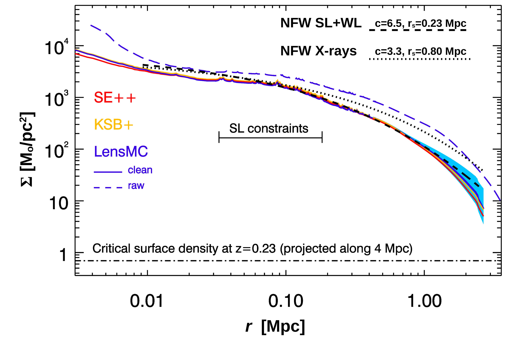
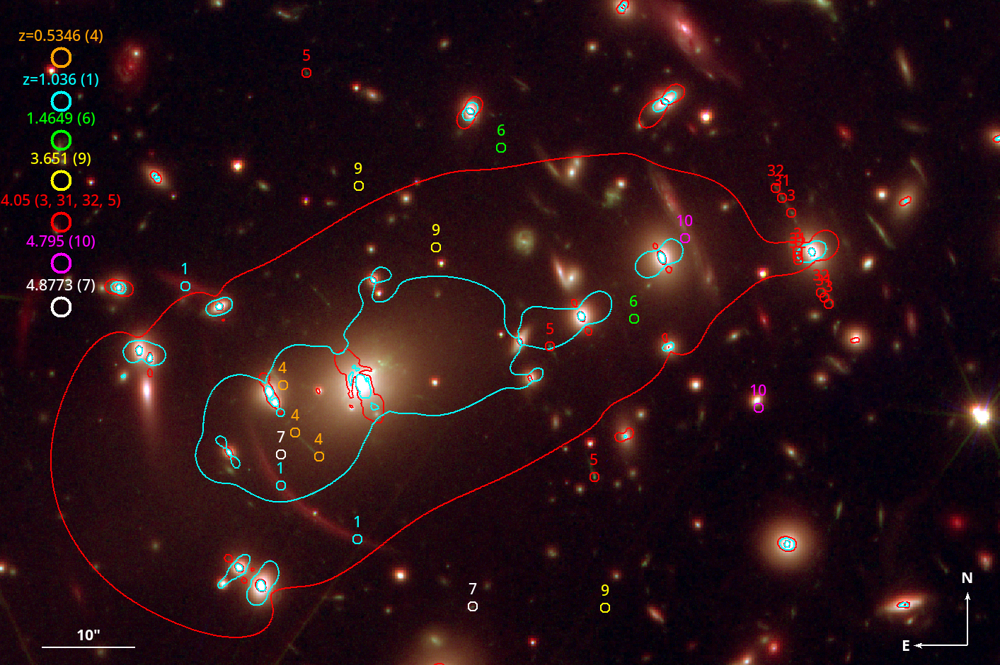

$\newcommand{\ensuremath}{}$
$\newcommand{\xspace}{}$
$\newcommand{\object}[1]{\texttt{#1}}$
$\newcommand{\farcs}{{.}''}$
$\newcommand{\farcm}{{.}'}$
$\newcommand{\arcsec}{''}$
$\newcommand{\arcmin}{'}$
$\newcommand{\ion}[2]{#1#2}$
$\newcommand{\textsc}[1]{\textrm{#1}}$
$\newcommand{\hl}[1]{\textrm{#1}}$
$\newcommand{\footnote}[1]{}$
$\newcommand{\vect}[1]{\vec{#1}}$
$\newcommand{\Msun}{{  M}_{\odot}}$
$\newcommand{\wslap}{\texttt{WSLAP+} }$
$\newcommand{\orcid}[1]$

# $\Euclid$: Early Release Observations. A combined strong and weak lensing solution for Abell 2390 beyond its virial radius$\thanks{This paper is published on behalf of the Euclid Consortium.}$

<mark>Appeared on: 2025-07-14</mark> -  _13 pages, 8 figures_

J. M. Diego, et al. -- incl., <mark>M. Schirmer</mark>, <mark>K. Jahnke</mark>

**Abstract:** $\Euclid$ \/ is presently mapping the distribution of matter in the Universe in detail via the weak lensing signature of billions of distant galaxies. The weak lensing signal is most prominent around galaxy clusters, and can extend up to distances well beyond their virial radius, thus constraining their total mass.     Near the centre of clusters, where contamination by member galaxies is an issue, the weak lensing data can be complemented with strong lensing data. Strong lensing information can also  diminish the uncertainty due to the mass-sheet degeneracy and provide high-resolution information about the distribution of matter in the centre of clusters. Here we present a joint strong and weak lensing analysis of the $\Euclid$ Early Release Observations  of the cluster Abell 2390  at $z=0.228$ . Thanks to $\Euclid$ 's wide field of view of $0.5 \mathrm{deg}^2$ , combined with its angular resolution in the visible band of $\ang{;;0.13}$ and sampling of $\ang{;;0.1}$ per pixel [ and Acevedo~Barroso (2025)]() , we constrain the density profile in a wide range of radii, 30 kpc $< r <$ 2000 kpc, from the inner region near the brightest cluster galaxy to beyond the virial radius of the cluster.  We find consistency with earlier X-ray results based on assumptions of hydrostatic equilibrium, thus indirectly confirming the nearly relaxed state of this cluster. We also find consistency with previous results based on weak lensing data and ground-based observations of this cluster. From the combined strong+weak lensing profile, we derive the values of the viral mass $M_{200} = (1.48 \pm 0.29)\times10^{15}  \Msun$ ,     and virial radius $r_{200} =(2.05\pm0.13   {\rm Mpc}$ ),     with error bars representing one standard deviation. The profile is well described by an Navarro-Frenk-White model with concentration $c=6.5$ and a small-scale radius of 230 kpc in the  30 kpc $< r <$ 2000 kpc range that is best constrained by strong lensing and weak lensing data.     Abell 2390 is the first of many examples where $\Euclid$ data will play a crucial role in providing masses for clusters. The large coverage provided by $\Euclid$ , combined with the depth of the observations, and high angular resolution, will allow to produce similar results in hundreds of other clusters with rich already available strong lensing data.

**Figure 1. -** Surface mass density ($\Sigma$) profiles as a function of radius ($r$) centred on the BCG for the three WL clean catalogues. Two NFW profiles are shown in black-grey. The black dotted line is the NFW derived from X-rays assuming hydrostatic equilibrium. The black short-dashed line is an NFW that fits the SL+WL model in the region that is best constrained by the SL+WL data. The light-blue band shows the $1 \sigma$ variability in the \texttt{LensMC} profile when we change the initial guess in the SL+WL optimisation algorithm.  The dark-blue dashed curve is the joint SL+WL solution when we use the raw LensMC in a larger field of view and with a minimal selection of objects (see appendix \ref{sc:lensmc_fullcat}).
   (*fig:A2390_profile*)

**Figure 6. -** Colour composite image (Red=NISP $\JE+\YE+\HE$, Green=HST-ACS-F850LP, Blue=VIS \IE) of the central region of A2390. The circles mark the position of the spectroscopic sample of SL constraints from [Richard, Stark and Ellis (2008)](), [Richard, Claeyssens and Lagattuta (2021)]() colour coded by their spectroscopic redshift (indicated in the upper left). The number next to each small circle is the ID for each family of counterimages.
  We show the critical curves from the SL+WL model
  in cyan at $z_{\rm s}=1.036$ and red at $z_{\rm s}=4.05$.
  The image covers $\ang{;1.73;}\times\ang{;1.18;}$.
   (*fig:A2390_Arcs*)

**Figure 7. -** Multi-scale grid used for binning the shear measurements in the clean catalogue. The grid is centred in the cluster. _Left_: shows the number of galaxies per square arcminute in each bin when considering only galaxies in the tomographic bins 3--10 described in [Schrabback, Congedo and Gavazzi (2025)]().  The smallest bins in the centre are approximately $\ang{;1;}\times\ang{;1;}$ while in the edges the bins are $\ang{;2.24}\times\ang{;2.24;}$. The full area is  $\ang{;26.85;}\times\ang{;26.85;}$. A similar grid configuration is adopted for the Gaussian functions in the distribution in mass. For the mass grid, the central  $\ang{;4;}\times\ang{;4;}$ region (where the strong lensing constraints are found) is marked with a yellow square. This small region is further divided with an additional set of 123 smaller Gaussians (not shown).
  _Middle and right_: show the observed shear $\gamma_1$ and $\gamma_2$ in the same multi-scale grid, same field of view, and for \texttt{LensMC}. The classic structure of $\gamma_1$ and $\gamma_2$ can be seen (i.e., horizontal and $\pi/4$-oriented quadrupole).
   (*fig:A2390_ShearGrid*)

