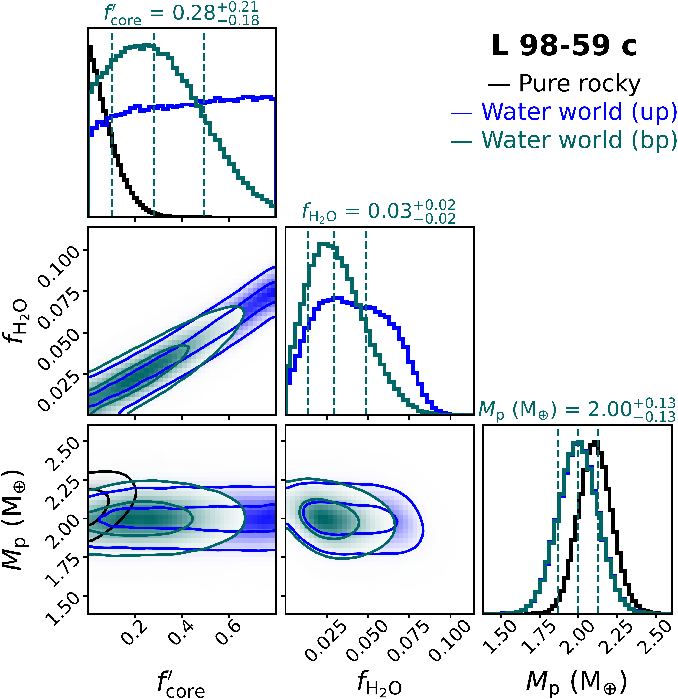
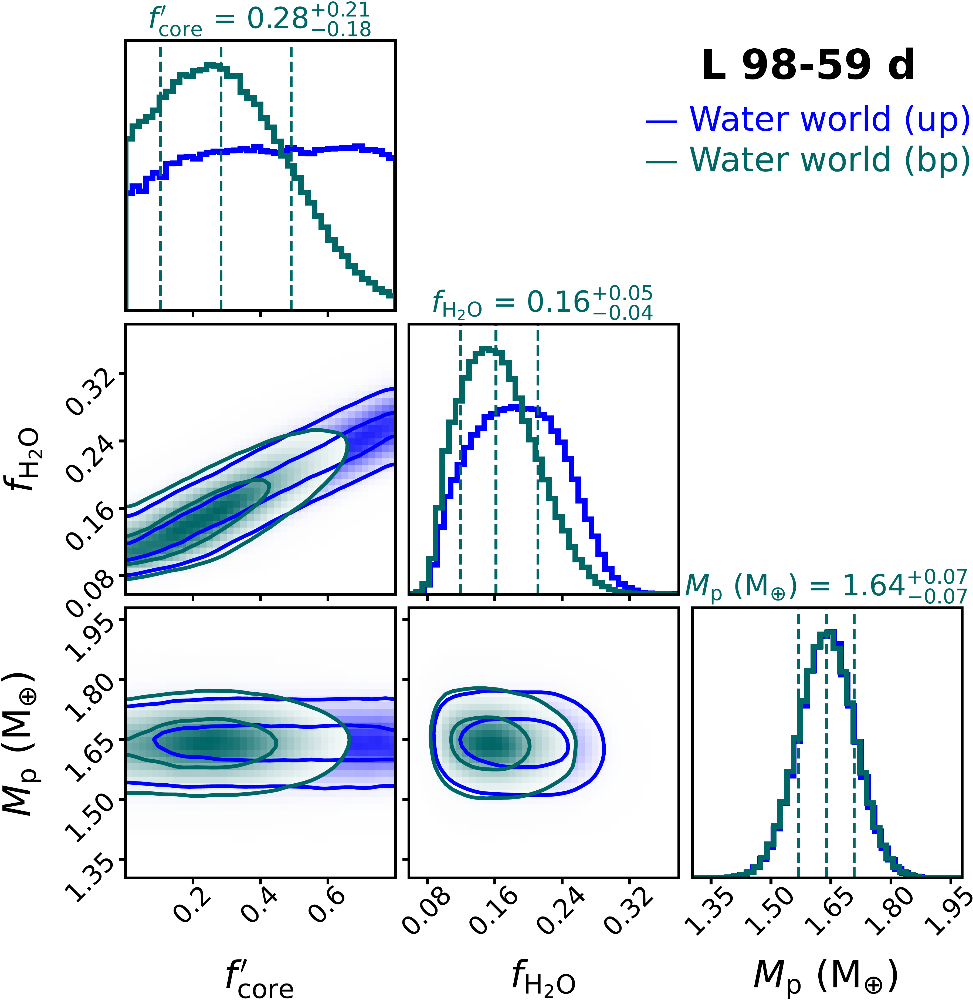
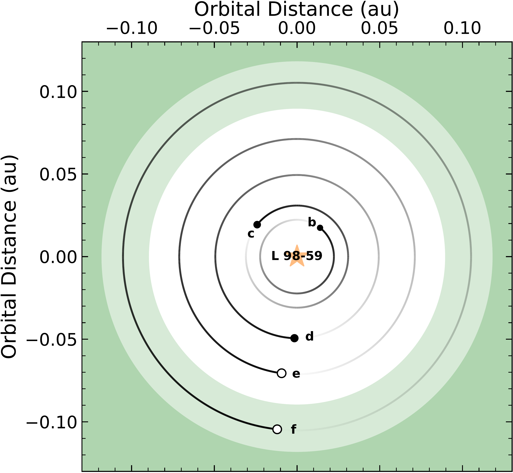

$\newcommand{\ensuremath}{}$
$\newcommand{\xspace}{}$
$\newcommand{\object}[1]{\texttt{#1}}$
$\newcommand{\farcs}{{.}''}$
$\newcommand{\farcm}{{.}'}$
$\newcommand{\arcsec}{''}$
$\newcommand{\arcmin}{'}$
$\newcommand{\ion}[2]{#1#2}$
$\newcommand{\textsc}[1]{\textrm{#1}}$
$\newcommand{\hl}[1]{\textrm{#1}}$
$\newcommand{\footnote}[1]{}$
$\newcommand{\vdag}{(v)^\dagger}$
$\newcommand$
$\newcommand$
$\newcommand{\todo}[1]{\textcolor{orange}{#1}}$
$\newcommand{\tofix}[1]{\textcolor{red}{#1}}$
$\newcommand{\dtemp}{d\textit{Temp}}$
$\newcommand$

# Detailed Architecture of the L 98-59 System and Confirmation of a Fifth Planet in the Habitable Zone

<mark>Appeared on: 2025-07-15</mark> -  _32 pages, 12 figures, 8 tables, accepted for publication in AJ_

C. Cadieux, et al. -- incl., <mark>E.-M. Ahrer</mark>

**Abstract:** The L 98-59 system, identified by TESS in 2019, features three transiting exoplanets in compact orbits of 2.253, 3.691, and 7.451 days around an M3V star, with an outer 12.83-day non-transiting planet confirmed in 2021 using ESPRESSO. The planets exhibit a diverse range of sizes (0.8--1.6 R $_{\oplus}$ ), masses (0.5--3 M $_{\oplus}$ ), and likely compositions (Earth-like to possibly water-rich), prompting atmospheric characterization studies with HST and JWST. Here, we analyze 16 new TESS sectors and improve radial velocity (RV) precision of archival ESPRESSO and HARPS data using a line-by-line framework, enabling stellar activity detrending via a novel differential temperature indicator. We refine the radii of L 98-59 b, c, and d to 0.837 $\pm$ 0.019 R $_{\oplus}$ , 1.329 $\pm$ 0.029 R $_{\oplus}$ , 1.627 $\pm$ 0.041 R $_{\oplus}$ , respectively. Combining RVs with transit timing variations (TTV) of L 98-59 c and d from TESS and JWST provides unprecedented constraints on the masses and eccentricities of the planets. We report updated masses of 0.46 $\pm$ 0.11 M $_{\oplus}$ for b, 2.00 $\pm$ 0.13 M $_{\oplus}$ for c, and 1.64 $\pm$ 0.07 M $_{\oplus}$ for d, and a minimum mass of 2.82 $\pm$ 0.19 M $_{\oplus}$ for e. We additionally confirm L 98-59 f, a non-transiting super-Earth with a minimal mass of 2.80 $\pm$ 0.30 M $_{\oplus}$ on a 23.06-day orbit inside the Habitable Zone. The TTVs of L 98-59 c and d ( $<$ 3 min, $P_{\rm TTV} = 396$ days) constrain the eccentricities of all planets to near-circular orbits ( $e \lesssim 0.04$ ). An internal structure analysis of the transiting planets reveals increasing water-mass fractions ( $f_{\rm H_{2}O}$ ) with orbital distance, reaching $f_{\rm H_{2}O} \approx 0.16$ for L 98-59 d. We predict eccentricity-induced tidal heating in L 98-59 b with heat fluxes comparable to those of Io, potentially driving volcanic activity.

**Figure 4. -** Mass--radius constraints on the L 98-59 planets (b: green, c: purple, d: red, e: blue, f: teal) with other exoplanets around M dwarfs in the background (gray points). The previous values from \citetalias{Demangeon_2021} are shown in black attached to revised measurements. For L 98-59 e and f, 1- and 2-$\sigma$ confidence contours are shown with the radius estimated using \texttt{spright}\citep{Parviainen_2024}  and with a cross symbol showing the two modes (rocky and volatile-rich). Rocky composition curves from \cite{Zeng_2019} are drawn from pure iron to pure silicate rocks. Water-rich interior models at $T = 400$ K from \cite{Aguichine_2021} are shown with dotted blue curves. The orange region delimits a degeneracy ($H_2$- or $H_2$O-rich) in composition \citep{Rogers_2023}. (*fig:mr*)

**Figure 11. -** Marginalised 1D and 2D posterior distributions of internal structure parameters for L 98-59 b (left), c (center), and d (right) derived with \texttt{smint}\citep{Piaulet_2023}. The 2D posteriors display the 1- and 2-$\sigma$ contours. The analysis constrains the core- and water-mass fractions ($f^{\prime}_{\rm core}$, $f_{\rm H_{2}O}$) using priors on planetary mass ($M_{\rm p}$) and irradiation temperature ($T_{\rm irr}$; not shown), while requiring consistency with the observed planetary radius ($R_{\rm p}$). The sub-Earth L 98-59 b is assumed to be purely rocky ($f_{\rm H_{2}O} = 0$). We explored a pure rocky model for L 98-59 c and water-rich models for L 98-59 c and d with either a uniform prior on $f^{\prime}_{\rm core}$(`up') or using $f^{\prime}_{\rm core}$ from planet b as a prior (`bp'). L 98-59 b has a $f^{\prime}_{\rm core}$ consistent with a wide range of iron content in the interior (from coreless to super-Mercury), with a mode close to Earth's value ($f^{\prime}_{\rm core} = 0.325$, \citealt{Wang_2018}). L 98-59 c likely has a small $f_{\rm H_{2}O} \sim 0.03$ to explain its mass and radius. For L 98-59 d, we infer a statistically significant $f_{\rm H_{2}O}$ = 0.16--0.18 irrespective of the choice of prior. (*fig:interior*)

**Figure 1. -** _Top_: Above view of the L 98-59 planetary system on BJD = 2 460 000 assuming circular orbits. The line of sight towards Earth is to the right. The Habitable Zone defined in \citealt{Kopparapu_2013} is shown in green for runaway/maximum greenhouse (conservative) and pale green for early recent Venus/early Mars (optimistic). _Bottom_: Comparative exoplanetology of M-dwarf multiplanetary systems ordered by stellar effective temperature and planetary instellation. An arbitrary shift of $+$100 K in $T_{\rm eff}$ has been applied to \hbox{TOI-700} and Teegarden's star for clarity. In both panels, transiting (non-transiting) exoplanets are shown as filled (open) circles, with circle size proportional to planetary radius. For planets with only a minimum mass constraint, the radius is set to the 95$^{\rm th}$ percentile of the prediction from \texttt{spright}\citep{Parviainen_2024}. (*fig:orbit*)

