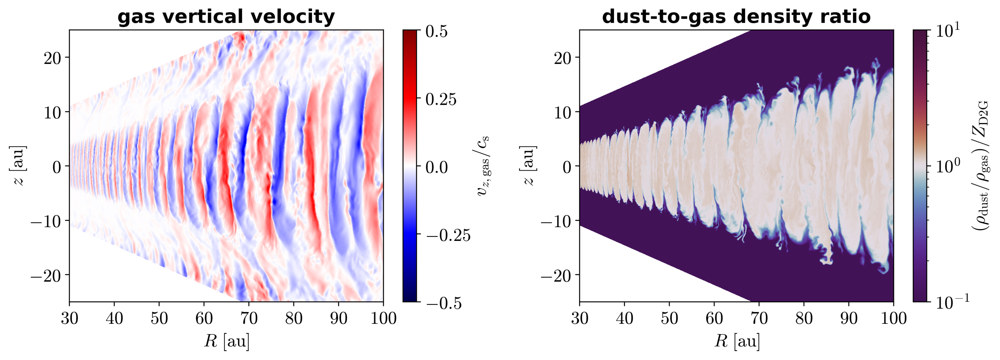
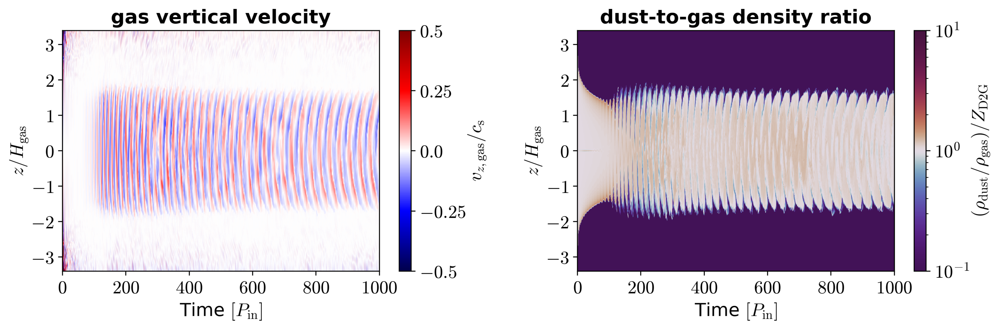
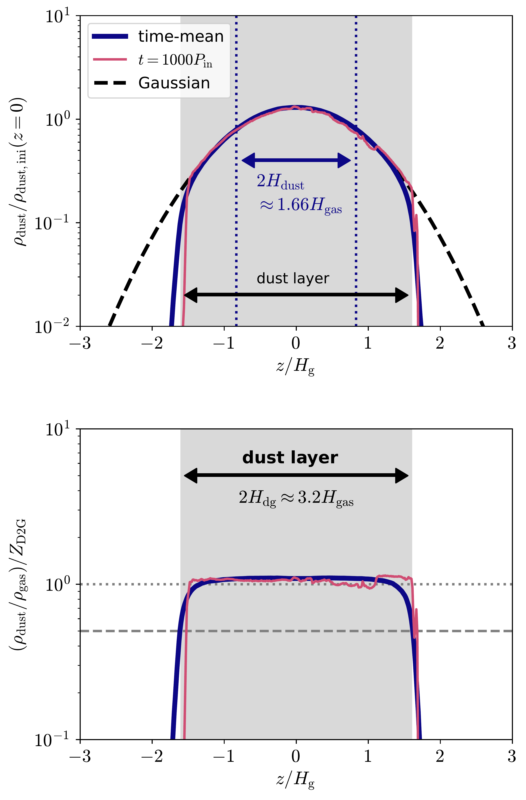

$\newcommand{\ensuremath}{}$
$\newcommand{\xspace}{}$
$\newcommand{\object}[1]{\texttt{#1}}$
$\newcommand{\farcs}{{.}''}$
$\newcommand{\farcm}{{.}'}$
$\newcommand{\arcsec}{''}$
$\newcommand{\arcmin}{'}$
$\newcommand{\ion}[2]{#1#2}$
$\newcommand{\textsc}[1]{\textrm{#1}}$
$\newcommand{\hl}[1]{\textrm{#1}}$
$\newcommand{\footnote}[1]{}$

# Hydrodynamical simulations of the vertical shear instability with dynamic dust and cooling rates in protoplanetary disks

<mark>Appeared on: 2025-07-16</mark> -  _16 pages, 20 figures, 1 table, Accepted for publication in Astronomy & Astrophysics (A&A)_

Y. Fukuhara, <mark>M. Flock</mark>, S. Okuzumi, R. T. Tominaga

**Abstract:** Turbulence in protoplanetary disks affects dust evolution and planetesimal formation.The vertical shear instability (VSI) is one of the candidate turbulence-driving mechanisms in the outer disk region.Since the VSI requires rapid gas cooling, dust particles in disks can influence and potentially control VSI-driven turbulence.However, VSI-driven turbulence has strong vertical motion, causing vertical diffusion of particles.As a result of this interaction, it remains unclear how turbulent structures and dust distributions form and persist. We aim to clarify whether the VSI can drive turbulence and achieve a quasi-steady dust distribution under cooling rate evolution associated with turbulently diffusing dust.We also elucidate the dependence of the dust size and dust-to-gas mass ratio on the realization and persistence of the equilibrium state. We perform global two-dimensional hydrodynamical simulations of an axisymmetric protoplanetary disk to investigate how the VSI drives turbulence and maintains a balance between dust settling and diffusion.These simulations account for the dynamic interplay between dust distribution, cooling rates, and turbulence. We find that VSI mixing, dust settling, and local dust cooling reach an equilibrium, forming a thick dust layer with a dimensionless vertical mixing coefficient of approximately $\alpha_{\rm diff} \approx 10^{-3}$ .The ability of the VSI to sustain this state also depends on the dust size and dust-to-gas mass ratio.Larger grains or lower mass ratios weaken turbulence, leading to dust settling.The condition of equilibrium state existence is consistent with the prediction of the semi-analytic model presented by [ and Fukuhara (2024)]() . Our results indicate that efficient turbulent dust mixing and efficient cooling can occur simultaneously.They also imply that turbulence in VSI-dominated disks has different levels of intensity depending on the grain size.This suggests that the efficiency of dust growth can depend on the VSI in protoplanetary disks.

**Figure 15. -** Gas vertical velocity $v_{z,\rm gas}/c_{\rm s}$(left) and ratio of dust and gas density $(\rho_{\rm dust}/\rho_{\rm gas})/Z_{\rm D2G}$(right) for a run with $(Z_{\rm D2G}, a) = (0.01, 10 {\rm \mu m})$ in the dynamic-dust simulations, as a function of $R$ and $z$ at the end of the simulation ($1000$ orbits at $20 {\rm au}$). (*fig:colormap_vz_rhodgINI_D2G1e-2_a1e-3_h*)

**Figure 16. -** Gas vertical velocity $v_{z,\rm gas}/c_{\rm s}$(left) and ratio of dust and gas density $(\rho_{\rm dust}/\rho_{\rm gas})/Z_{\rm D2G}$(right) for a run with $(Z_{\rm D2G}, a) = (0.01, 10 {\rm \mu m})$ in the dynamic-dust simulations, as a function of time and $z/H_{\rm gas}$ at $R=40 {\rm au}$. (*fig:colormap_time_vzINI_rhodg_D2G1e-2_a1e-3_h*)

**Figure 2. -** Vertical profiles of the dust density $\rho_{\rm dust}$ normalized by the initial dust density at the midplane $\rho_{\rm dust,ini}(z=0)$(upper panel), and ratio of dust and gas densities $\rho_{\rm dust}/\rho_{\rm gas}$ normalized by the initial dust-to-gas mass ratio $Z_{\rm D2G}$(lower panel), at $R=40 {\rm au}$ for a run with $(Z_{\rm D2G}, a) = (0.01, 10 {\rm \mu m})$ in the dynamic-dust simulations. In the upper panel, the dashed curve shows a Gaussian fitting of $\rho_{\rm dust}$ within $|z|<H_{\rm dg}$, and the vertical dotted lines mark the height of the dust scale height $H_{\rm dust}$. The horizontal dashed and dotted lines in the lower panel mark $\rho_{\rm dust}/\rho_{\rm gas}=Z_{\rm D2G}/2$ and $Z_{\rm D2G}$, respectively. The gray regions in both panels map the dust layer defined by $H_{\rm dg}$. (*fig:vertical_profile_rhod*)

