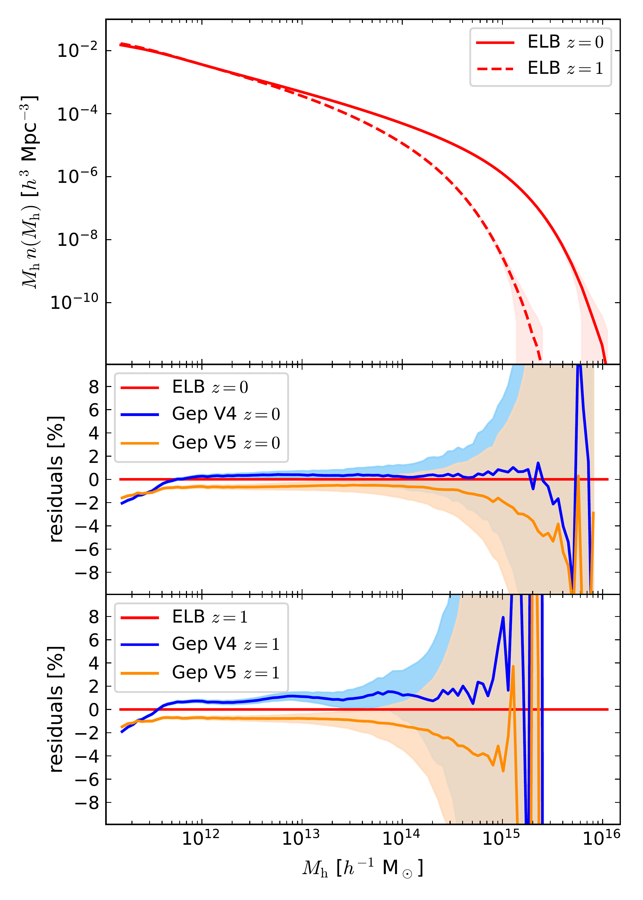
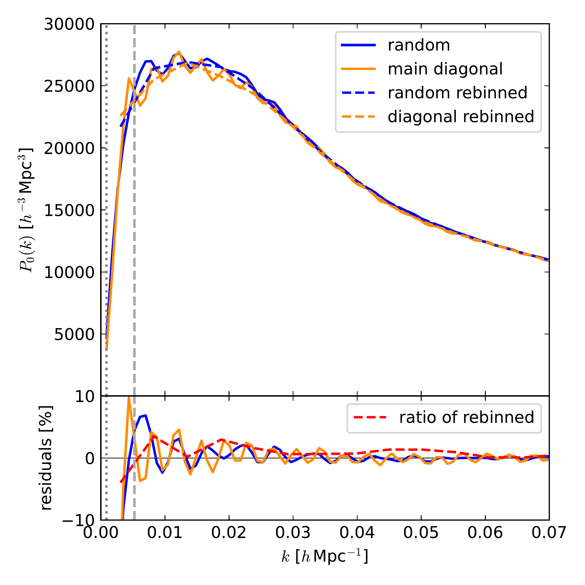

$\newcommand{\ensuremath}{}$
$\newcommand{\xspace}{}$
$\newcommand{\object}[1]{\texttt{#1}}$
$\newcommand{\farcs}{{.}''}$
$\newcommand{\farcm}{{.}'}$
$\newcommand{\arcsec}{''}$
$\newcommand{\arcmin}{'}$
$\newcommand{\ion}[2]{#1#2}$
$\newcommand{\textsc}[1]{\textrm{#1}}$
$\newcommand{\hl}[1]{\textrm{#1}}$
$\newcommand{\footnote}[1]{}$
$\newcommand{\pigi}[1]{\textcolor{orange}{ [Pigi: #1]}}$
$\newcommand{\fha}{\ensuremath{f_{{\rm H}\alpha}}\xspace}$
$\newcommand{\vx}{\vec{x}\xspace}$
$\newcommand{\nh}{\hat{n}\xspace}$
$\newcommand{\hmpc}{\ensuremath{h^{-1} \text{Mpc}}\xspace}$
$\newcommand{\kmpc}{\ensuremath{h \text{Mpc}^{-1}}\xspace}$
$\newcommand{\dens}{\ensuremath{h^{3} \mathrm{Mpc}^{-3}}\xspace}$
$\newcommand{\cgpc}{\ensuremath{h^{-3} \mathrm{Gpc}^3}\xspace}$
$\newcommand{\hgpc}{\ensuremath{h^{-1} \text{Gpc}}\xspace}$
$\newcommand{\hmsun}{\ensuremath{h^{-1} M_\odot}\xspace}$
$\newcommand{\Comp}{{\cal{C}}}$
$\newcommand{\Compa}{\tilde{\cal C}}$
$\newcommand{\flux}{erg s^{-1} cm^{-2}\xspace}$
$\newcommand{\pin}{\texttt{Pinocchio}\xspace}$
$\newcommand{\tdeg}{\ensuremath{30^{\circ}}\xspace}$
$\newcommand{\sqdeg}{\ensuremath{{\rm deg}^2}\xspace}$
$\newcommand{\gl}[1]{\textcolor{red}{[{\bf Guilhem}: #1]}}$
$\newcommand{\glrm}[1]{\textcolor{red}{[{\bf Guilhem}: \sout{#1}]}}$
$\newcommand{\tc}[1]{\textcolor{blue}{[{\bf Tiago}: #1]}}$
$\newcommand{\MYK}[1]{\textcolor{magenta}{[{\bf Yousry}: #1]}}$
$\newcommand{\orcid}[1]$

# $\Euclid$ preparation: Simulating thousands of $\Euclid$ spectroscopic skies

<mark>Appeared on: 2025-07-17</mark> -  _19 pages, submitted to A&A_

E. Collaboration, et al. -- incl., <mark>Y. Wang</mark>, <mark>K. Jahnke</mark>

**Abstract:** We present two extensive sets of 3500 $+$ 1000 simulations of dark matter haloes  on the past light cone, and two corresponding sets of simulated (`mock') galaxy  catalogues that represent the $\Euclid$ spectroscopic sample. The simulations were  produced with the latest version of the ${\pin}$ code, and provide the largest, public set  of simulated skies. Mock galaxy catalogues were obtained by populating haloes with  galaxies using an halo occupation distribution (HOD) model extracted from the Flagship  galaxy catalogue provided by Euclid Collaboration. The Geppetto set of 3500 simulated  skies was obtained by tiling a $1.2 \hgpc$ box to cover a light-cone whose sky  footprint is a circle of ${\tdeg}$ radius, for an area of 2763 $\sqdeg$ and a minimum halo  mass of $1.5\times10^{11}$ $\hmsun$ . The relatively small box size makes this set unfit  for measuring very large scales. The EuclidLargeBox set consists of 1000 simulations of $3.38 \hgpc$ , with the same mass resolution and a footprint that covers half of the  sky, excluding the Milky Way zone of avoidance. From this we produced a set of 1000  EuclidLargeMocks on the ${\tdeg}$ radius footprint, whose comoving volume is fully  contained in the simulation box. We validated the two sets of catalogues by analysing  number densities, power spectra, and 2-point correlation functions, showing that the  Flagship spectroscopic catalogue is consistent with being one of the realisations of the  simulated sets, although we noticed small deviations limited to the quadrupole at $k>0.2 \kmpc$ . We show cosmological parameter inference from these catalogues and  demonstrate that using one realisation of EuclidLargeMocks in place of the Flagship mock  produces the same posteriors, to within the expected shift given by sample variance.  These simulated skies will be used for the galaxy clustering analysis of $\Euclid$ 's Data  Release 1 (DR1).

**Figure 1. -** Graphical representation of the comoving volume of the {$\tdeg$} radius survey
  footprint, highlighting the four redshift bins bounded by redshifts
  $[0.9,1.1,1.3,1.5,1.8]$, immersed in the comoving volume of the Flagship simulation
  (that is our reference), of EuclidLargeBox, and of Geppetto simulation boxes. The
  Geppetto box is tiled a few times to cover the survey volume; for sake of clarity, the
  tiling is limited to the main replications. Here the central axis of the footprint lies
  on the main diagonal of the box, however all EuclidLargeBox and most Geppetto boxes have
  random orientations of this axis. (*fig:replicas*)

**Figure 2. -** Halo mass function $n(M_{\rm h})$ of the simulated sets. The upper panel only
  shows the mass function of EuclidLargeBox (ELB) for $z=0$ and $z=1$, where the line
  gives the average over the 1000 simulations and the shaded area gives its sample
  variance. The two lower panels show relative residuals, $n/n_{\rm elb}-1$ in percent, of
  the mass function of the first 600 Geppetto simulations, run with V4 of the code (Gep
  V4), and the other 2900, run with V5 (Gep V5), with respect to the EuclidLargeBox
  measurement, respectively at $z=0$(mid panel) and $z=1$(lower panel). Here the
  reported sample variance is relative only to the Geppetto sets. (*fig:haloMF*)

**Figure 3. -** Power spectrum monopole of {$\pin$} dark matter haloes from the Geppetto
  light-cones, with $M_{\rm h}>10^{12}$\hmsun in the redshift range $z\in[0.9,1.1]$. The
  continuous lines show measurements in a box of $L_{\rm m}=7.2 $\hgpc$$ sampled on its
  fundamental frequency $k_{\rm fm}$, the dashed lines show the same measurements with a
  sampling of $6k_{\rm fm}$, equal to the fundamental mode of the simulation box $k_{\rm
    fs}$. Blue and orange lines show respectively averages over 100 mocks with random
  orientations of the cone axis and with axis aligned with the main diagonal of the
  simulation box. The lower panel shows the residuals of the measurements along a random
  orientation with respect to those with axis along the main diagonal, plus, in red, the
  residuals of the two rebinned measurements. (*fig:PKreplicas*)

