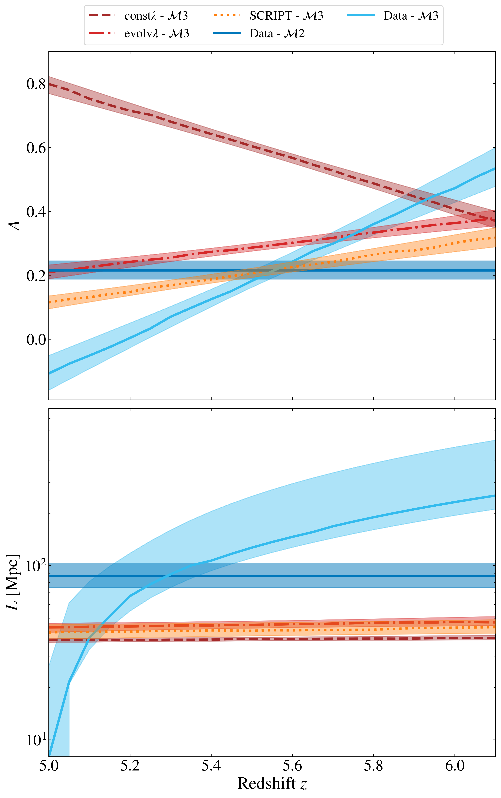
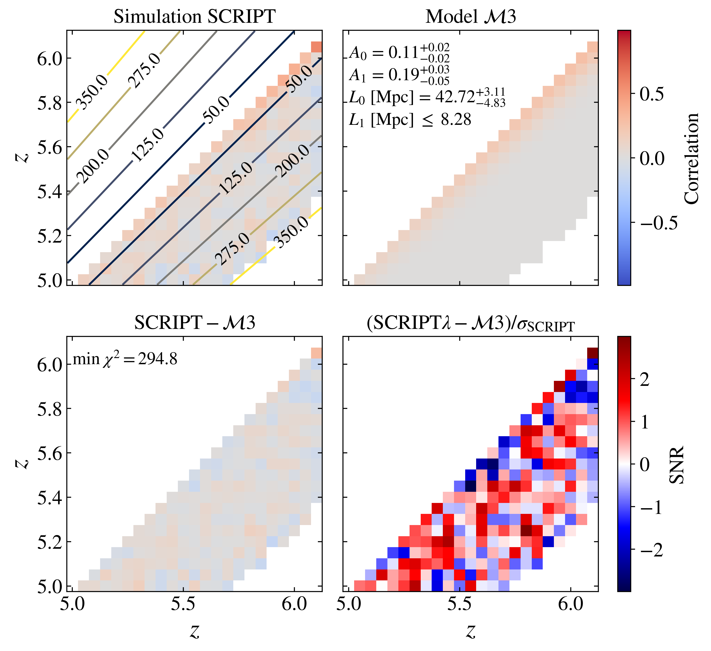

$\newcommand{\ensuremath}{}$
$\newcommand{\xspace}{}$
$\newcommand{\object}[1]{\texttt{#1}}$
$\newcommand{\farcs}{{.}''}$
$\newcommand{\farcm}{{.}'}$
$\newcommand{\arcsec}{''}$
$\newcommand{\arcmin}{'}$
$\newcommand{\ion}[2]{#1#2}$
$\newcommand{\textsc}[1]{\textrm{#1}}$
$\newcommand{\hl}[1]{\textrm{#1}}$
$\newcommand{\footnote}[1]{}$
$\newcommand{\orcidauthorA}{0000-0003-1634-1283}$
$\newcommand{\orcidauthorB}{0000-0001-8582-7012}$
$\newcommand{\orcidauthorC}{0000-0003-0821-3644}$
$\newcommand{\orcidauthorD}{0000-0002-4682-6970}$
$\newcommand{\bene}{\textcolor{blue}}$
$\newcommand{\BM}[1]{{\color{magenta}[{BM: }#1]}}$
$\newcommand{\arraystretch}{1.8}$

# Measuring the IGM correlation length at 5<z<6.1: a fast change at the end of Reionization

<mark>Appeared on: 2025-07-17</mark> -  _11 pages, 5 figures, 1 table. Submitted to A&A_

B. Spina, S. E. I. Bosman, <mark>B. Maity</mark>, F. B. Davies

**Abstract:** The Lyman- $\alpha$ forest of high redshift quasars is a powerful probe of the late stages of the Epoch of Reionization (EoR), in particular thanks to the presence of Gunn-Peterson troughs. These troughs exhibit a broad range of lengths, with some extending up to $\sim 100$ cMpc, suggesting large-scale coherent structures in the intergalactic medium (IGM). We aim to gain more insight into the presence, extent, and magnitude of correlations in the Lyman- $\alpha$ forest during the end of reionization, at $5<z<6.1$ . In particular, we want to quantify the scales over which correlations are significant in order to help inform the required size of cosmological simulations aiming to capture the evolution of the EoR. We utilize the extended XQR-30 dataset over the redshift range $5 < z < 6.1$ ( $\Delta z = 0.05$ ) to explore large-scale correlations. After accounting for the relevant systematics, the flux correlation matrix proves to be a powerful tool for probing large-scale correlations across redshifts. We perform an MCMC analysis to quantify the extent and strength of the correlation, making use of several functional forms. We moreover employ new large-volume ( $1.5^3 \mathrm{Gpc}^3$ ) light-cones of Lyman- $\alpha$ transmission implementing different reionization scenarios to interpret the observed signal, including a fiducial box employing SCRIPT. We detect strong correlations at redshifts $z > 5.3$ , extending at least tens of Mpc and strongly increasing with redshift. Our results suggest a redshift-dependent correlation length, from $L \leq 26.53  (68.47) \mathrm{Mpc}$ at 1- $\sigma$ (2- $\sigma$ ) limit at redshift $z = 5.0$ to $L = 252.72^{+272.61}_{-41.61} \mathrm{Mpc}$ at redshift $z = 6.1$ . On the contrary, our simulations all demonstrate characteristic correlation scales $< 60$ Mpc with a very slow redshift evolution, in strong tension with our observations. The presence and redshift-dependence of correlations in the Lyman- $\alpha$ forest on $>200$ Mpc scales at $z=6$ indicates that cosmological simulations should be larger than this scale to adequately sample the Lyman- $\alpha$ forest. Despite implementing a fluctuating UVB and numerous neutral islands at $z<6$ , and matching well the sightline scatter in the Lyman- $\alpha$ forest, our fiducial SCRIPT-based simulation fails to reproduce the large-scale correlations. It may be that those ingredients are necessary, but not sufficient, to understanding the unfolding of the EoR.

**Figure 9. -** Correlations in the Lyman-$\alpha$ forest flux across redshift. Top row: correlation matrix for observed QSO sightlines, showing a positive correlation (in red) in the off-diagonal terms near the diagonal at all redshifts, and an increasing correlation length at higher redshifts. Bottom row: mock sightlines with continuum-reconstruction uncertainties applied, leading to a slight increase in correlation at lower redshifts, while failing to account for the observed correlation at higher redshifts. First column: correlation matrices. Second column: standard deviation of the correlation matrices. Third column: statistical significance of the correlation, estimated as the ratio between the correlation matrix and its standard deviation. The results suggest that while continuum-reconstruction uncertainties contribute to correlations at low redshifts, they cannot account for the correlations observed at higher redshifts. (*fig:fig2*)

**Figure 1. -** Amplitude (top panel) and correlation length (bottom panel) as a function of redshift for different models and simulations. The continuous gray (blue) lines are the results of fitting the observations with $\mathcal{M}2$($\mathcal{M}3$), a Gaussian model with constant (redshift-dependent) width and amplitude. The gray shaded regions represent the $1-\sigma$ error on the $A$($L$) parameters. The blue shaded region instead indicates the 16th and 84th percentiles of the  $A_0$-$A_1$($L_0$-$L_1$) joint-posterior distribution, except for redshifts $z < 5.1$, where only the $1\sigma$ upper limit of $L$ is shown. The brown dashed, the red dash-dotted and the orange dotted lines are the results of fitting the simulations ($\mathrm{const}\lambda$, $\mathrm{evolv}\lambda$, $\mathrm{SCRIPT}$) with $\mathcal{M}3$.
     (*fig:fig_tot*)

**Figure 5. -** As Figure \ref{fig:fit_models_to_data}, but here the different simulations are fitted with model $\mathcal{M}3$.  (*fig:fit_bbbb_with_M3*)

