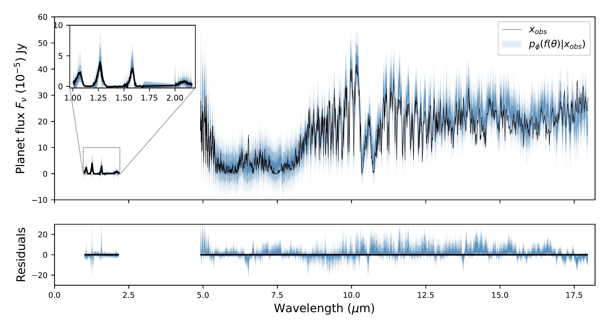

$\newcommand{\ensuremath}{}$
$\newcommand{\xspace}{}$
$\newcommand{\object}[1]{\texttt{#1}}$
$\newcommand{\farcs}{{.}''}$
$\newcommand{\farcm}{{.}'}$
$\newcommand{\arcsec}{''}$
$\newcommand{\arcmin}{'}$
$\newcommand{\ion}[2]{#1#2}$
$\newcommand{\textsc}[1]{\textrm{#1}}$
$\newcommand{\hl}[1]{\textrm{#1}}$
$\newcommand{\footnote}[1]{}$
$\newcommand{\aaj}{\emph{Astronomy \& Astrophysics}}$
$\newcommand{\sci}{\emph{Science}}$
$\newcommand$
$\newcommand{\namea}[1]{\textcolor{red}{#1}}$
$\newcommand{\nameb}[1]{\textcolor{brown}{(b: #1)}}$
$\newcommand{\namec}[1]{\textcolor{cyan}{(c: #1)}}$
$\newcommand{\mala}[1]{\textcolor{black}{( #1)}}$
$\newcommand{\malb}[1]{\textcolor{brown}{( #1)}}$
$\newcommand{\aaj}{\emph{Astronomy \& Astrophysics}}$
$\newcommand{\sci}{\emph{Science}}$
$\newcommand$
$\newcommand{\namea}[1]{\textcolor{red}{#1}}$
$\newcommand{\nameb}[1]{\textcolor{brown}{(b: #1)}}$
$\newcommand{\namec}[1]{\textcolor{cyan}{(c: #1)}}$
$\newcommand{\mala}[1]{\textcolor{black}{( #1)}}$
$\newcommand{\malb}[1]{\textcolor{brown}{( #1)}}$
$\newcommand{\arraystretch}{1.4}$
$\newcommand{\arraystretch}{1.4}$

# Panchromatic characterization of the Y0 brown dwarf WISEP J173835.52+273258.9 using JWST/MIRI

<mark>Appeared on: 2025-07-17</mark> - 

M. Vasist, et al. -- incl., <mark>T. Henning</mark>

**Abstract:** Cold brown dwarf atmospheres provide a good training ground for the analysis of atmospheres of temperate giant planets. WISEP J173835.52+273258.9 (WISE 1738) is an isolated cold brown dwarf and a Y0 spectral standard with a temperature between 350–400 K, lying at the boundary of the T-Y transition. Although its atmosphere has been extensively studied in the near-infrared, its bulk physical parameters and atmospheric chemistry and dynamics are not well understood. Using a Mid-Infrared Instrument (MIRI) medium-resolution spectrum (5–18 $\mu$ m), combined with near-infrared spectra (0.98–2.2 $\mu$ m) from Hubble Space Telescope's (HST) Wide Field Camera 3 (WFC3) and Gemini Observatory's Near-Infrared Spectrograph (GNIRS), we aim to accurately characterize the atmospheric chemistry and bulk physical parameters of WISE 1738. We perform a combined atmospheric retrieval on the MIRI, GNIRS and WFC3 spectra using a machine learning algorithm called Neural Posterior Estimation (NPE) assuming a cloud-free model implemented using \texttt{petitRADTRANS} . We demonstrate how this combined retrieval approach ensures robust constraints on the abundances of major atmospheric species, the pressure-temperature ( $P$ - $T$ ) profile, bulk C/O and metalliclity [ M/H ] , along with bulk physical properties such as effective temperature, radius, surface gravity, mass and luminosity. We estimate 1D and 2D marginal posterior distributions for the constrained parameters and evaluate our results using several qualitative and quantitative Bayesian diagnostics, including Local Classifier 2-Sample Test (L-C2ST), coverage and posterior predictive checks. The combined atmospheric retrieval confirms previous constraints on $H_2$ O, $CH_4$ , $NH_3$ , and for the first time provides constraints on CO, $CO_2$ and $^{15}$ $NH_3$ . It also gives better constraints on the physical parameters and the $P$ - $T$ profile, while also revealing potential biases in characterizing objects using data from limited wavelength ranges. The retrievals further suggest the presence of disequilibrium chemistry, as evidenced by the constrained abundances of CO and CO $\(_2\)$ , which are otherwise expected to be depleted and hence not visible beyond the near-infrared wavelengths under equilibrium conditions. We estimate the physical parameters of the object as follows: an effective temperature of 402 $\(^{+12}_{-9}\)$ K, surface gravity ( $\(\log g\)$ ) of 4.43 $\(^{+0.26}_{-0.34}\)$ cm s $\(^{-2}\)$ , mass of 13 $\(^{+11}_{-7}\)$  $\(M_{\text{Jup}}\)$ , radius of 1.14 $\(^{+0.03}_{-0.03}\)$  $\(R_{\text{Jup}}\)$ , and a bolometric luminosity of $\(-6.52^{+0.05}_{-0.04}\)$  $\(\log L/L_\odot\)$ . Based on these values, the evolutionary models suggest an age between 1 and 4 Gyr, which is consistent with a high rotation rate of 6 hr of the brown dwarf. We further obtain an upper bound on the $\(^{15}\)$ NH $\(_3\)$ abundance, enabling a 3 $\sigma$ lower bound calculation of the $\(^{14}\)$ N/ $\(^{15}\)$ N ratio = 275, unable to   interpret the formation pathway as core collapse. Additionally, we calculate a C/O ratio of 1.35 $\(^{+0.39}_{-0.31}\)$ and a metallicity of 0.34 $\(^{+0.12}_{-0.11}\)$ without considering any oxygen sequestration effects.

**Figure 9. -** _Top._ WFC3+GNIRS+MIRI consistency plot. The posterior predictive distribution $p(f(\theta)+ \epsilon |x_\text{obs})$ of noisy simulations spectra for the $99.7\%$, $95\%$ and $68.7\%$ quartiles (hues of blue), overlaid on top of the the WFC3+GNIRS+MIRI observation $x_\text{obs}$(black line). {_Bottom._ Residuals of the posterior predictive samples, normalized by the inflated standard deviation of the noise distribution for each spectral channel and a horizontal line at 0 for reference (in black).
    } (*fig:cloudfree_consistency*)

**Figure 10. -** _Top._ MIRI consistency plot. Posterior predictive distribution $p(f(\theta)+ \epsilon |x_\text{MIRI})$ of noisy simulations spectra for the $99.7\%$, $95\%$ and $68.7\%$ quartiles (hues of blue) obtained from the retrieval on MIRI data alone extended to near-infrared wavelengths, and overlaid on top of the the WFC3+GNIRS+MIRI observation $x_\text{obs}$(black line). {_Bottom._ Residuals of the posterior predictive samples, normalized by the inflated standard deviation of the noise distribution for each spectral channel and a horizontal line at 0 for reference (in black).
    } (*fig:consistency_onlyMIRI*)

**Figure 11. -** _Top._ GNIRS consistency plot. Posterior predictive distribution $p(f(\theta)+ \epsilon |x_\text{GNIRS})$ of noisy simulations spectra for the $99.7\%$, $95\%$ and $68.7\%$ quartiles (hues of green) obtained from the retrieval on GNIRS data alone extended to mid-infrared wavelengths, and overlaid on top of the the WFC3+GNIRS+MIRI observation $x_\text{obs}$(black line). {_Bottom._ Residuals of the posterior predictive samples, normalized by the inflated standard deviation of the noise distribution for each spectral channel and a horizontal line at 0 for reference (in black).
    } (*fig:consistency_onlyGemini*)

