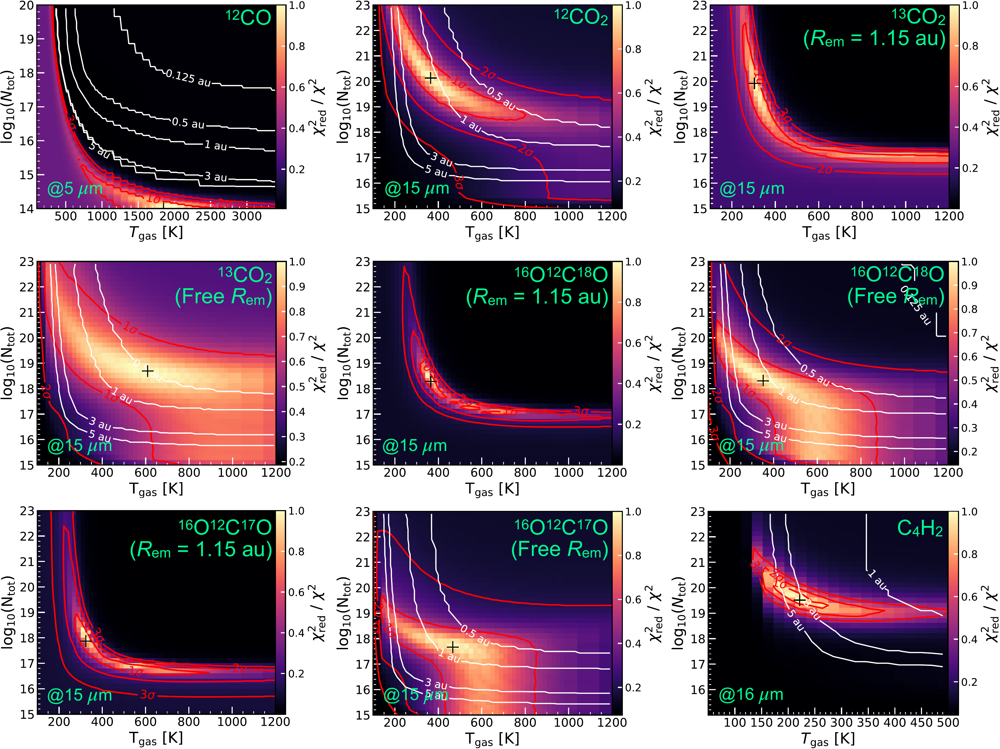
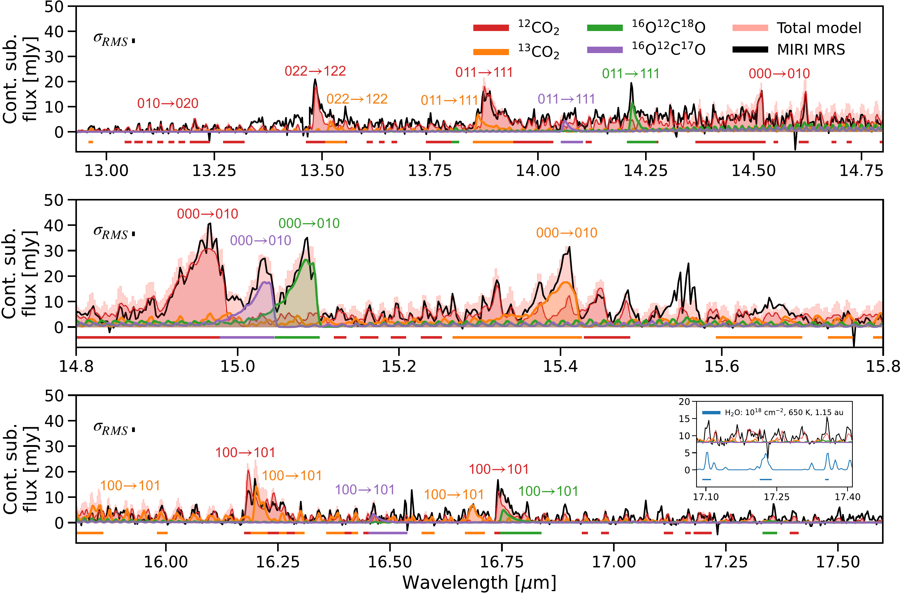

$\newcommand{\ensuremath}{}$
$\newcommand{\xspace}{}$
$\newcommand{\object}[1]{\texttt{#1}}$
$\newcommand{\farcs}{{.}''}$
$\newcommand{\farcm}{{.}'}$
$\newcommand{\arcsec}{''}$
$\newcommand{\arcmin}{'}$
$\newcommand{\ion}[2]{#1#2}$
$\newcommand{\textsc}[1]{\textrm{#1}}$
$\newcommand{\hl}[1]{\textrm{#1}}$
$\newcommand{\footnote}[1]{}$
$\newcommand{\vdag}{(v)^\dagger}$
$\newcommand$
$\newcommand$

# XUE: The $CO_2$-rich terrestrial planet-forming region\ of an externally irradiated Herbig disk

<mark>Appeared on: 2025-07-21</mark> -  _20 pages, 13 figures, 4 tables_

J. Frediani, et al. -- incl., <mark>A. Winter</mark>, <mark>T. Henning</mark>, <mark>G. Perotti</mark>

**Abstract:**            We investigate the James Webb Space Telescope (JWST) MIRI MRS gas molecular content of an externally irradiated Herbig disk, the F-type XUE 10 source, in the context of the eXtreme UV Environments (XUE) program. XUE 10 belongs to the massive star cluster NGC 6357 (1.69 kpc), where it is exposed to an external far-ultraviolet (FUV) radiation $\approx$ 10$^3$ times stronger than in the Solar neighborhood. We modeled the molecular features in the mid-infrared spectrum with Local Thermodynamic Equilibrium (LTE) 0D slab models. We derived basic parameters of the stellar host from a VLT FORS2 optical spectrum using PHOENIX stellar templates. We detect bright CO2 gas with the first simultaneous detection (> 5$\sigma$) of four isotopologues (12CO2, 13CO2, 16O12C18O, 16O12C17O) in a protoplanetary disk. We also detect faint CO emission (2$\sigma$) and the HI Pf$\alpha$ line (8$\sigma$). We also place strict upper limits on the water content, finding a total column density $\lesssim$ 10$^{18}$ cm$^{-2}$. The CO2 species trace low gas temperatures (300-370 K) with a range of column densities of 7.4 $\times$ 10$^{17}$ cm$^{-2}$ (16O12C17O)-1.3 $\times$ 10$^{20}$ cm$^{-2}$ (12CO2) in an equivalent emitting radius of 1.15 au. The emission of 13CO2 is likely affected by line optical depth effects. 16O12C18O and 16O12C17O abundances may be isotopically anomalous compared to the 16O/18O and 16O/17O ratios measured in the interstellar medium and the Solar System. We propose that the mid-infrared spectrum of XUE 10 is explained by H2O removal either via advection or strong photo-dissociation by stellar UV irradiation, and enhanced local CO2 gas-phase production. Outer disk truncation supports the observed CO2-H2O dichotomy. A CO2 vapor enrichment in 18O and 17O can be explained by means of external UV irradiation and early on (10$^{4-5}$ yr) delivery of isotopically anomalous water ice to the inner disk.         

**Figure 13. -** Reduced chi-square $N_{\rm tot}$--$T_{\rm gas}$ maps resulting from the fitting of 0D LTE gas slab models to the MIRI MRS spectrum for various molecular species at increasing wavelength.
    The fit of the carbon dioxide isotopologues, $^{13}$$CO_2$, $^{16}$O$^{12}$C$^{18}$O, and $^{16}$O$^{12}$C$^{17}$O with fixed/free emitting radius are labeled in figure. In colorbar are the $\chi^{2}_{red}/\chi^{2}$ values, with 1.0 corresponding to the best-fit model. The white contours show the range of fitted emitting radii in au, while the red contours show the 1$\sigma$, 2$\sigma$, and 3$\sigma$ confidence intervals. The location of the best-fit models in the parameter space is indicated by a black cross marker. (*fig:chisquaremaps*)

**Figure 5. -** Continuum-subtracted MIRI spectrum of XUE 10 (black) with overlaid best-fit slab models of the identified carbon dioxide isotopologues, $^{12}$$CO_2$(red), $^{13}$$CO_2$(orange), $^{16}$O$^{12}$C$^{18}$O (green), $^{16}$O$^{12}$C$^{17}$O (purple) between 12.93 $\mu$m and 17.6 $\mu$m (from top to bottom panel). The vibrational quantum numbers $(\upsilon_1 \upsilon_2 \upsilon_3)$ corresponding to the fundamental $\upsilon_2$$\mathit{Q}$-branch and its associated hot bands are labeled for each species. The inset in the bottom panel shows the fiducial LTE slab model of $H_2$O that matches the observed line luminosity between 17.08--17.4 $\mu$m. The colored horizontal bars indicate the fitted wavelength ranges for $CO_2$ listed in Table \ref{tab:fitting_ranges}. The spectral uncertainty is indicated in each panel. (*fig:13-18mu_slabmodels*)

**Figure 8. -** Continuum-subtracted MIRI spectrum of XUE 10 (black) and fiducial LTE slab models of $H_2$O between 6.4 $\mu$m and 7.6 $\mu$m (top panel), and between 18 $\mu$m and 25 $\mu$m (middle and bottom panel). The observed spectrum is vertically offset for visual clarity. The vertical dotted line marks the detected H$\alpha$ line of the Pfund series. The colored horizontal bars indicate where $H_2$O lines are tentatively identified. The spectral uncertainty is indicated in each panel. (*fig:1825mu_slabmodels*)

