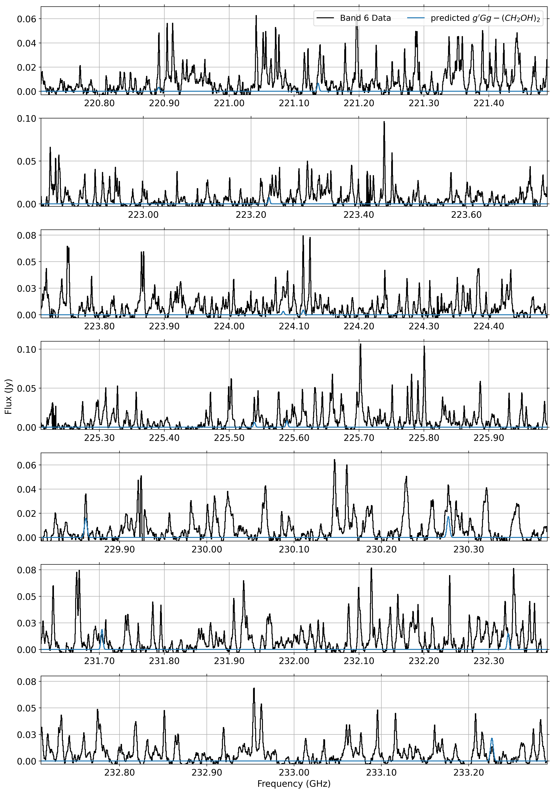

$\newcommand{\ensuremath}{}$
$\newcommand{\xspace}{}$
$\newcommand{\object}[1]{\texttt{#1}}$
$\newcommand{\farcs}{{.}''}$
$\newcommand{\farcm}{{.}'}$
$\newcommand{\arcsec}{''}$
$\newcommand{\arcmin}{'}$
$\newcommand{\ion}[2]{#1#2}$
$\newcommand{\textsc}[1]{\textrm{#1}}$
$\newcommand{\hl}[1]{\textrm{#1}}$
$\newcommand{\footnote}[1]{}$
$\newcommand{\vdag}{(v)^\dagger}$
$\newcommand$
$\newcommand$

# A deep Search for Ethylene Glycol and Glycolonitrile in the V883 Ori Protoplanetary Disk

<mark>Appeared on: 2025-07-22</mark> -  _15 pages, 8 figures, accepted for publication in ApJL_

A. M. A. Fadul, et al. -- incl., <mark>T. Suhasaria</mark>

**Abstract:** Ethylene glycol ( $\mathrm{(CH_2OH)_2}$ , hereafter EG) and Glycolonitrile ( $\mathrm{HOCH_2CN}$ , hereafter GN) are considered molecular precursors of nucleic acids. EG is a sugar alcohol and the reduced form of Glycolaldehyde ( $\mathrm{CH_2(OH)CHO}$ , hereafter GA). GN is considered a key precursor of adenine formation (nucleotide) and can be a precursor of glycine (amino acid).Detections of such prebiotic molecules in the interstellar medium are increasingly common. How much of this complexity endures to the planet formation stage, and thus is already present when planets form, remains largely unknown. Here we report Atacama Large Millimeter/sub-millimeter Array (ALMA) observations in which we tentatively detect EG and GN in the protoplanetary disk around the outbursting protostar V883 Ori. The observed EG emission is best reproduced by a column density of $\mathrm{3.63^{+0.11}_{-0.12} \times 10^{16} \; cm^{-2}}$ and a temperature of at least 300 K. The observed GN emission is best reproduced by a column density of $\mathrm{3.37^{+0.09}_{-0.09} \times 10^{16} \; cm^{-2}}$ and a temperature of $88^{+1.2}_{-1.2}$ K.Comparing the abundance of EG and GN relative to methanol in V883 Ori with other objects, V883 Ori falls between hot cores and comets in terms of increasing complexity. This suggests that the build up of prebiotic molecules continues past the hot core phase into the epoch of planet formation. Nascent planets in such environments may inherit essential building blocks for life, enhancing their potential habitability. Further observations of this protoplanetary disk at higher spectral resolution are required to resolve blended lines and to confirm these tentative detection.

**Figure 5. -** The best-fit model of the detected transitions of $\mathrm{g\text{'}Gg-(CH_2OH)_2}$ is shown in green, and $\mathrm{HOCH_2CN}$ is shown in orange. These are plotted on top of the data, which is shown in black, along with the summed spectra of the other detected molecules by Fadul25, shown in blue. The dotted and dashed gray line indicates the noise level in the data (corresponding to 1 and 3$\sigma$). (*results*)

**Figure 2. -** Represent the cumulative model for all species reported by Fadul25 in blue, and the same cumulative model include EG and GN in green. The black represents the observed spectra, and the gray dotted horizontal line represents the noise level, which corresponds to 1$\sigma$.  (*summed_spectra*)

**Figure 3. -** Shows ethylene glycol spectra in steel blue overlaid on the observed spectra from ALMA Band 6 in black   ([Jeong, Lee and Lee 2025]()) . (*firstFigure*)

