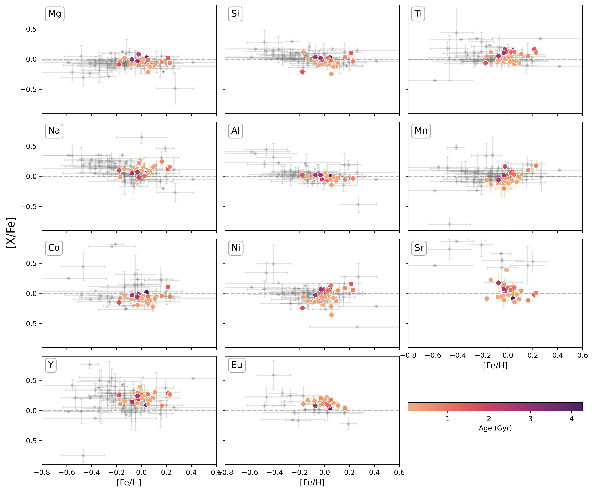
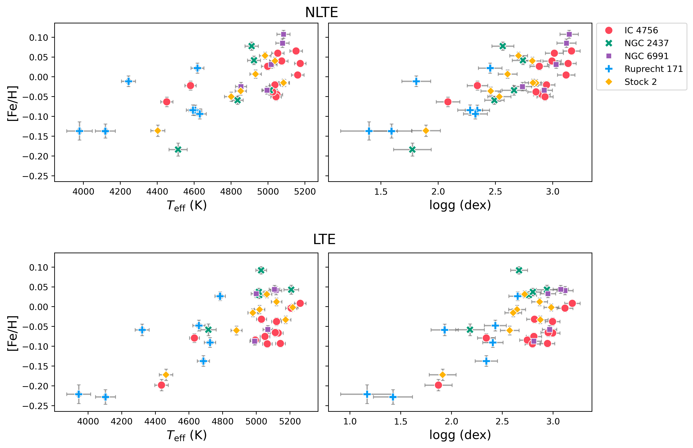

$\newcommand{\ensuremath}{}$
$\newcommand{\xspace}{}$
$\newcommand{\object}[1]{\texttt{#1}}$
$\newcommand{\farcs}{{.}''}$
$\newcommand{\farcm}{{.}'}$
$\newcommand{\arcsec}{''}$
$\newcommand{\arcmin}{'}$
$\newcommand{\ion}[2]{#1#2}$
$\newcommand{\textsc}[1]{\textrm{#1}}$
$\newcommand{\hl}[1]{\textrm{#1}}$
$\newcommand{\footnote}[1]{}$

# Stellar Population Astrophysics (SPA) with the TNG$\thanks{Based on observations made with the Italian TelescopioNazionale Galileo (TNG) operated on the island of La Palma bythe Fundación Galileo Galilei of the INAF (Istituto Nazionaledi Astrofisica) at the Observatorio del Roque de los Muchachos.}$: NLTE atmospheric parameters and abundances of giant stars in 33 Open Clusters

<mark>Appeared on: 2025-07-22</mark> -  _23 pages, 12 figures, Accepted for publication in A&A_

M. D. Ponte, et al. -- incl., <mark>N. Storm</mark>

**Abstract:** Open clusters serve as important tools for accurately studying the chemical evolution of the Milky Way. By combining precise chemical data from high-resolution spectra with information on their distances and ages, we can effectively uncover the processes that have shaped our Galaxy. This study aims to derive non-local thermodynamic equilibrium (NLTE) atmospheric parameters and chemical abundances for approximately one hundred giant stars across 33 open clusters with near-solar metallicity. The clusters span a wide range of ages, enabling an assessment of the presence and extent of any age-related abundance gradients. In the Stellar Population Astrophysics (SPA) project, we acquired new high-resolution spectra of giant stars in a sample of open clusters using the HARPS-N echelle spectrograph at the Telescopio Nazionale Galileo (TNG). We chemically characterized nine open clusters for the first time and reanalyzed previously studied SPA clusters, resulting in a consistent and homogeneous sample. We determined NLTE atmospheric parameters using the equivalent width method and derived NLTE chemical abundances through spectral synthesis for various elements, including $\alpha$ elements (Mg, Si, and Ti), light odd-Z elements (Na, Al), iron-peak elements (Mn, Co, and Ni), and neutron-capture elements (Sr, Y, and Eu). Our findings are compared with the existing literature, revealing good agreement. We examine the trends of [ X/Fe ] versus age, confirming previous observations and the enrichment patterns predicted by nucleosynthesis processes. Positive correlations with age are present for $\alpha$ elements such as Mg, Si, Ti, odd-Z Al, and iron-peak elements Mn, Co, Ni, ${and Sr}$ , while Na and ${neutron-capture Y and Eu}$ show a negative trend. This study emphasizes the significance of NLTE corrections and reinforces the utility of open clusters as tracers of Galactic chemical evolution. Furthermore, we provide a benchmark sample of NLTE abundances for upcoming open cluster surveys within large-scale projects such as 4MOST and WEAVE.

**Figure 9. -** Abundance [X/Fe] ratios as function of [Fe/H]. The gray diamonds represent the OCs compilation from GALAH (see Table \ref{tab:galah_oc}). Our results are color-coded according to the age. (*fig:elem_fe*)

**Figure 10. -** Abundance [X/Fe] ratios as a function of age. The gray diamonds represent the OCs compilation from GALAH (see Table \ref{tab:galah_oc}) and the gray squares represent the OCs from OCCAM. Our results are color-coded according to [Fe/H]. (*fig:elem_age_fe*)

**Figure 8. -** Atmospheric parameters [Fe/H], $T_{\rm eff}$, and $\log g$ obtained with {\tt LOTUS} for clusters containing more than five stars. The first row presents the NLTE results, while the second row shows the LTE results. (*fig:lotus*)

