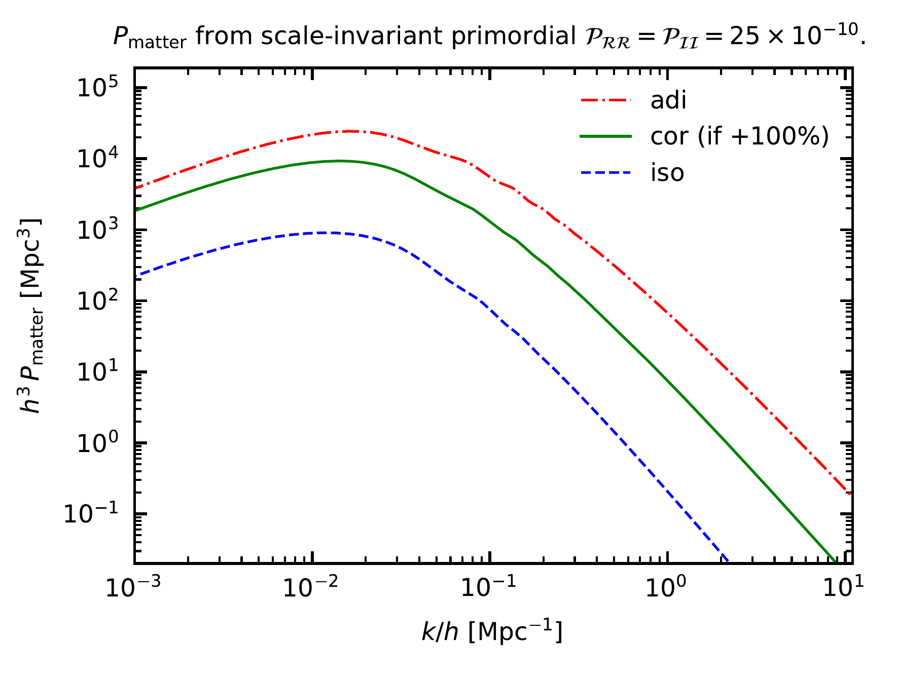
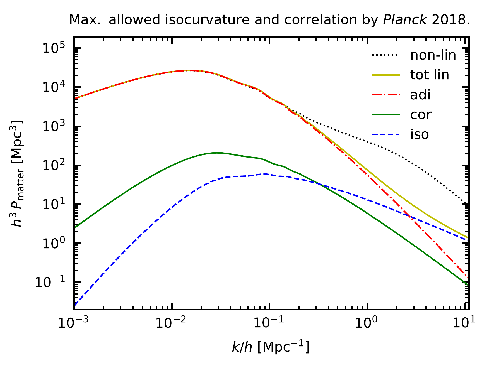
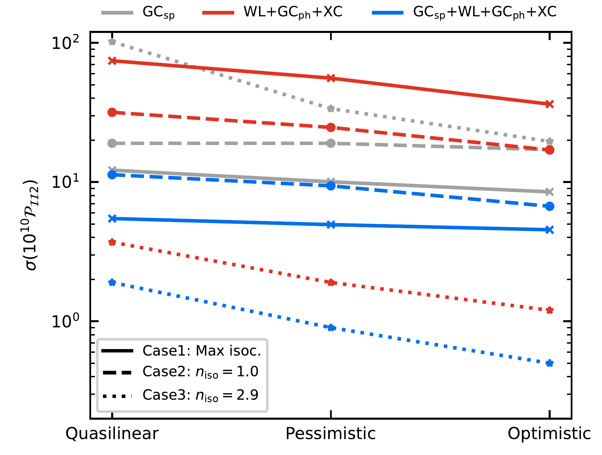

$\newcommand{\ensuremath}{}$
$\newcommand{\xspace}{}$
$\newcommand{\object}[1]{\texttt{#1}}$
$\newcommand{\farcs}{{.}''}$
$\newcommand{\farcm}{{.}'}$
$\newcommand{\arcsec}{''}$
$\newcommand{\arcmin}{'}$
$\newcommand{\ion}[2]{#1#2}$
$\newcommand{\textsc}[1]{\textrm{#1}}$
$\newcommand{\hl}[1]{\textrm{#1}}$
$\newcommand{\footnote}[1]{}$
$\newcommand{\bk}{\bm{k}}$
$\newcommand{\bq}{\bm{q}}$
$\newcommand{\bx}{\bm{x}}$
$\newcommand{\fnl}{f_{\rm NL}}$
$\newcommand{\fnll}{f_{\mathrm{NL}}^{\mathrm{loc}}}$
$\newcommand{\fnle}{f_{\mathrm{NL}}^{\mathrm{equil}}}$
$\newcommand{\fnloC}{f_{\mathrm{NL}}^{\mathrm{ortho-CMB}}}$
$\newcommand{\fnloL}{f_{\mathrm{NL}}^{\mathrm{ortho-LSS}}}$
$\newcommand{\Mpc}{\ensuremath{\text{h/Mpc}}\xspace}$
$\newcommand{\GCsp}{{\text{GC}\ensuremath{_\mathrm{sp}}}}$
$\newcommand{\GCph}{{\text{GC}\ensuremath{_\mathrm{ph}}}}$
$\newcommand{\Omegam}{\ensuremath{\Omega_{\mathrm{m},0}}}$
$\newcommand{\Omegab}{\ensuremath{\Omega_{\mathrm{b},0}}}$
$\newcommand{\OmegaDE}{\ensuremath{\Omega_{\mathrm{DE},0}}}$
$\newcommand{\ns}{n_{\mathrm{s}}}$
$\newcommand{\lcdm}{\ensuremath{\Lambda\mathrm{CDM}}}$
$\newcommand{\logfr}{\ensuremath{\log_{10}(|f_{R0}|)}}$
$\newcommand{\fr}{\ensuremath{|f_{R0}|}}$
$\newcommand{\sg}{\ensuremath{\sigma_{8}}}$
$\newcommand{\de}{\mathrm{d}}$
$\newcommand{\bpd}{{b_{\phi ,   \delta}}}$
$\newcommand{\borg}{\texttt{BORG}\xspace}$
$\newcommand{\Mpch}{\ensuremath{h^{-1} \text{Mpc}}}$
$\newcommand{\dd}{\mathrm{d}}$
$\newcommand{\jvc}[1]{\textcolor{red}{JV: #1}}$
$\newcommand{\aanote}[1]{\textcolor{purple}{AA: #1}}$
$\newcommand{\DK}[1]{\textcolor{orange}{DK: #1}}$
$\newcommand{\FF}[1]{\textcolor{green}{FF: #1}}$
$\newcommand{\mb}[1]{{\color{blue} #1}}$
$\newcommand{\MB}[1]{\textcolor{orange}{{\bf[MB: #1]}}}$
$\newcommand{\YA}[1]{\textcolor{red}{{\bf[YA: #1]}}}$
$\newcommand{\orcid}[1]$

# $\vspace*{-0.3cm}$Euclid preparation. Expected constraints on initial conditions

<mark>Appeared on: 2025-07-22</mark> -  _Abstract abridged, 25 pages, 6 tables, 11 figures_

E. Collaboration, et al. -- incl., <mark>K. Jahnke</mark>

**Abstract:** The $* Euclid*$ mission of the European Space Agency will deliver galaxy and cosmic shear surveys, which will be used to constrain initial conditions and statistics of primordial fluctuations. We present highlights for the $* Euclid*$ scientific capability to test initial conditions beyond $\Lambda$ CDMwith the 3-dimensional galaxy clustering from the spectroscopic survey, the tomographic approach to $3\times2$ pt statistics (information) from photometric galaxy survey, and their combination. We then present how these $* Euclid*$ results can be enhanced when combined with current and future measurements of the cosmic microwave background (CMB) anisotropies. We provide Fisher forecasts from the combination of $* Euclid*$ spectroscopic and photometric surveysfor spatial curvature, running of the spectral index of the power spectrum of curvature perturbations, isocurvature perturbations, and primordial features. For the parameters of these models we also provide the combination of $* Euclid*$ forecasts (pessimistic and optimistic) with three different CMB specifications, i.e. $* Planck*$ , the Simons Observatory (SO), and CMB-S4. We provide Fisher forecasts for how the power spectrum and bispectrum from the $* Euclid*$ spectroscopic survey will constrain the local, equilateral, and orthogonal shapes of primordial non-Gaussianity. We also review how Bayesian field-level inference of primordial non-Gaussianity can constrain local primordial non-Gaussianity. We find that the combination of the $* Euclid*$ main probes will provide the uncertainty of $\sigma(\Omega_K) = 0.0044 (0.003)$ at the $68 \%$ confidence level (CL) in the pessimistic (optimistic) settings assuming flat spatial sections as fiducial cosmology. We also find that the combination of the $* Euclid*$ main probes can detect the running of the scalar spectral index for the fiducial value $\alpha_s = - 0.01$ with approximately $2\sigma$ ( $4\sigma$ ) uncertainty and provide the uncertainty of $\sigma(\alpha_s)  = 0.004 (0.0015)$ for the fiducial value $\alpha_s = - 0.001$ at the $68\%$ CL, always with pessimistic (optimistic) settings. We show how $* Euclid*$ will have the capability to provide constraints on isocurvature perturbations with ablue spectral index that are one order of magnitude tighter than current bounds. The combined power spectrum and bispectrum Fisher forecast for the $* Euclid*$ spectroscopic survey leads to $\sigma (f_{\rm NL}^{\rm local}) = 2.2$ , $\sigma (f_{\rm NL}^{\rm equil}) = 108$ , and $\sigma (\fnl^{\rm ortho}) = 33$ by assuming $k_{\rm max} = 0.15 h {\rm Mpc}^{-1}$ and universality for the halo mass function. We show how the expected uncertainty on the local shape decreases by encompassing summary statistics and using Bayesian field-level inference. For the $* Euclid*$ main probes, we find relative errors on the amplitude of primordial oscillations (with a fiducial value of $0.01$ ), of 21 \% (18 \% ) for linear frequency and of 22 \% (18 \% ) for logarithmic frequency at $68.3\%$ CL in the pessimistic (optimistic) case. These uncertainties can be further improved by adding the information from the bispectrum and the non-linear reconstruction. We show how $* Euclid*$ , with its unique combination of 3-dimensional galaxy clustering from the spectroscopic survey and $3\times2$ pt statistics from the photometric survey, will provide the tightest constraints on low redshift to date. By targeting a markedly different range in redshift and scale, $* Euclid*$ 's expected uncertainties are complementary to those obtained by CMB primary anisotropy, returning the tightest combined constraints on the physics of the early Universe.

**Figure 10. -** 
Matter power spectra at redshift $z=0$.
The left panel shows the linear matter power spectrum today, if the primordial perturbations are scale-invariant pure adiabatic perturbations with amplitude $\mathcal{P}_\mathcal{RR} = 25\times10^{-10}$(red dotted-dashed), or if the primordial perturbations are scale-invariant pure cold dark matter isocurvature perturbations with amplitude $\mathcal{P}_\mathcal{II} = 25\times10^{-10}$(blue dashed), and the resulting correlation component to the matter power spectrum if there are these two components and they are $+100\%$ correlated with each other (green solid).
The right panel shows the fiducial model used in the case of "maximum $2\sigma$ allowed by * Planck*." The linear total matter power spectrum (tot lin) is the sum of the adiabatic (adi) and blue-tilted isocurvature (iso) contributions, and their $\sim10\%$ correlation (cor). This (tot lin) is then corrected by \texttt{Halofit} to approximate the non-linear spectrum (non-lin) of the fiducial model. (*fig:isocurvatureexamples*)

**Figure 2. -** Fisher-matrix marginalised uncertainty for $10^{10}$ times the primordial isocurvature perturbation amplitude $\mathcal{P}_\mathcal{II}$ at $k_2 = 0.1 $Mpc$^{-1}$ for Case 1 "maximum $2\sigma$ allowed by * Planck*" (solid lines), Case 2 "scale-invariant uncorrelated $n_\mathrm{iso}=1.0$" (dashed lines), and Case 3 "blue-tilted uncorrelated $n_\mathrm{iso}=2.9$" (dotted lines).
Our baseline results of Table \ref{tab:isocurvaturefisher} are for the pessimistic setting. To test the effect of the choice of $k_{\rm max}$ and $\ell_{\rm max}$ on the results we repeat the analysis with an even more conservative quasilinear setting ($k_{\rm max} = 0.15 h {\rm Mpc}^{-1}$ for $\GCsp$, $\ell_{\rm max} = 750$ for WL, and $\ell_{\rm max} = 500$ for $\GCph$ and XC) and with the optimistic setting ($k_{\rm max} = 0.30 h {\rm Mpc}^{-1}$ for $\GCsp$, $\ell_{\rm max} = 5000$ for WL, and $\ell_{\rm max} = 3000$ for $\GCph$ and XC). (*fig:isoc_quasi_pess_optimistic*)

**Figure 11. -**  Matter power spectra at redshift $z=0$ for Case 2 (left panel) and Case 3 (right panel). The left panel shows the different contributions for our forecasted pessimistic $\GCsp$$1\sigma$ upper bound on our Case 2 uncorrelated isocurvature model with $n_\mathrm{iso}=1.0$ when the underlying true model (fiducial, cyan colour) is purely adiabatic. The upper bound on the isocurvature contribution is so small that the linear pure adiabatic (adi) and total linear (tot lin) matter power spectra are indistinguishable by eye in this figure. The right panel shows the same quantities for the forecasted $\GCsp$$1\sigma$ pessimistic upper bound on our Case 3 one-isocurvature-parameter uncorrelated isocurvature model with $n_\mathrm{iso}=2.9$ when the underlying true model (fiducial) is purely adiabatic. Note how, for Case 3, the isocurvature contribution visibly modifies the spectrum for $k/h \gtrsim 0.1 \mathrm{Mpc}^{-1}$. (*fig:1paramisocurvaturecases*)

