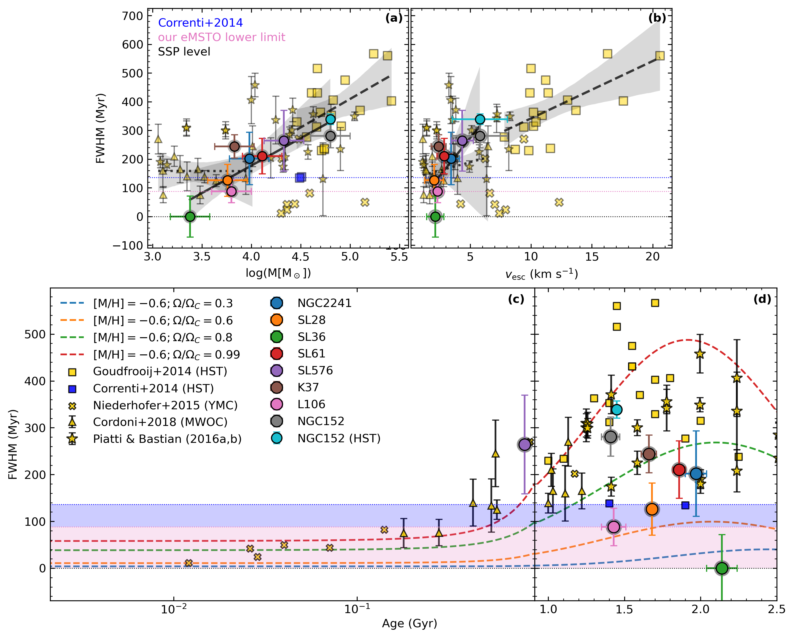
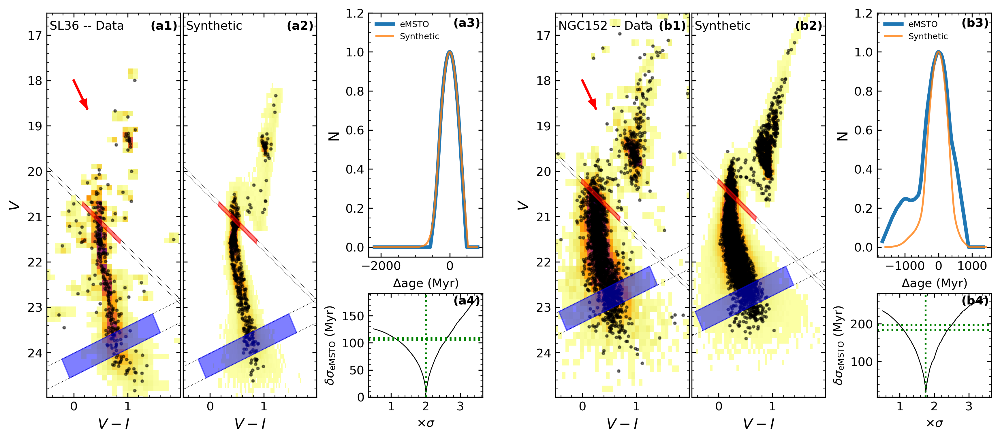
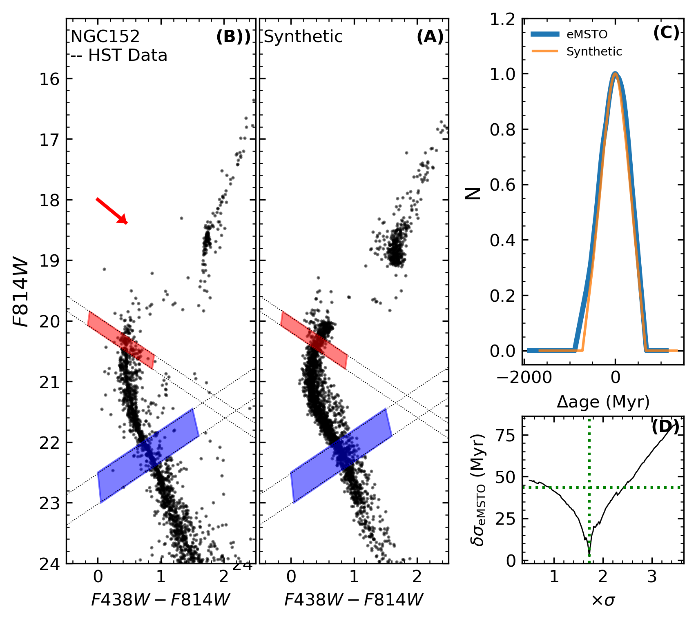

$\newcommand{\ensuremath}{}$
$\newcommand{\xspace}{}$
$\newcommand{\object}[1]{\texttt{#1}}$
$\newcommand{\farcs}{{.}''}$
$\newcommand{\farcm}{{.}'}$
$\newcommand{\arcsec}{''}$
$\newcommand{\arcmin}{'}$
$\newcommand{\ion}[2]{#1#2}$
$\newcommand{\textsc}[1]{\textrm{#1}}$
$\newcommand{\hl}[1]{\textrm{#1}}$
$\newcommand{\footnote}[1]{}$
$\newcommand{\angstrom}{\mbox{\normalfontÅ}}$
$\newcommand{\orcid}[1]{\href{https://orcid.org/#1}{\includegraphics[width=10pt]{Orcid-ID.png}}}$
$\newcommand{\stefano}[1]{{\color{red}#1}}$

# The VISCACHA survey: XIII. The extended main-sequence turn-off in intermediate-age low-mass clusters

<mark>Appeared on: 2025-07-23</mark> -  _Accepted for publication in A&A. 9 pages, 5 figures, and 2 tables_

S. O. Souza, et al.

**Abstract:** The extended main-sequence turn-off (eMSTO) is a well-known feature observed in young and intermediate-age star clusters, characterized by a significant broadening of the main-sequence turn-off region. Although prolonged star formation and stellar rotation have been proposed as possible explanations, no consensus has yet been reached. Most previous studies have focused on high-mass clusters. In this work, we extend the analysis to the less-explored low-mass regime by investigating star clusters in the Magellanic Clouds using data from the VISCACHA survey. We employed a widely used method to quantify the MSTO width in terms of age spread. Additionally, to validate our approach, we used a cluster also observed with HST. Our analysis confirms that the eMSTO phenomenon is also present in low-mass clusters, following the known ${age/mass-MSTO width relations}$ . In particular, the less massive cluster in our sample does not show an eMSTO, supporting the proposed link between the eMSTO and the escape velocity of the cluster, providing a new lower limit to the age spread of $88\pm40$ Myr for the presence of the eMSTO. The consistent MSTO width measurements between the VISCACHA and HST photometries confirm the robustness of our method and demonstrate that the age spread determination is independent of the photometric system, showing also the power of ground-based observations to investigate the eMSTO phenomenon.

**Figure 4. -** The MSTO width at 50\% of the maximum (FWHM), as a function of cluster mass (panel a), escape velocity (panel b), and age (panels c and d). The colored dots represent the star clusters analyzed in this work. Yellow squares represent MCs clusters from [Goudfrooij, Girardi and Kozhurina-Platais (2014)](), the blue squares are the clusters analyzed by [Correnti, Goudfrooij and Kalirai (2014)]() and used by [Goudfrooij, Girardi and Kozhurina-Platais (2014)]() lower limit for the existence of the eMSTO, yellow crosses indicate YMC analyzed by [Niederhofer, et. al (2015)](). Yellow triangles show MWOC from [Cordoni, Milone and Marino (2018)](). The yellow stars are the results by [ and Piatti (2016)](), [ and Piatti (2016)](). The colored dotted lines illustrate the expected MSTO width comparing non-rotating isochrones to models for different rotation fractions $\Omega/\Omega_C=$ 0.3 (blue), 0.6 (orange), 0.8 (green), and 0.99 (red), adopting the metallicity of [M/H]$=-0.6$(mean of our sample). The horizontal dashed blue line represents previous limits by [Correnti, Goudfrooij and Kalirai (2014)]() and [Goudfrooij, Girardi and Kozhurina-Platais (2014)](), while the pink line and shaded region mark the eMSTO limit derived in this work. The black lines in panels (a) and (b) represent the linear regression for the data from \citet[][dotted]{cordoni18}, \citet[][dashed]{goudfrooij14}, and this work (solid). The gray shaded regions represent the standard deviation of the fit.  (*fig:main_fig*)

**Figure 3. -** Hess diagrams for SL36 (left) and NGC152 (right) showing the MSTO width derivation. Panels a1 and b1 show the observed data expanded via Monte Carlo simulation. The synthetic CMDs generated from the best isochrone fitting are in panels a2 (SL36) and b2 (NGC152). The red arrow represents the reddening vector for a $E(B-V)=0.2$. The age distribution along the eMSTO are shown in panels a3 (SL36) and b3 (NGC152). The synthetic CMDs were generated assuming the scaled errors using the MS control sample and demonstrated in panels a4 (SL36) and b4 (NGC152). The dotted black lines in panels a1, a2, b1, and b2 are the support lines to construct the eMSTO parallelogram (red shaded region) and the MS control sample (blue shaded region). The vertical green line in panels a4 and b4 shows the best error scale, while the horizontal line is the mean age standard deviation in the MS control sample used as an error for the MSTO width. (*fig:sl36_res*)

**Figure 2. -** Same as Figure \ref{fig:sl36_res}, but for NGC 152 using HST data. (*fig:ngc152_hst*)

