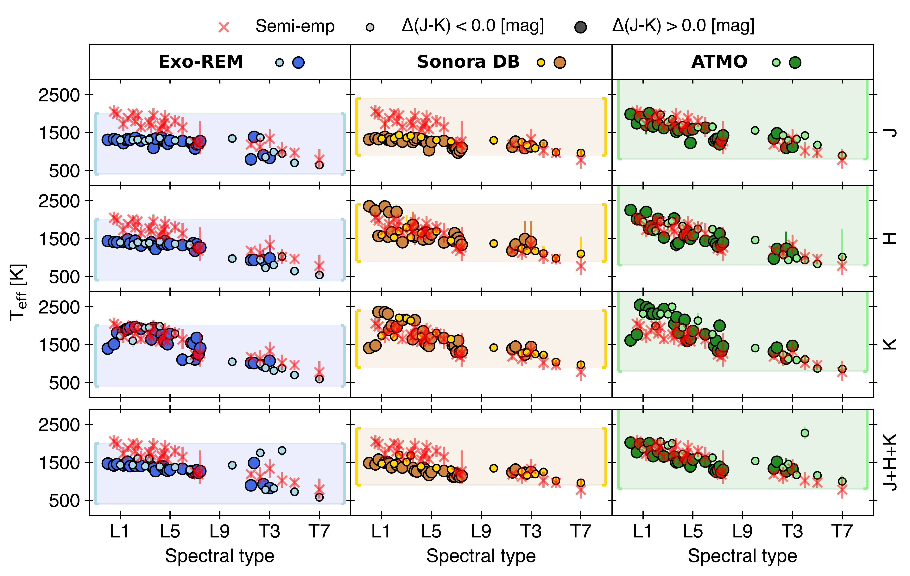

$\newcommand{\ensuremath}{}$
$\newcommand{\xspace}{}$
$\newcommand{\object}[1]{\texttt{#1}}$
$\newcommand{\farcs}{{.}''}$
$\newcommand{\farcm}{{.}'}$
$\newcommand{\arcsec}{''}$
$\newcommand{\arcmin}{'}$
$\newcommand{\ion}[2]{#1#2}$
$\newcommand{\textsc}[1]{\textrm{#1}}$
$\newcommand{\hl}[1]{\textrm{#1}}$
$\newcommand{\footnote}[1]{}$
$\newcommand{\mic}{\ensuremath{\upmu}m\xspace}$
$\newcommand{\Teff}{\ensuremath{\mathrm{T_{eff}}}\xspace}$
$\newcommand{\fsed}{\ensuremath{\mathrm{f_{sed}}}\xspace}$
$\newcommand{\kzz}{\ensuremath{\mathrm{K_{ZZ}}}\xspace}$
$\newcommand{\Rjup}{\ensuremath{\mathrm{R_{Jup}}}\xspace}$
$\newcommand{\Mjup}{\ensuremath{\mathrm{M_{Jup}}}\xspace}$
$\newcommand{\Lbol}{\ensuremath{\mathrm{L_{bol}}}\xspace}$
$\newcommand{\Rlam}{\ensuremath{\mathrm{R_{\uplambda}}}\xspace}$
$\newcommand{\chr}{\ensuremath{\mathrm{\chi^{2}_{r}}}\xspace}$
$\newcommand{\ab}[1]{\textcolor{red}{AB: #1}}$

# X-SHYNE: X-Shooter spectra of young exoplanet analogs$\thanks{Based on observations collected at the European Organization for Astronomical Research in the Southern Hemisphere under ESO programs 0101.C-0290; 0102.C-0121; 0103.C-0231; 0104.C-0094; 111.24PX.001; and 114.27B1.001}$: II. Presentation and analysis of the full library

<mark>Appeared on: 2025-07-24</mark> -  _28 pages, 18 figures, 6 tables_

S. Petrus, et al. -- incl., <mark>G. Chauvin</mark>, <mark>M. Ravet</mark>, <mark>P. Mollière</mark>

**Abstract:** The characterization of exoplanetary spectra is a crucial step in understanding the chemical and physical processes shaping their atmospheres and constraining their formation and evolutionary history. The X-SHYNE library is a homogeneous sample of 43 medium-resolution ( $\Rlam$  $\sim$ 8000) infrared (0.3–2.5 $\mic$ ) spectra of young ( $<$ 500 Myr), low-mass ( $<$ 20 $\Mjup$ ), and cold ( $\Teff$  $\sim$ 600–2000 K) isolated brown dwarfs and wide-separation companions observed with the VLT/X-Shooter instrument. To characterize our targets, we performed a global comparative analysis. We first applied a semi-empirical approach. By refining their age and bolometric luminosity, we derived key atmospheric and physical properties, such as $\Teff$ , mass, surface gravity (g), and radius, using the evolutionary model \texttt{COND03} . These results were then compared with the results from a synthetic analysis based on three self-consistent atmospheric models: the cloudy models \texttt{Exo-REM} and \texttt{Sonora Diamondback} , and the cloudless model \texttt{ATMO} . To compare our spectra with these grids we used the Bayesian inference code \texttt{ForMoSA} . We found similar $\Lbol$ estimates between both approaches, but an underestimated $\Teff$ from the cloudy models, likely due to a lack of absorbers that could dominate the J and H bands of early L. We also observed a discrepancy in the log(g) estimates, which are dispersed between 3.5 and 5.5 dex for mid-L objects. We interpreted this as a bias caused by a range of rotational velocities leading to cloud migration toward equatorial latitudes, combined with a variety of viewing angles that result in different observed atmospheric properties (cloud column densities, atmospheric pressures, etc.). This interpretation is supported by the correlation of the color anomaly $\Delta$ (J-K) of each object with log(g) and the parameter $\fsed$ that drives the sedimentation of the clouds. Finally, while providing robust estimates of [ M/H ] and C/O for individual objects remains challenging, the X-SHYNE library globally suggests solar values, which are consistent with a formation via stellar formation mechanisms. This study highlights the strength of homogeneous datasets in performing comparative analyses, reducing the impact of systematics, and ensuring robust conclusions while avoiding over-interpretation.

**Figure 4. -** Sequence of the X-SHYNE spectra. The integrated flux between 1.2 and 1.3 $\mic$ normalized the spectra, and an offset was applied. The color of each spectrum indicates its spectral type. Several zooms are given in Figures \ref{fig:sequence_VIS_wav}, \ref{fig:sequence_Y_wav}, \ref{fig:sequence_J_wav}, \ref{fig:sequence_H_wav}, and \ref{fig:sequence_K_wav}. (*fig:sequence_full_wav*)

**Figure 8. -** $\Lbol$ estimated from each model grid and for each spectral range using the Stefan-Boltzmann law, based on the estimated $\Teff$(see Figure \ref{fig:tem}) and radius (see Figure \ref{fig:rad}). Objects with a negative color anomaly are represented by small light dots, while those with a positive color anomaly are shown as large deep dots. The $\Lbol$ values derived from the reconstructed SED (see Section \ref{sec:semiempirical_Lbol}) are indicated by red crosses. (*fig:lum*)

**Figure 9. -** Same as in Figure \ref{fig:lum}, but for the $\Teff$. The boundaries of each model grid are represented by the filled colored regions. (*fig:tem*)

