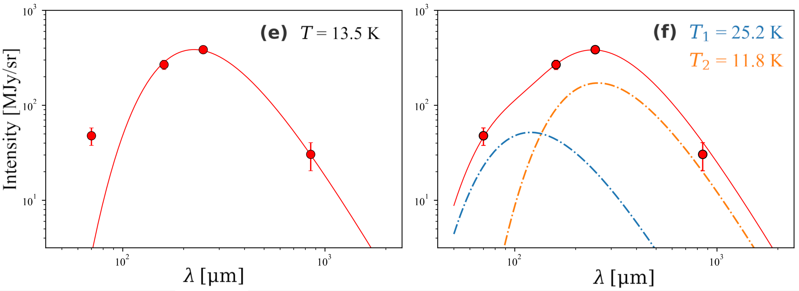
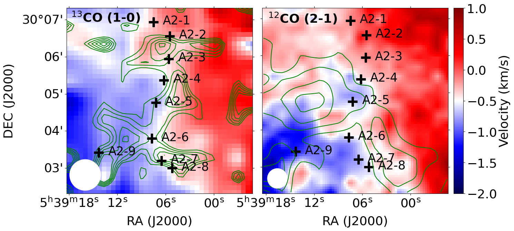
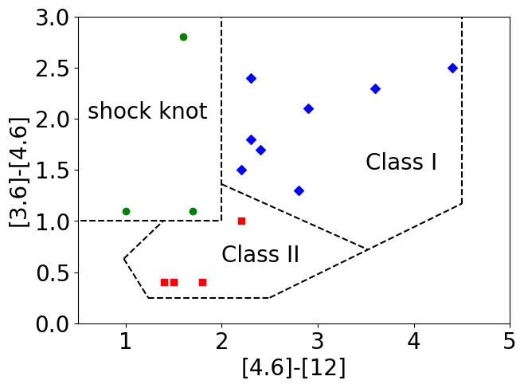

$\newcommand{\ensuremath}{}$
$\newcommand{\xspace}{}$
$\newcommand{\object}[1]{\texttt{#1}}$
$\newcommand{\farcs}{{.}''}$
$\newcommand{\farcm}{{.}'}$
$\newcommand{\arcsec}{''}$
$\newcommand{\arcmin}{'}$
$\newcommand{\ion}[2]{#1#2}$
$\newcommand{\textsc}[1]{\textrm{#1}}$
$\newcommand{\hl}[1]{\textrm{#1}}$
$\newcommand{\footnote}[1]{}$
$\newcommand$
$\newcommand$

# An S-shaped filament formed due to Cloud-Cloud Collision in molecular cloud G178.28-00.61

<mark>Appeared on: 2025-07-25</mark> - 

T. Zhang, et al. -- incl., <mark>S. Jiao</mark>

**Abstract:** We present compelling observational evidence supporting G178.28-00.61 as an early-stage candidate for Cloud-Cloud Collision (CCC), with indications of the formation of an S-shaped filament, evenly-separated dense cores, and young star clusters. The observations of CO molecular line emission demonstrate the existence of two interacting molecular clouds with systemic velocities of 0.8 km s $^{-1}$ and -1.2 km s $^{-1}$ , respectively. The convergence zone of these two clouds reveals an S-shaped filament in the JCMT 850 $\mu$ m continuum image, suggesting cloud interaction. In line with expectations from CCC simulations, broad bridging features are discernible in the position-velocity diagrams. An elevated concentration of identified Class I and II young stellar objects along the filament at the intersection area further supports the hypothesis of a collision-induced origin.This observation could be explained by a recent MHD model of CCC (Kong et al. 2024), which predicts a similar morphology, scale, density, and unbound status, as well as the orientation of the polarization.

**Figure 1. -** (a) The 850 $\mu$m continuum emission map of G178.2-0.6 in color scale, detected by the JCMT and Planck. Ten emission peaks are marked, which were subject to subsequent spectral observation using the KVN in single point mode. The cores identified with the dendrogram are delineated by black contours. The JCMT beam size and the corresponding physical scale are shown in the bottom left corner. The dust polarization is shown by the dark blue solid line at the center, roughly perpendicular to the filament. (b) to (d) The pixel-by-pixel SED fitting results for two-component modified grey body spectra, based on continuum images across four bands (70, 160, 250 $\mu$m Herschel data and 850 $\mu$m JCMT+Planck data). (b) The total column density map, overlaid with 850 $\mu$m continuum contours which range over 0.47--0.77 mJy/arcsec$^2$ with a step of 0.1 mJy/arcsec$^2$. (c) and (d): the derived dust temperature of the warm and cold component, respectively. (e) and (f) The example SEDs of core A2-4 with single-component and two-component fit. (*fig:continuum-SED*)

**Figure 10. -** Moment 1 maps of $^{13}$CO (1-0) (left panel) and $^{12}$CO (2-1) (right panel) in color scale, with corresponding moment 2 maps overlaid as green contours. The contours for the line widths of $^{13}$CO (1-0) are 1.7--2.5 km s$^{-1}$ with a step of 0.2 km s$^{-1}$, and for $^{12}$CO (2-1) are 3.4--4.0 km s$^{-1}$ with a step of 0.2 km s$^{-1}$. The continuum peaks are labeled and found to locate at the intermediate velocity region. The beam sizes are shown as white circles. (*fig:moments*)

**Figure 2. -** Left panel: WISE three-color composite image (RGB: 22 $\mu$m, 12 $\mu$m, 3.4 $\mu$m), overlaid with associated YSOs and 850 $\mu$m continuum contours. Class I YSOs are depicted in yellow diamonds, Class II YSOs in squares, shock knots in circles. The black cross shows the IRAS point source. The continuum peaks are marked as white crosses and names on the side. Right panel: The color–color diagram for the bands 3.4 $\mu$m, 4.6 $\mu$m, and 12 $\mu$m used to classify YSOs associated with G178. The dashed lines denotes the criteria used by \cite{koe12,koe14} to delineate the YSO classes. (*fig:WISE_YSO*)

