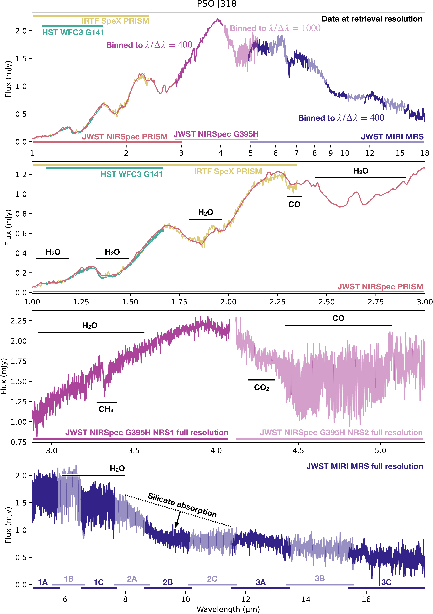

$\newcommand{\ensuremath}{}$
$\newcommand{\xspace}{}$
$\newcommand{\object}[1]{\texttt{#1}}$
$\newcommand{\farcs}{{.}''}$
$\newcommand{\farcm}{{.}'}$
$\newcommand{\arcsec}{''}$
$\newcommand{\arcmin}{'}$
$\newcommand{\ion}[2]{#1#2}$
$\newcommand{\textsc}[1]{\textrm{#1}}$
$\newcommand{\hl}[1]{\textrm{#1}}$
$\newcommand{\footnote}[1]{}$
$\newcommand{\rch}[1]{{{\color{black}#1}}}$
$\newcommand{\todoSO}[1]{\stepcounter{todocounter}\oldtodo[inline, color=green]{\thetodocounter: Paul -- #1}}$
$\newcommand{\todo}[1]{\stepcounter{todocounter}\oldtodo[inline]{\thetodocounter: #1}}$
$\newcommand{\mjup}{{\rm M_{\jupiter}}}$
$\newcommand{\micron}{µm}$
$\newcommand{\pso}{PSO~J318}$
$\newcommand{\aj}{AJ}$
$\newcommand{\araa}{ARA\&A}$
$\newcommand{\apj}{ApJ}$
$\newcommand{\apjl}{ApJ}$
$\newcommand{\apjs}{ApJS}$
$\newcommand{\ao}{Appl.Optics}$
$\newcommand{\apss}{Ap\&SS}$
$\newcommand{\aap}{A\&A}$
$\newcommand{\aapr}{A\&A~Rev.}$
$\newcommand{\aaps}{A\&AS}$
$\newcommand{\baas}{BAAS}$
$\newcommand{\jrasc}{JRASC}$
$\newcommand{\memras}{MmRAS}$
$\newcommand{\mnras}{MNRAS}$
$\newcommand{\pra}{Phys.Rev.A}$
$\newcommand{\prb}{Phys.Rev.B}$
$\newcommand{\prc}{Phys.Rev.C}$
$\newcommand{\prd}{Phys.Rev.D}$
$\newcommand{\prl}{Phys.Rev.Lett}$
$\newcommand{\pasp}{PASP}$
$\newcommand{\pasj}{PASJ}$
$\newcommand{\qjras}{QJRAS}$
$\newcommand{\skytel}{S\&T}$
$\newcommand{\solphys}{Solar~Phys.}$
$\newcommand{\sovast}{Soviet~Ast.}$
$\newcommand{\ssr}{Space~Sci.Rev.}$
$\newcommand{\zap}{ZAp}$
$\newcommand{\ActaA}{{Acta Astron.}}$

# Evidence for SiO cloud  nucleation in the rogue planet PSO J318

<mark>Appeared on: 2025-07-28</mark> -  _30 pages, 9 figures, accepted for publication in A&A_

<mark>P. Mollière</mark>, et al. -- incl., <mark>E. Matthews</mark>, <mark>T. Henning</mark>, <mark>M. Samland</mark>, <mark>S. Scheithauer</mark>

**Abstract:** Silicate clouds have long been known to significantly impact the spectra of late L-type brown dwarfs, with observable absorption features at $\sim 10$ µm. The $*James Webb Space Telescope*$ ( $*JWST*$ ) has reopened our window to the mid-infrared with unprecedented sensitivity, bringing the characterization of silicate clouds into focus again. Using $*JWST*$ , we aim to characterize the planetary-mass brown dwarf PSO J318.5338-22.8603, concentrating on any silicate cloud absorption the object may exhibit. $\pso$ 's spectrum is extremely red, and its flux is variable, both of which are thought to be hallmarks of cloud absorption. We present $*JWST*$ $*NIRSpec PRISM*$ , $*G395H*$ , and $*MIRI MRS*$ observations of $\pso$ from 1 to 18 µm. We introduce a method based on $\pso$ 's brightness temperature to generate a list of cloud species that are likely present in its atmosphere. We then test for the species' presence with \texttt{petitRADTRANS} retrievals. Using retrievals and grids from various climate models, we derive bulk parameters from $\pso$ 's spectra, which are mutually compatible. Our retrieval results point to a solar to slightly super-solar atmospheric C/O, a slightly super-solar metallicity, and a $\rm ^{12}C/^{13}C$ below ISM values. The atmospheric gravity proves difficult to constrain for both retrievals and grid models. Retrievals describing the flux of $\pso$ by mixing two 1-D models ("two-column models") appear favored over single-column models; this is consistent with $\pso$ 's variability. The $*JWST*$ observations also reveal a pronounced absorption feature at $10$ µm. This absorption is best reproduced by introducing a high-altitude cloud layer of small ( $<$ 0.1 µm), amorphous $\ce{SiO}$ grains. The retrieved particle size and location of the cloud is consistent with $\rch{SiO condensing as cloud seeding}$ nuclei. High-altitude clouds comprised of small SiO particles have been suggested in previous studies, therefore the SiO nucleation we potentially observe in $\pso$ could be a more wide-spread phenomenon.

**Figure 8. -** Best-fit spectra for all retrieval models listed in Table \ref{tab:all_retrieval_posteriors}. From left to right, top to bottom, the ordering is identical to the model ordering of Table \ref{tab:all_retrieval_posteriors}. The residuals of the winning model (SiO cloud with amorphous spherical particles in a two-column model with a global Fe cloud) are plotted in black below the respective residuals of all other models. (*fig:best_fits_all_retrievals*)

**Figure 2. -** $\rch${Observations considered for the atmospheric characterization of $\pso$.}_ Uppermost panel:_ all data considered for the spectral characterization of $\pso$, at the wavelength binning fed into the retrieval and self-consistent grid model fits. Specifically, *MIRI MRS* data was binned down to $\lambda/\Delta\lambda=400$, while NIRSpec G395H was binned to $\lambda/\Delta\lambda=400$ and $\lambda/\Delta\lambda=1000$ for NRS1 and NRS2, respectively. _ Second panel:_ the *HST WFC3*, *IRTF SpeX* and *JWST NIRSpec PRISM* data over the 1-3 µm wavelength range. _ Third panel:_ the *JWST NIRSpec G395H* data at the full spectral resolution. _ Lowermost panel:_ the *JWST MIRI MRS* data at the full spectral resolution. (*fig:jwstdata*)

**Figure 3. -** $\rch${Opacity fits of the $10$ µm feature for the "Top-14" silicate cloud species, using the brightness temperature method. The remaining fits for the less well fitting species can be found in Fig. \ref{fig:brightness_temperature_all_appendix_1}} (*fig:cloud_shape_fits*)

