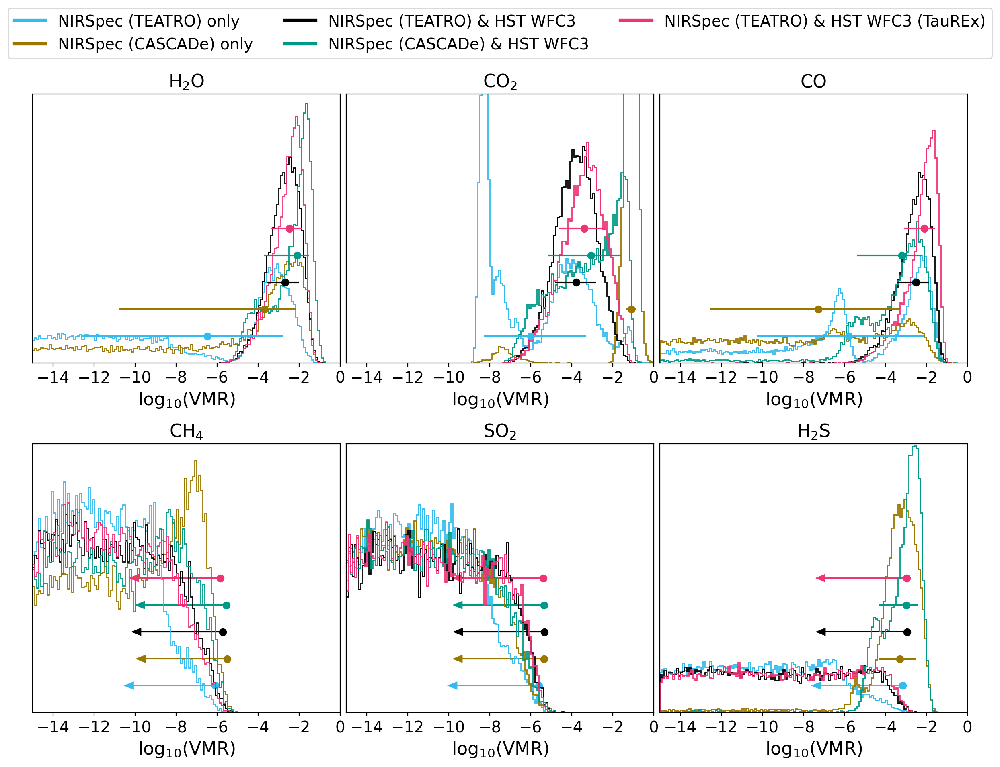

$\newcommand{\ensuremath}{}$
$\newcommand{\xspace}{}$
$\newcommand{\object}[1]{\texttt{#1}}$
$\newcommand{\farcs}{{.}''}$
$\newcommand{\farcm}{{.}'}$
$\newcommand{\arcsec}{''}$
$\newcommand{\arcmin}{'}$
$\newcommand{\ion}[2]{#1#2}$
$\newcommand{\textsc}[1]{\textrm{#1}}$
$\newcommand{\hl}[1]{\textrm{#1}}$
$\newcommand{\footnote}[1]{}$
$\newcommand{\jwst}{\textit{JWST}\xspace}$
$\newcommand{\hst}{\textit{HST}\xspace}$
$\newcommand{\spitzer}{\textit{Spitzer}\xspace}$
$\newcommand{\kepler}{\textit{Kepler}\xspace}$
$\newcommand{\tess}{\textit{TESS}\xspace}$
$\newcommand{\nirspec}{NIRSpec\xspace}$
$\newcommand{\teatro}{\texttt{TEATRO}\xspace}$
$\newcommand{\cascade}{\texttt{CASCADe}\xspace}$
$\newcommand{\vulcan}{\texttt{VULCAN}\xspace}$
$\newcommand{\arcis}{\texttt{ARCiS}\xspace}$
$\newcommand{\taurex}{\texttt{TauREx}\xspace}$
$\newcommand{\petitradtrans}{\texttt{petitRADTRANS}\xspace}$
$\newcommand{\pyratbay}{\texttt{PYRAT\;BAY}\xspace}$
$\newcommand{\exotethys}{\texttt{ExoTETHyS}\xspace}$
$\newcommand{\mum}{\mum\xspace}$
$\newcommand{\eg}{{e.g.,}\xspace}$
$\newcommand{\arraystretch}{1.2}$
$\newcommand{\arraystretch}{1.1}$
$\newcommand{\arraystretch}{1.1}$
$\newcommand{\arraystretch}{1}$
$\newcommand{\arraystretch}{1.2}$

# Detection of $CO_2$, CO, and $H_2$O in the atmosphere of the warm sub-Saturn HAT-P-12 b

<mark>Appeared on: 2025-07-28</mark> -  _22 pages, 16 figures, A&A, accepted_

N. Crouzet, et al. -- incl., <mark>J. Bouwman</mark>, <mark>T. Henning</mark>

**Abstract:** The chemical composition of warm gas giant exoplanet atmospheres (with $T_{\rm eq} < 1000 \;\rm K$ ) is not well known due to the lack of observational constraints. A new era began for the study of exoplanet atmospheres with the $\jwst$ . HAT-P-12 b is a warm, sub-Saturn-mass transiting exoplanet that is ideal for transmission spectroscopy. We aim to characterise its atmosphere and probe the presence of carbonaceous species using near-infrared observations. One transit of HAT-P-12 b was observed in spectroscopy with $\jwst$ NIRSpec in the $2.87-5.10 \; \mu$ m range with a resolving power of $\sim$ 1000. The $\jwst$ data are combined with archival observations from $\hst$ WFC3 covering the $1.1-1.7 \; \mu$ m range. The data are analysed using two data reduction pipelines and two atmospheric retrieval tools. Atmospheric simulations using chemical forward models are performed to interpret the spectra. $CO_2$ , CO, and $H_2$ O are detected at 12.2, 4.1, and 6.0 $\sigma$ confidence, respectively. Their volume mixing ratios are consistent with an atmosphere of $\sim$ 10 times solar metallicity and production of $\ce{CO2}$ by photochemistry. $CH_4$ is not detected and seems to be lacking, which could be due to a high intrinsic temperature with strong vertical mixing or other phenomena. $SO_2$ is also not detected and its production seems limited by low upper atmospheric temperatures ( $\sim$ 500 K at $P<10^{-3}$ bar inferred from 1D retrievals), insufficient to produce it in detectable quantities ( $\gtrsim$ 800 K required according to photochemical models). $H_2$ S is marginally detected using one data analysis method and not by the other. Retrievals indicate the presence of clouds between $10^{-1}$ and $10^{-3}$ bar. The inferred C/O ratio is below unity but is not well constrained. This study points towards an atmosphere for HAT-P-12 b that could be enriched in carbon and oxygen with respect to its host star, a possibly cold upper atmosphere that is unfavourable to $\ce{SO2}$ production and may explain its non-detection, and a $\ce{CH4}$ depletion that is yet to be fully understood. When including the production of $\ce{CO2}$ via photochemistry, an atmospheric metallicity that is close to Saturn's can explain the observations. Metallicities inferred for other gas giant exoplanets based on their $\ce{CO2}$ mixing ratios may need to account for its photochemical production pathways. This may impact studies on mass-metallicity trends and links between exoplanet atmospheres, interiors, and formation history.

**Figure 7. -** Synthetic spectra with grey clouds based on $\vulcan$ chemistry models for \mbox{HAT-P-12 b}. From top to bottom, the metallicity increases from 1 to 60 times solar. Models with carbon-to-oxygen ratios of 0.25 (orange), 0.50 (black), and 0.75 (green) with (solid lines) and without (dotted lines) photochemistry are shown. An offset is applied to the reference radius-pressure points of the model spectra to match the observed NIRSpec transit depths, and an offset of $0.09 \%$ is added for visual purposes. The $\jwst$ NIRSpec G395M data ($\teatro$ reduction) and the $\hst$ WFC3 G141 data are shown in light grey. The coloured regions correspond to the contribution of individual species to the model spectrum with C/O of 0.50 and photochemistry, which is also superimposed on the data. (*fig:vulcan_spectra*)

**Figure 11. -** Probability distributions for different molecules for each retrieval conducted here. One sigma constraints are also shown and arrows indicate 1$\sigma$ upper bounds on the presence of a species. (*fig:abundances*)

**Figure 12. -** $\vulcan$ chemistry results for HAT-P-12 b. The upper left panel shows the $P-T$ profile with high intrinsic temperature, resulting from the optimisation procedure described in Sect. \ref{subsec: forward models methods}. The other panels show the VMR of different molecules detected or expected in the NIRSpec spectrum, for different metallicities, carbon-to-oxygen ratios, with and without photochemistry. From dark to light grey, the shaded areas indicate respectively the 1, 2, and $3 \sigma$ uncertainty intervals of the retrieved atmospheric temperature and of the VMRs for detected species, and the 1, 2, and $3 \sigma$ upper limits of the VMRs for non-detected species (inferred from the $\hst$ + NIRSpec $\teatro$ spectrum and $\arcis$ retrieval). (*fig:vulcan*)

