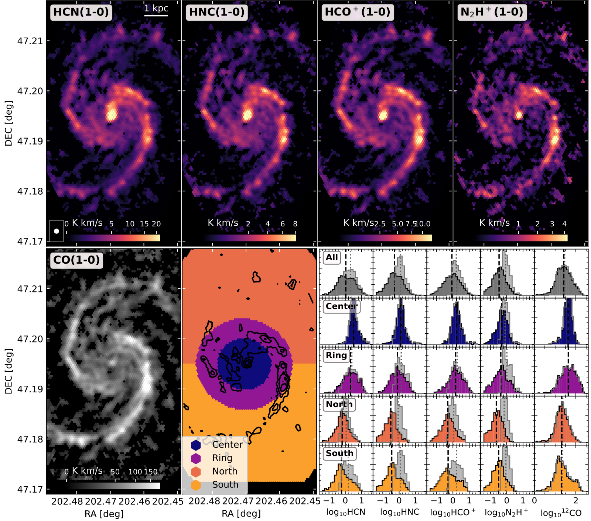

$\newcommand{\ensuremath}{}$
$\newcommand{\xspace}{}$
$\newcommand{\object}[1]{\texttt{#1}}$
$\newcommand{\farcs}{{.}''}$
$\newcommand{\farcm}{{.}'}$
$\newcommand{\arcsec}{''}$
$\newcommand{\arcmin}{'}$
$\newcommand{\ion}[2]{#1#2}$
$\newcommand{\textsc}[1]{\textrm{#1}}$
$\newcommand{\hl}[1]{\textrm{#1}}$
$\newcommand{\footnote}[1]{}$
$\newcommand{\nnhp}[0]{N_2H^+\xspace}$
$\newcommand{\hcop}[0]{HCO^+\xspace}$
$\newcommand{\tco}[0]{^{13}CO\xspace}$
$\newcommand{\CO}[0]{^{12}CO\xspace}$
$\newcommand{\ncrit}[0]{n_\mathrm{crit}\xspace}$
$\newcommand{\neff}[0]{n_\mathrm{eff}\xspace}$
$\newcommand{\SSFR}[0]{\Sigma_\mathrm{SFR}\xspace}$
$\newcommand{\Sstar}[0]{\Sigma_\ast\xspace}$
$\newcommand{\Smol}[0]{\Sigma_\mathrm{mol}\xspace}$
$\newcommand{\Pde}[0]{P_\mathrm{DE}\xspace}$
$\newcommand{\vdisp}[0]{\sigma_\mathrm{CO}\xspace}$
$\newcommand{\dep}[0]{\tau_\mathrm{depl}\xspace}$
$\newcommand{\refs}[0]{\textbf{\textcolor{red}{ref}}\xspace}$

# The SWAN view of dense gas in the Whirlpool: A cloud-scale comparison of $\nnhp$, $\hcop$, HNC and HCN emission in M51

<mark>Appeared on: 2025-07-28</mark> -  _Accepted for publication in A&A_

S. K. Stuber, et al. -- incl., <mark>E. Schinnerer</mark>, <mark>D. Gleis</mark>

**Abstract:** Tracing dense molecular gas, the fuel for star formation, is essential for the understanding of the evolution of molecular clouds and star formation processes.  We compare the emission of HCN (1-0), HNC (1-0) and $\hcop$ (1-0) with the emission of $\nnhp$ (1-0) at cloud-scales ( $125 $ pc) across the central $5\times7 $ kpc of the Whirlpool galaxy, M51a, from "Surveying the Whirlpool galaxy at Arcseconds with NOEMA" (SWAN).  We find that the integrated intensities of HCN, HNC and $\hcop$ are more steeply correlated with $\nnhp$ emission compared to the bulk molecular gas tracer CO, and we find variations in this relation across the center, molecular ring, northern and southern disk of M51.  Compared to HCN and HNC emission, the $\hcop$ emission follows the $\nnhp$ emission more similarly across the environments and physical conditions such as surface densities of molecular gas, stellar mass, star-formation rate, dynamical equilibrium pressure and radius.  Under the assumption that $\nnhp$ is a fair tracer of dense gas at these scales, this makes $\hcop$ a more favorable dense gas tracer than HCN within the inner disk of M51.  In all environments within our field of view, even when removing the central 2 kpc, HCN/CO, commonly used to trace average cloud density, is only weakly depending on molecular gas mass surface density.  While ratios of other dense gas lines to CO show a steeper dependency on the surface density of molecular gas, it is still shallow in comparison to other nearby star-forming disk galaxies.  The reasons might be  physical conditions in M51 that are different from other normal star-forming galaxies.  Increased ionization rates, increased dynamical equilibrium pressure in the central few kpc and the impact of the dwarf companion galaxy NGC 5195 are proposed mechanisms that might enhance HCN and HNC emission over $\hcop$ and $\nnhp$ emission at larger-scale environments and cloud scales.

**Figure 17. -** Integrated intensity maps of dense gas tracers HCN, HNC, HCO+ and $\nnhp$ from SWAN at a common resolution of $3$\arcsec$$(top row from left to right), as well as from $\CO$(PAWS, bottom left). We divide the disk into a center and ring environment  (colombo_pdbi_2014) , and the outer disk into northern and southern halves (bottom row, second panel from left). We add contours of integrated $\nnhp$ emission of 0.75, 2 and 4 K km/s to the environment map.
 We show the pixel-based integrated intensity distribution (in K km/s) in various environments in the disk for all pixels in the FoV (colored shaded area), as well as for pixels where emission is detected (emission $>3\sigma$, light grey shaded area) in the bottom right panels. The area of each histogram is normalized to unity.
 We indicate the median of all pixels (black dashed grey line) and median of masked pixels (dotted grey line) of each environment.
 The median represents the median value of logarithmic emission (med$\left(\mathrm{log}_{10}\left( I \right) \right)$. Pixels with negative emission are excluded in the logarithmic scaling of the histograms.
 Since CO is detected across most of the FoV and is used as a prior in the creation of the moment-0 map (Section \ref{sec:Data:SWANmoments}), its masked histogram distribution agrees well with the unmasked one.
  (*fig:Gallery*)

**Figure 19. -** Left panel: Line ratios of integrated line emission from dense gas tracers HCN, HNC and $\hcop$. For visual purpose, we only show line ratios for significant detected pixels ($>3\sigma$), but include non-detections in all calculations. We mark pixels in which CO is detected (grey points) and the center of the galaxy (green plus). The intensity scale is centered logarithmically on the average line ratios (log$_{10} R$, with $R$ from Table \ref{tab:Averagelineratios}) determined for all pixels in the FoV, including non-detections.  The average line ratio (log$_{10} R$) and the total range of 1 dex covered by the color bar are indicated by the black dashed line and greyshaded area in the right panel. We show contours of integrated $\nnhp$ emission (0.75, 3 K km/s) on top.
    Right panel: Histogram of line ratios per environment analogous to Figure \ref{fig:Gallery} but for HCN/HNC, HCN/$\hcop$ and HNC/$\hcop$(colored histograms).
    We indicate the amount of pixels shown in the histogram (top right corner), which varies slightly, as values with negative noise can not be shown in the logarithmic scale.
     (*fig:Gallery_linerationon2hp*)

**Figure 2. -** Average line intensity $I_\mathrm{Line}$ as a function of surface densities of molecular gas mass ($\Smol$), stellar mass ($\Sstar$) and star formation rate ($\SSFR$), as well as velocity dispersion ($\vdisp$), dynamical equilibrium pressure ($\Pde$) and galactocentric radius for all dense gas tracers.
    Shaded areas mark the standard deviation per bin. The $\CO$ intensity scaled by a factor of $1/10$ is added for comparison (grey line).
    For $\rm r>2.2kpc$, the shape of our FoV leads to incomplete sampling of these radial bins (grey shaded area). The obtained slopes for a linear fit (in log space) to the binned averages are provided in each panel. (*fig:average_intensity_sigmas*)

