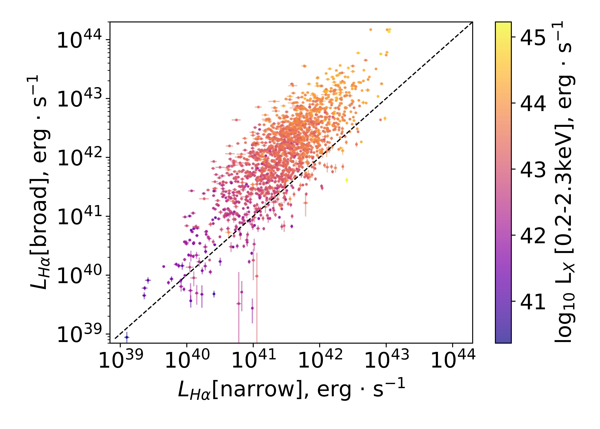
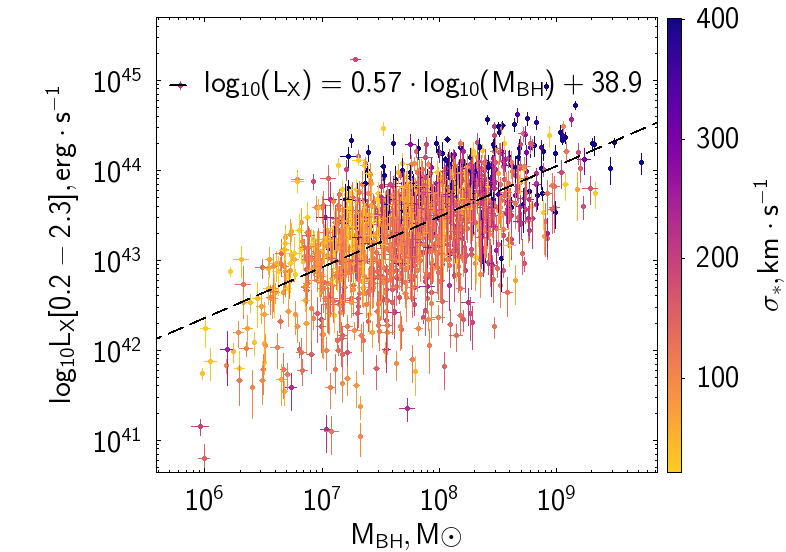

$\newcommand{\ensuremath}{}$
$\newcommand{\xspace}{}$
$\newcommand{\object}[1]{\texttt{#1}}$
$\newcommand{\farcs}{{.}''}$
$\newcommand{\farcm}{{.}'}$
$\newcommand{\arcsec}{''}$
$\newcommand{\arcmin}{'}$
$\newcommand{\ion}[2]{#1#2}$
$\newcommand{\textsc}[1]{\textrm{#1}}$
$\newcommand{\hl}[1]{\textrm{#1}}$
$\newcommand{\footnote}[1]{}$
$\newcommand{\ii}{ {\sc ii}}$
$\newcommand{\iii}{ {\sc iii}}$

# Optical Emission-Line Properties of \ eROSITA-selected SDSS-V Galaxies

<mark>Appeared on: 2025-07-30</mark> -  _15 pages, 9 figures, 3 tables_

N. G. Pulatova, et al. -- incl., <mark>H.-W. Rix</mark>, <mark>M. Demianenko</mark>

**Abstract:** We present and discuss optical emission line properties obtained from the analysis of Sloan Digital Sky Survey (SDSS) spectra for an X-ray selected sample of 3684 galaxies ( $0.002 < z < 0.55$ ), drawn from the eRASS1 catalog.We modeled SDSS-V DR19 spectra using the ${\sc NBursts}$ full spectrum fitting technique with E-MILES simple stellar populations (SSP) models and emission line templates to decompose broad and narrow emission line components for correlation with X-ray properties.We place the galaxies on the Baldwin-Phillips-Terlevich (BPT) diagram to diagnose their dominant excitation mechanism.We show that the consistent use of the narrow component fluxesshifts most galaxies systematically and significantly upward to the active galactic nuclei (AGN) region on the BPT diagram.On this basis, we confirm the dependence between a galaxy’s position on the BPT diagram and its ( $0.2-2.3$ keV) X-ray/H $\alpha$ flux ratio.We also verified the correlation between X-ray luminosity and emission line luminosities of the narrow [ O $\iii$ ] $\lambda 5007$ and broad H $\alpha$ component; as well as the relations between the Supermassive Black Hole (SMBH) mass, the X-ray luminosity, and the velocity dispersion of the stellar component ( $\sigma_{*}$ ) on the base on the unique sample of optical spectroscopic follow-up of X-ray sources detected by eROSITA.These results highlight the importance of emission line decomposition in AGN classification and refine the connection between X-ray emission and optical emission line properties in galaxies.

**Figure 8. -** 
        Optical luminosity in the broad and narrow components. Color code: eROSITA X-ray luminosity in $0.2 - 2.3$ keV. The black dashed line represents 1:1 relation. It demonstrates a strong connection between the BLR, NLR, and the X-ray source. Panel a: H$\alpha$; Panel b: H$\beta$.
         (*Fig-Lum-nar-broad_X*)

**Figure 1. -** 
        Step-by-step description of samples selection.
         (*Fig-sam-sel*)

**Figure 3. -** 
        The X-ray luminosity --- SMBH mass diagram. Color code: velocity dispersion of the stellar component $\sigma_{*}$.
         (*Fig_M_BH_LX*)

