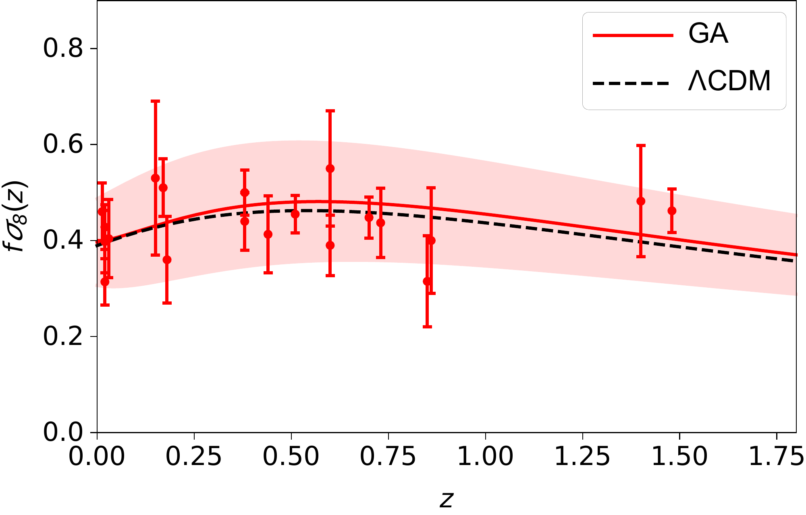
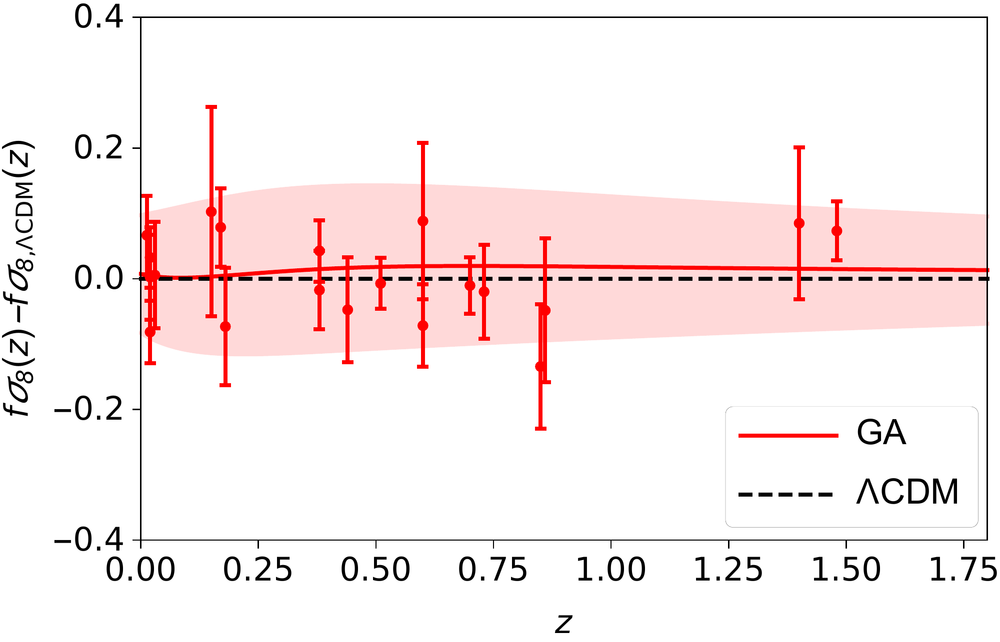
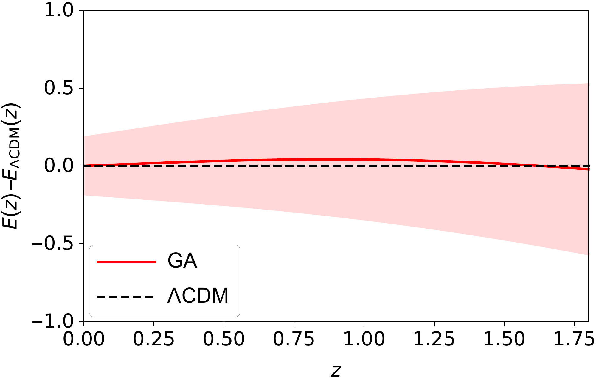
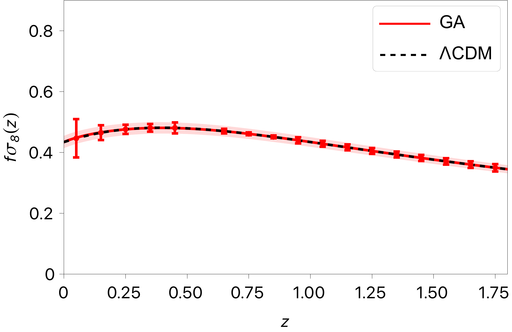
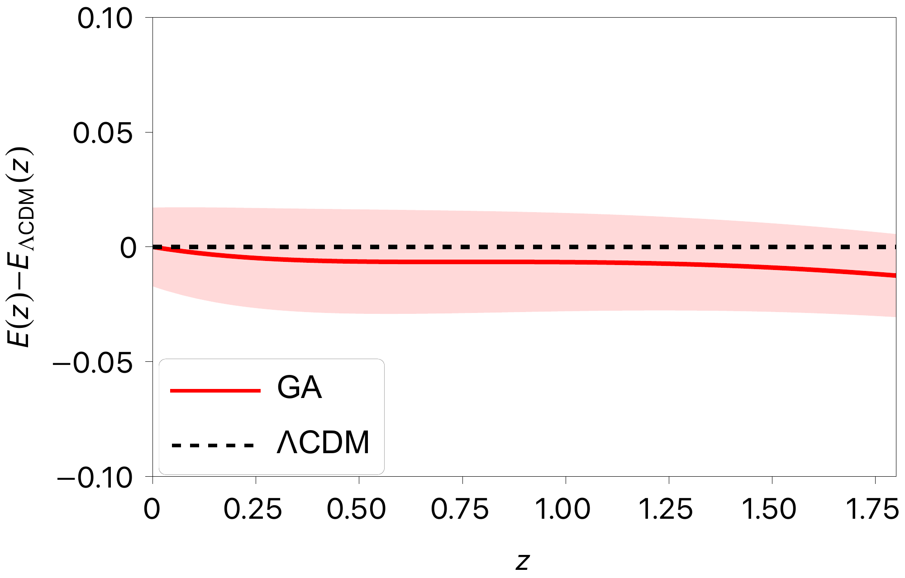
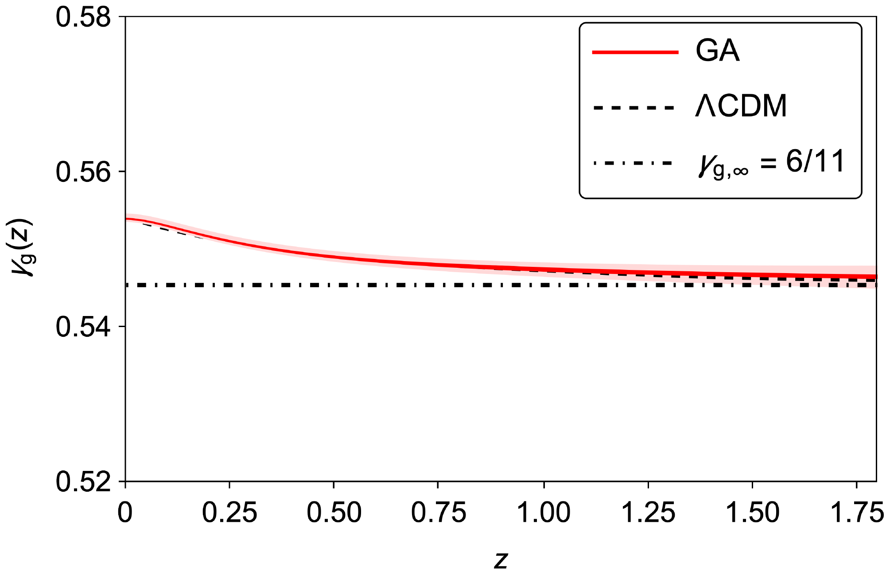
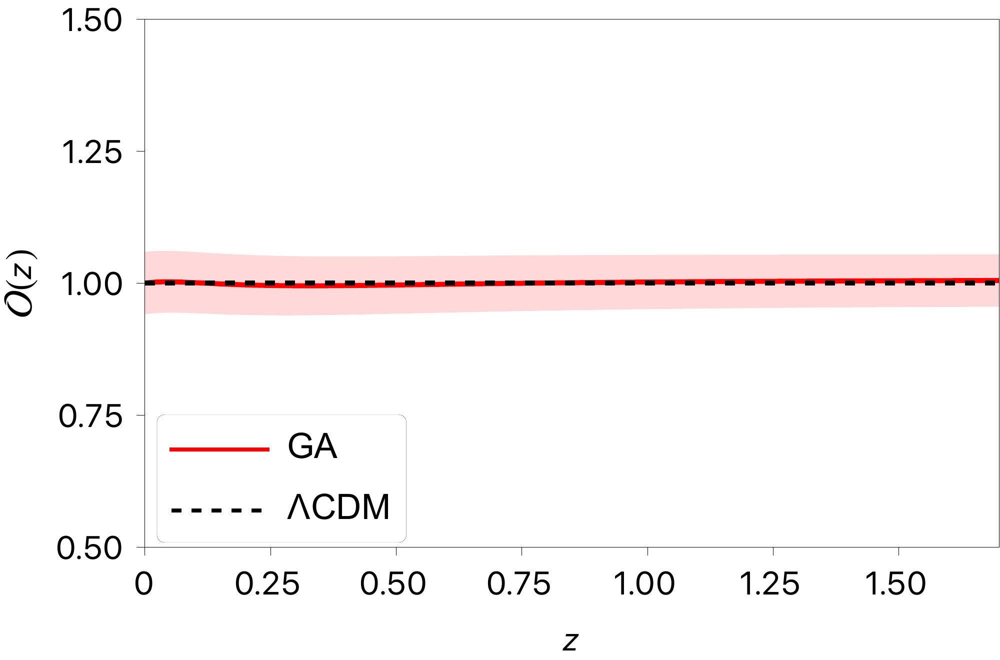
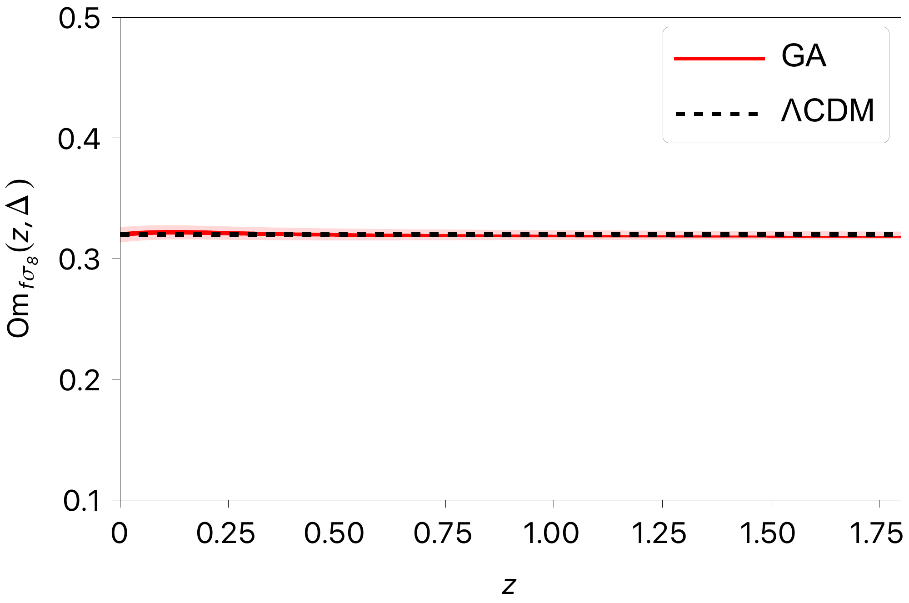
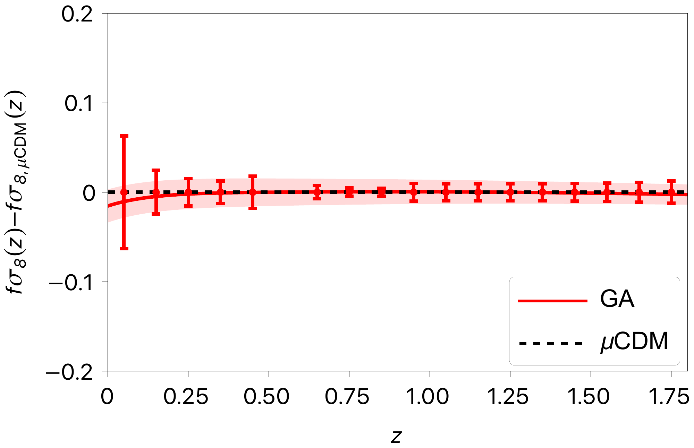
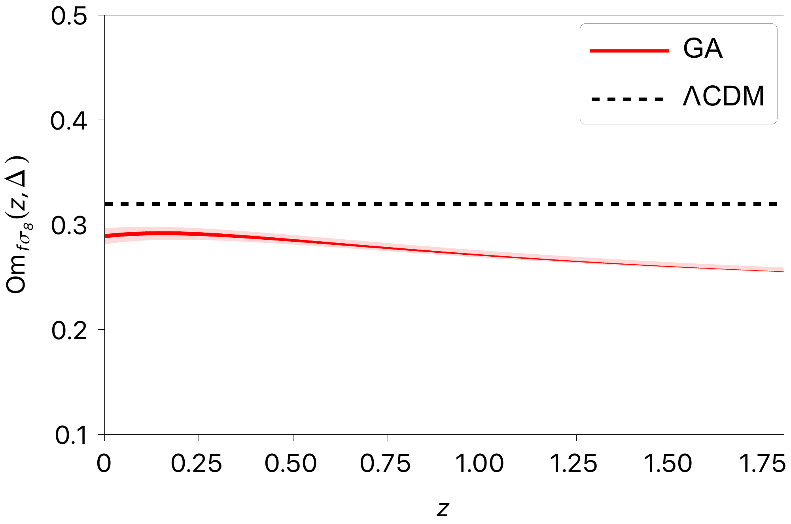

$\newcommand{\ensuremath}{}$
$\newcommand{\xspace}{}$
$\newcommand{\object}[1]{\texttt{#1}}$
$\newcommand{\farcs}{{.}''}$
$\newcommand{\farcm}{{.}'}$
$\newcommand{\arcsec}{''}$
$\newcommand{\arcmin}{'}$
$\newcommand{\ion}[2]{#1#2}$
$\newcommand{\textsc}[1]{\textrm{#1}}$
$\newcommand{\hl}[1]{\textrm{#1}}$
$\newcommand{\footnote}[1]{}$
$\newcommand{\lcdmeq}{\overset{\text{\lcdm}}{=}}$
$\newcommand{\orcid}[1]$
$\newcommand{\arraystretch}{1.35}$
$\newcommand{\arraystretch}{1.35}$
$\newcommand{\arraystretch}{1.35}$
$\newcommand{\be}{\begin{equation}}$
$\newcommand{\ee}{\end{equation}}$
$\newcommand{\ba}{\begin{eqnarray}}$
$\newcommand{\ea}{\end{eqnarray}}$
$\newcommand{\eqi}{\begin{equation}}$
$\newcommand{\eqf}{\end{equation}}$
$\newcommand{\eqia}{\begin{eqnarray}}$
$\newcommand{\eqfa}{\end{eqnarray}}$
$\newcommand{\lcdm}{\LambdaCDM\xspace}$
$\newcommand{\lcdmeq}{\overset{\text{\lcdm}}{=}}$
$\newcommand{\lltb}{\LambdaLTB\xspace}$
$\newcommand{\nn}{\nonumber}$
$\usepackage[nameinlink,noabbrev]{cleveref}$
$\Crefname{equation}{Eq.}{Eqs.}$
$\Crefname{eqnarray}{Eq.}{Eqs.}$
$\Crefname{section}{Sect.}{Sects.}$
$\Crefname{figure}{Fig.}{Figs.}$
$\crefname{equation}{Equation}{Equations}$
$\crefname{section}{Section}{Sections}$
$\crefname{figure}{Figure}{Figures}$
$\newcommandcitealias{IST:paper1}{EC20}$
$\usepackage{amstext}$
$\usepackage{soul}$
$\begin{document}$
$\title{\Euclid: Forecasts on \lcdm consistency tests with growth rate data \thanks{This paper is published on behalf of the Euclid Consortium.}}$
$\titlerunning{\Euclid: Forecast constraints on consistency tests of \LambdaCDM with growth data}$
$\authorrunning{I.~Ocampo et al.}$
$\newcommand{\orcid}[1] $
$\author{I.~Ocampo\orcid{0000-0001-7709-1930}\inst{\ref{aff1}}$
$\and D.~Sapone\orcid{0000-0001-7089-4503}\thanks{\email{dsapone@ing.uchile.cl}}\inst{\ref{aff2}}$
$\and S.~Nesseris\orcid{0000-0002-0567-0324}\inst{\ref{aff1}}$
$\and G.~Alestas\orcid{0000-0003-1790-4914}\inst{\ref{aff1}}$
$\and J.~García-Bellido\orcid{0000-0002-9370-8360}\inst{\ref{aff1}}$
$\and Z.~Sakr\orcid{0000-0002-4823-3757}\inst{\ref{aff3},\ref{aff4},\ref{aff5}}$
$\and C.~J.~A.~P.~Martins\orcid{0000-0002-4886-9261}\inst{\ref{aff6},\ref{aff7}}$
$\and J.~P.~Mimoso\orcid{0000-0002-9758-3366}\inst{\ref{aff8},\ref{aff9}}$
$\and A.~Carvalho\orcid{0000-0002-9301-262X}\inst{\ref{aff8},\ref{aff9}}$
$\and A.~Da~Silva\orcid{0000-0002-6385-1609}\inst{\ref{aff8},\ref{aff9}}$
$\and A.~Blanchard\orcid{0000-0001-8555-9003}\inst{\ref{aff4}}$
$\and S.~Casas\orcid{0000-0002-4751-5138}\inst{\ref{aff10}}$
$\and S.~Camera\orcid{0000-0003-3399-3574}\inst{\ref{aff11},\ref{aff12},\ref{aff13}}$
$\and M.~Martinelli\orcid{0000-0002-6943-7732}\inst{\ref{aff14},\ref{aff15}}$
$\and V.~Pettorino\orcid{0000-0002-4203-9320}\inst{\ref{aff16}}$
$\and A.~Amara\inst{\ref{aff17}}$
$\and S.~Andreon\orcid{0000-0002-2041-8784}\inst{\ref{aff18}}$
$\and N.~Auricchio\orcid{0000-0003-4444-8651}\inst{\ref{aff19}}$
$\and C.~Baccigalupi\orcid{0000-0002-8211-1630}\inst{\ref{aff20},\ref{aff21},\ref{aff22},\ref{aff23}}$
$\and M.~Baldi\orcid{0000-0003-4145-1943}\inst{\ref{aff24},\ref{aff19},\ref{aff25}}$
$\and A.~Balestra\orcid{0000-0002-6967-261X}\inst{\ref{aff26}}$
$\and S.~Bardelli\orcid{0000-0002-8900-0298}\inst{\ref{aff19}}$
$\and P.~Battaglia\orcid{0000-0002-7337-5909}\inst{\ref{aff19}}$
$\and F.~Bernardeau\orcid{0009-0007-3015-2581}\inst{\ref{aff27},\ref{aff28}}$
$\and A.~Biviano\orcid{0000-0002-0857-0732}\inst{\ref{aff21},\ref{aff20}}$
$\and E.~Branchini\orcid{0000-0002-0808-6908}\inst{\ref{aff29},\ref{aff30},\ref{aff18}}$
$\and M.~Brescia\orcid{0000-0001-9506-5680}\inst{\ref{aff31},\ref{aff32}}$
$\and G.~Cañas-Herrera\orcid{0000-0003-2796-2149}\inst{\ref{aff16},\ref{aff33},\ref{aff34}}$
$\and V.~Capobianco\orcid{0000-0002-3309-7692}\inst{\ref{aff13}}$
$\and C.~Carbone\orcid{0000-0003-0125-3563}\inst{\ref{aff35}}$
$\and V.~F.~Cardone\inst{\ref{aff14},\ref{aff15}}$
$\and J.~Carretero\orcid{0000-0002-3130-0204}\inst{\ref{aff36},\ref{aff37}}$
$\and M.~Castellano\orcid{0000-0001-9875-8263}\inst{\ref{aff14}}$
$\and G.~Castignani\orcid{0000-0001-6831-0687}\inst{\ref{aff19}}$
$\and S.~Cavuoti\orcid{0000-0002-3787-4196}\inst{\ref{aff32},\ref{aff38}}$
$\and K.~C.~Chambers\orcid{0000-0001-6965-7789}\inst{\ref{aff39}}$
$\and A.~Cimatti\inst{\ref{aff40}}$
$\and C.~Colodro-Conde\inst{\ref{aff41}}$
$\and G.~Congedo\orcid{0000-0003-2508-0046}\inst{\ref{aff42}}$
$\and L.~Conversi\orcid{0000-0002-6710-8476}\inst{\ref{aff43},\ref{aff44}}$
$\and Y.~Copin\orcid{0000-0002-5317-7518}\inst{\ref{aff45}}$
$\and F.~Courbin\orcid{0000-0003-0758-6510}\inst{\ref{aff46},\ref{aff47}}$
$\and H.~M.~Courtois\orcid{0000-0003-0509-1776}\inst{\ref{aff48}}$
$\and H.~Degaudenzi\orcid{0000-0002-5887-6799}\inst{\ref{aff49}}$
$\and S.~de~la~Torre\inst{\ref{aff50}}$
$\and G.~De~Lucia\orcid{0000-0002-6220-9104}\inst{\ref{aff21}}$
$\and F.~Dubath\orcid{0000-0002-6533-2810}\inst{\ref{aff49}}$
$\and C.~A.~J.~Duncan\orcid{0009-0003-3573-0791}\inst{\ref{aff42},\ref{aff51}}$
$\and X.~Dupac\inst{\ref{aff44}}$
$\and S.~Dusini\orcid{0000-0002-1128-0664}\inst{\ref{aff52}}$
$\and S.~Escoffier\orcid{0000-0002-2847-7498}\inst{\ref{aff53}}$
$\and M.~Farina\orcid{0000-0002-3089-7846}\inst{\ref{aff54}}$
$\and R.~Farinelli\inst{\ref{aff19}}$
$\and S.~Farrens\orcid{0000-0002-9594-9387}\inst{\ref{aff55}}$
$\and F.~Faustini\orcid{0000-0001-6274-5145}\inst{\ref{aff14},\ref{aff56}}$
$\and S.~Ferriol\inst{\ref{aff45}}$
$\and F.~Finelli\orcid{0000-0002-6694-3269}\inst{\ref{aff19},\ref{aff57}}$
$\and P.~Fosalba\orcid{0000-0002-1510-5214}\inst{\ref{aff58},\ref{aff59}}$
$\and N.~Fourmanoit\orcid{0009-0005-6816-6925}\inst{\ref{aff53}}$
$\and M.~Frailis\orcid{0000-0002-7400-2135}\inst{\ref{aff21}}$
$\and E.~Franceschi\orcid{0000-0002-0585-6591}\inst{\ref{aff19}}$
$\and S.~Galeotta\orcid{0000-0002-3748-5115}\inst{\ref{aff21}}$
$\and K.~George\orcid{0000-0002-1734-8455}\inst{\ref{aff60}}$
$\and B.~Gillis\orcid{0000-0002-4478-1270}\inst{\ref{aff42}}$
$\and C.~Giocoli\orcid{0000-0002-9590-7961}\inst{\ref{aff19},\ref{aff25}}$
$\and J.~Gracia-Carpio\inst{\ref{aff61}}$
$\and A.~Grazian\orcid{0000-0002-5688-0663}\inst{\ref{aff26}}$
$\and F.~Grupp\inst{\ref{aff61},\ref{aff60}}$
$\and S.~V.~H.~Haugan\orcid{0000-0001-9648-7260}\inst{\ref{aff62}}$
$\and W.~Holmes\inst{\ref{aff63}}$
$\and F.~Hormuth\inst{\ref{aff64}}$
$\and A.~Hornstrup\orcid{0000-0002-3363-0936}\inst{\ref{aff65},\ref{aff66}}$
$\and K.~Jahnke\orcid{0000-0003-3804-2137}\inst{\ref{aff67}}$
$\and M.~Jhabvala\inst{\ref{aff68}}$
$\and B.~Joachimi\orcid{0000-0001-7494-1303}\inst{\ref{aff69}}$
$\and E.~Keihänen\orcid{0000-0003-1804-7715}\inst{\ref{aff70}}$
$\and S.~Kermiche\orcid{0000-0002-0302-5735}\inst{\ref{aff53}}$
$\and B.~Kubik\orcid{0009-0006-5823-4880}\inst{\ref{aff45}}$
$\and M.~Kunz\orcid{0000-0002-3052-7394}\inst{\ref{aff71}}$
$\and H.~Kurki-Suonio\orcid{0000-0002-4618-3063}\inst{\ref{aff72},\ref{aff73}}$
$\and A.~M.~C.~Le~Brun\orcid{0000-0002-0936-4594}\inst{\ref{aff74}}$
$\and S.~Ligori\orcid{0000-0003-4172-4606}\inst{\ref{aff13}}$
$\and P.~B.~Lilje\orcid{0000-0003-4324-7794}\inst{\ref{aff62}}$
$\and V.~Lindholm\orcid{0000-0003-2317-5471}\inst{\ref{aff72},\ref{aff73}}$
$\and I.~Lloro\orcid{0000-0001-5966-1434}\inst{\ref{aff75}}$
$\and G.~Mainetti\orcid{0000-0003-2384-2377}\inst{\ref{aff76}}$
$\and D.~Maino\inst{\ref{aff77},\ref{aff35},\ref{aff78}}$
$\and E.~Maiorano\orcid{0000-0003-2593-4355}\inst{\ref{aff19}}$
$\and O.~Mansutti\orcid{0000-0001-5758-4658}\inst{\ref{aff21}}$
$\and O.~Marggraf\orcid{0000-0001-7242-3852}\inst{\ref{aff79}}$
$\and K.~Markovic\orcid{0000-0001-6764-073X}\inst{\ref{aff63}}$
$\and N.~Martinet\orcid{0000-0003-2786-7790}\inst{\ref{aff50}}$
$\and F.~Marulli\orcid{0000-0002-8850-0303}\inst{\ref{aff80},\ref{aff19},\ref{aff25}}$
$\and R.~J.~Massey\orcid{0000-0002-6085-3780}\inst{\ref{aff81}}$
$\and E.~Medinaceli\orcid{0000-0002-4040-7783}\inst{\ref{aff19}}$
$\and S.~Mei\orcid{0000-0002-2849-559X}\inst{\ref{aff82},\ref{aff83}}$
$\and Y.~Mellier\inst{\ref{aff84},\ref{aff28}}$
$\and M.~Meneghetti\orcid{0000-0003-1225-7084}\inst{\ref{aff19},\ref{aff25}}$
$\and E.~Merlin\orcid{0000-0001-6870-8900}\inst{\ref{aff14}}$
$\and G.~Meylan\inst{\ref{aff85}}$
$\and A.~Mora\orcid{0000-0002-1922-8529}\inst{\ref{aff86}}$
$\and M.~Moresco\orcid{0000-0002-7616-7136}\inst{\ref{aff80},\ref{aff19}}$
$\and L.~Moscardini\orcid{0000-0002-3473-6716}\inst{\ref{aff80},\ref{aff19},\ref{aff25}}$
$\and C.~Neissner\orcid{0000-0001-8524-4968}\inst{\ref{aff87},\ref{aff37}}$
$\and S.-M.~Niemi\orcid{0009-0005-0247-0086}\inst{\ref{aff16}}$
$\and C.~Padilla\orcid{0000-0001-7951-0166}\inst{\ref{aff87}}$
$\and S.~Paltani\orcid{0000-0002-8108-9179}\inst{\ref{aff49}}$
$\and F.~Pasian\orcid{0000-0002-4869-3227}\inst{\ref{aff21}}$
$\and K.~Pedersen\inst{\ref{aff88}}$
$\and W.~J.~Percival\orcid{0000-0002-0644-5727}\inst{\ref{aff89},\ref{aff90},\ref{aff91}}$
$\and S.~Pires\orcid{0000-0002-0249-2104}\inst{\ref{aff55}}$
$\and G.~Polenta\orcid{0000-0003-4067-9196}\inst{\ref{aff56}}$
$\and M.~Poncet\inst{\ref{aff92}}$
$\and L.~A.~Popa\inst{\ref{aff93}}$
$\and F.~Raison\orcid{0000-0002-7819-6918}\inst{\ref{aff61}}$
$\and R.~Rebolo\orcid{0000-0003-3767-7085}\inst{\ref{aff41},\ref{aff94},\ref{aff95}}$
$\and A.~Renzi\orcid{0000-0001-9856-1970}\inst{\ref{aff96},\ref{aff52}}$
$\and J.~Rhodes\orcid{0000-0002-4485-8549}\inst{\ref{aff63}}$
$\and G.~Riccio\inst{\ref{aff32}}$
$\and E.~Romelli\orcid{0000-0003-3069-9222}\inst{\ref{aff21}}$
$\and M.~Roncarelli\orcid{0000-0001-9587-7822}\inst{\ref{aff19}}$
$\and C.~Rosset\orcid{0000-0003-0286-2192}\inst{\ref{aff82}}$
$\and R.~Saglia\orcid{0000-0003-0378-7032}\inst{\ref{aff60},\ref{aff61}}$
$\and B.~Sartoris\orcid{0000-0003-1337-5269}\inst{\ref{aff60},\ref{aff21}}$
$\and T.~Schrabback\orcid{0000-0002-6987-7834}\inst{\ref{aff97},\ref{aff79}}$
$\and A.~Secroun\orcid{0000-0003-0505-3710}\inst{\ref{aff53}}$
$\and E.~Sefusatti\orcid{0000-0003-0473-1567}\inst{\ref{aff21},\ref{aff20},\ref{aff22}}$
$\and G.~Seidel\orcid{0000-0003-2907-353X}\inst{\ref{aff67}}$
$\and M.~Seiffert\orcid{0000-0002-7536-9393}\inst{\ref{aff63}}$
$\and S.~Serrano\orcid{0000-0002-0211-2861}\inst{\ref{aff58},\ref{aff98},\ref{aff59}}$
$\and C.~Sirignano\orcid{0000-0002-0995-7146}\inst{\ref{aff96},\ref{aff52}}$
$\and G.~Sirri\orcid{0000-0003-2626-2853}\inst{\ref{aff25}}$
$\and A.~Spurio~Mancini\orcid{0000-0001-5698-0990}\inst{\ref{aff99}}$
$\and L.~Stanco\orcid{0000-0002-9706-5104}\inst{\ref{aff52}}$
$\and J.~Steinwagner\orcid{0000-0001-7443-1047}\inst{\ref{aff61}}$
$\and P.~Tallada-Crespí\orcid{0000-0002-1336-8328}\inst{\ref{aff36},\ref{aff37}}$
$\and A.~N.~Taylor\inst{\ref{aff42}}$
$\and I.~Tereno\orcid{0000-0002-4537-6218}\inst{\ref{aff8},\ref{aff100}}$
$\and N.~Tessore\orcid{0000-0002-9696-7931}\inst{\ref{aff69}}$
$\and S.~Toft\orcid{0000-0003-3631-7176}\inst{\ref{aff101},\ref{aff102}}$
$\and R.~Toledo-Moreo\orcid{0000-0002-2997-4859}\inst{\ref{aff103}}$
$\and F.~Torranewcommandlot\orcid{0000-0003-1160-1517}\inst{\ref{aff37},\ref{aff36}}$
$\and I.~Tutusaus\orcid{0000-0002-3199-0399}\inst{\ref{aff4}}$
$\and L.~Valenziano\orcid{0000-0002-1170-0104}\inst{\ref{aff19},\ref{aff57}}$
$\and J.~Valiviita\orcid{0000-0001-6225-3693}\inst{\ref{aff72},\ref{aff73}}$
$\and T.~Vassallo\orcid{0000-0001-6512-6358}\inst{\ref{aff60},\ref{aff21}}$
$\and G.~Verdoes~Kleijn\orcid{0000-0001-5803-2580}\inst{\ref{aff104}}$
$\and A.~Veropalumbo\orcid{0000-0003-2387-1194}\inst{\ref{aff18},\ref{aff30},\ref{aff29}}$
$\and Y.~Wang\orcid{0000-0002-4749-2984}\inst{\ref{aff105}}$
$\and J.~Weller\orcid{0000-0002-8282-2010}\inst{\ref{aff60},\ref{aff61}}$
$\and G.~Zamorani\orcid{0000-0002-2318-301X}\inst{\ref{aff19}}$
$\and F.~M.~Zerbi\inst{\ref{aff18}}$
$\and E.~Zucca\orcid{0000-0002-5845-8132}\inst{\ref{aff19}}$
$\and M.~Ballardini\orcid{0000-0003-4481-3559}\inst{\ref{aff106},\ref{aff107},\ref{aff19}}$
$\and C.~Burigana\orcid{0000-0002-3005-5796}\inst{\ref{aff108},\ref{aff57}}$
$\and L.~Gabarra\orcid{0000-0002-8486-8856}\inst{\ref{aff109}}$
$\and A.~Pezzotta\orcid{0000-0003-0726-2268}\inst{\ref{aff18}}$
$\and V.~Scottez\orcid{0009-0008-3864-940X}\inst{\ref{aff84},\ref{aff110}}$
$\and M.~Viel\orcid{0000-0002-2642-5707}\inst{\ref{aff20},\ref{aff21},\ref{aff23},\ref{aff22},\ref{aff111}}}$
$\institute{Instituto de Física Teórica UAM-CSIC, Campus de Cantoblanco, 28049 Madrid, Spain\label{aff1}$
$\and$
$Departamento de Física, FCFM, Universidad de Chile, Blanco Encalada 2008, Santiago, Chile\label{aff2}$
$\and$
$Institut für Theoretische Physik, University of Heidelberg, Philosophenweg 16, 69120 Heidelberg, Germany\label{aff3}$
$\and$
$Institut de Recherche en Astrophysique et Planétologie (IRAP), Université de Toulouse, CNRS, UPS, CNES, 14 Av. Edouard Belin, 31400 Toulouse, France\label{aff4}$
$\and$
$Université St Joseph; Faculty of Sciences, Beirut, Lebanon\label{aff5}$
$\and$
$Centro de Astrofísica da Universidade do Porto, Rua das Estrelas, 4150-762 Porto, Portugal\label{aff6}$
$\and$
$Instituto de Astrofísica e Ci\^encias do Espaço, Universidade do Porto, CAUP, Rua das Estrelas, PT4150-762 Porto, Portugal\label{aff7}$
$\and$
$Departamento de Física, Faculdade de Ci\^encias, Universidade de Lisboa, Edifício C8, Campo Grande, PT1749-016 Lisboa, Portugal\label{aff8}$
$\and$
$Instituto de Astrofísica e Ci\^encias do Espaço, Faculdade de Ci\^encias, Universidade de Lisboa, Campo Grande, 1749-016 Lisboa, Portugal\label{aff9}$
$\and$
$Institute for Theoretical Particle Physics and Cosmology (TTK), RWTH Aachen University, 52056 Aachen, Germany\label{aff10}$
$\and$
$Dipartimento di Fisica, Università degli Studi di Torino, Via P. Giuria 1, 10125 Torino, Italy\label{aff11}$
$\and$
$INFN-Sezione di Torino, Via P. Giuria 1, 10125 Torino, Italy\label{aff12}$
$\and$
$INAF-Osservatorio Astrofisico di Torino, Via Osservatorio 20, 10025 Pino Torinese (TO), Italy\label{aff13}$
$\and$
$INAF-Osservatorio Astronomico di Roma, Via Frascati 33, 00078 Monteporzio Catone, Italy\label{aff14}$
$\and$
$INFN-Sezione di Roma, Piazzale Aldo Moro, 2 - c/o Dipartimento di Fisica, Edificio G. Marconi, 00185 Roma, Italy\label{aff15}$
$\and$
$European Space Agency/ESTEC, Keplerlaan 1, 2201 AZ Noordwijk, The Netherlands\label{aff16}$
$\and$
$School of Mathematics and Physics, University of Surrey, Guildford, Surrey, GU2 7XH, UK\label{aff17}$
$\and$
$INAF-Osservatorio Astronomico di Brera, Via Brera 28, 20122 Milano, Italy\label{aff18}$
$\and$
$INAF-Osservatorio di Astrofisica e Scienza dello Spazio di Bologna, Via Piero Gobetti 93/3, 40129 Bologna, Italy\label{aff19}$
$\and$
$IFPU, Institute for Fundamental Physics of the Universe, via Beirut 2, 34151 Trieste, Italy\label{aff20}$
$\and$
$INAF-Osservatorio Astronomico di Trieste, Via G. B. Tiepolo 11, 34143 Trieste, Italy\label{aff21}$
$\and$
$INFN, Sezione di Trieste, Via Valerio 2, 34127 Trieste TS, Italy\label{aff22}$
$\and$
$SISSA, International School for Advanced Studies, Via Bonomea 265, 34136 Trieste TS, Italy\label{aff23}$
$\and$
$Dipartimento di Fisica e Astronomia, Università di Bologna, Via Gobetti 93/2, 40129 Bologna, Italy\label{aff24}$
$\and$
$INFN-Sezione di Bologna, Viale Berti Pichat 6/2, 40127 Bologna, Italy\label{aff25}$
$\and$
$INAF-Osservatorio Astronomico di Padova, Via dell'Osservatorio 5, 35122 Padova, Italy\label{aff26}$
$\and$
$Institut de Physique Théorique, CEA, CNRS, Université Paris-Saclay 91191 Gif-sur-Yvette Cedex, France\label{aff27}$
$\and$
$Institut d'Astrophysique de Paris, UMR 7095, CNRS, and Sorbonne Université, 98 bis boulevard Arago, 75014 Paris, France\label{aff28}$
$\and$
$Dipartimento di Fisica, Università di Genova, Via Dodecaneso 33, 16146, Genova, Italy\label{aff29}$
$\and$
$INFN-Sezione di Genova, Via Dodecaneso 33, 16146, Genova, Italy\label{aff30}$
$\and$
$Department of Physics "E. Pancini", University Federico II, Via Cinthia 6, 80126, Napoli, Italy\label{aff31}$
$\and$
$INAF-Osservatorio Astronomico di Capodimonte, Via Moiariello 16, 80131 Napoli, Italy\label{aff32}$
$\and$
$Institute Lorentz, Leiden University, Niels Bohrweg 2, 2333 CA Leiden, The Netherlands\label{aff33}$
$\and$
$Leiden Observatory, Leiden University, Einsteinweg 55, 2333 CC Leiden, The Netherlands\label{aff34}$
$\and$
$INAF-IASF Milano, Via Alfonso Corti 12, 20133 Milano, Italy\label{aff35}$
$\and$
$Centro de Investigaciones Energéticas, Medioambientales y Tecnológicas (CIEMAT), Avenida Complutense 40, 28040 Madrid, Spain\label{aff36}$
$\and$
$Port d'Informació Científica, Campus UAB, C. Albareda s/n, 08193 Bellaterra (Barcelona), Spain\label{aff37}$
$\and$
$INFN section of Naples, Via Cinthia 6, 80126, Napoli, Italy\label{aff38}$
$\and$
$Institute for Astronomy, University of Hawaii, 2680 Woodlawn Drive, Honolulu, HI 96822, USA\label{aff39}$
$\and$
$Dipartimento di Fisica e Astronomia "Augusto Righi" - Alma Mater Studiorum Università di Bologna, Viale Berti Pichat 6/2, 40127 Bologna, Italy\label{aff40}$
$\and$
$Instituto de Astrofísica de Canarias, Vía Láctea, 38205 La Laguna, Tenerife, Spain\label{aff41}$
$\and$
$Institute for Astronomy, University of Edinburgh, Royal Observatory, Blackford Hill, Edinburgh EH9 3HJ, UK\label{aff42}$
$\and$
$European Space Agency/ESRIN, Largo Galileo Galilei 1, 00044 Frascati, Roma, Italy\label{aff43}$
$\and$
$ESAC/ESA, Camino Bajo del Castillo, s/n., Urb. Villafranca del Castillo, 28692 Villanueva de la Cañada, Madrid, Spain\label{aff44}$
$\and$
$Université Claude Bernard Lyon 1, CNRS/IN2P3, IP2I Lyon, UMR 5822, Villeurbanne, F-69100, France\label{aff45}$
$\and$
$Institut de Ciències del Cosmos (ICCUB), Universitat de Barcelona (IEEC-UB), Martí i Franquès 1, 08028 Barcelona, Spain\label{aff46}$
$\and$
$Institució Catalana de Recerca i Estudis Avançats (ICREA), Passeig de Lluís Companys 23, 08010 Barcelona, Spain\label{aff47}$
$\and$
$UCB Lyon 1, CNRS/IN2P3, IUF, IP2I Lyon, 4 rue Enrico Fermi, 69622 Villeurbanne, France\label{aff48}$
$\and$
$Department of Astronomy, University of Geneva, ch. d'Ecogia 16, 1290 Versoix, Switzerland\label{aff49}$
$\and$
$Aix-Marseille Université, CNRS, CNES, LAM, Marseille, France\label{aff50}$
$\and$
$Jodrell Bank Centre for Astrophysics, Department of Physics and Astronomy, University of Manchester, Oxford Road, Manchester M13 9PL, UK\label{aff51}$
$\and$
$INFN-Padova, Via Marzolo 8, 35131 Padova, Italy\label{aff52}$
$\and$
$Aix-Marseille Université, CNRS/IN2P3, CPPM, Marseille, France\label{aff53}$
$\and$
$INAF-Istituto di Astrofisica e Planetologia Spaziali, via del Fosso del Cavaliere, 100, 00100 Roma, Italy\label{aff54}$
$\and$
$Université Paris-Saclay, Université Paris Cité, CEA, CNRS, AIM, 91191, Gif-sur-Yvette, France\label{aff55}$
$\and$
$Space Science Data Center, Italian Space Agency, via del Politecnico snc, 00133 Roma, Italy\label{aff56}$
$\and$
$INFN-Bologna, Via Irnerio 46, 40126 Bologna, Italy\label{aff57}$
$\and$
$Institut d'Estudis Espacials de Catalunya (IEEC),  Edifici RDIT, Campus UPC, 08860 Castellnewcommandels, Barcelona, Spain\label{aff58}$
$\and$
$Institute of Space Sciences (ICE, CSIC), Campus UAB, Carrer de Can Magrans, s/n, 08193 Barcelona, Spain\label{aff59}$
$\and$
$Universitäts-Sternwarte München, Fakultät für Physik, Ludwig-Maximilians-Universität München, Scheinerstrasse 1, 81679 München, Germany\label{aff60}$
$\and$
$Max Planck Institute for Extraterrestrial Physics, Giessenbachstr. 1, 85748 Garching, Germany\label{aff61}$
$\and$
$Institute of Theoretical Astrophysics, University of Oslo, P.O. Box 1029 Blindern, 0315 Oslo, Norway\label{aff62}$
$\and$
$Jet Propulsion Laboratory, California Institute of Technology, 4800 Oak Grove Drive, Pasadena, CA, 91109, USA\label{aff63}$
$\and$
$Felix Hormuth Engineering, Goethestr. 17, 69181 Leimen, Germany\label{aff64}$
$\and$
$Technical University of Denmark, Elektrovej 327, 2800 Kgs. Lyngby, Denmark\label{aff65}$
$\and$
$Cosmic Dawn Center (DAWN), Denmark\label{aff66}$
$\and$
$Max-Planck-Institut für Astronomie, Königstuhl 17, 69117 Heidelberg, Germany\label{aff67}$
$\and$
$NASA Goddard Space Flight Center, Greenbelt, MD 20771, USA\label{aff68}$
$\and$
$Department of Physics and Astronomy, University College London, Gower Street, London WC1E 6BT, UK\label{aff69}$
$\and$
$Department of Physics and Helsinki Institute of Physics, Gustaf Hällströmin katu 2, 00014 University of Helsinki, Finland\label{aff70}$
$\and$
$Université de Genève, Département de Physique Théorique and Centre for Astroparticle Physics, 24 quai Ernest-Ansermet, CH-1211 Genève 4, Switzerland\label{aff71}$
$\and$
$Department of Physics, P.O. Box 64, 00014 University of Helsinki, Finland\label{aff72}$
$\and$
$Helsinki Institute of Physics, Gustaf H{ä}llstr{ö}min katu 2, University of Helsinki, Helsinki, Finland\label{aff73}$
$\and$
$Laboratoire d'etude de l'Univers et des phenomenes eXtremes, Observatoire de Paris, Université PSL, Sorbonne Université, CNRS, 92190 Meudon, France\label{aff74}$
$\and$
$SKA Observatory, Jodrell Bank, Lower Withington, Macclesfield, Cheshire SK11 9FT, UK\label{aff75}$
$\and$
$Centre de Calcul de l'IN2P3/CNRS, 21 avenue Pierre de Coubertin 69627 Villeurbanne Cedex, France\label{aff76}$
$\and$
$Dipartimento di Fisica "Aldo Pontremoli", Università degli Studi di Milano, Via Celoria 16, 20133 Milano, Italy\label{aff77}$
$\and$
$INFN-Sezione di Milano, Via Celoria 16, 20133 Milano, Italy\label{aff78}$
$\and$
$Universität Bonn, Argelander-Institut für Astronomie, Auf dem Hügel 71, 53121 Bonn, Germany\label{aff79}$
$\and$
$Dipartimento di Fisica e Astronomia "Augusto Righi" - Alma Mater Studiorum Università di Bologna, via Piero Gobetti 93/2, 40129 Bologna, Italy\label{aff80}$
$\and$
$Department of Physics, Institute for Computational Cosmology, Durham University, South Road, Durham, DH1 3LE, UK\label{aff81}$
$\and$
$Université Paris Cité, CNRS, Astroparticule et Cosmologie, 75013 Paris, France\label{aff82}$
$\and$
$CNRS-UCB International Research Laboratory, Centre Pierre Binétruy, IRL2007, CPB-IN2P3, Berkeley, USA\label{aff83}$
$\and$
$Institut d'Astrophysique de Paris, 98bis Boulevard Arago, 75014, Paris, France\label{aff84}$
$\and$
$Institute of Physics, Laboratory of Astrophysics, Ecole Polytechnique Fédérale de Lausanne (EPFL), Observatoire de Sauverny, 1290 Versoix, Switzerland\label{aff85}$
$\and$
$Telespazio UK S.L. for European Space Agency (ESA), Camino bajo del Castillo, s/n, Urbanizacion Villafranca del Castillo, Villanueva de la Cañada, 28692 Madrid, Spain\label{aff86}$
$\and$
$Institut de Física d'Altes Energies (IFAE), The Barcelona Institute of Science and Technology, Campus UAB, 08193 Bellaterra (Barcelona), Spain\label{aff87}$
$\and$
$DARK, Niels Bohr Institute, University of Copenhagen, Jagtvej 155, 2200 Copenhagen, Denmark\label{aff88}$
$\and$
$Waterloo Centre for Astrophysics, University of Waterloo, Waterloo, Ontario N2L 3G1, Canada\label{aff89}$
$\and$
$Department of Physics and Astronomy, University of Waterloo, Waterloo, Ontario N2L 3G1, Canada\label{aff90}$
$\and$
$Perimeter Institute for Theoretical Physics, Waterloo, Ontario N2L 2Y5, Canada\label{aff91}$
$\and$
$Centre National d'Etudes Spatiales -- Centre spatial de Toulouse, 18 avenue Edouard Belin, 31401 Toulouse Cedex 9, France\label{aff92}$
$\and$
$Institute of Space Science, Str. Atomistilor, nr. 409 M\u{a}gurele, Ilfov, 077125, Romania\label{aff93}$
$\and$
$Consejo Superior de Investigaciones Cientificas, Calle Serrano 117, 28006 Madrid, Spain\label{aff94}$
$\and$
$Universidad de La Laguna, Departamento de Astrofísica, 38206 La Laguna, Tenerife, Spain\label{aff95}$
$\and$
$Dipartimento di Fisica e Astronomia "G. Galilei", Università di Padova, Via Marzolo 8, 35131 Padova, Italy\label{aff96}$
$\and$
$Universität Innsbruck, Institut für Astro- und Teilchenphysik, Technikerstr. 25/8, 6020 Innsbruck, Austria\label{aff97}$
$\and$
$Satlantis, University Science Park, Sede Bld 48940, Leioa-Bilbao, Spain\label{aff98}$
$\and$
$Department of Physics, Royal Holloway, University of London, TW20 0EX, UK\label{aff99}$
$\and$
$Instituto de Astrofísica e Ci\^encias do Espaço, Faculdade de Ci\^encias, Universidade de Lisboa, Tapada da Ajuda, 1349-018 Lisboa, Portugal\label{aff100}$
$\and$
$Cosmic Dawn Center (DAWN)\label{aff101}$
$\and$
$Niels Bohr Institute, University of Copenhagen, Jagtvej 128, 2200 Copenhagen, Denmark\label{aff102}$
$\and$
$Universidad Politécnica de Cartagena, Departamento de Electrónica y Tecnología de Computadoras,  Plaza del Hospital 1, 30202 Cartagena, Spain\label{aff103}$
$\and$
$Kapteyn Astronomical Institute, University of Groningen, PO Box 800, 9700 AV Groningen, The Netherlands\label{aff104}$
$\and$
$Infrared Processing and Analysis Center, California Institute of Technology, Pasadena, CA 91125, USA\label{aff105}$
$\and$
$Dipartimento di Fisica e Scienze della Terra, Università degli Studi di Ferrara, Via Giuseppe Saragat 1, 44122 Ferrara, Italy\label{aff106}$
$\and$
$Istituto Nazionale di Fisica Nucleare, Sezione di Ferrara, Via Giuseppe Saragat 1, 44122 Ferrara, Italy\label{aff107}$
$\and$
$INAF, Istituto di Radioastronomia, Via Piero Gobetti 101, 40129 Bologna, Italy\label{aff108}$
$\and$
$Department of Physics, Oxford University, Keble Road, Oxford OX1 3RH, UK\label{aff109}$
$\and$
$ICL, Junia, Université Catholique de Lille, LITL, 59000 Lille, France\label{aff110}$
$\and$
$ICSC - Centro Nazionale di Ricerca in High Performance Computing, Big Data e Quantum Computing, Via Magnanelli 2, Bologna, Italy\label{aff111}}$
$\abstract{$
$The large-scale structure (LSS) of the Universe is an important probe for deviations from the canonical cosmological constant \Lambda and cold dark matter (\LambdaCDM) model. A statistically significant detection of any deviations would signify the presence of new physics or the breakdown of any number of the underlying assumptions of the standard cosmological model or possible systematic errors in the data.$
$In this paper, we quantify the ability of the LSS data products of the spectroscopic survey of the \Euclid mission, together with other contemporary surveys, to improve the constraints on deviations from \lcdm in the redshift range 0<z<1.75.$
$We consider both currently available growth rate data and simulated data with specifications from \Euclid and external surveys, based on \lcdm and a modified gravity (MoG) model with an evolving Newton's constant (denoted \muCDM), and carry out a binning method and a machine learning reconstruction, based on genetic algorithms (GAs), of several LSS null tests.$
$Using the forecast \Euclid growth data from the spectroscopic survey in the range 0.95<z<1.75, we find that in combination with external data products (covering the range 0<z<0.95), \Euclid will be able to improve on current constraints of null tests of the LSS on average by a factor of eight when using a binning method and a factor of six when using the GAs.$
$Our work highlights the need for synergies between \Euclid and other surveys, but also the usefulness of statistical analyses, such as GAs, in order to disentangle any degeneracies in the cosmological parameters. Both are necessary to new tight constraints over an extended redshift range and to probe for deviations from the \lcdm model.$
$}$
$\keywords{Cosmology: observations -- (Cosmology:) cosmological parameters -- Space vehicles: instruments -- Surveys -- Methods: statistical -- Methods: data analysis}$
$\maketitle$
$\n\end{document}\end{eqnarray}}\end{equation}}\end{eqnarray}}\end{equation}}$
$\newcommand{\ee}{\end{equation}}$
$\newcommand{\ba}{\begin{eqnarray}}$
$\newcommand{\ea}{\end{eqnarray}}$
$\newcommand{\eqi}{\begin{equation}}$
$\newcommand{\eqf}{\end{equation}}$
$\newcommand{\eqia}{\begin{eqnarray}}$
$\newcommand{\eqfa}{\end{eqnarray}}$
$\newcommand{\lcdm}{\LambdaCDM\xspace}$
$\newcommand{\lcdmeq}{\overset{\text{\lcdm}}{=}}$
$\newcommand{\lltb}{\LambdaLTB\xspace}$
$\newcommand{\nn}{\nonumber}$
$\usepackage[nameinlink,noabbrev]{cleveref}$
$\Crefname{equation}{Eq.}{Eqs.}$
$\Crefname{eqnarray}{Eq.}{Eqs.}$
$\Crefname{section}{Sect.}{Sects.}$
$\Crefname{figure}{Fig.}{Figs.}$
$\crefname{equation}{Equation}{Equations}$
$\crefname{section}{Section}{Sections}$
$\crefname{figure}{Figure}{Figures}$
$\newcommandcitealias{IST:paper1}{EC20}$
$\usepackage{amstext}$
$\usepackage{soul}$
$\begin{document}$
$\title{\Euclid: Forecasts on \lcdm consistency tests with growth rate data \thanks{This paper is published on behalf of the Euclid Consortium.}}$
$\titlerunning{\Euclid: Forecast constraints on consistency tests of \LambdaCDM with growth data}$
$\authorrunning{I.~Ocampo et al.}$
$\newcommand{\orcid}[1] $
$\author{I.~Ocampo\orcid{0000-0001-7709-1930}\inst{\ref{aff1}}$
$\and D.~Sapone\orcid{0000-0001-7089-4503}\thanks{\email{dsapone@ing.uchile.cl}}\inst{\ref{aff2}}$
$\and S.~Nesseris\orcid{0000-0002-0567-0324}\inst{\ref{aff1}}$
$\and G.~Alestas\orcid{0000-0003-1790-4914}\inst{\ref{aff1}}$
$\and J.~García-Bellido\orcid{0000-0002-9370-8360}\inst{\ref{aff1}}$
$\and Z.~Sakr\orcid{0000-0002-4823-3757}\inst{\ref{aff3},\ref{aff4},\ref{aff5}}$
$\and C.~J.~A.~P.~Martins\orcid{0000-0002-4886-9261}\inst{\ref{aff6},\ref{aff7}}$
$\and J.~P.~Mimoso\orcid{0000-0002-9758-3366}\inst{\ref{aff8},\ref{aff9}}$
$\and A.~Carvalho\orcid{0000-0002-9301-262X}\inst{\ref{aff8},\ref{aff9}}$
$\and A.~Da~Silva\orcid{0000-0002-6385-1609}\inst{\ref{aff8},\ref{aff9}}$
$\and A.~Blanchard\orcid{0000-0001-8555-9003}\inst{\ref{aff4}}$
$\and S.~Casas\orcid{0000-0002-4751-5138}\inst{\ref{aff10}}$
$\and S.~Camera\orcid{0000-0003-3399-3574}\inst{\ref{aff11},\ref{aff12},\ref{aff13}}$
$\and M.~Martinelli\orcid{0000-0002-6943-7732}\inst{\ref{aff14},\ref{aff15}}$
$\and V.~Pettorino\orcid{0000-0002-4203-9320}\inst{\ref{aff16}}$
$\and A.~Amara\inst{\ref{aff17}}$
$\and S.~Andreon\orcid{0000-0002-2041-8784}\inst{\ref{aff18}}$
$\and N.~Auricchio\orcid{0000-0003-4444-8651}\inst{\ref{aff19}}$
$\and C.~Baccigalupi\orcid{0000-0002-8211-1630}\inst{\ref{aff20},\ref{aff21},\ref{aff22},\ref{aff23}}$
$\and M.~Baldi\orcid{0000-0003-4145-1943}\inst{\ref{aff24},\ref{aff19},\ref{aff25}}$
$\and A.~Balestra\orcid{0000-0002-6967-261X}\inst{\ref{aff26}}$
$\and S.~Bardelli\orcid{0000-0002-8900-0298}\inst{\ref{aff19}}$
$\and P.~Battaglia\orcid{0000-0002-7337-5909}\inst{\ref{aff19}}$
$\and F.~Bernardeau\orcid{0009-0007-3015-2581}\inst{\ref{aff27},\ref{aff28}}$
$\and A.~Biviano\orcid{0000-0002-0857-0732}\inst{\ref{aff21},\ref{aff20}}$
$\and E.~Branchini\orcid{0000-0002-0808-6908}\inst{\ref{aff29},\ref{aff30},\ref{aff18}}$
$\and M.~Brescia\orcid{0000-0001-9506-5680}\inst{\ref{aff31},\ref{aff32}}$
$\and G.~Cañas-Herrera\orcid{0000-0003-2796-2149}\inst{\ref{aff16},\ref{aff33},\ref{aff34}}$
$\and V.~Capobianco\orcid{0000-0002-3309-7692}\inst{\ref{aff13}}$
$\and C.~Carbone\orcid{0000-0003-0125-3563}\inst{\ref{aff35}}$
$\and V.~F.~Cardone\inst{\ref{aff14},\ref{aff15}}$
$\and J.~Carretero\orcid{0000-0002-3130-0204}\inst{\ref{aff36},\ref{aff37}}$
$\and M.~Castellano\orcid{0000-0001-9875-8263}\inst{\ref{aff14}}$
$\and G.~Castignani\orcid{0000-0001-6831-0687}\inst{\ref{aff19}}$
$\and S.~Cavuoti\orcid{0000-0002-3787-4196}\inst{\ref{aff32},\ref{aff38}}$
$\and K.~C.~Chambers\orcid{0000-0001-6965-7789}\inst{\ref{aff39}}$
$\and A.~Cimatti\inst{\ref{aff40}}$
$\and C.~Colodro-Conde\inst{\ref{aff41}}$
$\and G.~Congedo\orcid{0000-0003-2508-0046}\inst{\ref{aff42}}$
$\and L.~Conversi\orcid{0000-0002-6710-8476}\inst{\ref{aff43},\ref{aff44}}$
$\and Y.~Copin\orcid{0000-0002-5317-7518}\inst{\ref{aff45}}$
$\and F.~Courbin\orcid{0000-0003-0758-6510}\inst{\ref{aff46},\ref{aff47}}$
$\and H.~M.~Courtois\orcid{0000-0003-0509-1776}\inst{\ref{aff48}}$
$\and H.~Degaudenzi\orcid{0000-0002-5887-6799}\inst{\ref{aff49}}$
$\and S.~de~la~Torre\inst{\ref{aff50}}$
$\and G.~De~Lucia\orcid{0000-0002-6220-9104}\inst{\ref{aff21}}$
$\and F.~Dubath\orcid{0000-0002-6533-2810}\inst{\ref{aff49}}$
$\and C.~A.~J.~Duncan\orcid{0009-0003-3573-0791}\inst{\ref{aff42},\ref{aff51}}$
$\and X.~Dupac\inst{\ref{aff44}}$
$\and S.~Dusini\orcid{0000-0002-1128-0664}\inst{\ref{aff52}}$
$\and S.~Escoffier\orcid{0000-0002-2847-7498}\inst{\ref{aff53}}$
$\and M.~Farina\orcid{0000-0002-3089-7846}\inst{\ref{aff54}}$
$\and R.~Farinelli\inst{\ref{aff19}}$
$\and S.~Farrens\orcid{0000-0002-9594-9387}\inst{\ref{aff55}}$
$\and F.~Faustini\orcid{0000-0001-6274-5145}\inst{\ref{aff14},\ref{aff56}}$
$\and S.~Ferriol\inst{\ref{aff45}}$
$\and F.~Finelli\orcid{0000-0002-6694-3269}\inst{\ref{aff19},\ref{aff57}}$
$\and P.~Fosalba\orcid{0000-0002-1510-5214}\inst{\ref{aff58},\ref{aff59}}$
$\and N.~Fourmanoit\orcid{0009-0005-6816-6925}\inst{\ref{aff53}}$
$\and M.~Frailis\orcid{0000-0002-7400-2135}\inst{\ref{aff21}}$
$\and E.~Franceschi\orcid{0000-0002-0585-6591}\inst{\ref{aff19}}$
$\and S.~Galeotta\orcid{0000-0002-3748-5115}\inst{\ref{aff21}}$
$\and K.~George\orcid{0000-0002-1734-8455}\inst{\ref{aff60}}$
$\and B.~Gillis\orcid{0000-0002-4478-1270}\inst{\ref{aff42}}$
$\and C.~Giocoli\orcid{0000-0002-9590-7961}\inst{\ref{aff19},\ref{aff25}}$
$\and J.~Gracia-Carpio\inst{\ref{aff61}}$
$\and A.~Grazian\orcid{0000-0002-5688-0663}\inst{\ref{aff26}}$
$\and F.~Grupp\inst{\ref{aff61},\ref{aff60}}$
$\and S.~V.~H.~Haugan\orcid{0000-0001-9648-7260}\inst{\ref{aff62}}$
$\and W.~Holmes\inst{\ref{aff63}}$
$\and F.~Hormuth\inst{\ref{aff64}}$
$\and A.~Hornstrup\orcid{0000-0002-3363-0936}\inst{\ref{aff65},\ref{aff66}}$
$\and K.~Jahnke\orcid{0000-0003-3804-2137}\inst{\ref{aff67}}$
$\and M.~Jhabvala\inst{\ref{aff68}}$
$\and B.~Joachimi\orcid{0000-0001-7494-1303}\inst{\ref{aff69}}$
$\and E.~Keihänen\orcid{0000-0003-1804-7715}\inst{\ref{aff70}}$
$\and S.~Kermiche\orcid{0000-0002-0302-5735}\inst{\ref{aff53}}$
$\and B.~Kubik\orcid{0009-0006-5823-4880}\inst{\ref{aff45}}$
$\and M.~Kunz\orcid{0000-0002-3052-7394}\inst{\ref{aff71}}$
$\and H.~Kurki-Suonio\orcid{0000-0002-4618-3063}\inst{\ref{aff72},\ref{aff73}}$
$\and A.~M.~C.~Le~Brun\orcid{0000-0002-0936-4594}\inst{\ref{aff74}}$
$\and S.~Ligori\orcid{0000-0003-4172-4606}\inst{\ref{aff13}}$
$\and P.~B.~Lilje\orcid{0000-0003-4324-7794}\inst{\ref{aff62}}$
$\and V.~Lindholm\orcid{0000-0003-2317-5471}\inst{\ref{aff72},\ref{aff73}}$
$\and I.~Lloro\orcid{0000-0001-5966-1434}\inst{\ref{aff75}}$
$\and G.~Mainetti\orcid{0000-0003-2384-2377}\inst{\ref{aff76}}$
$\and D.~Maino\inst{\ref{aff77},\ref{aff35},\ref{aff78}}$
$\and E.~Maiorano\orcid{0000-0003-2593-4355}\inst{\ref{aff19}}$
$\and O.~Mansutti\orcid{0000-0001-5758-4658}\inst{\ref{aff21}}$
$\and O.~Marggraf\orcid{0000-0001-7242-3852}\inst{\ref{aff79}}$
$\and K.~Markovic\orcid{0000-0001-6764-073X}\inst{\ref{aff63}}$
$\and N.~Martinet\orcid{0000-0003-2786-7790}\inst{\ref{aff50}}$
$\and F.~Marulli\orcid{0000-0002-8850-0303}\inst{\ref{aff80},\ref{aff19},\ref{aff25}}$
$\and R.~J.~Massey\orcid{0000-0002-6085-3780}\inst{\ref{aff81}}$
$\and E.~Medinaceli\orcid{0000-0002-4040-7783}\inst{\ref{aff19}}$
$\and S.~Mei\orcid{0000-0002-2849-559X}\inst{\ref{aff82},\ref{aff83}}$
$\and Y.~Mellier\inst{\ref{aff84},\ref{aff28}}$
$\and M.~Meneghetti\orcid{0000-0003-1225-7084}\inst{\ref{aff19},\ref{aff25}}$
$\and E.~Merlin\orcid{0000-0001-6870-8900}\inst{\ref{aff14}}$
$\and G.~Meylan\inst{\ref{aff85}}$
$\and A.~Mora\orcid{0000-0002-1922-8529}\inst{\ref{aff86}}$
$\and M.~Moresco\orcid{0000-0002-7616-7136}\inst{\ref{aff80},\ref{aff19}}$
$\and L.~Moscardini\orcid{0000-0002-3473-6716}\inst{\ref{aff80},\ref{aff19},\ref{aff25}}$
$\and C.~Neissner\orcid{0000-0001-8524-4968}\inst{\ref{aff87},\ref{aff37}}$
$\and S.-M.~Niemi\orcid{0009-0005-0247-0086}\inst{\ref{aff16}}$
$\and C.~Padilla\orcid{0000-0001-7951-0166}\inst{\ref{aff87}}$
$\and S.~Paltani\orcid{0000-0002-8108-9179}\inst{\ref{aff49}}$
$\and F.~Pasian\orcid{0000-0002-4869-3227}\inst{\ref{aff21}}$
$\and K.~Pedersen\inst{\ref{aff88}}$
$\and W.~J.~Percival\orcid{0000-0002-0644-5727}\inst{\ref{aff89},\ref{aff90},\ref{aff91}}$
$\and S.~Pires\orcid{0000-0002-0249-2104}\inst{\ref{aff55}}$
$\and G.~Polenta\orcid{0000-0003-4067-9196}\inst{\ref{aff56}}$
$\and M.~Poncet\inst{\ref{aff92}}$
$\and L.~A.~Popa\inst{\ref{aff93}}$
$\and F.~Raison\orcid{0000-0002-7819-6918}\inst{\ref{aff61}}$
$\and R.~Rebolo\orcid{0000-0003-3767-7085}\inst{\ref{aff41},\ref{aff94},\ref{aff95}}$
$\and A.~Renzi\orcid{0000-0001-9856-1970}\inst{\ref{aff96},\ref{aff52}}$
$\and J.~Rhodes\orcid{0000-0002-4485-8549}\inst{\ref{aff63}}$
$\and G.~Riccio\inst{\ref{aff32}}$
$\and E.~Romelli\orcid{0000-0003-3069-9222}\inst{\ref{aff21}}$
$\and M.~Roncarelli\orcid{0000-0001-9587-7822}\inst{\ref{aff19}}$
$\and C.~Rosset\orcid{0000-0003-0286-2192}\inst{\ref{aff82}}$
$\and R.~Saglia\orcid{0000-0003-0378-7032}\inst{\ref{aff60},\ref{aff61}}$
$\and B.~Sartoris\orcid{0000-0003-1337-5269}\inst{\ref{aff60},\ref{aff21}}$
$\and T.~Schrabback\orcid{0000-0002-6987-7834}\inst{\ref{aff97},\ref{aff79}}$
$\and A.~Secroun\orcid{0000-0003-0505-3710}\inst{\ref{aff53}}$
$\and E.~Sefusatti\orcid{0000-0003-0473-1567}\inst{\ref{aff21},\ref{aff20},\ref{aff22}}$
$\and G.~Seidel\orcid{0000-0003-2907-353X}\inst{\ref{aff67}}$
$\and M.~Seiffert\orcid{0000-0002-7536-9393}\inst{\ref{aff63}}$
$\and S.~Serrano\orcid{0000-0002-0211-2861}\inst{\ref{aff58},\ref{aff98},\ref{aff59}}$
$\and C.~Sirignano\orcid{0000-0002-0995-7146}\inst{\ref{aff96},\ref{aff52}}$
$\and G.~Sirri\orcid{0000-0003-2626-2853}\inst{\ref{aff25}}$
$\and A.~Spurio~Mancini\orcid{0000-0001-5698-0990}\inst{\ref{aff99}}$
$\and L.~Stanco\orcid{0000-0002-9706-5104}\inst{\ref{aff52}}$
$\and J.~Steinwagner\orcid{0000-0001-7443-1047}\inst{\ref{aff61}}$
$\and P.~Tallada-Crespí\orcid{0000-0002-1336-8328}\inst{\ref{aff36},\ref{aff37}}$
$\and A.~N.~Taylor\inst{\ref{aff42}}$
$\and I.~Tereno\orcid{0000-0002-4537-6218}\inst{\ref{aff8},\ref{aff100}}$
$\and N.~Tessore\orcid{0000-0002-9696-7931}\inst{\ref{aff69}}$
$\and S.~Toft\orcid{0000-0003-3631-7176}\inst{\ref{aff101},\ref{aff102}}$
$\and R.~Toledo-Moreo\orcid{0000-0002-2997-4859}\inst{\ref{aff103}}$
$\and F.~Torranewcommandlot\orcid{0000-0003-1160-1517}\inst{\ref{aff37},\ref{aff36}}$
$\and I.~Tutusaus\orcid{0000-0002-3199-0399}\inst{\ref{aff4}}$
$\and L.~Valenziano\orcid{0000-0002-1170-0104}\inst{\ref{aff19},\ref{aff57}}$
$\and J.~Valiviita\orcid{0000-0001-6225-3693}\inst{\ref{aff72},\ref{aff73}}$
$\and T.~Vassallo\orcid{0000-0001-6512-6358}\inst{\ref{aff60},\ref{aff21}}$
$\and G.~Verdoes~Kleijn\orcid{0000-0001-5803-2580}\inst{\ref{aff104}}$
$\and A.~Veropalumbo\orcid{0000-0003-2387-1194}\inst{\ref{aff18},\ref{aff30},\ref{aff29}}$
$\and Y.~Wang\orcid{0000-0002-4749-2984}\inst{\ref{aff105}}$
$\and J.~Weller\orcid{0000-0002-8282-2010}\inst{\ref{aff60},\ref{aff61}}$
$\and G.~Zamorani\orcid{0000-0002-2318-301X}\inst{\ref{aff19}}$
$\and F.~M.~Zerbi\inst{\ref{aff18}}$
$\and E.~Zucca\orcid{0000-0002-5845-8132}\inst{\ref{aff19}}$
$\and M.~Ballardini\orcid{0000-0003-4481-3559}\inst{\ref{aff106},\ref{aff107},\ref{aff19}}$
$\and C.~Burigana\orcid{0000-0002-3005-5796}\inst{\ref{aff108},\ref{aff57}}$
$\and L.~Gabarra\orcid{0000-0002-8486-8856}\inst{\ref{aff109}}$
$\and A.~Pezzotta\orcid{0000-0003-0726-2268}\inst{\ref{aff18}}$
$\and V.~Scottez\orcid{0009-0008-3864-940X}\inst{\ref{aff84},\ref{aff110}}$
$\and M.~Viel\orcid{0000-0002-2642-5707}\inst{\ref{aff20},\ref{aff21},\ref{aff23},\ref{aff22},\ref{aff111}}}$
$\institute{Instituto de Física Teórica UAM-CSIC, Campus de Cantoblanco, 28049 Madrid, Spain\label{aff1}$
$\and$
$Departamento de Física, FCFM, Universidad de Chile, Blanco Encalada 2008, Santiago, Chile\label{aff2}$
$\and$
$Institut für Theoretische Physik, University of Heidelberg, Philosophenweg 16, 69120 Heidelberg, Germany\label{aff3}$
$\and$
$Institut de Recherche en Astrophysique et Planétologie (IRAP), Université de Toulouse, CNRS, UPS, CNES, 14 Av. Edouard Belin, 31400 Toulouse, France\label{aff4}$
$\and$
$Université St Joseph; Faculty of Sciences, Beirut, Lebanon\label{aff5}$
$\and$
$Centro de Astrofísica da Universidade do Porto, Rua das Estrelas, 4150-762 Porto, Portugal\label{aff6}$
$\and$
$Instituto de Astrofísica e Ci\^encias do Espaço, Universidade do Porto, CAUP, Rua das Estrelas, PT4150-762 Porto, Portugal\label{aff7}$
$\and$
$Departamento de Física, Faculdade de Ci\^encias, Universidade de Lisboa, Edifício C8, Campo Grande, PT1749-016 Lisboa, Portugal\label{aff8}$
$\and$
$Instituto de Astrofísica e Ci\^encias do Espaço, Faculdade de Ci\^encias, Universidade de Lisboa, Campo Grande, 1749-016 Lisboa, Portugal\label{aff9}$
$\and$
$Institute for Theoretical Particle Physics and Cosmology (TTK), RWTH Aachen University, 52056 Aachen, Germany\label{aff10}$
$\and$
$Dipartimento di Fisica, Università degli Studi di Torino, Via P. Giuria 1, 10125 Torino, Italy\label{aff11}$
$\and$
$INFN-Sezione di Torino, Via P. Giuria 1, 10125 Torino, Italy\label{aff12}$
$\and$
$INAF-Osservatorio Astrofisico di Torino, Via Osservatorio 20, 10025 Pino Torinese (TO), Italy\label{aff13}$
$\and$
$INAF-Osservatorio Astronomico di Roma, Via Frascati 33, 00078 Monteporzio Catone, Italy\label{aff14}$
$\and$
$INFN-Sezione di Roma, Piazzale Aldo Moro, 2 - c/o Dipartimento di Fisica, Edificio G. Marconi, 00185 Roma, Italy\label{aff15}$
$\and$
$European Space Agency/ESTEC, Keplerlaan 1, 2201 AZ Noordwijk, The Netherlands\label{aff16}$
$\and$
$School of Mathematics and Physics, University of Surrey, Guildford, Surrey, GU2 7XH, UK\label{aff17}$
$\and$
$INAF-Osservatorio Astronomico di Brera, Via Brera 28, 20122 Milano, Italy\label{aff18}$
$\and$
$INAF-Osservatorio di Astrofisica e Scienza dello Spazio di Bologna, Via Piero Gobetti 93/3, 40129 Bologna, Italy\label{aff19}$
$\and$
$IFPU, Institute for Fundamental Physics of the Universe, via Beirut 2, 34151 Trieste, Italy\label{aff20}$
$\and$
$INAF-Osservatorio Astronomico di Trieste, Via G. B. Tiepolo 11, 34143 Trieste, Italy\label{aff21}$
$\and$
$INFN, Sezione di Trieste, Via Valerio 2, 34127 Trieste TS, Italy\label{aff22}$
$\and$
$SISSA, International School for Advanced Studies, Via Bonomea 265, 34136 Trieste TS, Italy\label{aff23}$
$\and$
$Dipartimento di Fisica e Astronomia, Università di Bologna, Via Gobetti 93/2, 40129 Bologna, Italy\label{aff24}$
$\and$
$INFN-Sezione di Bologna, Viale Berti Pichat 6/2, 40127 Bologna, Italy\label{aff25}$
$\and$
$INAF-Osservatorio Astronomico di Padova, Via dell'Osservatorio 5, 35122 Padova, Italy\label{aff26}$
$\and$
$Institut de Physique Théorique, CEA, CNRS, Université Paris-Saclay 91191 Gif-sur-Yvette Cedex, France\label{aff27}$
$\and$
$Institut d'Astrophysique de Paris, UMR 7095, CNRS, and Sorbonne Université, 98 bis boulevard Arago, 75014 Paris, France\label{aff28}$
$\and$
$Dipartimento di Fisica, Università di Genova, Via Dodecaneso 33, 16146, Genova, Italy\label{aff29}$
$\and$
$INFN-Sezione di Genova, Via Dodecaneso 33, 16146, Genova, Italy\label{aff30}$
$\and$
$Department of Physics "E. Pancini", University Federico II, Via Cinthia 6, 80126, Napoli, Italy\label{aff31}$
$\and$
$INAF-Osservatorio Astronomico di Capodimonte, Via Moiariello 16, 80131 Napoli, Italy\label{aff32}$
$\and$
$Institute Lorentz, Leiden University, Niels Bohrweg 2, 2333 CA Leiden, The Netherlands\label{aff33}$
$\and$
$Leiden Observatory, Leiden University, Einsteinweg 55, 2333 CC Leiden, The Netherlands\label{aff34}$
$\and$
$INAF-IASF Milano, Via Alfonso Corti 12, 20133 Milano, Italy\label{aff35}$
$\and$
$Centro de Investigaciones Energéticas, Medioambientales y Tecnológicas (CIEMAT), Avenida Complutense 40, 28040 Madrid, Spain\label{aff36}$
$\and$
$Port d'Informació Científica, Campus UAB, C. Albareda s/n, 08193 Bellaterra (Barcelona), Spain\label{aff37}$
$\and$
$INFN section of Naples, Via Cinthia 6, 80126, Napoli, Italy\label{aff38}$
$\and$
$Institute for Astronomy, University of Hawaii, 2680 Woodlawn Drive, Honolulu, HI 96822, USA\label{aff39}$
$\and$
$Dipartimento di Fisica e Astronomia "Augusto Righi" - Alma Mater Studiorum Università di Bologna, Viale Berti Pichat 6/2, 40127 Bologna, Italy\label{aff40}$
$\and$
$Instituto de Astrofísica de Canarias, Vía Láctea, 38205 La Laguna, Tenerife, Spain\label{aff41}$
$\and$
$Institute for Astronomy, University of Edinburgh, Royal Observatory, Blackford Hill, Edinburgh EH9 3HJ, UK\label{aff42}$
$\and$
$European Space Agency/ESRIN, Largo Galileo Galilei 1, 00044 Frascati, Roma, Italy\label{aff43}$
$\and$
$ESAC/ESA, Camino Bajo del Castillo, s/n., Urb. Villafranca del Castillo, 28692 Villanueva de la Cañada, Madrid, Spain\label{aff44}$
$\and$
$Université Claude Bernard Lyon 1, CNRS/IN2P3, IP2I Lyon, UMR 5822, Villeurbanne, F-69100, France\label{aff45}$
$\and$
$Institut de Ciències del Cosmos (ICCUB), Universitat de Barcelona (IEEC-UB), Martí i Franquès 1, 08028 Barcelona, Spain\label{aff46}$
$\and$
$Institució Catalana de Recerca i Estudis Avançats (ICREA), Passeig de Lluís Companys 23, 08010 Barcelona, Spain\label{aff47}$
$\and$
$UCB Lyon 1, CNRS/IN2P3, IUF, IP2I Lyon, 4 rue Enrico Fermi, 69622 Villeurbanne, France\label{aff48}$
$\and$
$Department of Astronomy, University of Geneva, ch. d'Ecogia 16, 1290 Versoix, Switzerland\label{aff49}$
$\and$
$Aix-Marseille Université, CNRS, CNES, LAM, Marseille, France\label{aff50}$
$\and$
$Jodrell Bank Centre for Astrophysics, Department of Physics and Astronomy, University of Manchester, Oxford Road, Manchester M13 9PL, UK\label{aff51}$
$\and$
$INFN-Padova, Via Marzolo 8, 35131 Padova, Italy\label{aff52}$
$\and$
$Aix-Marseille Université, CNRS/IN2P3, CPPM, Marseille, France\label{aff53}$
$\and$
$INAF-Istituto di Astrofisica e Planetologia Spaziali, via del Fosso del Cavaliere, 100, 00100 Roma, Italy\label{aff54}$
$\and$
$Université Paris-Saclay, Université Paris Cité, CEA, CNRS, AIM, 91191, Gif-sur-Yvette, France\label{aff55}$
$\and$
$Space Science Data Center, Italian Space Agency, via del Politecnico snc, 00133 Roma, Italy\label{aff56}$
$\and$
$INFN-Bologna, Via Irnerio 46, 40126 Bologna, Italy\label{aff57}$
$\and$
$Institut d'Estudis Espacials de Catalunya (IEEC),  Edifici RDIT, Campus UPC, 08860 Castellnewcommandels, Barcelona, Spain\label{aff58}$
$\and$
$Institute of Space Sciences (ICE, CSIC), Campus UAB, Carrer de Can Magrans, s/n, 08193 Barcelona, Spain\label{aff59}$
$\and$
$Universitäts-Sternwarte München, Fakultät für Physik, Ludwig-Maximilians-Universität München, Scheinerstrasse 1, 81679 München, Germany\label{aff60}$
$\and$
$Max Planck Institute for Extraterrestrial Physics, Giessenbachstr. 1, 85748 Garching, Germany\label{aff61}$
$\and$
$Institute of Theoretical Astrophysics, University of Oslo, P.O. Box 1029 Blindern, 0315 Oslo, Norway\label{aff62}$
$\and$
$Jet Propulsion Laboratory, California Institute of Technology, 4800 Oak Grove Drive, Pasadena, CA, 91109, USA\label{aff63}$
$\and$
$Felix Hormuth Engineering, Goethestr. 17, 69181 Leimen, Germany\label{aff64}$
$\and$
$Technical University of Denmark, Elektrovej 327, 2800 Kgs. Lyngby, Denmark\label{aff65}$
$\and$
$Cosmic Dawn Center (DAWN), Denmark\label{aff66}$
$\and$
$Max-Planck-Institut für Astronomie, Königstuhl 17, 69117 Heidelberg, Germany\label{aff67}$
$\and$
$NASA Goddard Space Flight Center, Greenbelt, MD 20771, USA\label{aff68}$
$\and$
$Department of Physics and Astronomy, University College London, Gower Street, London WC1E 6BT, UK\label{aff69}$
$\and$
$Department of Physics and Helsinki Institute of Physics, Gustaf Hällströmin katu 2, 00014 University of Helsinki, Finland\label{aff70}$
$\and$
$Université de Genève, Département de Physique Théorique and Centre for Astroparticle Physics, 24 quai Ernest-Ansermet, CH-1211 Genève 4, Switzerland\label{aff71}$
$\and$
$Department of Physics, P.O. Box 64, 00014 University of Helsinki, Finland\label{aff72}$
$\and$
$Helsinki Institute of Physics, Gustaf H{ä}llstr{ö}min katu 2, University of Helsinki, Helsinki, Finland\label{aff73}$
$\and$
$Laboratoire d'etude de l'Univers et des phenomenes eXtremes, Observatoire de Paris, Université PSL, Sorbonne Université, CNRS, 92190 Meudon, France\label{aff74}$
$\and$
$SKA Observatory, Jodrell Bank, Lower Withington, Macclesfield, Cheshire SK11 9FT, UK\label{aff75}$
$\and$
$Centre de Calcul de l'IN2P3/CNRS, 21 avenue Pierre de Coubertin 69627 Villeurbanne Cedex, France\label{aff76}$
$\and$
$Dipartimento di Fisica "Aldo Pontremoli", Università degli Studi di Milano, Via Celoria 16, 20133 Milano, Italy\label{aff77}$
$\and$
$INFN-Sezione di Milano, Via Celoria 16, 20133 Milano, Italy\label{aff78}$
$\and$
$Universität Bonn, Argelander-Institut für Astronomie, Auf dem Hügel 71, 53121 Bonn, Germany\label{aff79}$
$\and$
$Dipartimento di Fisica e Astronomia "Augusto Righi" - Alma Mater Studiorum Università di Bologna, via Piero Gobetti 93/2, 40129 Bologna, Italy\label{aff80}$
$\and$
$Department of Physics, Institute for Computational Cosmology, Durham University, South Road, Durham, DH1 3LE, UK\label{aff81}$
$\and$
$Université Paris Cité, CNRS, Astroparticule et Cosmologie, 75013 Paris, France\label{aff82}$
$\and$
$CNRS-UCB International Research Laboratory, Centre Pierre Binétruy, IRL2007, CPB-IN2P3, Berkeley, USA\label{aff83}$
$\and$
$Institut d'Astrophysique de Paris, 98bis Boulevard Arago, 75014, Paris, France\label{aff84}$
$\and$
$Institute of Physics, Laboratory of Astrophysics, Ecole Polytechnique Fédérale de Lausanne (EPFL), Observatoire de Sauverny, 1290 Versoix, Switzerland\label{aff85}$
$\and$
$Telespazio UK S.L. for European Space Agency (ESA), Camino bajo del Castillo, s/n, Urbanizacion Villafranca del Castillo, Villanueva de la Cañada, 28692 Madrid, Spain\label{aff86}$
$\and$
$Institut de Física d'Altes Energies (IFAE), The Barcelona Institute of Science and Technology, Campus UAB, 08193 Bellaterra (Barcelona), Spain\label{aff87}$
$\and$
$DARK, Niels Bohr Institute, University of Copenhagen, Jagtvej 155, 2200 Copenhagen, Denmark\label{aff88}$
$\and$
$Waterloo Centre for Astrophysics, University of Waterloo, Waterloo, Ontario N2L 3G1, Canada\label{aff89}$
$\and$
$Department of Physics and Astronomy, University of Waterloo, Waterloo, Ontario N2L 3G1, Canada\label{aff90}$
$\and$
$Perimeter Institute for Theoretical Physics, Waterloo, Ontario N2L 2Y5, Canada\label{aff91}$
$\and$
$Centre National d'Etudes Spatiales -- Centre spatial de Toulouse, 18 avenue Edouard Belin, 31401 Toulouse Cedex 9, France\label{aff92}$
$\and$
$Institute of Space Science, Str. Atomistilor, nr. 409 M\u{a}gurele, Ilfov, 077125, Romania\label{aff93}$
$\and$
$Consejo Superior de Investigaciones Cientificas, Calle Serrano 117, 28006 Madrid, Spain\label{aff94}$
$\and$
$Universidad de La Laguna, Departamento de Astrofísica, 38206 La Laguna, Tenerife, Spain\label{aff95}$
$\and$
$Dipartimento di Fisica e Astronomia "G. Galilei", Università di Padova, Via Marzolo 8, 35131 Padova, Italy\label{aff96}$
$\and$
$Universität Innsbruck, Institut für Astro- und Teilchenphysik, Technikerstr. 25/8, 6020 Innsbruck, Austria\label{aff97}$
$\and$
$Satlantis, University Science Park, Sede Bld 48940, Leioa-Bilbao, Spain\label{aff98}$
$\and$
$Department of Physics, Royal Holloway, University of London, TW20 0EX, UK\label{aff99}$
$\and$
$Instituto de Astrofísica e Ci\^encias do Espaço, Faculdade de Ci\^encias, Universidade de Lisboa, Tapada da Ajuda, 1349-018 Lisboa, Portugal\label{aff100}$
$\and$
$Cosmic Dawn Center (DAWN)\label{aff101}$
$\and$
$Niels Bohr Institute, University of Copenhagen, Jagtvej 128, 2200 Copenhagen, Denmark\label{aff102}$
$\and$
$Universidad Politécnica de Cartagena, Departamento de Electrónica y Tecnología de Computadoras,  Plaza del Hospital 1, 30202 Cartagena, Spain\label{aff103}$
$\and$
$Kapteyn Astronomical Institute, University of Groningen, PO Box 800, 9700 AV Groningen, The Netherlands\label{aff104}$
$\and$
$Infrared Processing and Analysis Center, California Institute of Technology, Pasadena, CA 91125, USA\label{aff105}$
$\and$
$Dipartimento di Fisica e Scienze della Terra, Università degli Studi di Ferrara, Via Giuseppe Saragat 1, 44122 Ferrara, Italy\label{aff106}$
$\and$
$Istituto Nazionale di Fisica Nucleare, Sezione di Ferrara, Via Giuseppe Saragat 1, 44122 Ferrara, Italy\label{aff107}$
$\and$
$INAF, Istituto di Radioastronomia, Via Piero Gobetti 101, 40129 Bologna, Italy\label{aff108}$
$\and$
$Department of Physics, Oxford University, Keble Road, Oxford OX1 3RH, UK\label{aff109}$
$\and$
$ICL, Junia, Université Catholique de Lille, LITL, 59000 Lille, France\label{aff110}$
$\and$
$ICSC - Centro Nazionale di Ricerca in High Performance Computing, Big Data e Quantum Computing, Via Magnanelli 2, Bologna, Italy\label{aff111}}$
$\abstract{$
$The large-scale structure (LSS) of the Universe is an important probe for deviations from the canonical cosmological constant \Lambda and cold dark matter (\LambdaCDM) model. A statistically significant detection of any deviations would signify the presence of new physics or the breakdown of any number of the underlying assumptions of the standard cosmological model or possible systematic errors in the data.$
$In this paper, we quantify the ability of the LSS data products of the spectroscopic survey of the \Euclid mission, together with other contemporary surveys, to improve the constraints on deviations from \lcdm in the redshift range 0<z<1.75.$
$We consider both currently available growth rate data and simulated data with specifications from \Euclid and external surveys, based on \lcdm and a modified gravity (MoG) model with an evolving Newton's constant (denoted \muCDM), and carry out a binning method and a machine learning reconstruction, based on genetic algorithms (GAs), of several LSS null tests.$
$Using the forecast \Euclid growth data from the spectroscopic survey in the range 0.95<z<1.75, we find that in combination with external data products (covering the range 0<z<0.95), \Euclid will be able to improve on current constraints of null tests of the LSS on average by a factor of eight when using a binning method and a factor of six when using the GAs.$
$Our work highlights the need for synergies between \Euclid and other surveys, but also the usefulness of statistical analyses, such as GAs, in order to disentangle any degeneracies in the cosmological parameters. Both are necessary to new tight constraints over an extended redshift range and to probe for deviations from the \lcdm model.$
$}$
$\keywords{Cosmology: observations -- (Cosmology:) cosmological parameters -- Space vehicles: instruments -- Surveys -- Methods: statistical -- Methods: data analysis}$
$\maketitle$
$\n\end{document}\end{eqnarray}}\end{equation}}\end{eqnarray}}$
$\newcommand{\ea}{\end{eqnarray}}$
$\newcommand{\eqi}{\begin{equation}}$
$\newcommand{\eqf}{\end{equation}}$
$\newcommand{\eqia}{\begin{eqnarray}}$
$\newcommand{\eqfa}{\end{eqnarray}}$
$\newcommand{\lcdm}{\LambdaCDM\xspace}$
$\newcommand{\lcdmeq}{\overset{\text{\lcdm}}{=}}$
$\newcommand{\lltb}{\LambdaLTB\xspace}$
$\newcommand{\nn}{\nonumber}$
$\usepackage[nameinlink,noabbrev]{cleveref}$
$\Crefname{equation}{Eq.}{Eqs.}$
$\Crefname{eqnarray}{Eq.}{Eqs.}$
$\Crefname{section}{Sect.}{Sects.}$
$\Crefname{figure}{Fig.}{Figs.}$
$\crefname{equation}{Equation}{Equations}$
$\crefname{section}{Section}{Sections}$
$\crefname{figure}{Figure}{Figures}$
$\newcommandcitealias{IST:paper1}{EC20}$
$\usepackage{amstext}$
$\usepackage{soul}$
$\begin{document}$
$\title{\Euclid: Forecasts on \lcdm consistency tests with growth rate data \thanks{This paper is published on behalf of the Euclid Consortium.}}$
$\titlerunning{\Euclid: Forecast constraints on consistency tests of \LambdaCDM with growth data}$
$\authorrunning{I.~Ocampo et al.}$
$\newcommand{\orcid}[1] $
$\author{I.~Ocampo\orcid{0000-0001-7709-1930}\inst{\ref{aff1}}$
$\and D.~Sapone\orcid{0000-0001-7089-4503}\thanks{\email{dsapone@ing.uchile.cl}}\inst{\ref{aff2}}$
$\and S.~Nesseris\orcid{0000-0002-0567-0324}\inst{\ref{aff1}}$
$\and G.~Alestas\orcid{0000-0003-1790-4914}\inst{\ref{aff1}}$
$\and J.~García-Bellido\orcid{0000-0002-9370-8360}\inst{\ref{aff1}}$
$\and Z.~Sakr\orcid{0000-0002-4823-3757}\inst{\ref{aff3},\ref{aff4},\ref{aff5}}$
$\and C.~J.~A.~P.~Martins\orcid{0000-0002-4886-9261}\inst{\ref{aff6},\ref{aff7}}$
$\and J.~P.~Mimoso\orcid{0000-0002-9758-3366}\inst{\ref{aff8},\ref{aff9}}$
$\and A.~Carvalho\orcid{0000-0002-9301-262X}\inst{\ref{aff8},\ref{aff9}}$
$\and A.~Da~Silva\orcid{0000-0002-6385-1609}\inst{\ref{aff8},\ref{aff9}}$
$\and A.~Blanchard\orcid{0000-0001-8555-9003}\inst{\ref{aff4}}$
$\and S.~Casas\orcid{0000-0002-4751-5138}\inst{\ref{aff10}}$
$\and S.~Camera\orcid{0000-0003-3399-3574}\inst{\ref{aff11},\ref{aff12},\ref{aff13}}$
$\and M.~Martinelli\orcid{0000-0002-6943-7732}\inst{\ref{aff14},\ref{aff15}}$
$\and V.~Pettorino\orcid{0000-0002-4203-9320}\inst{\ref{aff16}}$
$\and A.~Amara\inst{\ref{aff17}}$
$\and S.~Andreon\orcid{0000-0002-2041-8784}\inst{\ref{aff18}}$
$\and N.~Auricchio\orcid{0000-0003-4444-8651}\inst{\ref{aff19}}$
$\and C.~Baccigalupi\orcid{0000-0002-8211-1630}\inst{\ref{aff20},\ref{aff21},\ref{aff22},\ref{aff23}}$
$\and M.~Baldi\orcid{0000-0003-4145-1943}\inst{\ref{aff24},\ref{aff19},\ref{aff25}}$
$\and A.~Balestra\orcid{0000-0002-6967-261X}\inst{\ref{aff26}}$
$\and S.~Bardelli\orcid{0000-0002-8900-0298}\inst{\ref{aff19}}$
$\and P.~Battaglia\orcid{0000-0002-7337-5909}\inst{\ref{aff19}}$
$\and F.~Bernardeau\orcid{0009-0007-3015-2581}\inst{\ref{aff27},\ref{aff28}}$
$\and A.~Biviano\orcid{0000-0002-0857-0732}\inst{\ref{aff21},\ref{aff20}}$
$\and E.~Branchini\orcid{0000-0002-0808-6908}\inst{\ref{aff29},\ref{aff30},\ref{aff18}}$
$\and M.~Brescia\orcid{0000-0001-9506-5680}\inst{\ref{aff31},\ref{aff32}}$
$\and G.~Cañas-Herrera\orcid{0000-0003-2796-2149}\inst{\ref{aff16},\ref{aff33},\ref{aff34}}$
$\and V.~Capobianco\orcid{0000-0002-3309-7692}\inst{\ref{aff13}}$
$\and C.~Carbone\orcid{0000-0003-0125-3563}\inst{\ref{aff35}}$
$\and V.~F.~Cardone\inst{\ref{aff14},\ref{aff15}}$
$\and J.~Carretero\orcid{0000-0002-3130-0204}\inst{\ref{aff36},\ref{aff37}}$
$\and M.~Castellano\orcid{0000-0001-9875-8263}\inst{\ref{aff14}}$
$\and G.~Castignani\orcid{0000-0001-6831-0687}\inst{\ref{aff19}}$
$\and S.~Cavuoti\orcid{0000-0002-3787-4196}\inst{\ref{aff32},\ref{aff38}}$
$\and K.~C.~Chambers\orcid{0000-0001-6965-7789}\inst{\ref{aff39}}$
$\and A.~Cimatti\inst{\ref{aff40}}$
$\and C.~Colodro-Conde\inst{\ref{aff41}}$
$\and G.~Congedo\orcid{0000-0003-2508-0046}\inst{\ref{aff42}}$
$\and L.~Conversi\orcid{0000-0002-6710-8476}\inst{\ref{aff43},\ref{aff44}}$
$\and Y.~Copin\orcid{0000-0002-5317-7518}\inst{\ref{aff45}}$
$\and F.~Courbin\orcid{0000-0003-0758-6510}\inst{\ref{aff46},\ref{aff47}}$
$\and H.~M.~Courtois\orcid{0000-0003-0509-1776}\inst{\ref{aff48}}$
$\and H.~Degaudenzi\orcid{0000-0002-5887-6799}\inst{\ref{aff49}}$
$\and S.~de~la~Torre\inst{\ref{aff50}}$
$\and G.~De~Lucia\orcid{0000-0002-6220-9104}\inst{\ref{aff21}}$
$\and F.~Dubath\orcid{0000-0002-6533-2810}\inst{\ref{aff49}}$
$\and C.~A.~J.~Duncan\orcid{0009-0003-3573-0791}\inst{\ref{aff42},\ref{aff51}}$
$\and X.~Dupac\inst{\ref{aff44}}$
$\and S.~Dusini\orcid{0000-0002-1128-0664}\inst{\ref{aff52}}$
$\and S.~Escoffier\orcid{0000-0002-2847-7498}\inst{\ref{aff53}}$
$\and M.~Farina\orcid{0000-0002-3089-7846}\inst{\ref{aff54}}$
$\and R.~Farinelli\inst{\ref{aff19}}$
$\and S.~Farrens\orcid{0000-0002-9594-9387}\inst{\ref{aff55}}$
$\and F.~Faustini\orcid{0000-0001-6274-5145}\inst{\ref{aff14},\ref{aff56}}$
$\and S.~Ferriol\inst{\ref{aff45}}$
$\and F.~Finelli\orcid{0000-0002-6694-3269}\inst{\ref{aff19},\ref{aff57}}$
$\and P.~Fosalba\orcid{0000-0002-1510-5214}\inst{\ref{aff58},\ref{aff59}}$
$\and N.~Fourmanoit\orcid{0009-0005-6816-6925}\inst{\ref{aff53}}$
$\and M.~Frailis\orcid{0000-0002-7400-2135}\inst{\ref{aff21}}$
$\and E.~Franceschi\orcid{0000-0002-0585-6591}\inst{\ref{aff19}}$
$\and S.~Galeotta\orcid{0000-0002-3748-5115}\inst{\ref{aff21}}$
$\and K.~George\orcid{0000-0002-1734-8455}\inst{\ref{aff60}}$
$\and B.~Gillis\orcid{0000-0002-4478-1270}\inst{\ref{aff42}}$
$\and C.~Giocoli\orcid{0000-0002-9590-7961}\inst{\ref{aff19},\ref{aff25}}$
$\and J.~Gracia-Carpio\inst{\ref{aff61}}$
$\and A.~Grazian\orcid{0000-0002-5688-0663}\inst{\ref{aff26}}$
$\and F.~Grupp\inst{\ref{aff61},\ref{aff60}}$
$\and S.~V.~H.~Haugan\orcid{0000-0001-9648-7260}\inst{\ref{aff62}}$
$\and W.~Holmes\inst{\ref{aff63}}$
$\and F.~Hormuth\inst{\ref{aff64}}$
$\and A.~Hornstrup\orcid{0000-0002-3363-0936}\inst{\ref{aff65},\ref{aff66}}$
$\and K.~Jahnke\orcid{0000-0003-3804-2137}\inst{\ref{aff67}}$
$\and M.~Jhabvala\inst{\ref{aff68}}$
$\and B.~Joachimi\orcid{0000-0001-7494-1303}\inst{\ref{aff69}}$
$\and E.~Keihänen\orcid{0000-0003-1804-7715}\inst{\ref{aff70}}$
$\and S.~Kermiche\orcid{0000-0002-0302-5735}\inst{\ref{aff53}}$
$\and B.~Kubik\orcid{0009-0006-5823-4880}\inst{\ref{aff45}}$
$\and M.~Kunz\orcid{0000-0002-3052-7394}\inst{\ref{aff71}}$
$\and H.~Kurki-Suonio\orcid{0000-0002-4618-3063}\inst{\ref{aff72},\ref{aff73}}$
$\and A.~M.~C.~Le~Brun\orcid{0000-0002-0936-4594}\inst{\ref{aff74}}$
$\and S.~Ligori\orcid{0000-0003-4172-4606}\inst{\ref{aff13}}$
$\and P.~B.~Lilje\orcid{0000-0003-4324-7794}\inst{\ref{aff62}}$
$\and V.~Lindholm\orcid{0000-0003-2317-5471}\inst{\ref{aff72},\ref{aff73}}$
$\and I.~Lloro\orcid{0000-0001-5966-1434}\inst{\ref{aff75}}$
$\and G.~Mainetti\orcid{0000-0003-2384-2377}\inst{\ref{aff76}}$
$\and D.~Maino\inst{\ref{aff77},\ref{aff35},\ref{aff78}}$
$\and E.~Maiorano\orcid{0000-0003-2593-4355}\inst{\ref{aff19}}$
$\and O.~Mansutti\orcid{0000-0001-5758-4658}\inst{\ref{aff21}}$
$\and O.~Marggraf\orcid{0000-0001-7242-3852}\inst{\ref{aff79}}$
$\and K.~Markovic\orcid{0000-0001-6764-073X}\inst{\ref{aff63}}$
$\and N.~Martinet\orcid{0000-0003-2786-7790}\inst{\ref{aff50}}$
$\and F.~Marulli\orcid{0000-0002-8850-0303}\inst{\ref{aff80},\ref{aff19},\ref{aff25}}$
$\and R.~J.~Massey\orcid{0000-0002-6085-3780}\inst{\ref{aff81}}$
$\and E.~Medinaceli\orcid{0000-0002-4040-7783}\inst{\ref{aff19}}$
$\and S.~Mei\orcid{0000-0002-2849-559X}\inst{\ref{aff82},\ref{aff83}}$
$\and Y.~Mellier\inst{\ref{aff84},\ref{aff28}}$
$\and M.~Meneghetti\orcid{0000-0003-1225-7084}\inst{\ref{aff19},\ref{aff25}}$
$\and E.~Merlin\orcid{0000-0001-6870-8900}\inst{\ref{aff14}}$
$\and G.~Meylan\inst{\ref{aff85}}$
$\and A.~Mora\orcid{0000-0002-1922-8529}\inst{\ref{aff86}}$
$\and M.~Moresco\orcid{0000-0002-7616-7136}\inst{\ref{aff80},\ref{aff19}}$
$\and L.~Moscardini\orcid{0000-0002-3473-6716}\inst{\ref{aff80},\ref{aff19},\ref{aff25}}$
$\and C.~Neissner\orcid{0000-0001-8524-4968}\inst{\ref{aff87},\ref{aff37}}$
$\and S.-M.~Niemi\orcid{0009-0005-0247-0086}\inst{\ref{aff16}}$
$\and C.~Padilla\orcid{0000-0001-7951-0166}\inst{\ref{aff87}}$
$\and S.~Paltani\orcid{0000-0002-8108-9179}\inst{\ref{aff49}}$
$\and F.~Pasian\orcid{0000-0002-4869-3227}\inst{\ref{aff21}}$
$\and K.~Pedersen\inst{\ref{aff88}}$
$\and W.~J.~Percival\orcid{0000-0002-0644-5727}\inst{\ref{aff89},\ref{aff90},\ref{aff91}}$
$\and S.~Pires\orcid{0000-0002-0249-2104}\inst{\ref{aff55}}$
$\and G.~Polenta\orcid{0000-0003-4067-9196}\inst{\ref{aff56}}$
$\and M.~Poncet\inst{\ref{aff92}}$
$\and L.~A.~Popa\inst{\ref{aff93}}$
$\and F.~Raison\orcid{0000-0002-7819-6918}\inst{\ref{aff61}}$
$\and R.~Rebolo\orcid{0000-0003-3767-7085}\inst{\ref{aff41},\ref{aff94},\ref{aff95}}$
$\and A.~Renzi\orcid{0000-0001-9856-1970}\inst{\ref{aff96},\ref{aff52}}$
$\and J.~Rhodes\orcid{0000-0002-4485-8549}\inst{\ref{aff63}}$
$\and G.~Riccio\inst{\ref{aff32}}$
$\and E.~Romelli\orcid{0000-0003-3069-9222}\inst{\ref{aff21}}$
$\and M.~Roncarelli\orcid{0000-0001-9587-7822}\inst{\ref{aff19}}$
$\and C.~Rosset\orcid{0000-0003-0286-2192}\inst{\ref{aff82}}$
$\and R.~Saglia\orcid{0000-0003-0378-7032}\inst{\ref{aff60},\ref{aff61}}$
$\and B.~Sartoris\orcid{0000-0003-1337-5269}\inst{\ref{aff60},\ref{aff21}}$
$\and T.~Schrabback\orcid{0000-0002-6987-7834}\inst{\ref{aff97},\ref{aff79}}$
$\and A.~Secroun\orcid{0000-0003-0505-3710}\inst{\ref{aff53}}$
$\and E.~Sefusatti\orcid{0000-0003-0473-1567}\inst{\ref{aff21},\ref{aff20},\ref{aff22}}$
$\and G.~Seidel\orcid{0000-0003-2907-353X}\inst{\ref{aff67}}$
$\and M.~Seiffert\orcid{0000-0002-7536-9393}\inst{\ref{aff63}}$
$\and S.~Serrano\orcid{0000-0002-0211-2861}\inst{\ref{aff58},\ref{aff98},\ref{aff59}}$
$\and C.~Sirignano\orcid{0000-0002-0995-7146}\inst{\ref{aff96},\ref{aff52}}$
$\and G.~Sirri\orcid{0000-0003-2626-2853}\inst{\ref{aff25}}$
$\and A.~Spurio~Mancini\orcid{0000-0001-5698-0990}\inst{\ref{aff99}}$
$\and L.~Stanco\orcid{0000-0002-9706-5104}\inst{\ref{aff52}}$
$\and J.~Steinwagner\orcid{0000-0001-7443-1047}\inst{\ref{aff61}}$
$\and P.~Tallada-Crespí\orcid{0000-0002-1336-8328}\inst{\ref{aff36},\ref{aff37}}$
$\and A.~N.~Taylor\inst{\ref{aff42}}$
$\and I.~Tereno\orcid{0000-0002-4537-6218}\inst{\ref{aff8},\ref{aff100}}$
$\and N.~Tessore\orcid{0000-0002-9696-7931}\inst{\ref{aff69}}$
$\and S.~Toft\orcid{0000-0003-3631-7176}\inst{\ref{aff101},\ref{aff102}}$
$\and R.~Toledo-Moreo\orcid{0000-0002-2997-4859}\inst{\ref{aff103}}$
$\and F.~Torranewcommandlot\orcid{0000-0003-1160-1517}\inst{\ref{aff37},\ref{aff36}}$
$\and I.~Tutusaus\orcid{0000-0002-3199-0399}\inst{\ref{aff4}}$
$\and L.~Valenziano\orcid{0000-0002-1170-0104}\inst{\ref{aff19},\ref{aff57}}$
$\and J.~Valiviita\orcid{0000-0001-6225-3693}\inst{\ref{aff72},\ref{aff73}}$
$\and T.~Vassallo\orcid{0000-0001-6512-6358}\inst{\ref{aff60},\ref{aff21}}$
$\and G.~Verdoes~Kleijn\orcid{0000-0001-5803-2580}\inst{\ref{aff104}}$
$\and A.~Veropalumbo\orcid{0000-0003-2387-1194}\inst{\ref{aff18},\ref{aff30},\ref{aff29}}$
$\and Y.~Wang\orcid{0000-0002-4749-2984}\inst{\ref{aff105}}$
$\and J.~Weller\orcid{0000-0002-8282-2010}\inst{\ref{aff60},\ref{aff61}}$
$\and G.~Zamorani\orcid{0000-0002-2318-301X}\inst{\ref{aff19}}$
$\and F.~M.~Zerbi\inst{\ref{aff18}}$
$\and E.~Zucca\orcid{0000-0002-5845-8132}\inst{\ref{aff19}}$
$\and M.~Ballardini\orcid{0000-0003-4481-3559}\inst{\ref{aff106},\ref{aff107},\ref{aff19}}$
$\and C.~Burigana\orcid{0000-0002-3005-5796}\inst{\ref{aff108},\ref{aff57}}$
$\and L.~Gabarra\orcid{0000-0002-8486-8856}\inst{\ref{aff109}}$
$\and A.~Pezzotta\orcid{0000-0003-0726-2268}\inst{\ref{aff18}}$
$\and V.~Scottez\orcid{0009-0008-3864-940X}\inst{\ref{aff84},\ref{aff110}}$
$\and M.~Viel\orcid{0000-0002-2642-5707}\inst{\ref{aff20},\ref{aff21},\ref{aff23},\ref{aff22},\ref{aff111}}}$
$\institute{Instituto de Física Teórica UAM-CSIC, Campus de Cantoblanco, 28049 Madrid, Spain\label{aff1}$
$\and$
$Departamento de Física, FCFM, Universidad de Chile, Blanco Encalada 2008, Santiago, Chile\label{aff2}$
$\and$
$Institut für Theoretische Physik, University of Heidelberg, Philosophenweg 16, 69120 Heidelberg, Germany\label{aff3}$
$\and$
$Institut de Recherche en Astrophysique et Planétologie (IRAP), Université de Toulouse, CNRS, UPS, CNES, 14 Av. Edouard Belin, 31400 Toulouse, France\label{aff4}$
$\and$
$Université St Joseph; Faculty of Sciences, Beirut, Lebanon\label{aff5}$
$\and$
$Centro de Astrofísica da Universidade do Porto, Rua das Estrelas, 4150-762 Porto, Portugal\label{aff6}$
$\and$
$Instituto de Astrofísica e Ci\^encias do Espaço, Universidade do Porto, CAUP, Rua das Estrelas, PT4150-762 Porto, Portugal\label{aff7}$
$\and$
$Departamento de Física, Faculdade de Ci\^encias, Universidade de Lisboa, Edifício C8, Campo Grande, PT1749-016 Lisboa, Portugal\label{aff8}$
$\and$
$Instituto de Astrofísica e Ci\^encias do Espaço, Faculdade de Ci\^encias, Universidade de Lisboa, Campo Grande, 1749-016 Lisboa, Portugal\label{aff9}$
$\and$
$Institute for Theoretical Particle Physics and Cosmology (TTK), RWTH Aachen University, 52056 Aachen, Germany\label{aff10}$
$\and$
$Dipartimento di Fisica, Università degli Studi di Torino, Via P. Giuria 1, 10125 Torino, Italy\label{aff11}$
$\and$
$INFN-Sezione di Torino, Via P. Giuria 1, 10125 Torino, Italy\label{aff12}$
$\and$
$INAF-Osservatorio Astrofisico di Torino, Via Osservatorio 20, 10025 Pino Torinese (TO), Italy\label{aff13}$
$\and$
$INAF-Osservatorio Astronomico di Roma, Via Frascati 33, 00078 Monteporzio Catone, Italy\label{aff14}$
$\and$
$INFN-Sezione di Roma, Piazzale Aldo Moro, 2 - c/o Dipartimento di Fisica, Edificio G. Marconi, 00185 Roma, Italy\label{aff15}$
$\and$
$European Space Agency/ESTEC, Keplerlaan 1, 2201 AZ Noordwijk, The Netherlands\label{aff16}$
$\and$
$School of Mathematics and Physics, University of Surrey, Guildford, Surrey, GU2 7XH, UK\label{aff17}$
$\and$
$INAF-Osservatorio Astronomico di Brera, Via Brera 28, 20122 Milano, Italy\label{aff18}$
$\and$
$INAF-Osservatorio di Astrofisica e Scienza dello Spazio di Bologna, Via Piero Gobetti 93/3, 40129 Bologna, Italy\label{aff19}$
$\and$
$IFPU, Institute for Fundamental Physics of the Universe, via Beirut 2, 34151 Trieste, Italy\label{aff20}$
$\and$
$INAF-Osservatorio Astronomico di Trieste, Via G. B. Tiepolo 11, 34143 Trieste, Italy\label{aff21}$
$\and$
$INFN, Sezione di Trieste, Via Valerio 2, 34127 Trieste TS, Italy\label{aff22}$
$\and$
$SISSA, International School for Advanced Studies, Via Bonomea 265, 34136 Trieste TS, Italy\label{aff23}$
$\and$
$Dipartimento di Fisica e Astronomia, Università di Bologna, Via Gobetti 93/2, 40129 Bologna, Italy\label{aff24}$
$\and$
$INFN-Sezione di Bologna, Viale Berti Pichat 6/2, 40127 Bologna, Italy\label{aff25}$
$\and$
$INAF-Osservatorio Astronomico di Padova, Via dell'Osservatorio 5, 35122 Padova, Italy\label{aff26}$
$\and$
$Institut de Physique Théorique, CEA, CNRS, Université Paris-Saclay 91191 Gif-sur-Yvette Cedex, France\label{aff27}$
$\and$
$Institut d'Astrophysique de Paris, UMR 7095, CNRS, and Sorbonne Université, 98 bis boulevard Arago, 75014 Paris, France\label{aff28}$
$\and$
$Dipartimento di Fisica, Università di Genova, Via Dodecaneso 33, 16146, Genova, Italy\label{aff29}$
$\and$
$INFN-Sezione di Genova, Via Dodecaneso 33, 16146, Genova, Italy\label{aff30}$
$\and$
$Department of Physics "E. Pancini", University Federico II, Via Cinthia 6, 80126, Napoli, Italy\label{aff31}$
$\and$
$INAF-Osservatorio Astronomico di Capodimonte, Via Moiariello 16, 80131 Napoli, Italy\label{aff32}$
$\and$
$Institute Lorentz, Leiden University, Niels Bohrweg 2, 2333 CA Leiden, The Netherlands\label{aff33}$
$\and$
$Leiden Observatory, Leiden University, Einsteinweg 55, 2333 CC Leiden, The Netherlands\label{aff34}$
$\and$
$INAF-IASF Milano, Via Alfonso Corti 12, 20133 Milano, Italy\label{aff35}$
$\and$
$Centro de Investigaciones Energéticas, Medioambientales y Tecnológicas (CIEMAT), Avenida Complutense 40, 28040 Madrid, Spain\label{aff36}$
$\and$
$Port d'Informació Científica, Campus UAB, C. Albareda s/n, 08193 Bellaterra (Barcelona), Spain\label{aff37}$
$\and$
$INFN section of Naples, Via Cinthia 6, 80126, Napoli, Italy\label{aff38}$
$\and$
$Institute for Astronomy, University of Hawaii, 2680 Woodlawn Drive, Honolulu, HI 96822, USA\label{aff39}$
$\and$
$Dipartimento di Fisica e Astronomia "Augusto Righi" - Alma Mater Studiorum Università di Bologna, Viale Berti Pichat 6/2, 40127 Bologna, Italy\label{aff40}$
$\and$
$Instituto de Astrofísica de Canarias, Vía Láctea, 38205 La Laguna, Tenerife, Spain\label{aff41}$
$\and$
$Institute for Astronomy, University of Edinburgh, Royal Observatory, Blackford Hill, Edinburgh EH9 3HJ, UK\label{aff42}$
$\and$
$European Space Agency/ESRIN, Largo Galileo Galilei 1, 00044 Frascati, Roma, Italy\label{aff43}$
$\and$
$ESAC/ESA, Camino Bajo del Castillo, s/n., Urb. Villafranca del Castillo, 28692 Villanueva de la Cañada, Madrid, Spain\label{aff44}$
$\and$
$Université Claude Bernard Lyon 1, CNRS/IN2P3, IP2I Lyon, UMR 5822, Villeurbanne, F-69100, France\label{aff45}$
$\and$
$Institut de Ciències del Cosmos (ICCUB), Universitat de Barcelona (IEEC-UB), Martí i Franquès 1, 08028 Barcelona, Spain\label{aff46}$
$\and$
$Institució Catalana de Recerca i Estudis Avançats (ICREA), Passeig de Lluís Companys 23, 08010 Barcelona, Spain\label{aff47}$
$\and$
$UCB Lyon 1, CNRS/IN2P3, IUF, IP2I Lyon, 4 rue Enrico Fermi, 69622 Villeurbanne, France\label{aff48}$
$\and$
$Department of Astronomy, University of Geneva, ch. d'Ecogia 16, 1290 Versoix, Switzerland\label{aff49}$
$\and$
$Aix-Marseille Université, CNRS, CNES, LAM, Marseille, France\label{aff50}$
$\and$
$Jodrell Bank Centre for Astrophysics, Department of Physics and Astronomy, University of Manchester, Oxford Road, Manchester M13 9PL, UK\label{aff51}$
$\and$
$INFN-Padova, Via Marzolo 8, 35131 Padova, Italy\label{aff52}$
$\and$
$Aix-Marseille Université, CNRS/IN2P3, CPPM, Marseille, France\label{aff53}$
$\and$
$INAF-Istituto di Astrofisica e Planetologia Spaziali, via del Fosso del Cavaliere, 100, 00100 Roma, Italy\label{aff54}$
$\and$
$Université Paris-Saclay, Université Paris Cité, CEA, CNRS, AIM, 91191, Gif-sur-Yvette, France\label{aff55}$
$\and$
$Space Science Data Center, Italian Space Agency, via del Politecnico snc, 00133 Roma, Italy\label{aff56}$
$\and$
$INFN-Bologna, Via Irnerio 46, 40126 Bologna, Italy\label{aff57}$
$\and$
$Institut d'Estudis Espacials de Catalunya (IEEC),  Edifici RDIT, Campus UPC, 08860 Castellnewcommandels, Barcelona, Spain\label{aff58}$
$\and$
$Institute of Space Sciences (ICE, CSIC), Campus UAB, Carrer de Can Magrans, s/n, 08193 Barcelona, Spain\label{aff59}$
$\and$
$Universitäts-Sternwarte München, Fakultät für Physik, Ludwig-Maximilians-Universität München, Scheinerstrasse 1, 81679 München, Germany\label{aff60}$
$\and$
$Max Planck Institute for Extraterrestrial Physics, Giessenbachstr. 1, 85748 Garching, Germany\label{aff61}$
$\and$
$Institute of Theoretical Astrophysics, University of Oslo, P.O. Box 1029 Blindern, 0315 Oslo, Norway\label{aff62}$
$\and$
$Jet Propulsion Laboratory, California Institute of Technology, 4800 Oak Grove Drive, Pasadena, CA, 91109, USA\label{aff63}$
$\and$
$Felix Hormuth Engineering, Goethestr. 17, 69181 Leimen, Germany\label{aff64}$
$\and$
$Technical University of Denmark, Elektrovej 327, 2800 Kgs. Lyngby, Denmark\label{aff65}$
$\and$
$Cosmic Dawn Center (DAWN), Denmark\label{aff66}$
$\and$
$Max-Planck-Institut für Astronomie, Königstuhl 17, 69117 Heidelberg, Germany\label{aff67}$
$\and$
$NASA Goddard Space Flight Center, Greenbelt, MD 20771, USA\label{aff68}$
$\and$
$Department of Physics and Astronomy, University College London, Gower Street, London WC1E 6BT, UK\label{aff69}$
$\and$
$Department of Physics and Helsinki Institute of Physics, Gustaf Hällströmin katu 2, 00014 University of Helsinki, Finland\label{aff70}$
$\and$
$Université de Genève, Département de Physique Théorique and Centre for Astroparticle Physics, 24 quai Ernest-Ansermet, CH-1211 Genève 4, Switzerland\label{aff71}$
$\and$
$Department of Physics, P.O. Box 64, 00014 University of Helsinki, Finland\label{aff72}$
$\and$
$Helsinki Institute of Physics, Gustaf H{ä}llstr{ö}min katu 2, University of Helsinki, Helsinki, Finland\label{aff73}$
$\and$
$Laboratoire d'etude de l'Univers et des phenomenes eXtremes, Observatoire de Paris, Université PSL, Sorbonne Université, CNRS, 92190 Meudon, France\label{aff74}$
$\and$
$SKA Observatory, Jodrell Bank, Lower Withington, Macclesfield, Cheshire SK11 9FT, UK\label{aff75}$
$\and$
$Centre de Calcul de l'IN2P3/CNRS, 21 avenue Pierre de Coubertin 69627 Villeurbanne Cedex, France\label{aff76}$
$\and$
$Dipartimento di Fisica "Aldo Pontremoli", Università degli Studi di Milano, Via Celoria 16, 20133 Milano, Italy\label{aff77}$
$\and$
$INFN-Sezione di Milano, Via Celoria 16, 20133 Milano, Italy\label{aff78}$
$\and$
$Universität Bonn, Argelander-Institut für Astronomie, Auf dem Hügel 71, 53121 Bonn, Germany\label{aff79}$
$\and$
$Dipartimento di Fisica e Astronomia "Augusto Righi" - Alma Mater Studiorum Università di Bologna, via Piero Gobetti 93/2, 40129 Bologna, Italy\label{aff80}$
$\and$
$Department of Physics, Institute for Computational Cosmology, Durham University, South Road, Durham, DH1 3LE, UK\label{aff81}$
$\and$
$Université Paris Cité, CNRS, Astroparticule et Cosmologie, 75013 Paris, France\label{aff82}$
$\and$
$CNRS-UCB International Research Laboratory, Centre Pierre Binétruy, IRL2007, CPB-IN2P3, Berkeley, USA\label{aff83}$
$\and$
$Institut d'Astrophysique de Paris, 98bis Boulevard Arago, 75014, Paris, France\label{aff84}$
$\and$
$Institute of Physics, Laboratory of Astrophysics, Ecole Polytechnique Fédérale de Lausanne (EPFL), Observatoire de Sauverny, 1290 Versoix, Switzerland\label{aff85}$
$\and$
$Telespazio UK S.L. for European Space Agency (ESA), Camino bajo del Castillo, s/n, Urbanizacion Villafranca del Castillo, Villanueva de la Cañada, 28692 Madrid, Spain\label{aff86}$
$\and$
$Institut de Física d'Altes Energies (IFAE), The Barcelona Institute of Science and Technology, Campus UAB, 08193 Bellaterra (Barcelona), Spain\label{aff87}$
$\and$
$DARK, Niels Bohr Institute, University of Copenhagen, Jagtvej 155, 2200 Copenhagen, Denmark\label{aff88}$
$\and$
$Waterloo Centre for Astrophysics, University of Waterloo, Waterloo, Ontario N2L 3G1, Canada\label{aff89}$
$\and$
$Department of Physics and Astronomy, University of Waterloo, Waterloo, Ontario N2L 3G1, Canada\label{aff90}$
$\and$
$Perimeter Institute for Theoretical Physics, Waterloo, Ontario N2L 2Y5, Canada\label{aff91}$
$\and$
$Centre National d'Etudes Spatiales -- Centre spatial de Toulouse, 18 avenue Edouard Belin, 31401 Toulouse Cedex 9, France\label{aff92}$
$\and$
$Institute of Space Science, Str. Atomistilor, nr. 409 M\u{a}gurele, Ilfov, 077125, Romania\label{aff93}$
$\and$
$Consejo Superior de Investigaciones Cientificas, Calle Serrano 117, 28006 Madrid, Spain\label{aff94}$
$\and$
$Universidad de La Laguna, Departamento de Astrofísica, 38206 La Laguna, Tenerife, Spain\label{aff95}$
$\and$
$Dipartimento di Fisica e Astronomia "G. Galilei", Università di Padova, Via Marzolo 8, 35131 Padova, Italy\label{aff96}$
$\and$
$Universität Innsbruck, Institut für Astro- und Teilchenphysik, Technikerstr. 25/8, 6020 Innsbruck, Austria\label{aff97}$
$\and$
$Satlantis, University Science Park, Sede Bld 48940, Leioa-Bilbao, Spain\label{aff98}$
$\and$
$Department of Physics, Royal Holloway, University of London, TW20 0EX, UK\label{aff99}$
$\and$
$Instituto de Astrofísica e Ci\^encias do Espaço, Faculdade de Ci\^encias, Universidade de Lisboa, Tapada da Ajuda, 1349-018 Lisboa, Portugal\label{aff100}$
$\and$
$Cosmic Dawn Center (DAWN)\label{aff101}$
$\and$
$Niels Bohr Institute, University of Copenhagen, Jagtvej 128, 2200 Copenhagen, Denmark\label{aff102}$
$\and$
$Universidad Politécnica de Cartagena, Departamento de Electrónica y Tecnología de Computadoras,  Plaza del Hospital 1, 30202 Cartagena, Spain\label{aff103}$
$\and$
$Kapteyn Astronomical Institute, University of Groningen, PO Box 800, 9700 AV Groningen, The Netherlands\label{aff104}$
$\and$
$Infrared Processing and Analysis Center, California Institute of Technology, Pasadena, CA 91125, USA\label{aff105}$
$\and$
$Dipartimento di Fisica e Scienze della Terra, Università degli Studi di Ferrara, Via Giuseppe Saragat 1, 44122 Ferrara, Italy\label{aff106}$
$\and$
$Istituto Nazionale di Fisica Nucleare, Sezione di Ferrara, Via Giuseppe Saragat 1, 44122 Ferrara, Italy\label{aff107}$
$\and$
$INAF, Istituto di Radioastronomia, Via Piero Gobetti 101, 40129 Bologna, Italy\label{aff108}$
$\and$
$Department of Physics, Oxford University, Keble Road, Oxford OX1 3RH, UK\label{aff109}$
$\and$
$ICL, Junia, Université Catholique de Lille, LITL, 59000 Lille, France\label{aff110}$
$\and$
$ICSC - Centro Nazionale di Ricerca in High Performance Computing, Big Data e Quantum Computing, Via Magnanelli 2, Bologna, Italy\label{aff111}}$
$\abstract{$
$The large-scale structure (LSS) of the Universe is an important probe for deviations from the canonical cosmological constant \Lambda and cold dark matter (\LambdaCDM) model. A statistically significant detection of any deviations would signify the presence of new physics or the breakdown of any number of the underlying assumptions of the standard cosmological model or possible systematic errors in the data.$
$In this paper, we quantify the ability of the LSS data products of the spectroscopic survey of the \Euclid mission, together with other contemporary surveys, to improve the constraints on deviations from \lcdm in the redshift range 0<z<1.75.$
$We consider both currently available growth rate data and simulated data with specifications from \Euclid and external surveys, based on \lcdm and a modified gravity (MoG) model with an evolving Newton's constant (denoted \muCDM), and carry out a binning method and a machine learning reconstruction, based on genetic algorithms (GAs), of several LSS null tests.$
$Using the forecast \Euclid growth data from the spectroscopic survey in the range 0.95<z<1.75, we find that in combination with external data products (covering the range 0<z<0.95), \Euclid will be able to improve on current constraints of null tests of the LSS on average by a factor of eight when using a binning method and a factor of six when using the GAs.$
$Our work highlights the need for synergies between \Euclid and other surveys, but also the usefulness of statistical analyses, such as GAs, in order to disentangle any degeneracies in the cosmological parameters. Both are necessary to new tight constraints over an extended redshift range and to probe for deviations from the \lcdm model.$
$}$
$\keywords{Cosmology: observations -- (Cosmology:) cosmological parameters -- Space vehicles: instruments -- Surveys -- Methods: statistical -- Methods: data analysis}$
$\maketitle$
$\n\end{document}\end{eqnarray}}\end{equation}}$
$\newcommand{\eqf}{\end{equation}}$
$\newcommand{\eqia}{\begin{eqnarray}}$
$\newcommand{\eqfa}{\end{eqnarray}}$
$\newcommand{\lcdm}{\LambdaCDM\xspace}$
$\newcommand{\lcdmeq}{\overset{\text{\lcdm}}{=}}$
$\newcommand{\lltb}{\LambdaLTB\xspace}$
$\newcommand{\nn}{\nonumber}$
$\usepackage[nameinlink,noabbrev]{cleveref}$
$\Crefname{equation}{Eq.}{Eqs.}$
$\Crefname{eqnarray}{Eq.}{Eqs.}$
$\Crefname{section}{Sect.}{Sects.}$
$\Crefname{figure}{Fig.}{Figs.}$
$\crefname{equation}{Equation}{Equations}$
$\crefname{section}{Section}{Sections}$
$\crefname{figure}{Figure}{Figures}$
$\newcommandcitealias{IST:paper1}{EC20}$
$\usepackage{amstext}$
$\usepackage{soul}$
$\begin{document}$
$\title{\Euclid: Forecasts on \lcdm consistency tests with growth rate data \thanks{This paper is published on behalf of the Euclid Consortium.}}$
$\titlerunning{\Euclid: Forecast constraints on consistency tests of \LambdaCDM with growth data}$
$\authorrunning{I.~Ocampo et al.}$
$\newcommand{\orcid}[1] $
$\author{I.~Ocampo\orcid{0000-0001-7709-1930}\inst{\ref{aff1}}$
$\and D.~Sapone\orcid{0000-0001-7089-4503}\thanks{\email{dsapone@ing.uchile.cl}}\inst{\ref{aff2}}$
$\and S.~Nesseris\orcid{0000-0002-0567-0324}\inst{\ref{aff1}}$
$\and G.~Alestas\orcid{0000-0003-1790-4914}\inst{\ref{aff1}}$
$\and J.~García-Bellido\orcid{0000-0002-9370-8360}\inst{\ref{aff1}}$
$\and Z.~Sakr\orcid{0000-0002-4823-3757}\inst{\ref{aff3},\ref{aff4},\ref{aff5}}$
$\and C.~J.~A.~P.~Martins\orcid{0000-0002-4886-9261}\inst{\ref{aff6},\ref{aff7}}$
$\and J.~P.~Mimoso\orcid{0000-0002-9758-3366}\inst{\ref{aff8},\ref{aff9}}$
$\and A.~Carvalho\orcid{0000-0002-9301-262X}\inst{\ref{aff8},\ref{aff9}}$
$\and A.~Da~Silva\orcid{0000-0002-6385-1609}\inst{\ref{aff8},\ref{aff9}}$
$\and A.~Blanchard\orcid{0000-0001-8555-9003}\inst{\ref{aff4}}$
$\and S.~Casas\orcid{0000-0002-4751-5138}\inst{\ref{aff10}}$
$\and S.~Camera\orcid{0000-0003-3399-3574}\inst{\ref{aff11},\ref{aff12},\ref{aff13}}$
$\and M.~Martinelli\orcid{0000-0002-6943-7732}\inst{\ref{aff14},\ref{aff15}}$
$\and V.~Pettorino\orcid{0000-0002-4203-9320}\inst{\ref{aff16}}$
$\and A.~Amara\inst{\ref{aff17}}$
$\and S.~Andreon\orcid{0000-0002-2041-8784}\inst{\ref{aff18}}$
$\and N.~Auricchio\orcid{0000-0003-4444-8651}\inst{\ref{aff19}}$
$\and C.~Baccigalupi\orcid{0000-0002-8211-1630}\inst{\ref{aff20},\ref{aff21},\ref{aff22},\ref{aff23}}$
$\and M.~Baldi\orcid{0000-0003-4145-1943}\inst{\ref{aff24},\ref{aff19},\ref{aff25}}$
$\and A.~Balestra\orcid{0000-0002-6967-261X}\inst{\ref{aff26}}$
$\and S.~Bardelli\orcid{0000-0002-8900-0298}\inst{\ref{aff19}}$
$\and P.~Battaglia\orcid{0000-0002-7337-5909}\inst{\ref{aff19}}$
$\and F.~Bernardeau\orcid{0009-0007-3015-2581}\inst{\ref{aff27},\ref{aff28}}$
$\and A.~Biviano\orcid{0000-0002-0857-0732}\inst{\ref{aff21},\ref{aff20}}$
$\and E.~Branchini\orcid{0000-0002-0808-6908}\inst{\ref{aff29},\ref{aff30},\ref{aff18}}$
$\and M.~Brescia\orcid{0000-0001-9506-5680}\inst{\ref{aff31},\ref{aff32}}$
$\and G.~Cañas-Herrera\orcid{0000-0003-2796-2149}\inst{\ref{aff16},\ref{aff33},\ref{aff34}}$
$\and V.~Capobianco\orcid{0000-0002-3309-7692}\inst{\ref{aff13}}$
$\and C.~Carbone\orcid{0000-0003-0125-3563}\inst{\ref{aff35}}$
$\and V.~F.~Cardone\inst{\ref{aff14},\ref{aff15}}$
$\and J.~Carretero\orcid{0000-0002-3130-0204}\inst{\ref{aff36},\ref{aff37}}$
$\and M.~Castellano\orcid{0000-0001-9875-8263}\inst{\ref{aff14}}$
$\and G.~Castignani\orcid{0000-0001-6831-0687}\inst{\ref{aff19}}$
$\and S.~Cavuoti\orcid{0000-0002-3787-4196}\inst{\ref{aff32},\ref{aff38}}$
$\and K.~C.~Chambers\orcid{0000-0001-6965-7789}\inst{\ref{aff39}}$
$\and A.~Cimatti\inst{\ref{aff40}}$
$\and C.~Colodro-Conde\inst{\ref{aff41}}$
$\and G.~Congedo\orcid{0000-0003-2508-0046}\inst{\ref{aff42}}$
$\and L.~Conversi\orcid{0000-0002-6710-8476}\inst{\ref{aff43},\ref{aff44}}$
$\and Y.~Copin\orcid{0000-0002-5317-7518}\inst{\ref{aff45}}$
$\and F.~Courbin\orcid{0000-0003-0758-6510}\inst{\ref{aff46},\ref{aff47}}$
$\and H.~M.~Courtois\orcid{0000-0003-0509-1776}\inst{\ref{aff48}}$
$\and H.~Degaudenzi\orcid{0000-0002-5887-6799}\inst{\ref{aff49}}$
$\and S.~de~la~Torre\inst{\ref{aff50}}$
$\and G.~De~Lucia\orcid{0000-0002-6220-9104}\inst{\ref{aff21}}$
$\and F.~Dubath\orcid{0000-0002-6533-2810}\inst{\ref{aff49}}$
$\and C.~A.~J.~Duncan\orcid{0009-0003-3573-0791}\inst{\ref{aff42},\ref{aff51}}$
$\and X.~Dupac\inst{\ref{aff44}}$
$\and S.~Dusini\orcid{0000-0002-1128-0664}\inst{\ref{aff52}}$
$\and S.~Escoffier\orcid{0000-0002-2847-7498}\inst{\ref{aff53}}$
$\and M.~Farina\orcid{0000-0002-3089-7846}\inst{\ref{aff54}}$
$\and R.~Farinelli\inst{\ref{aff19}}$
$\and S.~Farrens\orcid{0000-0002-9594-9387}\inst{\ref{aff55}}$
$\and F.~Faustini\orcid{0000-0001-6274-5145}\inst{\ref{aff14},\ref{aff56}}$
$\and S.~Ferriol\inst{\ref{aff45}}$
$\and F.~Finelli\orcid{0000-0002-6694-3269}\inst{\ref{aff19},\ref{aff57}}$
$\and P.~Fosalba\orcid{0000-0002-1510-5214}\inst{\ref{aff58},\ref{aff59}}$
$\and N.~Fourmanoit\orcid{0009-0005-6816-6925}\inst{\ref{aff53}}$
$\and M.~Frailis\orcid{0000-0002-7400-2135}\inst{\ref{aff21}}$
$\and E.~Franceschi\orcid{0000-0002-0585-6591}\inst{\ref{aff19}}$
$\and S.~Galeotta\orcid{0000-0002-3748-5115}\inst{\ref{aff21}}$
$\and K.~George\orcid{0000-0002-1734-8455}\inst{\ref{aff60}}$
$\and B.~Gillis\orcid{0000-0002-4478-1270}\inst{\ref{aff42}}$
$\and C.~Giocoli\orcid{0000-0002-9590-7961}\inst{\ref{aff19},\ref{aff25}}$
$\and J.~Gracia-Carpio\inst{\ref{aff61}}$
$\and A.~Grazian\orcid{0000-0002-5688-0663}\inst{\ref{aff26}}$
$\and F.~Grupp\inst{\ref{aff61},\ref{aff60}}$
$\and S.~V.~H.~Haugan\orcid{0000-0001-9648-7260}\inst{\ref{aff62}}$
$\and W.~Holmes\inst{\ref{aff63}}$
$\and F.~Hormuth\inst{\ref{aff64}}$
$\and A.~Hornstrup\orcid{0000-0002-3363-0936}\inst{\ref{aff65},\ref{aff66}}$
$\and K.~Jahnke\orcid{0000-0003-3804-2137}\inst{\ref{aff67}}$
$\and M.~Jhabvala\inst{\ref{aff68}}$
$\and B.~Joachimi\orcid{0000-0001-7494-1303}\inst{\ref{aff69}}$
$\and E.~Keihänen\orcid{0000-0003-1804-7715}\inst{\ref{aff70}}$
$\and S.~Kermiche\orcid{0000-0002-0302-5735}\inst{\ref{aff53}}$
$\and B.~Kubik\orcid{0009-0006-5823-4880}\inst{\ref{aff45}}$
$\and M.~Kunz\orcid{0000-0002-3052-7394}\inst{\ref{aff71}}$
$\and H.~Kurki-Suonio\orcid{0000-0002-4618-3063}\inst{\ref{aff72},\ref{aff73}}$
$\and A.~M.~C.~Le~Brun\orcid{0000-0002-0936-4594}\inst{\ref{aff74}}$
$\and S.~Ligori\orcid{0000-0003-4172-4606}\inst{\ref{aff13}}$
$\and P.~B.~Lilje\orcid{0000-0003-4324-7794}\inst{\ref{aff62}}$
$\and V.~Lindholm\orcid{0000-0003-2317-5471}\inst{\ref{aff72},\ref{aff73}}$
$\and I.~Lloro\orcid{0000-0001-5966-1434}\inst{\ref{aff75}}$
$\and G.~Mainetti\orcid{0000-0003-2384-2377}\inst{\ref{aff76}}$
$\and D.~Maino\inst{\ref{aff77},\ref{aff35},\ref{aff78}}$
$\and E.~Maiorano\orcid{0000-0003-2593-4355}\inst{\ref{aff19}}$
$\and O.~Mansutti\orcid{0000-0001-5758-4658}\inst{\ref{aff21}}$
$\and O.~Marggraf\orcid{0000-0001-7242-3852}\inst{\ref{aff79}}$
$\and K.~Markovic\orcid{0000-0001-6764-073X}\inst{\ref{aff63}}$
$\and N.~Martinet\orcid{0000-0003-2786-7790}\inst{\ref{aff50}}$
$\and F.~Marulli\orcid{0000-0002-8850-0303}\inst{\ref{aff80},\ref{aff19},\ref{aff25}}$
$\and R.~J.~Massey\orcid{0000-0002-6085-3780}\inst{\ref{aff81}}$
$\and E.~Medinaceli\orcid{0000-0002-4040-7783}\inst{\ref{aff19}}$
$\and S.~Mei\orcid{0000-0002-2849-559X}\inst{\ref{aff82},\ref{aff83}}$
$\and Y.~Mellier\inst{\ref{aff84},\ref{aff28}}$
$\and M.~Meneghetti\orcid{0000-0003-1225-7084}\inst{\ref{aff19},\ref{aff25}}$
$\and E.~Merlin\orcid{0000-0001-6870-8900}\inst{\ref{aff14}}$
$\and G.~Meylan\inst{\ref{aff85}}$
$\and A.~Mora\orcid{0000-0002-1922-8529}\inst{\ref{aff86}}$
$\and M.~Moresco\orcid{0000-0002-7616-7136}\inst{\ref{aff80},\ref{aff19}}$
$\and L.~Moscardini\orcid{0000-0002-3473-6716}\inst{\ref{aff80},\ref{aff19},\ref{aff25}}$
$\and C.~Neissner\orcid{0000-0001-8524-4968}\inst{\ref{aff87},\ref{aff37}}$
$\and S.-M.~Niemi\orcid{0009-0005-0247-0086}\inst{\ref{aff16}}$
$\and C.~Padilla\orcid{0000-0001-7951-0166}\inst{\ref{aff87}}$
$\and S.~Paltani\orcid{0000-0002-8108-9179}\inst{\ref{aff49}}$
$\and F.~Pasian\orcid{0000-0002-4869-3227}\inst{\ref{aff21}}$
$\and K.~Pedersen\inst{\ref{aff88}}$
$\and W.~J.~Percival\orcid{0000-0002-0644-5727}\inst{\ref{aff89},\ref{aff90},\ref{aff91}}$
$\and S.~Pires\orcid{0000-0002-0249-2104}\inst{\ref{aff55}}$
$\and G.~Polenta\orcid{0000-0003-4067-9196}\inst{\ref{aff56}}$
$\and M.~Poncet\inst{\ref{aff92}}$
$\and L.~A.~Popa\inst{\ref{aff93}}$
$\and F.~Raison\orcid{0000-0002-7819-6918}\inst{\ref{aff61}}$
$\and R.~Rebolo\orcid{0000-0003-3767-7085}\inst{\ref{aff41},\ref{aff94},\ref{aff95}}$
$\and A.~Renzi\orcid{0000-0001-9856-1970}\inst{\ref{aff96},\ref{aff52}}$
$\and J.~Rhodes\orcid{0000-0002-4485-8549}\inst{\ref{aff63}}$
$\and G.~Riccio\inst{\ref{aff32}}$
$\and E.~Romelli\orcid{0000-0003-3069-9222}\inst{\ref{aff21}}$
$\and M.~Roncarelli\orcid{0000-0001-9587-7822}\inst{\ref{aff19}}$
$\and C.~Rosset\orcid{0000-0003-0286-2192}\inst{\ref{aff82}}$
$\and R.~Saglia\orcid{0000-0003-0378-7032}\inst{\ref{aff60},\ref{aff61}}$
$\and B.~Sartoris\orcid{0000-0003-1337-5269}\inst{\ref{aff60},\ref{aff21}}$
$\and T.~Schrabback\orcid{0000-0002-6987-7834}\inst{\ref{aff97},\ref{aff79}}$
$\and A.~Secroun\orcid{0000-0003-0505-3710}\inst{\ref{aff53}}$
$\and E.~Sefusatti\orcid{0000-0003-0473-1567}\inst{\ref{aff21},\ref{aff20},\ref{aff22}}$
$\and G.~Seidel\orcid{0000-0003-2907-353X}\inst{\ref{aff67}}$
$\and M.~Seiffert\orcid{0000-0002-7536-9393}\inst{\ref{aff63}}$
$\and S.~Serrano\orcid{0000-0002-0211-2861}\inst{\ref{aff58},\ref{aff98},\ref{aff59}}$
$\and C.~Sirignano\orcid{0000-0002-0995-7146}\inst{\ref{aff96},\ref{aff52}}$
$\and G.~Sirri\orcid{0000-0003-2626-2853}\inst{\ref{aff25}}$
$\and A.~Spurio~Mancini\orcid{0000-0001-5698-0990}\inst{\ref{aff99}}$
$\and L.~Stanco\orcid{0000-0002-9706-5104}\inst{\ref{aff52}}$
$\and J.~Steinwagner\orcid{0000-0001-7443-1047}\inst{\ref{aff61}}$
$\and P.~Tallada-Crespí\orcid{0000-0002-1336-8328}\inst{\ref{aff36},\ref{aff37}}$
$\and A.~N.~Taylor\inst{\ref{aff42}}$
$\and I.~Tereno\orcid{0000-0002-4537-6218}\inst{\ref{aff8},\ref{aff100}}$
$\and N.~Tessore\orcid{0000-0002-9696-7931}\inst{\ref{aff69}}$
$\and S.~Toft\orcid{0000-0003-3631-7176}\inst{\ref{aff101},\ref{aff102}}$
$\and R.~Toledo-Moreo\orcid{0000-0002-2997-4859}\inst{\ref{aff103}}$
$\and F.~Torranewcommandlot\orcid{0000-0003-1160-1517}\inst{\ref{aff37},\ref{aff36}}$
$\and I.~Tutusaus\orcid{0000-0002-3199-0399}\inst{\ref{aff4}}$
$\and L.~Valenziano\orcid{0000-0002-1170-0104}\inst{\ref{aff19},\ref{aff57}}$
$\and J.~Valiviita\orcid{0000-0001-6225-3693}\inst{\ref{aff72},\ref{aff73}}$
$\and T.~Vassallo\orcid{0000-0001-6512-6358}\inst{\ref{aff60},\ref{aff21}}$
$\and G.~Verdoes~Kleijn\orcid{0000-0001-5803-2580}\inst{\ref{aff104}}$
$\and A.~Veropalumbo\orcid{0000-0003-2387-1194}\inst{\ref{aff18},\ref{aff30},\ref{aff29}}$
$\and Y.~Wang\orcid{0000-0002-4749-2984}\inst{\ref{aff105}}$
$\and J.~Weller\orcid{0000-0002-8282-2010}\inst{\ref{aff60},\ref{aff61}}$
$\and G.~Zamorani\orcid{0000-0002-2318-301X}\inst{\ref{aff19}}$
$\and F.~M.~Zerbi\inst{\ref{aff18}}$
$\and E.~Zucca\orcid{0000-0002-5845-8132}\inst{\ref{aff19}}$
$\and M.~Ballardini\orcid{0000-0003-4481-3559}\inst{\ref{aff106},\ref{aff107},\ref{aff19}}$
$\and C.~Burigana\orcid{0000-0002-3005-5796}\inst{\ref{aff108},\ref{aff57}}$
$\and L.~Gabarra\orcid{0000-0002-8486-8856}\inst{\ref{aff109}}$
$\and A.~Pezzotta\orcid{0000-0003-0726-2268}\inst{\ref{aff18}}$
$\and V.~Scottez\orcid{0009-0008-3864-940X}\inst{\ref{aff84},\ref{aff110}}$
$\and M.~Viel\orcid{0000-0002-2642-5707}\inst{\ref{aff20},\ref{aff21},\ref{aff23},\ref{aff22},\ref{aff111}}}$
$\institute{Instituto de Física Teórica UAM-CSIC, Campus de Cantoblanco, 28049 Madrid, Spain\label{aff1}$
$\and$
$Departamento de Física, FCFM, Universidad de Chile, Blanco Encalada 2008, Santiago, Chile\label{aff2}$
$\and$
$Institut für Theoretische Physik, University of Heidelberg, Philosophenweg 16, 69120 Heidelberg, Germany\label{aff3}$
$\and$
$Institut de Recherche en Astrophysique et Planétologie (IRAP), Université de Toulouse, CNRS, UPS, CNES, 14 Av. Edouard Belin, 31400 Toulouse, France\label{aff4}$
$\and$
$Université St Joseph; Faculty of Sciences, Beirut, Lebanon\label{aff5}$
$\and$
$Centro de Astrofísica da Universidade do Porto, Rua das Estrelas, 4150-762 Porto, Portugal\label{aff6}$
$\and$
$Instituto de Astrofísica e Ci\^encias do Espaço, Universidade do Porto, CAUP, Rua das Estrelas, PT4150-762 Porto, Portugal\label{aff7}$
$\and$
$Departamento de Física, Faculdade de Ci\^encias, Universidade de Lisboa, Edifício C8, Campo Grande, PT1749-016 Lisboa, Portugal\label{aff8}$
$\and$
$Instituto de Astrofísica e Ci\^encias do Espaço, Faculdade de Ci\^encias, Universidade de Lisboa, Campo Grande, 1749-016 Lisboa, Portugal\label{aff9}$
$\and$
$Institute for Theoretical Particle Physics and Cosmology (TTK), RWTH Aachen University, 52056 Aachen, Germany\label{aff10}$
$\and$
$Dipartimento di Fisica, Università degli Studi di Torino, Via P. Giuria 1, 10125 Torino, Italy\label{aff11}$
$\and$
$INFN-Sezione di Torino, Via P. Giuria 1, 10125 Torino, Italy\label{aff12}$
$\and$
$INAF-Osservatorio Astrofisico di Torino, Via Osservatorio 20, 10025 Pino Torinese (TO), Italy\label{aff13}$
$\and$
$INAF-Osservatorio Astronomico di Roma, Via Frascati 33, 00078 Monteporzio Catone, Italy\label{aff14}$
$\and$
$INFN-Sezione di Roma, Piazzale Aldo Moro, 2 - c/o Dipartimento di Fisica, Edificio G. Marconi, 00185 Roma, Italy\label{aff15}$
$\and$
$European Space Agency/ESTEC, Keplerlaan 1, 2201 AZ Noordwijk, The Netherlands\label{aff16}$
$\and$
$School of Mathematics and Physics, University of Surrey, Guildford, Surrey, GU2 7XH, UK\label{aff17}$
$\and$
$INAF-Osservatorio Astronomico di Brera, Via Brera 28, 20122 Milano, Italy\label{aff18}$
$\and$
$INAF-Osservatorio di Astrofisica e Scienza dello Spazio di Bologna, Via Piero Gobetti 93/3, 40129 Bologna, Italy\label{aff19}$
$\and$
$IFPU, Institute for Fundamental Physics of the Universe, via Beirut 2, 34151 Trieste, Italy\label{aff20}$
$\and$
$INAF-Osservatorio Astronomico di Trieste, Via G. B. Tiepolo 11, 34143 Trieste, Italy\label{aff21}$
$\and$
$INFN, Sezione di Trieste, Via Valerio 2, 34127 Trieste TS, Italy\label{aff22}$
$\and$
$SISSA, International School for Advanced Studies, Via Bonomea 265, 34136 Trieste TS, Italy\label{aff23}$
$\and$
$Dipartimento di Fisica e Astronomia, Università di Bologna, Via Gobetti 93/2, 40129 Bologna, Italy\label{aff24}$
$\and$
$INFN-Sezione di Bologna, Viale Berti Pichat 6/2, 40127 Bologna, Italy\label{aff25}$
$\and$
$INAF-Osservatorio Astronomico di Padova, Via dell'Osservatorio 5, 35122 Padova, Italy\label{aff26}$
$\and$
$Institut de Physique Théorique, CEA, CNRS, Université Paris-Saclay 91191 Gif-sur-Yvette Cedex, France\label{aff27}$
$\and$
$Institut d'Astrophysique de Paris, UMR 7095, CNRS, and Sorbonne Université, 98 bis boulevard Arago, 75014 Paris, France\label{aff28}$
$\and$
$Dipartimento di Fisica, Università di Genova, Via Dodecaneso 33, 16146, Genova, Italy\label{aff29}$
$\and$
$INFN-Sezione di Genova, Via Dodecaneso 33, 16146, Genova, Italy\label{aff30}$
$\and$
$Department of Physics "E. Pancini", University Federico II, Via Cinthia 6, 80126, Napoli, Italy\label{aff31}$
$\and$
$INAF-Osservatorio Astronomico di Capodimonte, Via Moiariello 16, 80131 Napoli, Italy\label{aff32}$
$\and$
$Institute Lorentz, Leiden University, Niels Bohrweg 2, 2333 CA Leiden, The Netherlands\label{aff33}$
$\and$
$Leiden Observatory, Leiden University, Einsteinweg 55, 2333 CC Leiden, The Netherlands\label{aff34}$
$\and$
$INAF-IASF Milano, Via Alfonso Corti 12, 20133 Milano, Italy\label{aff35}$
$\and$
$Centro de Investigaciones Energéticas, Medioambientales y Tecnológicas (CIEMAT), Avenida Complutense 40, 28040 Madrid, Spain\label{aff36}$
$\and$
$Port d'Informació Científica, Campus UAB, C. Albareda s/n, 08193 Bellaterra (Barcelona), Spain\label{aff37}$
$\and$
$INFN section of Naples, Via Cinthia 6, 80126, Napoli, Italy\label{aff38}$
$\and$
$Institute for Astronomy, University of Hawaii, 2680 Woodlawn Drive, Honolulu, HI 96822, USA\label{aff39}$
$\and$
$Dipartimento di Fisica e Astronomia "Augusto Righi" - Alma Mater Studiorum Università di Bologna, Viale Berti Pichat 6/2, 40127 Bologna, Italy\label{aff40}$
$\and$
$Instituto de Astrofísica de Canarias, Vía Láctea, 38205 La Laguna, Tenerife, Spain\label{aff41}$
$\and$
$Institute for Astronomy, University of Edinburgh, Royal Observatory, Blackford Hill, Edinburgh EH9 3HJ, UK\label{aff42}$
$\and$
$European Space Agency/ESRIN, Largo Galileo Galilei 1, 00044 Frascati, Roma, Italy\label{aff43}$
$\and$
$ESAC/ESA, Camino Bajo del Castillo, s/n., Urb. Villafranca del Castillo, 28692 Villanueva de la Cañada, Madrid, Spain\label{aff44}$
$\and$
$Université Claude Bernard Lyon 1, CNRS/IN2P3, IP2I Lyon, UMR 5822, Villeurbanne, F-69100, France\label{aff45}$
$\and$
$Institut de Ciències del Cosmos (ICCUB), Universitat de Barcelona (IEEC-UB), Martí i Franquès 1, 08028 Barcelona, Spain\label{aff46}$
$\and$
$Institució Catalana de Recerca i Estudis Avançats (ICREA), Passeig de Lluís Companys 23, 08010 Barcelona, Spain\label{aff47}$
$\and$
$UCB Lyon 1, CNRS/IN2P3, IUF, IP2I Lyon, 4 rue Enrico Fermi, 69622 Villeurbanne, France\label{aff48}$
$\and$
$Department of Astronomy, University of Geneva, ch. d'Ecogia 16, 1290 Versoix, Switzerland\label{aff49}$
$\and$
$Aix-Marseille Université, CNRS, CNES, LAM, Marseille, France\label{aff50}$
$\and$
$Jodrell Bank Centre for Astrophysics, Department of Physics and Astronomy, University of Manchester, Oxford Road, Manchester M13 9PL, UK\label{aff51}$
$\and$
$INFN-Padova, Via Marzolo 8, 35131 Padova, Italy\label{aff52}$
$\and$
$Aix-Marseille Université, CNRS/IN2P3, CPPM, Marseille, France\label{aff53}$
$\and$
$INAF-Istituto di Astrofisica e Planetologia Spaziali, via del Fosso del Cavaliere, 100, 00100 Roma, Italy\label{aff54}$
$\and$
$Université Paris-Saclay, Université Paris Cité, CEA, CNRS, AIM, 91191, Gif-sur-Yvette, France\label{aff55}$
$\and$
$Space Science Data Center, Italian Space Agency, via del Politecnico snc, 00133 Roma, Italy\label{aff56}$
$\and$
$INFN-Bologna, Via Irnerio 46, 40126 Bologna, Italy\label{aff57}$
$\and$
$Institut d'Estudis Espacials de Catalunya (IEEC),  Edifici RDIT, Campus UPC, 08860 Castellnewcommandels, Barcelona, Spain\label{aff58}$
$\and$
$Institute of Space Sciences (ICE, CSIC), Campus UAB, Carrer de Can Magrans, s/n, 08193 Barcelona, Spain\label{aff59}$
$\and$
$Universitäts-Sternwarte München, Fakultät für Physik, Ludwig-Maximilians-Universität München, Scheinerstrasse 1, 81679 München, Germany\label{aff60}$
$\and$
$Max Planck Institute for Extraterrestrial Physics, Giessenbachstr. 1, 85748 Garching, Germany\label{aff61}$
$\and$
$Institute of Theoretical Astrophysics, University of Oslo, P.O. Box 1029 Blindern, 0315 Oslo, Norway\label{aff62}$
$\and$
$Jet Propulsion Laboratory, California Institute of Technology, 4800 Oak Grove Drive, Pasadena, CA, 91109, USA\label{aff63}$
$\and$
$Felix Hormuth Engineering, Goethestr. 17, 69181 Leimen, Germany\label{aff64}$
$\and$
$Technical University of Denmark, Elektrovej 327, 2800 Kgs. Lyngby, Denmark\label{aff65}$
$\and$
$Cosmic Dawn Center (DAWN), Denmark\label{aff66}$
$\and$
$Max-Planck-Institut für Astronomie, Königstuhl 17, 69117 Heidelberg, Germany\label{aff67}$
$\and$
$NASA Goddard Space Flight Center, Greenbelt, MD 20771, USA\label{aff68}$
$\and$
$Department of Physics and Astronomy, University College London, Gower Street, London WC1E 6BT, UK\label{aff69}$
$\and$
$Department of Physics and Helsinki Institute of Physics, Gustaf Hällströmin katu 2, 00014 University of Helsinki, Finland\label{aff70}$
$\and$
$Université de Genève, Département de Physique Théorique and Centre for Astroparticle Physics, 24 quai Ernest-Ansermet, CH-1211 Genève 4, Switzerland\label{aff71}$
$\and$
$Department of Physics, P.O. Box 64, 00014 University of Helsinki, Finland\label{aff72}$
$\and$
$Helsinki Institute of Physics, Gustaf H{ä}llstr{ö}min katu 2, University of Helsinki, Helsinki, Finland\label{aff73}$
$\and$
$Laboratoire d'etude de l'Univers et des phenomenes eXtremes, Observatoire de Paris, Université PSL, Sorbonne Université, CNRS, 92190 Meudon, France\label{aff74}$
$\and$
$SKA Observatory, Jodrell Bank, Lower Withington, Macclesfield, Cheshire SK11 9FT, UK\label{aff75}$
$\and$
$Centre de Calcul de l'IN2P3/CNRS, 21 avenue Pierre de Coubertin 69627 Villeurbanne Cedex, France\label{aff76}$
$\and$
$Dipartimento di Fisica "Aldo Pontremoli", Università degli Studi di Milano, Via Celoria 16, 20133 Milano, Italy\label{aff77}$
$\and$
$INFN-Sezione di Milano, Via Celoria 16, 20133 Milano, Italy\label{aff78}$
$\and$
$Universität Bonn, Argelander-Institut für Astronomie, Auf dem Hügel 71, 53121 Bonn, Germany\label{aff79}$
$\and$
$Dipartimento di Fisica e Astronomia "Augusto Righi" - Alma Mater Studiorum Università di Bologna, via Piero Gobetti 93/2, 40129 Bologna, Italy\label{aff80}$
$\and$
$Department of Physics, Institute for Computational Cosmology, Durham University, South Road, Durham, DH1 3LE, UK\label{aff81}$
$\and$
$Université Paris Cité, CNRS, Astroparticule et Cosmologie, 75013 Paris, France\label{aff82}$
$\and$
$CNRS-UCB International Research Laboratory, Centre Pierre Binétruy, IRL2007, CPB-IN2P3, Berkeley, USA\label{aff83}$
$\and$
$Institut d'Astrophysique de Paris, 98bis Boulevard Arago, 75014, Paris, France\label{aff84}$
$\and$
$Institute of Physics, Laboratory of Astrophysics, Ecole Polytechnique Fédérale de Lausanne (EPFL), Observatoire de Sauverny, 1290 Versoix, Switzerland\label{aff85}$
$\and$
$Telespazio UK S.L. for European Space Agency (ESA), Camino bajo del Castillo, s/n, Urbanizacion Villafranca del Castillo, Villanueva de la Cañada, 28692 Madrid, Spain\label{aff86}$
$\and$
$Institut de Física d'Altes Energies (IFAE), The Barcelona Institute of Science and Technology, Campus UAB, 08193 Bellaterra (Barcelona), Spain\label{aff87}$
$\and$
$DARK, Niels Bohr Institute, University of Copenhagen, Jagtvej 155, 2200 Copenhagen, Denmark\label{aff88}$
$\and$
$Waterloo Centre for Astrophysics, University of Waterloo, Waterloo, Ontario N2L 3G1, Canada\label{aff89}$
$\and$
$Department of Physics and Astronomy, University of Waterloo, Waterloo, Ontario N2L 3G1, Canada\label{aff90}$
$\and$
$Perimeter Institute for Theoretical Physics, Waterloo, Ontario N2L 2Y5, Canada\label{aff91}$
$\and$
$Centre National d'Etudes Spatiales -- Centre spatial de Toulouse, 18 avenue Edouard Belin, 31401 Toulouse Cedex 9, France\label{aff92}$
$\and$
$Institute of Space Science, Str. Atomistilor, nr. 409 M\u{a}gurele, Ilfov, 077125, Romania\label{aff93}$
$\and$
$Consejo Superior de Investigaciones Cientificas, Calle Serrano 117, 28006 Madrid, Spain\label{aff94}$
$\and$
$Universidad de La Laguna, Departamento de Astrofísica, 38206 La Laguna, Tenerife, Spain\label{aff95}$
$\and$
$Dipartimento di Fisica e Astronomia "G. Galilei", Università di Padova, Via Marzolo 8, 35131 Padova, Italy\label{aff96}$
$\and$
$Universität Innsbruck, Institut für Astro- und Teilchenphysik, Technikerstr. 25/8, 6020 Innsbruck, Austria\label{aff97}$
$\and$
$Satlantis, University Science Park, Sede Bld 48940, Leioa-Bilbao, Spain\label{aff98}$
$\and$
$Department of Physics, Royal Holloway, University of London, TW20 0EX, UK\label{aff99}$
$\and$
$Instituto de Astrofísica e Ci\^encias do Espaço, Faculdade de Ci\^encias, Universidade de Lisboa, Tapada da Ajuda, 1349-018 Lisboa, Portugal\label{aff100}$
$\and$
$Cosmic Dawn Center (DAWN)\label{aff101}$
$\and$
$Niels Bohr Institute, University of Copenhagen, Jagtvej 128, 2200 Copenhagen, Denmark\label{aff102}$
$\and$
$Universidad Politécnica de Cartagena, Departamento de Electrónica y Tecnología de Computadoras,  Plaza del Hospital 1, 30202 Cartagena, Spain\label{aff103}$
$\and$
$Kapteyn Astronomical Institute, University of Groningen, PO Box 800, 9700 AV Groningen, The Netherlands\label{aff104}$
$\and$
$Infrared Processing and Analysis Center, California Institute of Technology, Pasadena, CA 91125, USA\label{aff105}$
$\and$
$Dipartimento di Fisica e Scienze della Terra, Università degli Studi di Ferrara, Via Giuseppe Saragat 1, 44122 Ferrara, Italy\label{aff106}$
$\and$
$Istituto Nazionale di Fisica Nucleare, Sezione di Ferrara, Via Giuseppe Saragat 1, 44122 Ferrara, Italy\label{aff107}$
$\and$
$INAF, Istituto di Radioastronomia, Via Piero Gobetti 101, 40129 Bologna, Italy\label{aff108}$
$\and$
$Department of Physics, Oxford University, Keble Road, Oxford OX1 3RH, UK\label{aff109}$
$\and$
$ICL, Junia, Université Catholique de Lille, LITL, 59000 Lille, France\label{aff110}$
$\and$
$ICSC - Centro Nazionale di Ricerca in High Performance Computing, Big Data e Quantum Computing, Via Magnanelli 2, Bologna, Italy\label{aff111}}$
$\abstract{$
$The large-scale structure (LSS) of the Universe is an important probe for deviations from the canonical cosmological constant \Lambda and cold dark matter (\LambdaCDM) model. A statistically significant detection of any deviations would signify the presence of new physics or the breakdown of any number of the underlying assumptions of the standard cosmological model or possible systematic errors in the data.$
$In this paper, we quantify the ability of the LSS data products of the spectroscopic survey of the \Euclid mission, together with other contemporary surveys, to improve the constraints on deviations from \lcdm in the redshift range 0<z<1.75.$
$We consider both currently available growth rate data and simulated data with specifications from \Euclid and external surveys, based on \lcdm and a modified gravity (MoG) model with an evolving Newton's constant (denoted \muCDM), and carry out a binning method and a machine learning reconstruction, based on genetic algorithms (GAs), of several LSS null tests.$
$Using the forecast \Euclid growth data from the spectroscopic survey in the range 0.95<z<1.75, we find that in combination with external data products (covering the range 0<z<0.95), \Euclid will be able to improve on current constraints of null tests of the LSS on average by a factor of eight when using a binning method and a factor of six when using the GAs.$
$Our work highlights the need for synergies between \Euclid and other surveys, but also the usefulness of statistical analyses, such as GAs, in order to disentangle any degeneracies in the cosmological parameters. Both are necessary to new tight constraints over an extended redshift range and to probe for deviations from the \lcdm model.$
$}$
$\keywords{Cosmology: observations -- (Cosmology:) cosmological parameters -- Space vehicles: instruments -- Surveys -- Methods: statistical -- Methods: data analysis}$
$\maketitle$
$\n\end{document}\end{eqnarray}}$
$\newcommand{\eqfa}{\end{eqnarray}}$
$\newcommand{\lcdm}{\LambdaCDM\xspace}$
$\newcommand{\lltb}{\LambdaLTB\xspace}$
$\newcommand{\nn}{\nonumber}$

# $\Euclid$: Forecasts on $\lcdm$ consistency tests with growth rate data $\thanks{This paper is published on behalf of the Euclid Consortium.}$

<mark>Appeared on: 2025-07-31</mark> -  _17 pages, 4 figures, 3 tables_

I. Ocampo, et al. -- incl., <mark>K. Jahnke</mark>

**Abstract:** The large-scale structure (LSS) of the Universe is an important probe for deviations from the canonical cosmological constant $\Lambda$ and cold dark matter ( $\Lambda$ CDM) model. A statistically significant detection of any deviations would signify the presence of new physics or the breakdown of any number of the underlying assumptions of the standard cosmological model or possible systematic errors in the data.In this paper, we quantify the ability of the LSS data products of the spectroscopic survey of the $\Euclid$ mission, together with other contemporary surveys, to improve the constraints on deviations from $\lcdm$ in the redshift range $0<z<1.75$ .We consider both currently available growth rate data and simulated data with specifications from $\Euclid$ and external surveys, based on $\lcdm$ and a modified gravity (MoG) model with an evolving Newton's constant (denoted $\mu$ CDM), and carry out a binning method and a machine learning reconstruction, based on genetic algorithms (GAs), of several LSS null tests.Using the forecast $\Euclid$ growth data from the spectroscopic survey in the range $0.95<z<1.75$ , we find that in combination with external data products (covering the range $0<z<0.95$ ), $\Euclid$ will be able to improve on current constraints of null tests of the LSS on average by a factor of eight when using a binning method and a factor of six when using the GAs.Our work highlights the need for synergies between $\Euclid$ and other surveys, but also the usefulness of statistical analyses, such as GAs, in order to disentangle any degeneracies in the cosmological parameters. Both are necessary to provide tight constraints over an extended redshift range and to probe for deviations from the $\lcdm$ model.

**Figure 1. -** Plots of the GA and $\lcdm$ reconstructions with the currently available data. In all cases, we show the best-fit GA (red line), its $68.3\%$ uncertainty region (light red shaded area), and $\lcdm$(dashed black line). *Top*: The growth rate $f\sigma_8$ as a function of redshift (left) and the difference between the GA and $\lcdm$$f\sigma_8$ best-fits (right). *Centre*: The difference between the GA and $\lcdm$ best-fits of the normalised Hubble parameter (left) and the GA growth index reconstruction (right) using Eq. \eqref{eq:gamma2}. *Bottom*: The $\mathcal{O}(z)$ test given by Eq. \eqref{eq:nullf1}, left panel, and the $\mathrm{Om}_{f{\sigma_8}}(z,\Delta)$ test given by Eq. \eqref{eq:nulltest}, right panel. (*fig:plots_real*)

**Figure 2. -** The same as in Fig. \ref{fig:plots_real}, but using the \Euclid + DESI $\lcdm$ mock data.  (*fig:plots_mock_LCDM*)

**Figure 3. -** The same as in Fig. \ref{fig:plots_real}, but using the \Euclid  + DESI $\mu$CDM mock data. (*fig:plots_mock_muCDM*)

