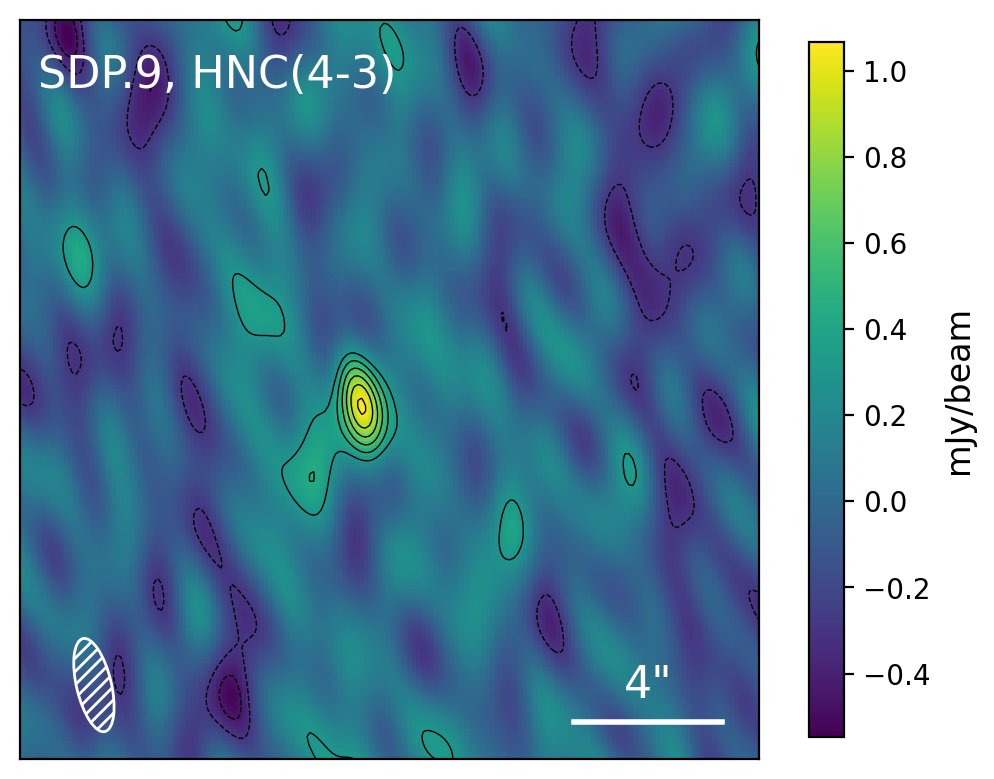
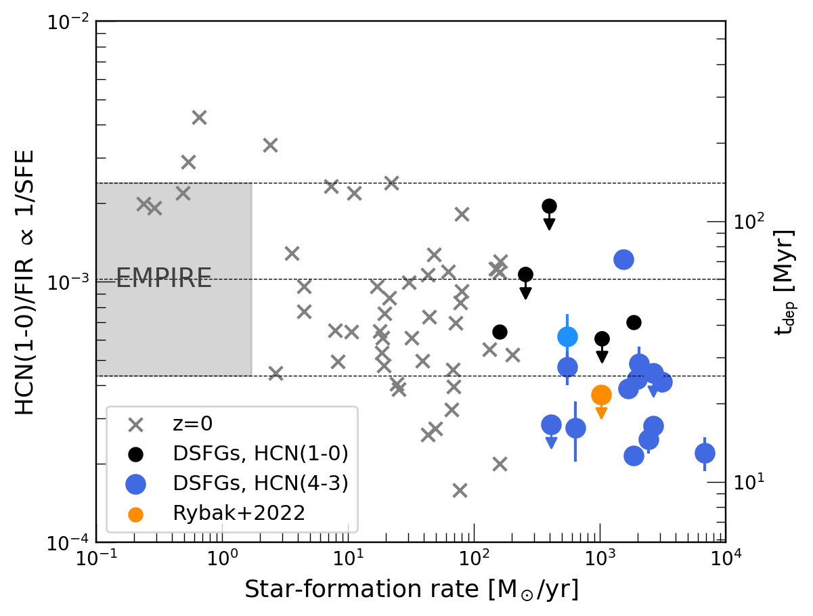
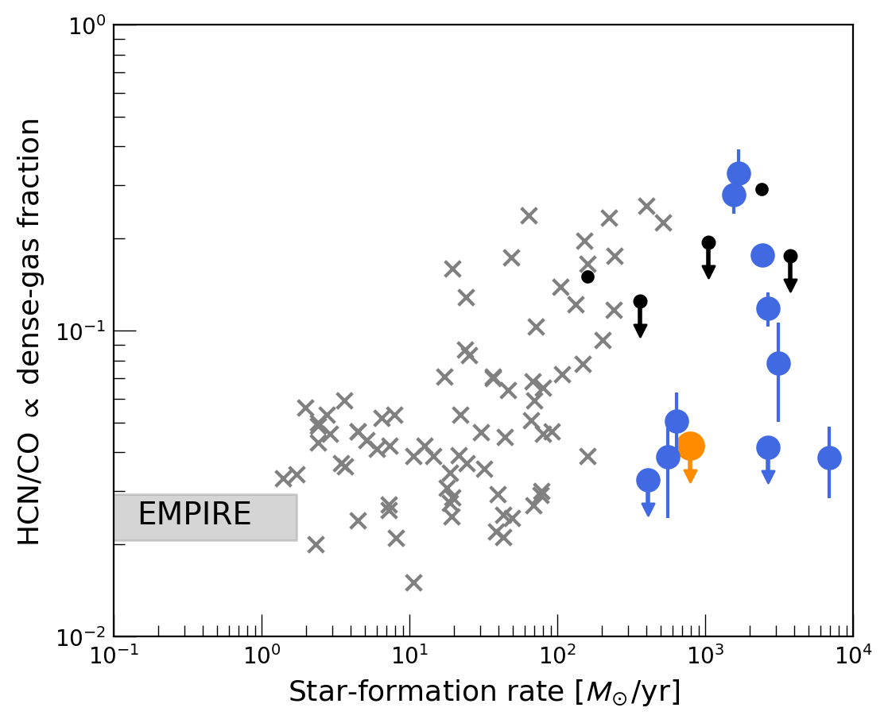

$\newcommand{\ensuremath}{}$
$\newcommand{\xspace}{}$
$\newcommand{\object}[1]{\texttt{#1}}$
$\newcommand{\farcs}{{.}''}$
$\newcommand{\farcm}{{.}'}$
$\newcommand{\arcsec}{''}$
$\newcommand{\arcmin}{'}$
$\newcommand{\ion}[2]{#1#2}$
$\newcommand{\textsc}[1]{\textrm{#1}}$
$\newcommand{\hl}[1]{\textrm{#1}}$
$\newcommand{\footnote}[1]{}$

# PRUSSIC III -  ALMA and NOEMA survey of dense gas in high-redshift star-forming galaxies

<mark>Appeared on: 2025-11-04</mark> -  _Submitted to A&A. First version 14th August 2025; revised 4th November 2025_

M. Rybak, et al. -- incl., <mark>F. Walter</mark>

**Abstract:** Characterising the relationship between dense gas and star formation is critical for understanding the assembly of galaxies throughout cosmic history. However, due to the faintness of standard dense-gas tracers -- HCN, HCO $^+$ , and HNC -- dense gas in high-redshift galaxies remainslargely unexplored.  We present ALMA and NOEMA observations targeting HCN/HCO $^+$ /HNC (3--2) and (4--3) emission lines in eleven (mostly) gravitationally lensed dusty star-forming galaxies (DSFGs) at redshift $z=1.6-3.2$ .  We detect at least one line in 10 out of 11 galaxies. Altogether, we detect 34 dense-gas transitions, more than quadrupling the number of extant high-redshift detections. Additionally, in two targets, we detect lower-abundance CO isotopologues $^{13}$ CO and C $^{18}$ O, as well as CN emission.  We derive excitation coefficients for HCN, HCO $^+$ and HNC in DSFGs, finding them to be systematically higher than those in nearby luminous infrared galaxies.  Assuming a canonical dense-mass conversion factor ( $\alpha_\mathrm{HCN}=10$ ), we find that DSFGs have shorter dense-gas depletion times (median 23 Myr) than nearby galaxies ( $\approx60$ Myr), with a star-forming efficiency per free-fall time of 1--2 \% , a factor of a few higher than in local galaxies. We find a wide range of dense-gas fractions, with HCN/CO ratios ranging between 0.01 and 0.15. Finally, we put the first constraints on the redshift evolution of the cosmic dense-gas density, which increases by a factor of $7\pm4$ between $z=0$ and $z=2.5$ , consistent with the evolution of the cosmic molecular-gas density.

**Figure 8. -** NOEMA narrow-band images of the HCN/HCO$^+$/HNC lines for SDP.9, which is detected in all three transitions. For the remaining sources, see Appendix. Contours start at $\pm$2$\sigma$ and increase in steps of 2$\sigma$.  (*fig:noema_hcnhcohnc*)

**Figure 11. -** {Left:} Ratio of HCN(1--0) and FIR luminosities (a proxy for star-forming efficiency) as a function of star-formation rate. The dotted lines indicate the mean and 1$\sigma$ scatter for local galaxies from the EMPIRE sample  ([Jiménez-Donaire, Bigiel and Leroy 2019]()) . We infer HCN(1--0) luminosities for our DSFGs using the following excitation coefficients: $r_\mathrm{31}=0.41$  and $r_\mathrm{41}=0.59$. {Right:} Ratio of  HCN(1--0) and CO(1--0) luminosities (a proxy for the dense-gas fraction). The inferred HCN/CO ratios span $\approx$1 dex, suggesting that dense-gas fraction in high-z DSFGs vary significantly source-to-source.  (*fig:SFE*)

**Figure 1. -** Comparison of CO, HCN, HCO$^+$ and HNC linewidths in individual galaxies, ordered by increasing CO linewidth. The linewidths of different tracers are generally consistent within 1$\sigma$ uncertainties. Note the large discrepancies between HCN/HCO$^+$ and HNC linewidths in G04v1.40 and J1202. (*fig:fwhm_fwhm*)

