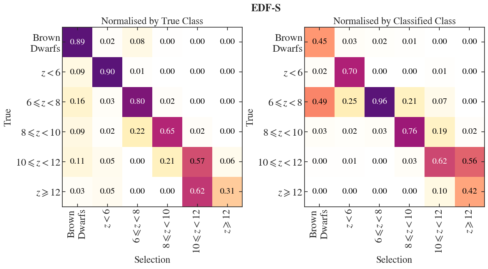
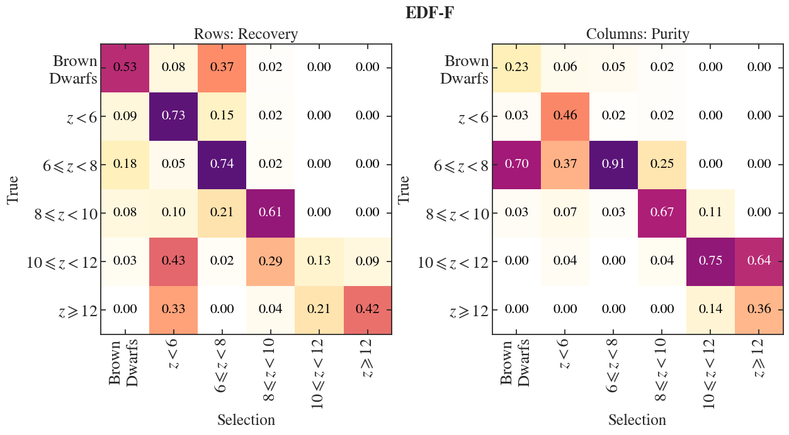
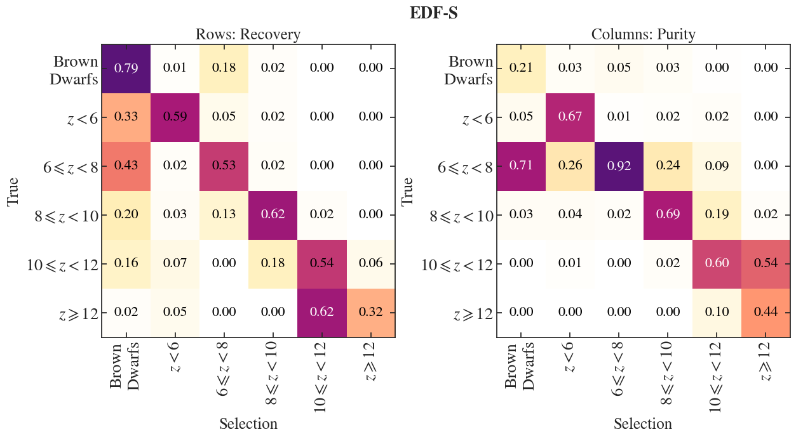
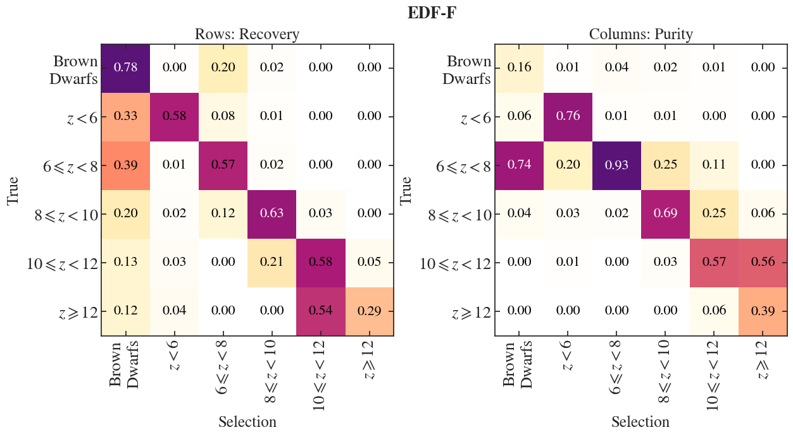

$\newcommand{\ensuremath}{}$
$\newcommand{\xspace}{}$
$\newcommand{\object}[1]{\texttt{#1}}$
$\newcommand{\farcs}{{.}''}$
$\newcommand{\farcm}{{.}'}$
$\newcommand{\arcsec}{''}$
$\newcommand{\arcmin}{'}$
$\newcommand{\ion}[2]{#1#2}$
$\newcommand{\textsc}[1]{\textrm{#1}}$
$\newcommand{\hl}[1]{\textrm{#1}}$
$\newcommand{\footnote}[1]{}$
$\newcommand{\orcid}[1]$
$\newcommand{\arraystretch}{1.3}$
$\newcommand{\arraystretch}{1.3}$
$\newcommand{\arraystretch}{1.3}$

# Euclid Quick Data Release (Q1): Hunting for luminous $z > 6$ galaxies in the Euclid Deep Fields -- forecasts and first bright detections

<mark>Appeared on: 2025-11-06</mark> - 

E. Collaboration, et al. -- incl., <mark>J. Matharu</mark>, <mark>E. Bañados</mark>, <mark>S. Belladitta</mark>, <mark>K. Jahnke</mark>

**Abstract:** The evolution of the rest-frame ultraviolet luminosity function (UV LF) is a powerful probe of early star formation and galaxy stellar mass build-up. At $z>6$ , its bright end ( $M_{\rm UV} <  -21$ ) remains poorly constrained due to small survey volumes of existing near-infrared (NIR) space-based imaging surveys. The Euclid Deep Fields (EDFs) will cover 53 deg $^2$ with NIR coverage down to 26.5 AB magnitude, providing a factor of 100 increase in area compared to previous space-based surveys. They thus offer an unprecedented opportunity to select bright $z>6$ Lyman break galaxies (LBGs) and definitively constrain the bright end of the UV LF. With its NIR coverage extending to $\sim2  \si{\micron}$ , $\Euclid$ has the power to detect galaxies out to $z\sim13$ . Here, we present a forecast for the number densities of $z>6$ galaxies that $\Euclid$ is expected to observe in the final EDF dataset. Using synthetic photometry from spectral energy distribution (SED) templates of $z=5$ --15 galaxies, $z=1$ --4 interlopers, and Milky Way MLT dwarfs, we investigate optimal selection methodologies for high- $z$ LBGs in the EDF datasets. We find that a combination of S/N cuts with SED fitting (over optical to MIR bands) yields the highest fidelity sample, recovering more than $76\%$ of the input synthetic $z>6$ LBGs, while limiting low- $z$ contamination to less than $10\%$ . This contamination does not include effects from instrumental artefacts, which will impact the first $\Euclid$ data releases. Auxiliary data proves critical: optical coverage from Hyper Suprime Camera and $_ Vera C. Rubin_$ Observatory will distinguish genuine Lyman breaks from contaminant features, while $\Spitzer$ /IRAC data is vital for recovering $z>10$ sources. Based on empirical double power-law LF models, we expect more than $100 000$ LBGs at $z=6$ --12 and more than $100$ sources as far back as $z>12$ in the final $\Euclid$ data release. In contrast, the steeper Schechter LF models predict no detections of $z>12$ LBGs. In this work, we also present two ultra-luminous ( $M_{\rm UV} < -23.5$ ) candidates selected from the Q1 EDF-N dataset (Euclid Quick Data Release). If their redshifts are reliable, their magnitudes suggest a DPL UV LF model at $z>9$ . This highlights the power of $\Euclid$ in constraining the bright end of the UV LF in the early Universe and in identifying the most luminous sources that are valuable for further follow-up observations.

**Figure 8. -** Confusion matrices, for each EDF, presenting the performance of our classification (Sect. \ref{sc:EF_Paper_Method}). The left matrices are normalised by true class, and the right matrices are normalised by selected class. Diagonals present the completeness (_left_) and purity (_right_).  (*fig:recoved_sel_frac_allfields*)

**Figure 11. -** Performance of a classifier including \Euclid filters only, for each EDF. The performance of this classification is presented in confusion matrices, which are normalised by true class (_left_) and selected class (_right_). Diagonals present completeness (_left_) and purity (_right_). (*fig:recoved_sel_frac_euclidonly_allfields*)

**Figure 12. -** Performance of a classifier which includes both _ Spitzer_ and \Euclid filters, for each EDF. The performance of this classification is presented in confusion matrices, which are normalised by true class (left) and selected class (right). Diagonals present completeness (left) and purity (right). (*fig:recoved_sel_frac_nooptext_allfields*)

