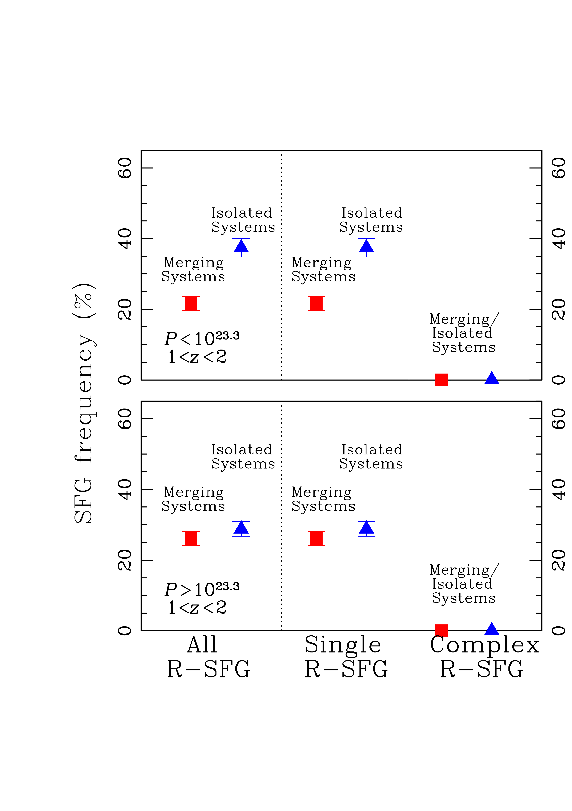
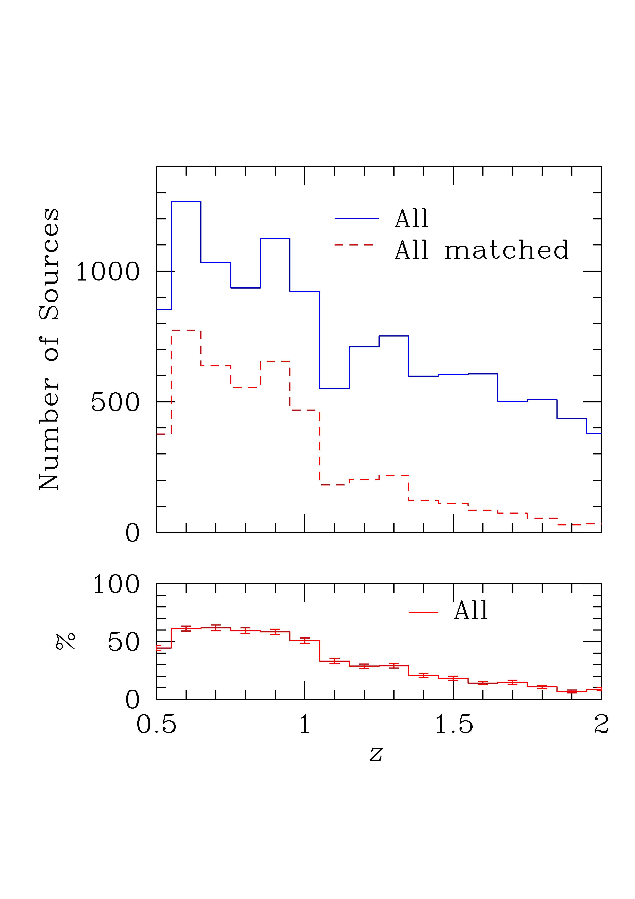
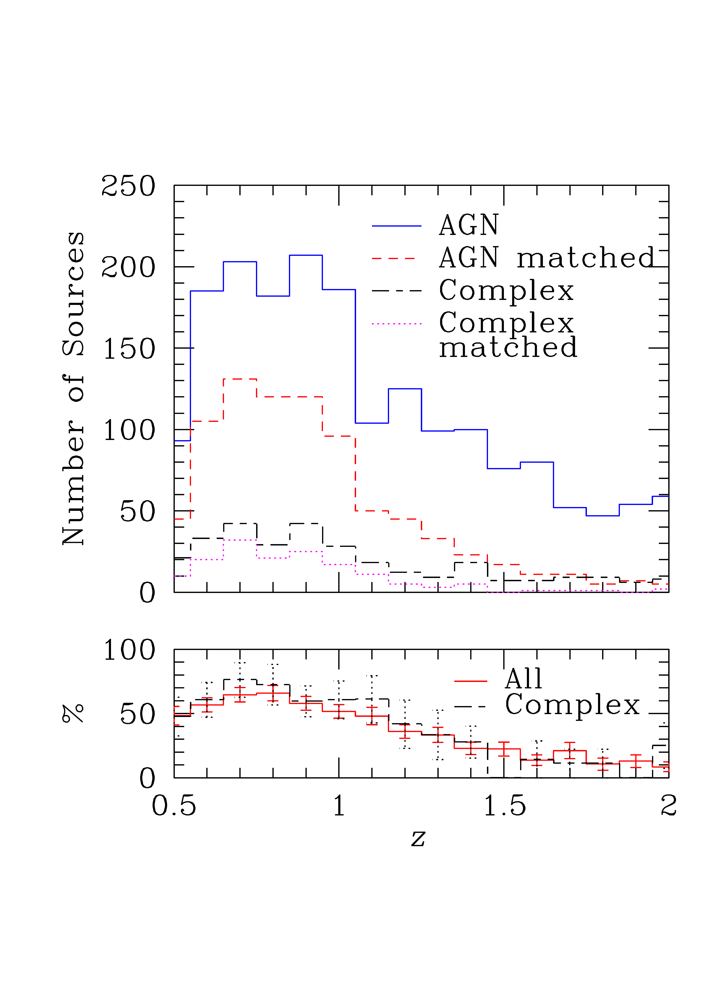
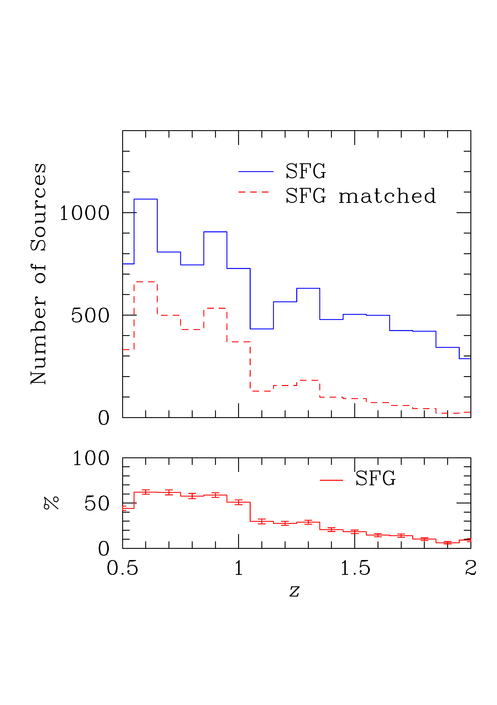

$\newcommand{\ensuremath}{}$
$\newcommand{\xspace}{}$
$\newcommand{\object}[1]{\texttt{#1}}$
$\newcommand{\farcs}{{.}''}$
$\newcommand{\farcm}{{.}'}$
$\newcommand{\arcsec}{''}$
$\newcommand{\arcmin}{'}$
$\newcommand{\ion}[2]{#1#2}$
$\newcommand{\textsc}[1]{\textrm{#1}}$
$\newcommand{\hl}[1]{\textrm{#1}}$
$\newcommand{\footnote}[1]{}$
$\newcommand{\orcid}[1]$

# $\Euclid$: Quick Data Release (Q1) -- The connection between galaxy close encounters and radio activity$\thanks{This paper is published on behalf of the Euclid Consortium.}$

<mark>Appeared on: 2025-11-06</mark> -  _22 pages, 16 figures, submitted to A&A_

M. Magliocchetti, et al. -- incl., <mark>K. Jahnke</mark>

**Abstract:** Using the large statistics provided by both $\Euclid$ and the LOFAR surveys, we present the first large-scale studyof the connection between radio emission, its morphology, and the merging properties of the hosts of radio sources up to $z\sim 2$ . By dividing the radio sample into active galactic nuclei (AGN) and star-forming galaxies, we find that radio-emitting AGN show a clear preference to reside within galaxies undergoing a merging event. This is more significant for AGN that present extended and/or complex radio emission: indeed, about half of them are associated with merging systems, while only $\SI{\sim 15}\percent$ are hosted by an isolated galaxy. The observed trend is primarily driven by AGN residing at $z<1$ , especially in the case of high  -- $P_{144 \rm MHz}>10^{24}$ W  Hz $^{-1}$ sr $^{-1}$ -- radio luminosities ( $\SI{\sim 60}\percent$ in mergers versus $\SI{\sim 10}\percent$ isolated regardless of radio appearance). On the other hand, this preference seems to disappear at higher redshifts, where only bright AGN with extended radio emission still prefer galaxies undergoing a merging event. The situation is reversed in the case of radio-emitting star-forming galaxies, which are preferentially associated with isolated systems. This is more significant as we move towards low radio-luminosity/star-formation objects ( $P_{144  \rm MHz}<10^{23}$ W Hz $^{-1}$ sr $^{-1}$ ) for which we find $\SI{\sim 40}\percent$ in isolated systems versus $\SI{\sim 20}\percent$ in mergers. These values hold regardless of redshift. We interpret the above result for AGN with their need to accrete outer gas from local encounters in order to trigger (radio) activity, especially in the case of extended radio emission such as hot-spots and lobes. This is mostly observed at $z<1$ , since in the local Universe galaxies are more gas deprived than their higher-redshift counterparts. Internal gas reservoirs instead seem sufficient to trigger star formation within the majority of galaxies, which indeed prefer to be associated with isolated systems at all redshifts probed.

**Figure 5. -** Similar to Fig. 4, except that now different panels present different redshift/radio-luminosity (expressed in W Hz$^{-1}$ sr$^{-1}$ units) combinations as shown (see text for details). The point in the top-right part of the top-right panel is off the scale and refers to one single object hosted by a merging system.
 (*fig:hist_AGN_mer_z_P*)

**Figure 7. -** Similar to Fig. 6, except that now different panels present different redshift/radio-luminosity (expressed in W Hz$^{-1}$ sr$^{-1}$) combinations as shown (see text for details).
 (*fig:hist_SF_mer_z_P*)

**Figure 1. -** Redshift distribution of LOFAR sources in the EDF-N region in the redshift interval $0.5< z < 2$. The left-hand panel refers to the whole sample, the middle panel to the sub-class of radio AGN, and the right-hand panel to star-forming galaxies. In each panel the solid line refers to the parent radio sample from the work of \citetalias{bisigello}, while the dashed histograms correspond to those sources with optical counterparts from the work of \citetalias{Q1-SP013}. The bottom panels show the percentages obtained from the ratios between the above quantities, together with the associated (Poissonian) errors. The middle panel additionally presents the trends for AGN with complex radio morphology, short-long dashed lines for the parent sample and dotted lines for the matched sample.
 (*fig:hist_z*)

