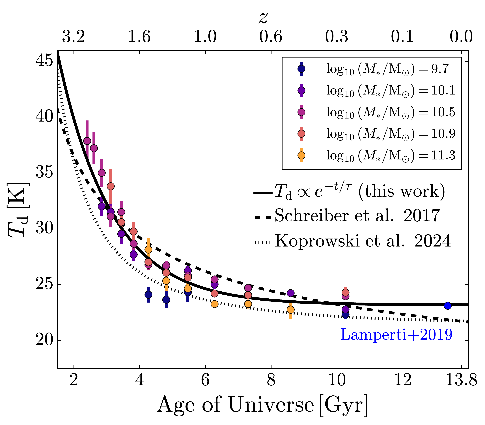
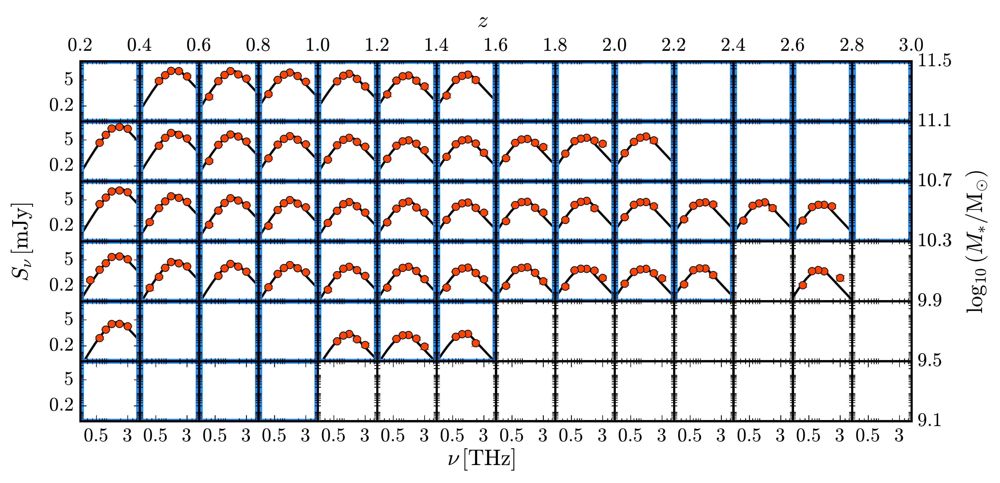

$\newcommand{\ensuremath}{}$
$\newcommand{\xspace}{}$
$\newcommand{\object}[1]{\texttt{#1}}$
$\newcommand{\farcs}{{.}''}$
$\newcommand{\farcm}{{.}'}$
$\newcommand{\arcsec}{''}$
$\newcommand{\arcmin}{'}$
$\newcommand{\ion}[2]{#1#2}$
$\newcommand{\textsc}[1]{\textrm{#1}}$
$\newcommand{\hl}[1]{\textrm{#1}}$
$\newcommand{\footnote}[1]{}$
$\newcommand{\orcid}[1]{\orcidlink{#1}}$
$\newcommand{\pz}{\phantom{0}}$
$\newcommand{\DS}[1]{{\textcolor{magenta}{DS: #1}}}$
$\newcommand{\Arefe}[1]{{\textcolor{red}{AA: #1}}}$

# Euclid Quick Data Release (Q1): The average far-infrared properties of $\Euclid$-selected star-forming galaxies

<mark>Appeared on: 2025-11-06</mark> -  _Submitted to A&A as part of the second Euclid Q1 paper splash_

E. Collaboration, et al. -- incl., <mark>K. Jahnke</mark>

**Abstract:** The first Euclid Quick Data Release (Q1) contains millions of galaxies with excellent optical and near-infrared (IR) coverage.To complement this dataset, we investigate the average far-IR properties of $\Euclid$ -selected main sequence (MS) galaxies using existing $\Herschel$ and SCUBA-2 data.We use 17.6 deg $^2$ (2.4 deg $^2$ ) of overlapping $\Herschel$ (SCUBA-2) data, containing 2.6 million (240 000) MS galaxies. We bin the $\Euclid$ catalogue by stellar mass and photometric redshift and perform a stacking analysis following ${\tt SimStack}$ , which takes into account galaxy clustering and bin-to-bin correlations.We detect stacked far-IR flux densities across a significant fraction of the bins. We fit modified blackbody spectral energy distributions in each bin and derive mean dust temperatures ( $T_{\rm d}$ ), dust masses ( $M_{\rm d}$ ), and star-formation rates (SFRs). We find similar mean SFRs compared to the $\Euclid$ catalogue, and we show that the average dust-to-stellar mass ratios decreased from $z {\simeq} 1$ to the present day. Average dust temperatures are largely independent of stellar mass and are well-described by the function $T_2 {+} (T_1 {-} T_2) {\rm e}^{-t/\tau}$ , where $t$ is the age of the Universe, $T_1 {=} (79.7\pm7.4) $ K, $T_2 {=} (23.2\pm0.1) $ K, and $\tau{=} (1.6\pm0.1) $ Gyr. We argue that since the dust temperatures are converging to a non-zero value below $z {=} 1$ , the dust is now primarily heated by the existing cooler and older stellar population, as opposed to hot young stars in star-forming regions at higher redshift. We show that since the dust temperatures are independent of stellar mass, the correlation between dust temperature and SFR depends on stellar mass. Lastly, we estimate the contribution of the $\Euclid$ catalogue to the cosmic IR background (CIB), finding that it accounts for ${>} 60\%$ of the CIB at 250, 350, and 500 $\mu$ m.As the $\Euclid$ mission progresses, larger catalogues will allow us to probe the far-IR properties of MS galaxies out to higher redshifts and lower stellar masses, potentially recovering the complete CIB.

**Figure 2. -** Best-fit dust temperatures from our SED fitting, $T_{\rm d}$, as a function of time (bottom axis) and redshift (top axis), considering only the redshift and stellar mass bins that are ${>} 95\%$ complete. We show the dust temperature evolution for five different stellar mass bins, with the stellar mass values of the centres of the bins given in the legend. The solid curve is a fit to the simple form $T_2 {+} (T_1 {-} T_2) e^{-t/\tau}$, while the dotted line is the quadratic-in-redshift fit from [Koprowski, Wijesekera and Dunlop (2024)]() and the dashed line is the linear-in-redshift fit from [Schreiber, Elbaz and Pannella (2017)](). We also show published mean temperature estimates for star-forming galaxies at low redshift \citep[$0.01 {<} z {<} 0.05$;][]{lamperti2019} in blue. (*fig:Td_z*)

**Figure 9. -** _ Top:_\Herschel-SPIRE data covering the CDFS-SWIRE field (which overlaps with the EDF-F) at 250, 350, and 500 $\mu$m. The blue contour shows the mask applied to the SPIRE images in order to remove bad edge pixels. The grey contours show the corresponding \Euclid catalogue mask, where masked rectangles are the locations of bright stars in the field that contaminate source extraction. _ Bottom:_ Same as the top panel, but  showing the RMS of the \Herschel-SPIRE data.  Coordinates are conventional RA and Dec. (*fig:field_summary_edff*)

**Figure 11. -** Modified blackbody SEDs (with $\beta=1.96$ and $\alpha=2.3$) fit to the stacked \Herschel and SCUBA-2 flux densities. The redshifts and stellar masses of each bin are indicated by the top and right axis labels, respectively. The best-fit parameters are given in Table \ref{table:bestfit_sed}. SEDs have only been fit to bins where all three SPIRE flux densities are detected with S/N$ {>} 3$, and at least one PACS flux density is detected with S/N$ {>} 3$; panels are blank otherwise. Bins that are ${>} 95\%$ complete in stellar mass are highlighted in blue. (*fig:stack_sed_fits*)

