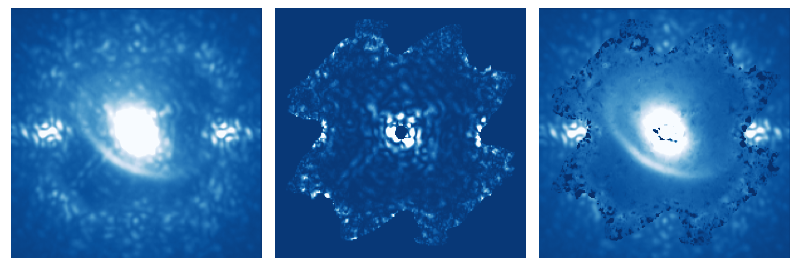
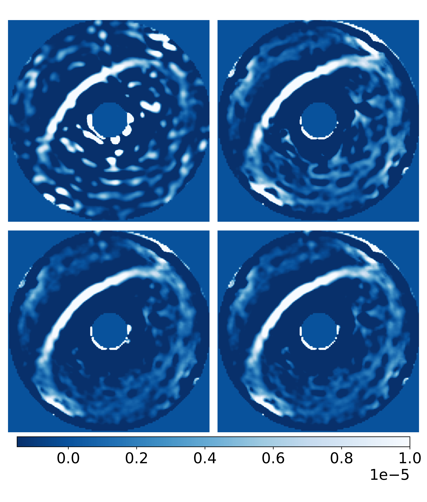

$\newcommand{\ensuremath}{}$
$\newcommand{\xspace}{}$
$\newcommand{\object}[1]{\texttt{#1}}$
$\newcommand{\farcs}{{.}''}$
$\newcommand{\farcm}{{.}'}$
$\newcommand{\arcsec}{''}$
$\newcommand{\arcmin}{'}$
$\newcommand{\ion}[2]{#1#2}$
$\newcommand{\textsc}[1]{\textrm{#1}}$
$\newcommand{\hl}[1]{\textrm{#1}}$
$\newcommand{\footnote}[1]{}$
$\newcommand{\todo}[1]{\textcolor{red}{[#1]}}$
$\newcommand{\rga}[1]{\textcolor{magenta}{[#1]}}$
$\newcommand{\pba}[1]{\textcolor{blue}{[#1]}}$
$\newcommand{\froc}[2]{{#1}/{#2}}$
$\newcommand{\ra}[1]{\newcommand{\arraystretch}{#1}}$
$\newcommand{\arraystretch}{#1}$
$\newcommand{\Var}{{\textrm{Var}} }$

# Coherent differential imaging of high-contrast extended sources with VLT/SPHERE$\thanks{Based on observations collected at the European Southern Observatory, Chile, 113.26G2}$

<mark>Appeared on: 2025-11-06</mark> -  _Accepted in A&A_

A. Potier, et al. -- incl., <mark>G. Chauvin</mark>

**Abstract:** High-contrast imaging relies on advanced coronagraphs and adaptive optics (AO) to attenuate the starlight. However, residual aberrations, especially non-common path aberrations between the AO channel and the coronagraph channel, limit the instrument performance. While post-processing techniques such as spectral or angular differential imaging (ADI) can partially address those issues, they suffer from self-subtraction and inefficiencies at small angular separations or when observations are conducted far from transit. We previously demonstrated the on-sky performance of coherent differential imaging (CDI), which offers a promising alternative. It allows for isolating coherent starlight residuals through speckle modulation, which can then be subtracted from the raw images during post-processing. This work aims to validate a CDI method on real science targets using VLT/SPHERE, demonstrating its effectiveness in imaging almost face-on circumstellar disks, which are typically challenging to retrieve with ADI. We temporally modulated the speckle field in VLT/SPHERE images, applying small phase offsets on the AO deformable mirror while observing stars surrounded by circumstellar material: HR 4796A, CPD-36 6759, HD 169142, and HD 163296. We hence separated the astrophysical scene from the stellar speckle field, whose lights are mutually incoherent. Combining a dozen of data frames and reference coronagraph point spread functions through a Karhunen–Loève image projection framework, we recover the circumstellar disks without the artifacts that are usually introduced by common post-processing algorithms (e.g., self-subtraction). The CDI method therefore represents a promising strategy for calibrating the effect of static and quasi-static aberrations in future direct imaging surveys. Indeed, it is efficient, does not require frequent telescope slewing, and does not introduce image artifacts to first order.

**Figure 8. -** Image decomposition of HD 163296 through CDI. Left: Coronagraph image with no probe (i.e., total intensity image). Center: PWP-estimated speckle field. Right: CDI result (estimated astrophysical scene subtracted from the total intensity image) after one sequence of PWP. The negative values, indicated by black-colored regions, show local over-subtraction in areas where PWP cannot properly estimate the speckle field. (*fig:1iter_example*)

**Figure 9. -** Comparison of disk images obtained with ADI (left column) and CDI (center column). For each disk, the ADI and CDI images are displayed using the same color scale; however, the scales vary from one disk to another. ADI and CDI results were obtained through the same dataset. We use K-klip ADI \citep{Soummer2012} with $K_{klip} = N_{filt}/2$. Right column: Comparison of disk intensities, for pixels inside the region encircled in green, obtained with both ADI and CDI as a function of the position angle. (*fig:Images_disk*)

**Figure 1. -** $I_{CDI}$ results for different reference estimations. Top left: $I_{ref,i}=0$, no CDI post-processing applied (equivalent to noADI). Top right: $I_{ref,i} = I_{PWP,i}$, a simple batch process used. Bottom left: Karhunen-Loève coherent component projection. Bottom right: Karhunen-Loève image projection. All images have been high-passed filtered, as explained in Sec. \ref{subsec:highpass_filter}. (*fig:Comparison_algorithms*)

