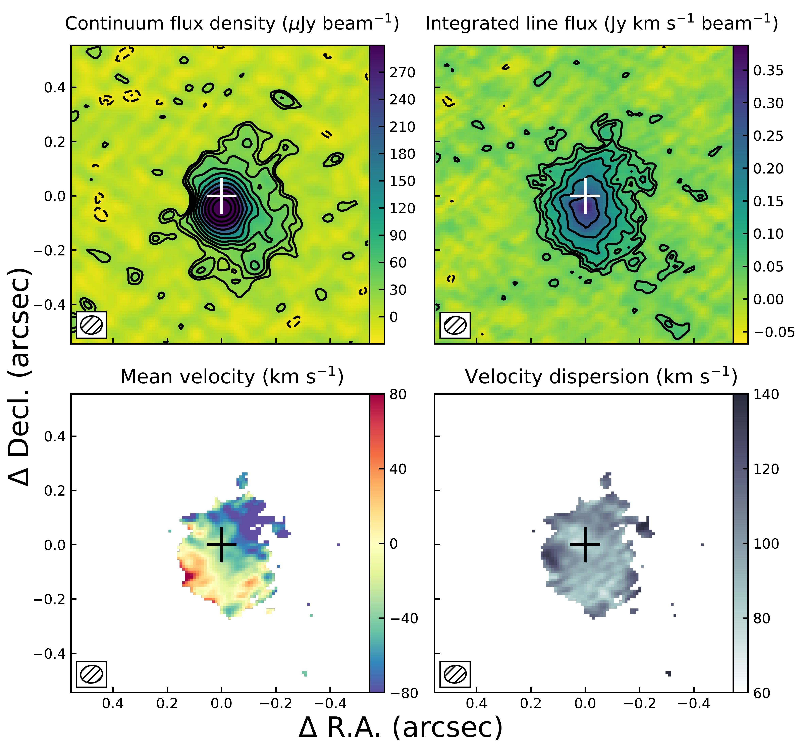
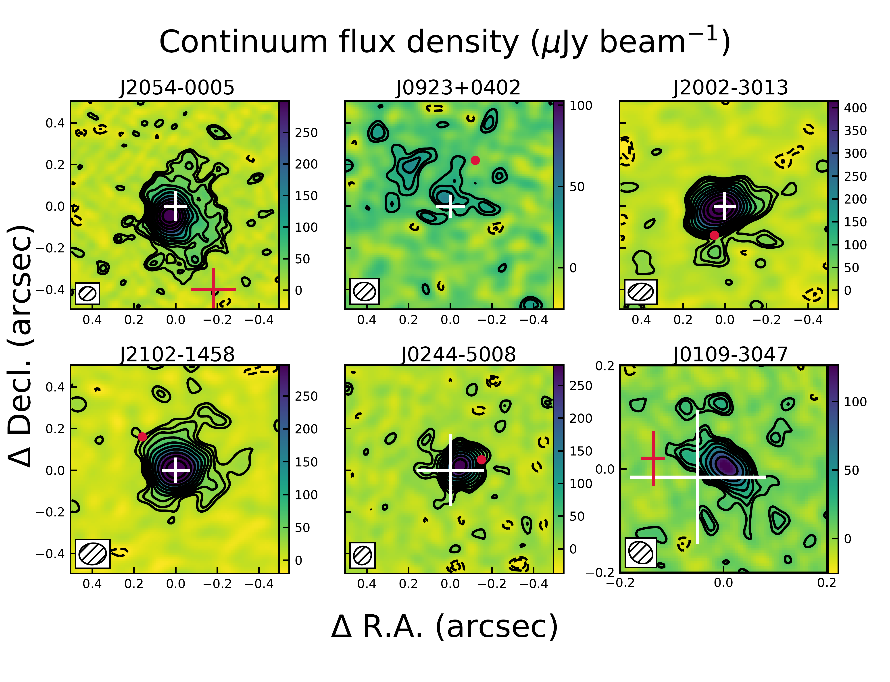

$\newcommand{\ensuremath}{}$
$\newcommand{\xspace}{}$
$\newcommand{\object}[1]{\texttt{#1}}$
$\newcommand{\farcs}{{.}''}$
$\newcommand{\farcm}{{.}'}$
$\newcommand{\arcsec}{''}$
$\newcommand{\arcmin}{'}$
$\newcommand{\ion}[2]{#1#2}$
$\newcommand{\textsc}[1]{\textrm{#1}}$
$\newcommand{\hl}[1]{\textrm{#1}}$
$\newcommand{\footnote}[1]{}$
$\newcommand$
$\newcommand$
$\newcommand$
$\newcommand$

# ALMA and JWST Imaging of $z > 6$ Quasars: No Spatial Position Offset Observed Between Quasars and Their Host Galaxies

<mark>Appeared on: 2025-11-06</mark> -  _Accepted to the Astrophysical Journal_

A. Wilde, et al. -- incl., <mark>F. Walter</mark>

**Abstract:** We present a study determining the spatial offset between the position of the supermassive black hole (as traced through their broad line regions) and the host galaxy in six $z > 6$ quasars. We determined the host galaxy's position from $\lesssim0\farcs10$ ( $\lesssim$ 600 pc) resolution Atacama Large Millimeter/sub-millimeter Array (ALMA) $\CII$ 158 $\mu m$ and corresponding dust continuum imaging. We determined the quasar's position from $\lesssim$ 400 pc resolution James Webb Space Telescope Near-Infrared Camera (JWST NIRCam) imaging. We estimated the observational uncertainties on the quasar's position using astrometric data from the Global Astrometric Interferometer for Astrophysics (GAIA) of field stars within the NIRCam images. We find that all six quasars are found within the central $\sim 400$ pc of their host galaxy dust continuum and $\CII$ emission. Apparent offsets seen in rest-frame optical JWST observations are not detected in our ALMA data, suggesting they likely result from dust obscuration rather than a true physical separation between the SMBH and its host galaxy. Kinematic modeling of these data further reveals that none of the galaxies show evidence for recent merger activity, and most of the galaxies can be accurately modeled using a simple disk model. The lack of an offset supports theoretical models that predict that positional offset within these galaxies are either short-lived or intrinsically rare.

**Figure 5. -** J2054$-$0005 continuum, \CII velocity-integrated flux density, mean velocity, and velocity dispersion maps. The cross marks the position of the quasar within the galaxy with error bars as found by comparing JWST and GAIA data (detailed in Section \ref{subsec:astrometry}). The contours in the top two panels start at 2$\sigma$ and increase by powers of $\sqrt{2}$. The synthesized beam is shown in the bottom left corner of each panel. (*fig:4pan 2054*)

**Figure 6. -** Continuum imaging of all six sources in the sample. Previous optical position of the quasars are noted in red. JWST positions (see Section \ref{sec:jwst}) of the quasars are shown in white. For sources lacking reported uncertainties in the literature for their previous coordinates, the positions are marked with a dot. We note that the spatial scaling for J0109$-$3047 is different, for the clearest possible view of the galaxy. Contours and annotations are similar to Figure \ref{fig:4pan 2054}. (*fig:cont 6pan*)

**Figure 8. -** J2054$-$0005 Channel Maps from the _qubefit_ thin disk model. The left panel shows \CII data at each 30 \kms increment with contours of the model. The right panel shows \CII emission at each 30 \kms increment with residual contours. Both sets of contours start at $2 \sigma$ and increase by factors of $\sqrt{2}$. (*fig:chanmap 2054*)

