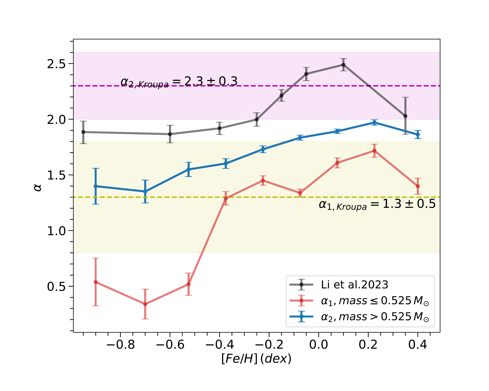

$\newcommand{\ensuremath}{}$
$\newcommand{\xspace}{}$
$\newcommand{\object}[1]{\texttt{#1}}$
$\newcommand{\farcs}{{.}''}$
$\newcommand{\farcm}{{.}'}$
$\newcommand{\arcsec}{''}$
$\newcommand{\arcmin}{'}$
$\newcommand{\ion}[2]{#1#2}$
$\newcommand{\textsc}[1]{\textrm{#1}}$
$\newcommand{\hl}[1]{\textrm{#1}}$
$\newcommand{\footnote}[1]{}$
$\newcommand{\feh}{\rm[Fe/H]}$
$\newcommand{\teff}{T_{\rm eff}}$
$\newcommand{\M}{M_{\odot}}$
$\newcommand{\orcid}[1]{$
$  \href{https://orcid.org/#1}{\textcolor{orcidgreen}{\faOrcid}}$
$}$
$\newcommand{\thebibliography}{\DeclareRobustCommand{\VAN}[3]{##3}\VANthebibliography}$

# The Initial mass function of field stars with mass $\leq$1 $M_{\odot}$ varies with metallicity

<mark>Appeared on: 2025-11-07</mark> -  _12 pages, 13 figures_

D. Qiu, et al. -- incl., <mark>J. Li</mark>

**Abstract:** We investigated a volume-limited sample of LAMOST main-sequence stars with masses from 0.25 to 1 $\M$ and distances of 150-350 pc to explore how the stellar initial mass function (IMF) varies with metelliaicty.We corrected the spectroscopic selection function by comparing the stellar number densities with the photometric ones at the same colour and magnitude. From these corrected number density distributions, we derived IMFs for each metallicity sub-samples. Fitting a broken power-law function in each IMF with a fixed break point at 0.525 $\M$ , we found the power-law indices increase with [ Fe/H ] for both mass regimes: $\alpha_1$ (mass $\leq$ 0.525 $\M$ ) rises from 0.54 $\pm$ 0.21 to 1.40 $\pm$ 0.07 and $\alpha_2$ (mass $>$ 0.525 $\M$ ) grows from 1.40 $\pm$ 0.16 to 1.86 $\pm$ 0.04as [ Fe/H ] varies from -1 to +0.5 dex. It demonstratesthat low-mass stars make up a larger fraction in metal-rich environments than in metal-poor ones. We performed simulations to assess the impact of unresolved binaries on the IMF power-law indices.After correction, the binary-adjusted $\alpha$ values retained a similar metallicity-dependent trend.Furthermore, by examining the IMF of the aggregatesample,we found the corrected indices ( $\alpha_{\rm{1,corr}} = 1.48 \pm 0.03$ , $\alpha_{\rm{2,corr}} = 2.17 \pm 0.03$ ) are consistent with Kroupa's IMF values ( $\alpha_1 = 1.3 \pm 0.5$ and $\alpha_2 = 2.3 \pm 0.3$ ). Finally, we verified the robustness of our results by testing different break points and mass bin sizes, confirming that the IMF’s dependence on [ Fe/H ] remains consistent.

**Figure 11. -** Both axes are shown on logarithmic scales. The solid lines, transitioning from yellow to dark purple, represent the initial mass function of stars with metallicities ranging from –1.0 to +0.5 dex, the black solid line denotes the IMF derived from the full, unbinned sample. All the solid lines are computed with a mass bin size of 0.05$\M$. The dotted lines show the corresponding IMFs calculated with a coarser mass bin size of 0.1 $\M$. A vertical pink solid line marks the location of 0.525 $\M$, corresponding to the mass bin [0.50,0.55) $\M$(highlighted in pink). Two vertical pink dotted lines at 0.475 $\M$  and 0.575$\M$  indicate the adjacent bins, [0.45,0.50) and [0.55,0.60)$\M$, respectively. (*fig:dndm*)

**Figure 3. -** The red and blue lines represent the IMF power-law indices as a function of $\feh$ for stars with mass $\leq$ 0.525 $\M$($\alpha_1$) and > 0.525 $\M$($\alpha_2$), respectively. The black line displays the result of Li23 as a reference. The yellow dashed line marks the Kroupa's slope for stars with a mass range of [0.08, 0.5) $M_{\odot}$($\rm \alpha_{1,Kroupa}=1.3$), with the surrounding yellow shading indicating its quoted uncertainty ($\pm$0.5).
Likewise, the purple line and shading show the slop value and uncertainty for mass $\geq$ 0.5 $\M$($\rm \alpha_{2,Kroupa} =2.3\pm 0.3$).
  (*fig:alpha_feh*)

**Figure 1. -** The metallicity versus the effective temperature of 1308 LAMOST M dwarfs. The metallicities, calibrated with Equation (\ref{eq:deltafeh}), are inherited from the F, G, or K dwarf companions, whereas the $\teff$ are taken from the LASPM pipeline. (*fig:teff_feh*)

