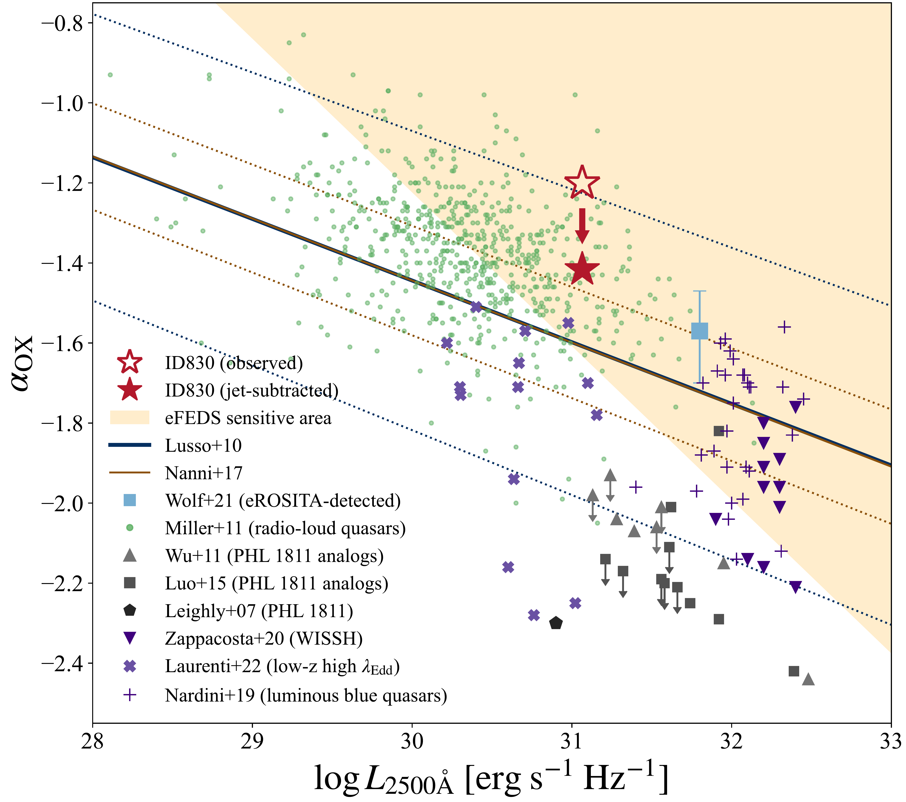

$\newcommand{\ensuremath}{}$
$\newcommand{\xspace}{}$
$\newcommand{\object}[1]{\texttt{#1}}$
$\newcommand{\farcs}{{.}''}$
$\newcommand{\farcm}{{.}'}$
$\newcommand{\arcsec}{''}$
$\newcommand{\arcmin}{'}$
$\newcommand{\ion}[2]{#1#2}$
$\newcommand{\textsc}[1]{\textrm{#1}}$
$\newcommand{\hl}[1]{\textrm{#1}}$
$\newcommand{\footnote}[1]{}$
$\newcommand{\vdag}{(v)^\dagger}$
$\newcommand$
$\newcommand$
$\newcommand$
$\newcommand{\todo}{\ifmmode \text{\color{purple}\Huge{\(\bullet\)}} \else{\color{purple}{\Huge\bullet}}\fi}$
$\newcommand{\finish}{\ifmmode \text{\color{blue}\Huge{\(\bullet\)}} \else{\color{blue}{\Huge\bullet}}\fi}$
$\newcommand{\REFS}{\todo \rev{REFS}}$
$\newcommand{\specz}{z_\mathrm{spec}}$
$\newcommand{\photz}{z_\mathrm{phot}}$
$\newcommand{\Mstar}{M_{\star}}$
$\newcommand{\Msun}{M_{\odot}}$
$\newcommand{\Mbh}{M_\mathrm{BH}}$
$\newcommand{\Mdotbh}{\dot{M}_\mathrm{BH}}$
$\newcommand{\lamEdd}{\lambda_\mathrm{Edd}}$
$\newcommand{\Lbol}{L_\mathrm{AGN,bol}}$
$\newcommand{\LEdd}{L_\mathrm{Edd}}$
$\newcommand{\Luv}{L_\mathrm{UV}}$
$\newcommand{\maguv}{M_\mathrm{1450}}$
$\newcommand{\LuvalphaOX}{L_\mathrm{2500 \text{Å}}}$
$\newcommand{\Lx}{L_\mathrm{X}}$
$\newcommand{\Lsoftx}{L_\mathrm{0.5-2 keV}}$
$\newcommand{\fsoftx}{f_\mathrm{0.5-2 keV}}$
$\newcommand{\Lhardx}{L_\mathrm{2-10 keV}}$
$\newcommand{\NH}{N_\mathrm{H}}$
$\newcommand{\NHunit}{N_\mathrm{H}/\mathrm{cm}^{-2}}$
$\newcommand{\alphaox}{\alpha_\mathrm{OX}}$
$\newcommand{\mstar}{M_{\star}}$
$\newcommand{\msun}{M_{\odot}}$
$\newcommand{\mbh}{M_\mathrm{BH}}$
$\newcommand{\mdotbh}{\dot{M}_\mathrm{BH}}$
$\newcommand{\lbol}{L_\mathrm{AGN,bol}}$
$\newcommand{\ledd}{L_{\rm Edd}}$
$\newcommand{\eddington}{\lambda_\mathrm{Edd}}$
$\newcommand{\liragn}{L_\mathrm{AGN,IR}}$
$\newcommand{\liragnunit}{\liragn/\mathrm{erg}~\mathrm{s}^{-1}}$
$\newcommand{\ltwelve}{L_{12 \mu{\rm m}}}$
$\newcommand{\etar}{\eta_\mathrm{rad}}$
$\newcommand{\etarpone}{\eta_\mathrm{rad,0.1}}$
$\newcommand{\lfirst}{L_\mathrm{1.4GHz}}$
$\newcommand{\lfirstunit}{L_\mathrm{1.4GHz}/\mathrm{W}~\mathrm{Hz}^{-1} }$
$\newcommand{\lvfirst}{\nu L_\nu (\mathrm{1.4GHz})}$
$\newcommand{\lvfirstunit}{\nu L_\nu (\mathrm{1.4GHz})/\mathrm{erg}~\mathrm{s}^{-1} }$
$\newcommand{\ljet}{L_\mathrm{jet}}$
$\newcommand{\ljetunit}{L_\mathrm{jet}/\mathrm{erg}~\mathrm{s}^{-1}}$
$\newcommand{\etaj}{\eta_\mathrm{jet}}$
$\newcommand{\lambdaedd}{\lambda_\mathrm{Edd}}$
$\newcommand{\av}{A_\mathrm{V}}$
$\newcommand{\R}{\mathcal{R_{\rm rest}}}$
$\newcommand{\Rint}{\mathcal{R_\mathrm{int}}}$
$\newcommand{\whz}{\mathrm{W}~\mathrm{Hz}^{-1}}$
$\newcommand{\sBHARunit}{\mathrm{erg}~\mathrm{s}^{-1}~M_\odot^{-1}}$
$\newcommand{\SFR}{\mathrm{SFR}}$
$\newcommand{\sSFR}{\mathrm{sSFR}}$
$\newcommand{\qir}{q_\mathrm{IR}}$
$\newcommand{\fbstar}{f_\mathrm{b,\star}}$
$\newcommand{\rt}[1]{#1}$
$\newcommand{\del}[1]{\textcolor{cyan}{#1}}$
$\newcommand{\arraystretch}{1.1}$
$\newcommand{\arraystretch}{1.1}$
$\newcommand{\arraystretch}{1.1}$
$\newcommand{\arraystretch}{1.1}$

# Discovery of an X-ray Luminous Radio-Loud Quasar at $z=3.4$: A Possible Transitional Super-Eddington Phase

<mark>Appeared on: 2025-11-10</mark> -  _20 pages, 11 figures, accepted for publication in ApJ_

S. Obuchi, et al. -- incl., <mark>J. Wolf</mark>

**Abstract:** We report the multiwavelength properties of eFEDS J084222.9+001000 (hereafter ID830),a quasar at $z=3.4351$ , identified as the most X-ray luminous radio-loud quasar in the eROSITAFinal Equatorial Depth Survey (eFEDS) field.ID830 shows a rest-frame 0.5--2 keV luminosity of $\log (\Lsoftx/\mathrm{erg} \mathrm{s}^{-1}) = 46.20 \pm 0.12$ ,with a steep X-ray photon index ( $\Gamma =2.43 \pm 0.21$ ), and a significant radio counterpart detected with VLA/FIRST 1.4 GHz and VLASS 3 GHz bands.The rest-frame UV to optical spectra from SDSS and Subaru/MOIRCS $J$ -band show a dust reddened quasar feature with $\av = 0.39 \pm 0.08$ mag and the expected bolometric AGN luminosity from the dust-extinction-corrected UV luminosity reaches $L_\mathrm{bol,3000 \text{Å}}= (7.62 \pm 0.31) \times 10^{46}$ erg s $^{-1}$ .We estimate the black hole mass of $\Mbh = (4.40 \pm 0.72) \times 10^{8} \msun$ based on the MgII $\lambda$ 2800 emission line width, and an Eddington ratio from the dust-extinction-corrected UV continuum luminosity reaches $\lambda_\mathrm{Edd,UV}=1.44 \pm 0.24$ and $\lambda_{\mathrm{Edd,X}} = 12.8 \pm 3.9$ from the X-ray luminosity, both indicating the super-Eddington accretion.ID830 shows a high ratio of UV-to-X-ray luminosities, $\alphaox=\rt{-1.20 \pm 0.07}$ (or $\alphaox=\rt{-1.42 \pm 0.07}$ after correcting for jet-linked X-ray excess),higher than quasars and little red dots in super-Eddington phase with similar UV luminosities, with $\alphaox<-1.8$ .Such a high $\alphaox$ suggests the coexistence of a prominent radio jet and X-ray corona, in this high Eddington accretion phase.We propose that ID830 may be in a transitional phase after an accretion burst, evolving from a super-Eddington to a sub-Eddington state, which could naturally describe the high $\alphaox$ .

**Figure 6. -** $\alphaox$ vs. UV monochromatic luminosity $\LuvalphaOX$ for ID830. The open star represents the $\rt${observed}$\alphaox$ of ID830. The filled star represents the $\rt${jet-subtracted}$\alphaox$, after removing the jet contamination. $\rt${Both $\alphaox$ points are higher than} the best-fit relation of [Lusso, et. al (2010)](https://ui.adsabs.harvard.edu/abs/2010A&A...512A..34L)(blue line) and [Nanni, et. al (2017)](https://ui.adsabs.harvard.edu/abs/2017A&A...603A.128N)(brown line). $\rt${The dotted lines are the $1 \sigma$ upper and lower bounds of the two best-fit relations.} The square plot is a eROSITA-detected quasar  ([Wolf, et. al 2021](https://ui.adsabs.harvard.edu/abs/2021A&A...647A...5W)) , and black plots are PHL 1811 and its analogs  ([Leighly, et. al 2007](https://ui.adsabs.harvard.edu/abs/2007ApJ...663..103L), [Wu, et. al 2011](https://ui.adsabs.harvard.edu/abs/2011ApJ...736...28W), [Luo, et. al 2015](https://ui.adsabs.harvard.edu/abs/2015ApJ...805..122L)) . Other X-ray weak sources are also shown as purple inverted triangles  ([Zappacosta, et. al 2020](https://ui.adsabs.harvard.edu/abs/2020A&A...635L...5Z)) , bold cross markers  ([Laurenti, et. al 2022](https://ui.adsabs.harvard.edu/abs/2022A&A...657A..57L)) , and plus markers  ([Nardini, et. al 2019](https://ui.adsabs.harvard.edu/abs/2019A&A...632A.109N)) .
Radio-loud quasars with X-ray excesses detected by _Chandra_, _XMM-Newton_, and ROSAT  ([Miller, et. al 2011](https://ui.adsabs.harvard.edu/abs/2011ApJ...726...20M))  are shown as green circles. The orange shaded region shows the eFEDS sensitive area.
 (*fig:alphaOX*)

**Figure 10. -** 
The broad-band SED of ID830, along with the SED templates of radio-loud and radio-quiet quasars  ([Shang, et. al 2011](https://ui.adsabs.harvard.edu/abs/2011ApJS..196....2S))  and the blazar sequence  ([Ghisellini, et. al 2017](https://ui.adsabs.harvard.edu/abs/2017MNRAS.469..255G)) . The blue, green, and orange shaded regions represent the individual bins of the blazar sequence. The light red plots are the $\rt${observed} X-ray spectrum of ID830. The dark red plots are the $\rt${jet-subtracted} X-ray spectrum, after removing the jet contamination. The upper limits are indicated by arrows.
 (*fig:multiwave_SED*)

**Figure 11. -** 
The left panel shows the rest-frame 2--10 keV X-ray luminosity function  ([Ueda, et. al 2014](https://ui.adsabs.harvard.edu/abs/2014ApJ...786..104U))  of AGNs. $\rt${The open red diamond represents} the number density plotted at the observed X-ray luminosity $\Lhardx$ of ID830. The filled red diamond represents the number density plotted at the $\rt${jet-subtracted} X-ray luminosity, after removing the jet contamination. The right panel shows the rest-frame 1450 Å magnitude UV luminosity function  ([Kulkarni, Worseck and Hennawi 2019](https://ui.adsabs.harvard.edu/abs/2019MNRAS.488.1035K))  of quasars. The filled red diamond represents the number density at the UV magnitude $M_\mathrm{1450 \text{Å}}$ of ID830.
The solid line in each panel indicates the intrinsic luminosity function of the total AGN population, while the dashed line indicates that of the radio AGN population, assuming a radio AGN fraction (RL frac) of 10\%. The purple diamonds are the number densities assuming that ID830 is a blazar.
$\rt${The error bars span the cases for the range for Lorentz factors $\Gamma=5$--15 and do not include the error associated with the number density derived from the observed X-ray luminosity.} (*fig:luminosity_function*)

