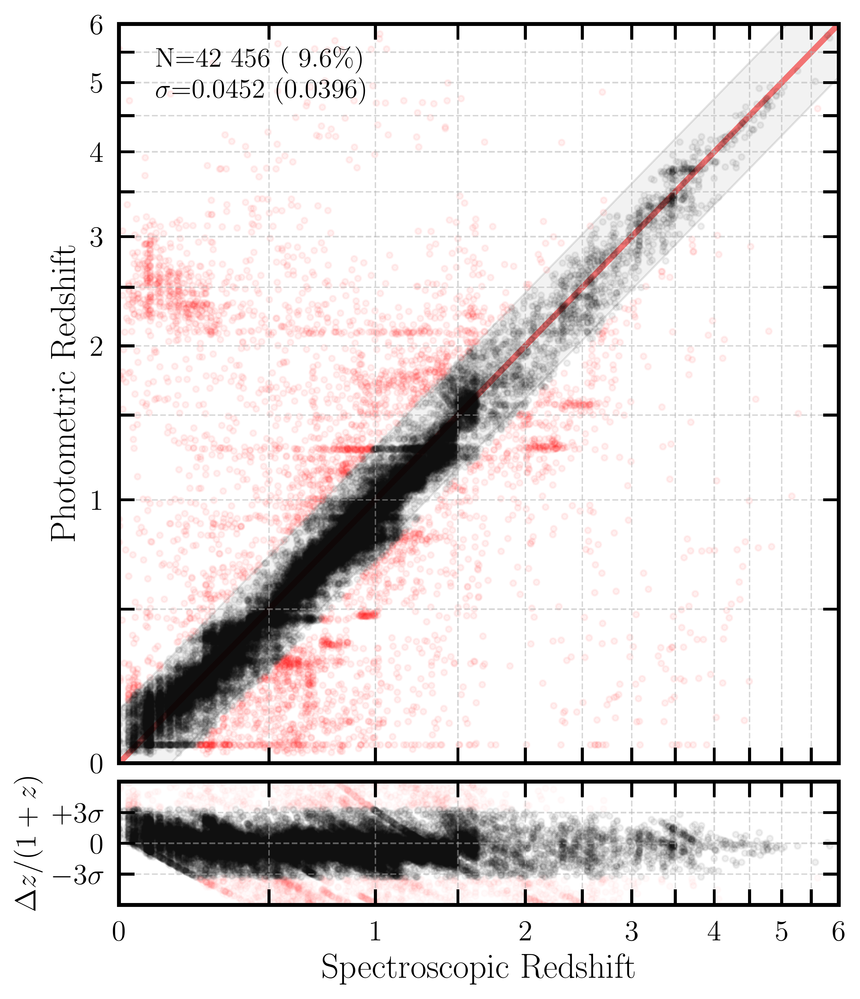
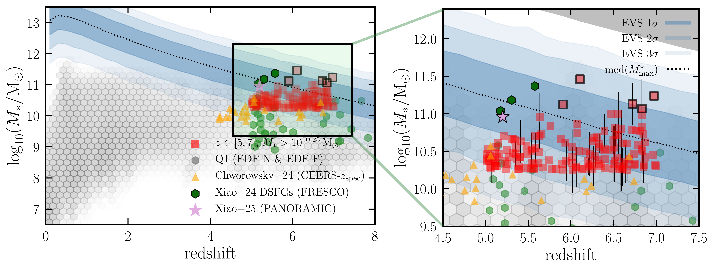

$\newcommand{\ensuremath}{}$
$\newcommand{\xspace}{}$
$\newcommand{\object}[1]{\texttt{#1}}$
$\newcommand{\farcs}{{.}''}$
$\newcommand{\farcm}{{.}'}$
$\newcommand{\arcsec}{''}$
$\newcommand{\arcmin}{'}$
$\newcommand{\ion}[2]{#1#2}$
$\newcommand{\textsc}[1]{\textrm{#1}}$
$\newcommand{\hl}[1]{\textrm{#1}}$
$\newcommand{\footnote}[1]{}$
$\newcommand{\lsim}{\raisebox{-0.13cm}{~\shortstack{< \\[-0.07cm] \sim}}~}$
$\newcommand{\gsim}{\raisebox{-0.13cm}{~\shortstack{> \\[-0.07cm] \sim}}~}$
$\newcommand{\orcid}[1]$
$\newcommand{\arraystretch}{1.1}$
$\newcommand{\arraystretch}{1.2}$

# Euclid Quick Data Release (Q1): Identification of massive galaxy candidates at the end of the Epoch of Reionisation

<mark>Appeared on: 2025-11-18</mark> -  _13 pages, including 6 figures and 3 tables; submitted to A&A_

E. Collaboration, et al. -- incl., <mark>K. Jahnke</mark>

**Abstract:** Probing the presence and properties of massive galaxies at high redshift is one of the most critical tests for galaxy formation models. In this work, we search for galaxies with stellar masses $\( M_* > 10^{10.25}   \rm{M_\odot} \)$ at $\( z \in [5,7]\)$ , i.e., towards the end of the Epoch of Reionisation, over a total of $\( \sim 23  \mathrm{deg}^2\)$ in two of the Euclid Quick Data Release (Q1) fields: the Euclid Deep Field North and Fornax (EDF-N and EDF-F). In addition to the _Euclid_ photometry, we incorporate _Spitzer_ Infrared Camera (IRAC) and ground-based optical data to perform spectral energy distribution (SED) fitting, obtaining photometric redshifts and derived physical parameters. After applying rigorous selection criteria,  we identify a conservative sample of 145 candidate massive galaxies with $\( M_* > 10^{10.25}   \rm{M_\odot} \)$ at $\( z \in [5,7] \)$ , including 5 objects with $\( M_* > 10^{11}   \rm{M_\odot} \)$ .  This makes for a surface density of about 6.3 deg $^{-2}$ at $z\in [5,7]$ , which should be considered a lower limit because of the current depth of the _Euclid_ data ( $\HE<24,   5\sigma$ in Q1). We find that the inferred stellar masses are consistent with galaxy formation models with standard star-formation efficiencies. These massive galaxies have colour excess $E(B-V)$ values up to 0.75, indicating significant dust attenuation in some of them. In addition, half of the massive galaxies have best-fit ages comparable to the age of the Universe at those redshifts, which suggests that their progenitors were formed very early in cosmic time. About 78 \% of the massive galaxies lie on the star-forming main sequence (MS) in the SFR– $\( M_* \)$ plane, $\sim$ 12 \% are found in the starburst region, and 10 \% in the transition zone between the MS and starbursts. We find no significant evidence for outshining or AGN contamination that could account for the elevated specific star-formation rates (sSFR) observed in the $\(\sim12\%\)$ of galaxies classified as starbursts.

**Figure 1. -** Photometric redshifts that we derive in our work versus the spectroscopic redshifts from the literature available in EDF-N and EDF-F. For a more detailed description of the spectroscopic sample, we refer the reader to Q1-TP005. We report an outlier fraction of $9.6\%$ over $\sim 42 000$ galaxies in $z\in(0,6)$ at all magnitudes. We show the identity as a red continuous line, together with the shaded area delimiting catastrophic outliers, defined as $|z_{\rm phot}-z_{\rm spec}|/(1+z_{\rm spec})>0.15$. These cases are highlighted in red colour. (*fig:zphot_zspec*)

**Figure 6. -** *Left panel:* Stellar mass ($M_* $) versus photometric redshift. Our massive galaxy candidates are shown as red squares, overlaid on a gray hexagonal density plot representing the Q1 sample. The 5 candidates above $M_* >10^{11}  \rm{M_\odot}$ are shown with a black outline. For comparison, we include massive galaxies reported in the literature: orange triangles from chworowsky_evidence_2024, green hexagons from xiao_accelerated_2024(with black outlines highlighting the three most massive objects S1, S2, and S3) and a pink star from xiao_panoramic_2025.
    *Right panel:* Zoom-in of the left panel, focusing on our massive galaxy candidates shown as red squares. Confidence intervals from the Extreme Value Statistics (EVS) model  (lovell_extreme_2023) , computed for a survey area comparable to ours, are shown as blue shaded regions, by assuming a lognormal distribution of the star-formation efficiency (SFE). The gray shaded area at the top represents the absolute upper limit under the assumption of 100\% SFE.
     (*fig:hmf_panel*)

**Figure 2. -** Size–stellar mass relation for VIS-detected galaxies in our sample (36 objects), showing the Sérsic effective radius from \IE modeling as a function of stellar mass. Our high-mass galaxies are represented by red squares. Observational relations from recent JWST-based studies are included as shaded regions: blue for ward_evolution_2024 and purple for yang_cosmos-web_2025. The minimum effective radius (\IE) at the average redshift of our sample is shown as a gray line. (*fig:size_mass*)

