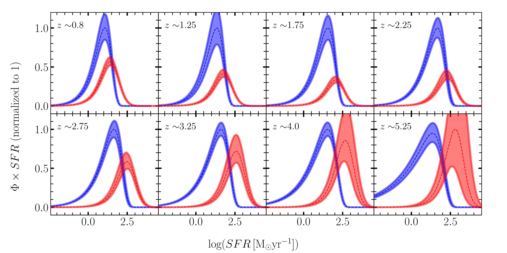
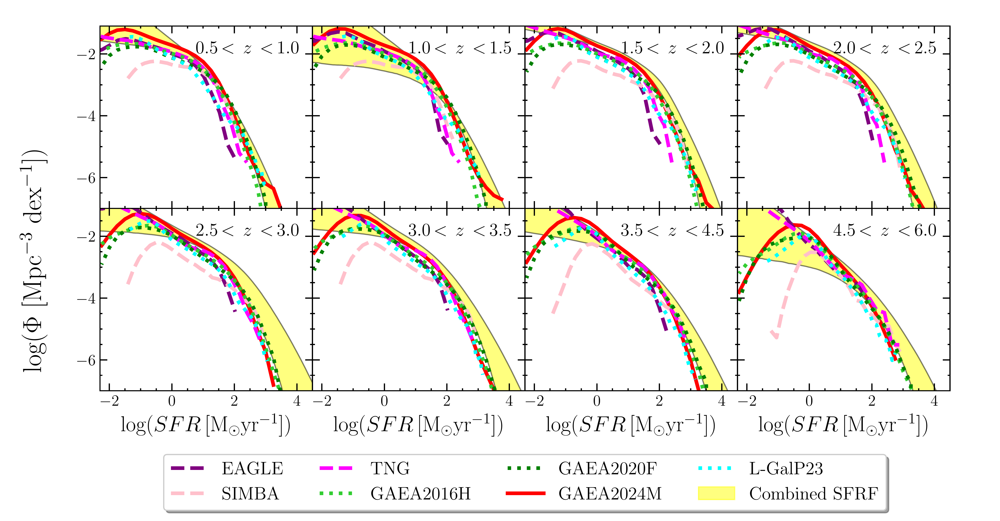

$\newcommand{\ensuremath}{}$
$\newcommand{\xspace}{}$
$\newcommand{\object}[1]{\texttt{#1}}$
$\newcommand{\farcs}{{.}''}$
$\newcommand{\farcm}{{.}'}$
$\newcommand{\arcsec}{''}$
$\newcommand{\arcmin}{'}$
$\newcommand{\ion}[2]{#1#2}$
$\newcommand{\textsc}[1]{\textrm{#1}}$
$\newcommand{\hl}[1]{\textrm{#1}}$
$\newcommand{\footnote}[1]{}$
$\newcommand{\at}[1]{{\textcolor{magenta}{\bf[AT: #1]}}}$
$\newcommand{\arraystretch}{1.5}$
$\newcommand{\arraystretch}{1.5}$
$\newcommand{\arraystretch}{1.5}$
$\newcommand{\cha}{\textit{Chandra}}$
$\newcommand{\XMM}{{XMM-\textit{Newton}}}$
$\newcommand{\NuSTAR}{\textit{NuSTAR}}$
$\newcommand{\Nu}{\textit{NuSTAR,}}$
$\newcommand{\bat}{{{\it Swift}-BAT}}$
$\newcommand\XSPEC{{\tt XSPEC}}$
$\newcommand\pexrav{{\tt pexrav}}$
$\newcommand\MYTorus{{\tt MYTorus}}$
$\newcommand\borus{{\tt borus02}}$
$\newcommand\bntorus{{\tt BNtorus}}$
$\newcommand\ngc{NGC 3081}$
$\newcommand\a{3 }$
$\newcommand\ad{A^320 }$

# The observed total star formation rate function up to $z \sim 6$: complementary UV and IR contributions and comparison with state-of-the-art galaxy formation models

<mark>Appeared on: 2025-11-19</mark> -  _14 pages, 8 figure, accepted for publication on A&A_

A. Traina, et al. -- incl., <mark>L. Xie</mark>, <mark>E. Schinnerer</mark>

**Abstract:**            We investigate how the obscured IR-derived and the dust-corrected UV star formation rate functions (SFRFs) compare with each other, and with predictions from state-of-the-art theoretical models of galaxy formation and evolution. We derive the IR-SFRF from the ALMA A$^3$COSMOS survey, by converting the IR luminosity functions (IR-LFs) into SFRF after correcting for AGN contribution. Similarly, we obtain the UV SFRFs from literature UV LFs, corrected for dust-extinction. First, we fit the two SFRFs independently via a MCMC approach, then we combine them to obtain the first estimate of the total SFRF out to $z \sim 6$. Finally, we compare this SFRF with the predictions of a set of theoretical models. We derived the UV (dust-extinction corrected, from literature UV-LFs) and IR SFRFs (from Herschel and ALMA IR-LFs) at $0.5 < z < 6$ , finding that they are mostly complementary, covering different ranges in star formation rate (SFR$ < 10-100$ M$_{\odot}$yr$^{-1}$ for the UV-corrected and SFR$ > 100$ M$_{\odot}$yr$^{-1}$ for the IR). From the comparison of the total SFRF with model predictions we find an overall good agreement at $z < 2.5$, with increasing difference at higher redshifts, with all models missing the galaxies that are forming stars with the highest SFRs. We finally obtained the UV (dust-corrected), IR and total star formation rate densities (SFRDs), finding that there are no redshift ranges where UV and IR alone are able to reproduce the whole total SFRD.         

**Figure 5. -** _ Upper panel:_ UV and IR SFRFs at different redshifts. Data points are plotted in cyan (UV) and red (IR), while the best fit is shown as blue and red curves for the UV and IR datasets, respectively. _ Lower panel:_ product between volume density ($\Phi$) and SFR in each redshift bin: this is the quantity that we integrate to obtain the SFRD. The UV (blue area) and the IR (red area) SFR density distributions are compared at different redshifts as function of the SFR. Both curves are normalize to have the peak of the UV at 1. (*fig:SFRF_points_fit*)

**Figure 4. -** Fit to the total SFRD using the functional form by madau2014sfrd. The best fit to our data is the orange dashed line,  with yellow errorbands. The fit by \citet{madau2014sfrd is reported in black. A similar fit by [Fujimoto, et. al (2024)](https://ui.adsabs.harvard.edu/abs/2024ApJS..275...36F) is represented by the blue dotted line, while the green shaded area is the combined SFRD estimated by [Burgarella, et. al (2013)](https://ui.adsabs.harvard.edu/abs/2013A&A...554A..70B). In the upper-right corner, we display the best-fit values of the free parameters of Equation \ref{eq:sfrd_fit}.} (*fig:sfrd_fitted*)

**Figure 7. -** Observed SFRF compared with the prediction from simulations and SAMs. The yellow area represents the observed data used for the fit. The best-fit curve is reported in black. The purple dashed line represents the SFRF from the EAGLE simulation; the pink dashed curve is the result from the SIMBA simulation and the magenta line is from the IllustrisTNG \citep[][]{katsianis2017eagle, katsianis2021simba. The limegreen and green dotted curves are the prediction by [Hirschmann, De Lucia and Fontanot (2016)](https://ui.adsabs.harvard.edu/abs/2016MNRAS.461.1760H) and [Fontanot, et. al (2020)](https://ui.adsabs.harvard.edu/abs/2020MNRAS.496.3943F), from the GAEA SAM. Finally, the cyan dotted curves are the predictions by [Parente, et. al (2023)](https://ui.adsabs.harvard.edu/abs/2023MNRAS.521.6105P).} (*fig:LF_sam*)

