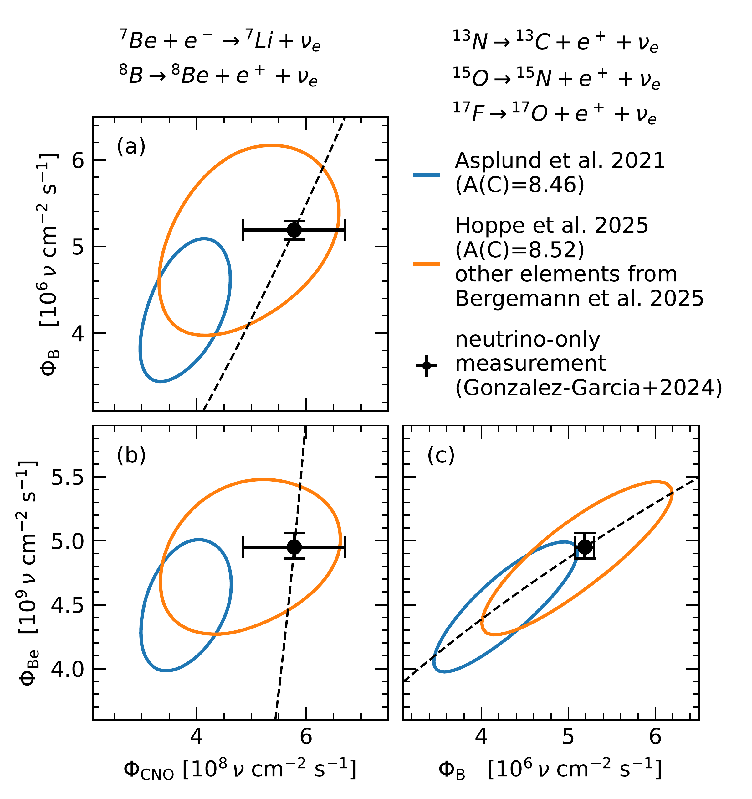
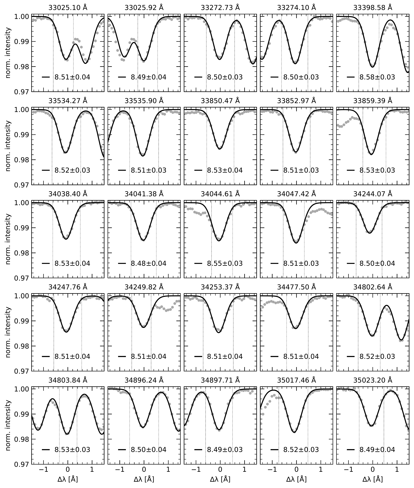

$\newcommand{\ensuremath}{}$
$\newcommand{\xspace}{}$
$\newcommand{\object}[1]{\texttt{#1}}$
$\newcommand{\farcs}{{.}''}$
$\newcommand{\farcm}{{.}'}$
$\newcommand{\arcsec}{''}$
$\newcommand{\arcmin}{'}$
$\newcommand{\ion}[2]{#1#2}$
$\newcommand{\textsc}[1]{\textrm{#1}}$
$\newcommand{\hl}[1]{\textrm{#1}}$
$\newcommand{\footnote}[1]{}$
$\newcommand{\Multi}{\texttt{MULTI}\xspace}$
$\newcommand{\MultiD}{\texttt{MULTI3D}\xspace}$
$\newcommand{\Dispatch}{\texttt{DISPATCH}\xspace}$
$\newcommand{\Must}{\texttt{M3DIS}\xspace}$
$\newcommand{\Turb}{\texttt{TURBOSPECTRUM}\xspace}$
$\newcommand{\Code}{\texttt{TUMULT}\xspace}$
$\newcommand{\Stagger}{\texttt{STAGGER}\xspace}$
$\newcommand{\Cobold}{\texttt{CO5BOLD}\xspace}$
$\newcommand{\Marcs}{\texttt{MARCS}\xspace}$
$\newcommand{\UOP}{\texttt{UOP}\xspace}$
$\newcommand{\Balder}{\texttt{BALDER}\xspace}$
$\newcommand{\Comment}[1]{{\xspace\color{Red}[#1]}\xspace}$
$\newcommand{\footnoterule}$
$\newcommand{\thebibliography}{\DeclareRobustCommand{\VAN}[3]{##3}\VANthebibliography}$

# Solar carbon abundance from 3D non-LTE modelling of the diagnostic lines of the CH molecule

<mark>Appeared on: 2025-11-19</mark> -  _Accepted by MNRAS, 22 pages_

<mark>R. Hoppe</mark>, et al. -- incl., <mark>M. Bergemann</mark>, <mark>P. Eitner</mark>

**Abstract:** _Context._ The spectral lines of the CH molecule are a key carbon (C) abundance diagnostic in FGKM-type stars. These lines are detectable in metal-rich and, in contrast to atomic C lines, also in metal-poor late-type stars.  However, only 3D LTE analyses of the CH lines have been performed so far. $\noindent$ _Aims._ We test the formation of CH lines in the solar spectrum, using for the first time, 3D Non-LTE (NLTE) models. We also aim to derive the solar photospheric abundance of C, using the diagnostic transitions in the optical ( $\SI{4218}$ - $\SI{4356}{\angstrom}$ ) and infrared ( $\SI{33025}$ - $\SI{37944}{\angstrom}$ ). $\noindent$ _Methods._ We use the updated NLTE model molecule from [Popa, et. al (2023)](https://ui.adsabs.harvard.edu/abs/2023A&A...670A..25P) and different solar 3D radiation-hydrodynamics model atmospheres. The models are contrasted against new spatially-resolved optical solar spectra, and the center-to-limb variation (CLV) of CH lines is studied. $\noindent$ _Results._ The 1D LTE and 1D NLTE models fail to describe the line CLV, and lead to underestimated solar C abundances. The 3D NLTE modelling of diagnostic lines in the optical and IR yields a carbon abundance of A(C)= $8.52\pm0.07$ dex. The estimate is in agreement with recent results based on neutrino fluxes measured by Borexino. $\noindent$ _Conclusions._ 3D NLTE modelling and tests on spatially-resolved solar data are essential to derive robust solar abundances. The analysis presented here focuses on CH, but we expect that similar effects will be present for other molecules of astrophysical interest.

**Figure 22. -** 1D LTE ($\Marcs$) and 3D NLTE ($\Must$) best-fits of optical diagnostic A-X transitions to the KPNO disk-center \protect ([Brault and Neckel 1987]())  and flux \protect ([Kurucz, et. al 1984](https://ui.adsabs.harvard.edu/abs/1984sfat.book.....K))  atlases. The legend labels show the corresponding C abundance. The vertical lines frame the windows used in the fitting-procedure. (*fig:CH_AX_KPNO*)

**Figure 17. -** Neutrino fluxes from global analysis of experimental neutrino measurements (black circles). The contours show predicted neutrino fluxes based on standard solar models with varying solar compositions. The black dashed tracks show the correlation between the fluxes and the solar core temperature. (*fig:neutrino_fluxes*)

**Figure 23. -** Spacelab-3 \texttt{ATMOS} atlas observations \protect ([Farmer and Norton 1989](https://ui.adsabs.harvard.edu/abs/1989hra2.book.....F))  and 3D NLTE ($\Must$) line profile fits of infra-red vibration-rotation lines. The legend labels show the best-fit C abundance. The associated uncertainty is dominated by the uncertainty in the continuum placement. The vertical lines frame the windows used in the fitting-procedure. (*fig:IR_fits1*)

