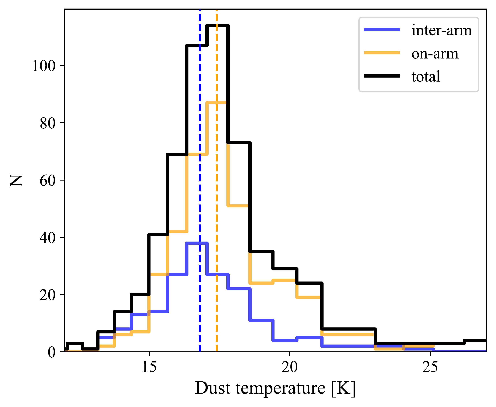
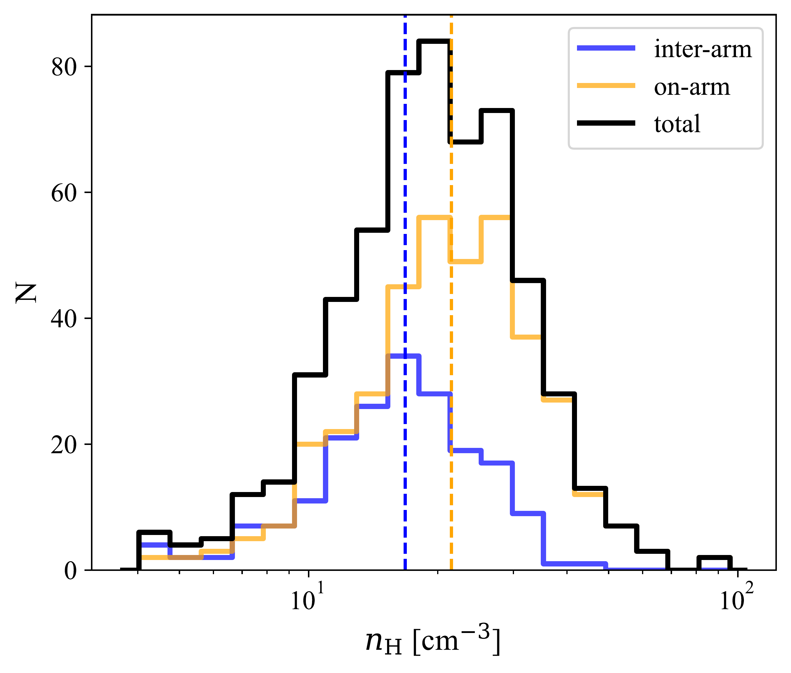
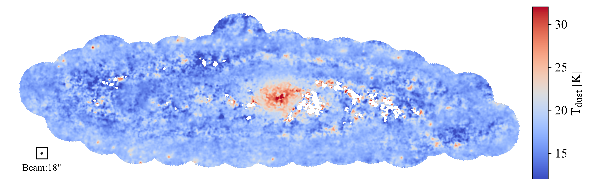

$\newcommand{\ensuremath}{}$
$\newcommand{\xspace}{}$
$\newcommand{\object}[1]{\texttt{#1}}$
$\newcommand{\farcs}{{.}''}$
$\newcommand{\farcm}{{.}'}$
$\newcommand{\arcsec}{''}$
$\newcommand{\arcmin}{'}$
$\newcommand{\ion}[2]{#1#2}$
$\newcommand{\textsc}[1]{\textrm{#1}}$
$\newcommand{\hl}[1]{\textrm{#1}}$
$\newcommand{\footnote}[1]{}$
$\newcommand{\mjypbm}{\mbox{mJy beam^{-1}}}$
$\newcommand{\bnote}[1]{{\bf\footnotesize \color{red}[HBL: #1]}}$
$\newcommand{\brevise}[1]{{\footnotesize \color{blue}[HBLrevised: #1]}}$
$\newcommand\green{#1 }$

# Deep Andromeda JCMT-SCUBA2 Observations. The Submillimeter Maps and Giant Molecular Clouds

<mark>Appeared on: 2025-11-19</mark> -  _24 pages, 14 figures. Accepted for publication in ApJS_

<mark>S. Jiao</mark>, et al. -- incl., <mark>H. Beuther</mark>, <mark>J. d. Brok</mark>, <mark>F. Xu</mark>

**Abstract:** We have carried out unprecedentedly deep, nearly confusion-limited JCMT-SCUBA2 mapping observations on the nearest spiral galaxy, M31 (Andromeda).The 850 $\mu$ m image with a $\sim$ 50 pc resolution yields a comprehensive catalog of 383 giant molecular clouds (GMCs) that are associated with the spiral arms.In addition, it unveiled a population of 189 compact inter-arm GMCs in M31, which are mostly unresolved or marginally resolved.The masses of all these GMCs are in the range of 2 $\times$ 10 $^4$ -- 6 $\times$ 10 $^6$ $M_{\odot}$ ; the sizes are in the range of 30--130 pc.They follow a mass-size correlation, $M$ $\propto$ $R_{c}^{2.5}$ .The inter-arm GMCs are systematically less massive, more diffuse, colder, and have lower star-forming efficiency (SFE) than on-arm GMCs.Moreover, within individual spatially resolved on-arm and off-arm M31 GMCs, the SFE is considerably lower than the SFE in molecular clouds in main sequence and green valley galaxies.Follow-up investigations on M31 GMCs may provide clues for how star formation may be quenched in galactic environments.Finally, we reconstrained the dust opacity spectral index $\beta$ in the M31 galaxy by combining our new JCMT observations with archival $_ Herschel_$ and $_ Planck_$ data and found that the radial variation of $\beta$ may not be as large as was proposed by previous studies.

**Figure 11. -** 
Probability distribution functions (histograms) of Mass, dust temperature, $\beta$, R$_{c}$, $\Sigma_{dust}$ and $n_{\mbox{\scriptsize H}}$ for all the clouds in the catalog (black histograms), for on-arm clouds (orange histograms), and for inter-arm clouds (blue histograms).
The blue and orange dashed lines show the median values for off-arm clouds and on-arm clouds, respectively.
The typical values for these quantities are summarized in Table \ref{tab:sum}.
 (*fig:distribution*)

**Figure 9. -** 
The distribution of dust surface density (18$"$ angular resolution), temperature (18$"$ angular resolution), and $\beta$(37$"$ angular resolution) obtained from the iterative SED fits.
The detailed procedures are described in Section \ref{section:res_t_n}.
 (*fig:sed_maps*)

**Figure 5. -** 
The background color map shows the _Herschel_ 250 $\mu$m image  ([Fritz, et. al 2012](https://ui.adsabs.harvard.edu/abs/2012A&A...546A..34F), [Smith, et. al 2012](https://ui.adsabs.harvard.edu/abs/2012ApJ...756...40S)) . The field of view of the HASHTAG survey  ([Smith, et. al 2021](https://ui.adsabs.harvard.edu/abs/2021ApJS..257...52S))  is outlined in blue dot–dashed lines, while those of the JCMT large PI project and JCMT pilot project are shown in green solid and orange dashed lines, respectively.
 (*fig:m31_obs*)

