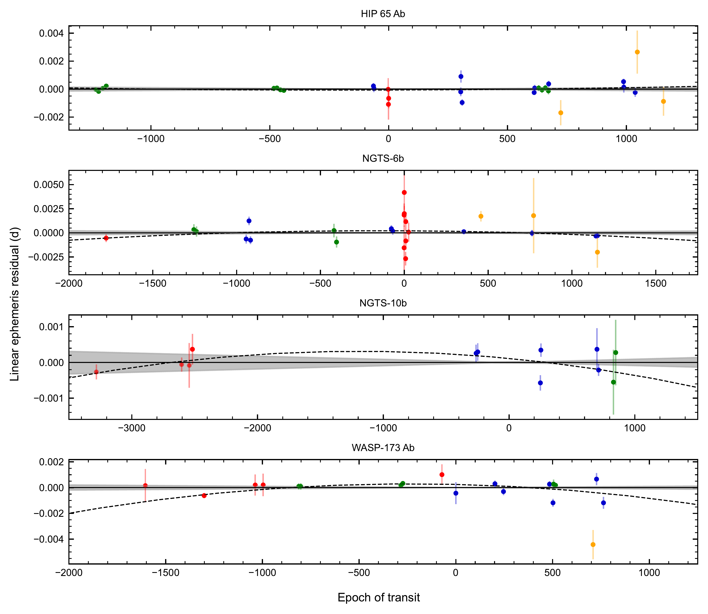
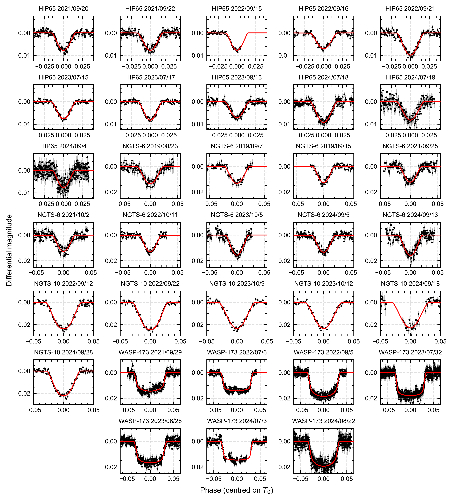

$\newcommand{\ensuremath}{}$
$\newcommand{\xspace}{}$
$\newcommand{\object}[1]{\texttt{#1}}$
$\newcommand{\farcs}{{.}''}$
$\newcommand{\farcm}{{.}'}$
$\newcommand{\arcsec}{''}$
$\newcommand{\arcmin}{'}$
$\newcommand{\ion}[2]{#1#2}$
$\newcommand{\textsc}[1]{\textrm{#1}}$
$\newcommand{\hl}[1]{\textrm{#1}}$
$\newcommand{\footnote}[1]{}$
$\newcommand{\reff}[1]{\textbf{#1}}$
$\newcommand{\thebibliography}{\DeclareRobustCommand{\VAN}[3]{##3}\VANthebibliography}$

# A search for transit timing variations in the transiting hot Jupiter systems HIP 65, NGTS-6, NGTS-10 and WASP-173

<mark>Appeared on: 2025-11-19</mark> -  _13 pages, 3 figures_

A. W. Griffiths, et al.

**Abstract:** Hot Jupiters are Jupiter-mass planets with orbital periods of less than ten days. Their short orbital separations make tidal dissipation within the stellar host especially efficient, potentially leading to a measurable evolution of the orbit. One possible manifestation of this is orbital decay, which presents itself observationally through variations in the orbital period and thus times of transit. Here we select four promising exoplanetary systems for detecting this effect: HIP 65, NGTS-6, NGTS-10 and WASP-173. We present 33 new transit light curves taken with the 1.54 m Danish Telescope, and analyse these alongside photometric data from the Transiting Exoplanet Survey Satellite and transit timing data from the literature. We construct two ephemeris models for each target: a linear ephemeris and a shrinking orbital period due to tidal decay. The linear ephemeris is preferred for all four models -- the highest significance for the quadratic ephemeris is 2 $\sigma$ for WASP-173. We compare these results to theoretical predictions for tidal dissipation of gravity waves in radiation zones, and find that wave breaking is predicted only in WASP-173, making rapid decay plausible in this system but unclear in the other three. The sensitivity of transit timings to orbital decay depends on the square of the time interval covered by available observations, so our results establish a useful baseline against which future measurements can be compared. NGTS-6 and NGTS-10 are important objects for future study as they are in the first field to be observed by the upcoming PLATO mission.

**Figure 2. -** Linear ephemeris residuals plotted against the number of cycles from the median time. The solid line at $y=0$ represents the linear model, where the shaded grey region is its 1$\sigma$ error. The dashed line represents the quadratic model in terms of the linear residuals. Blue points denote new transit times from the Danish Telescope. Green points denote TESS transits. Red points denote transit times from the literature. Orange points denote times from the ETD. (*fig resid*)

**Figure 1. -** New transit light curves for HIP 65 A, NGTS-6, NGTS-10 and WASP-173 A taken with the Danish Telescope. Data points are displayed in black with their errorbars. Fits are plotted in red. The dates of observation are displayed above each plot. (*fig:fig1*)

**Figure 3. -** Phase-folded transit light curves for HIP 65 A, NGTS-6, NGTS-10 and WASP-173 A taken from TESS. Data points are displayed in black with their errorbars. Fits are plotted in red. The TESS sectors are displayed above each plot. 1/2 refers to the first half of a sector. 2/2 refers to the second half of a sector. (*fig:tess*)

