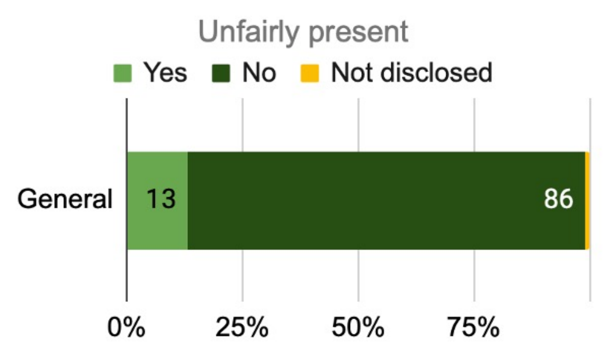
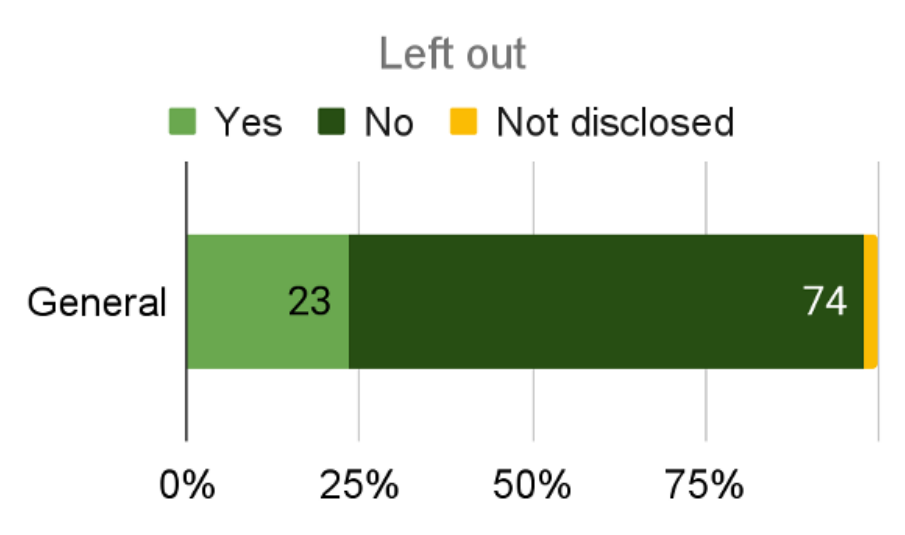
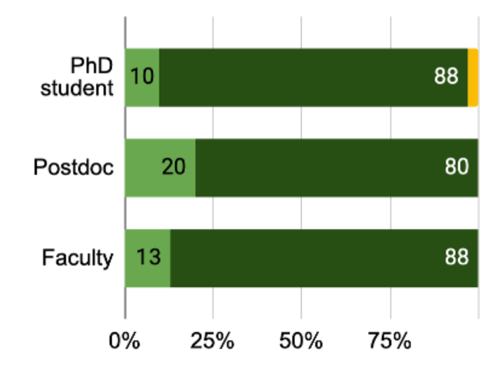
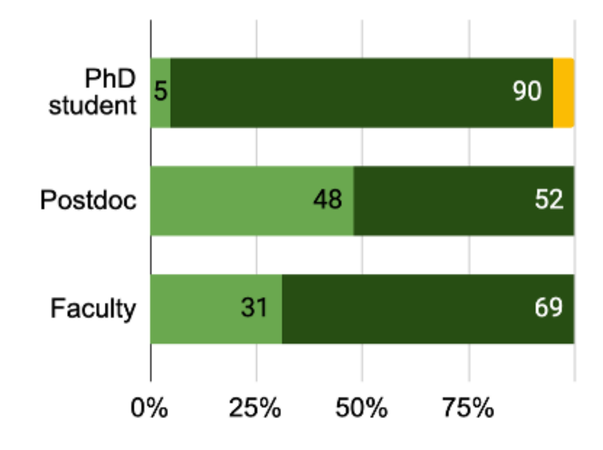
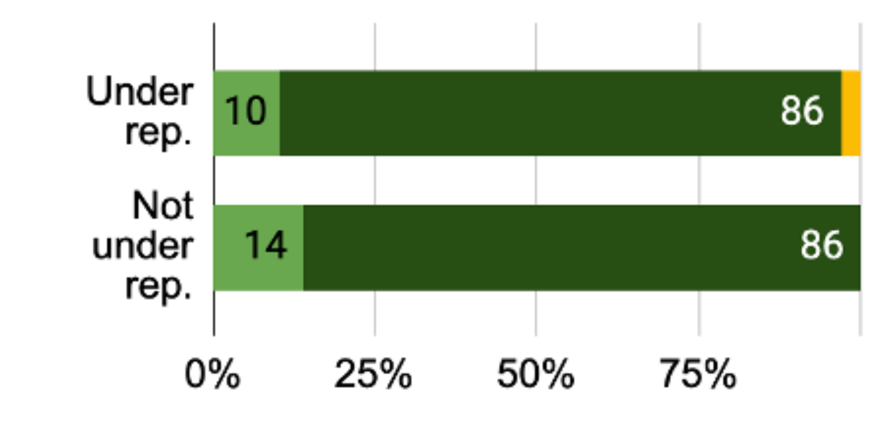
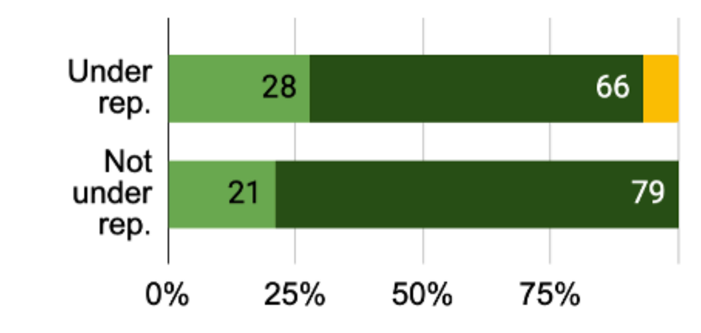
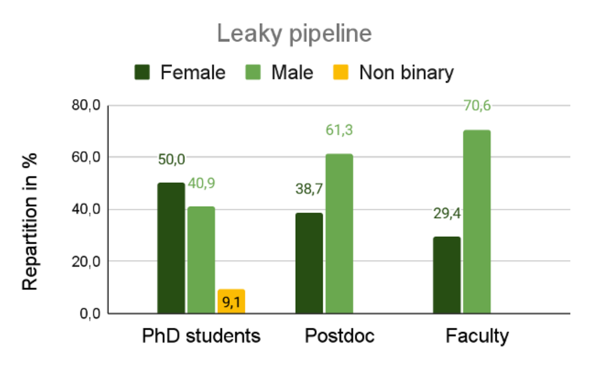

$\newcommand{\ensuremath}{}$
$\newcommand{\xspace}{}$
$\newcommand{\object}[1]{\texttt{#1}}$
$\newcommand{\farcs}{{.}''}$
$\newcommand{\farcm}{{.}'}$
$\newcommand{\arcsec}{''}$
$\newcommand{\arcmin}{'}$
$\newcommand{\ion}[2]{#1#2}$
$\newcommand{\textsc}[1]{\textrm{#1}}$
$\newcommand{\hl}[1]{\textrm{#1}}$
$\newcommand{\footnote}[1]{}$
$\newcommand{\vdag}{(v)^\dagger}$
$\newcommand$
$\newcommand$

# A socio-demographic study of the exoplanet direct imaging community 2

<mark>Appeared on: 2025-11-19</mark> -  _22 pages, 8 figures_

L. Leboulleux, et al. -- incl., <mark>E. Matthews</mark>

**Abstract:** Recognizing and addressing under-representation, exclusion, and problematic behavior, including discrimination, within astronomy and astrophysics are crucial. Therefore, in 2019, a survey was conducted at the Spirit of Lyot conference to evaluate the socio-demographics and well-being of the exoplanet and disk imaging community. In this paper, we present the results of a second survey, conducted as a followup at the 2022 Spirit of Lyot conference held in Leiden, the Netherlands. Its objective was to 1) improve the evaluation of our community, both in terms of questions of interest and diversity, and 2) monitor the evolution of the metrics since the 2019 socio-demographic study. This new survey was sent to all participants in Spirit of Lyot and received $96$ responses, equivalent to a participation rate of $44\%$ . It measured the visibility of respondents at conferences, their recognition through publications and projects, their experience of disrespect as victims or witnesses, their experience of inappropriate behaviors also as victims or witnesses, and their identification as allies of minorities in the field. These topics were studied with respect to job position, expatriation/non-expatriation, gender, belonging to another under-represented group (in terms of ethnicity, disability, or sexual orientation), and parenthood. Overall, comparing the survey respondent panel with the conference attendee information shows that survey respondents were more likely to be part of traditionally more-discriminated categories (women and non-permanent researchers, etc.). The survey also reveals biases against non-permanent researchers in terms of visibility (less invitation to Scientific Organizing Committees, less talks for PhD students). Regarding disrespect and inappropriate behaviors, the results are concerning: for instance, women and non-binary people are the most exposed to inappropriate behaviors, and are more likely to hold non-permanent positions. Considering these categories together, $36\%$ of female and non-binary PhD students (respectively $17\%$ of male PhD students) have experienced situations of inappropriate behaviors over the last $2.5$ years. There is also a clear trend between having experienced disrespect or inappropriate behavior and noticing that such a situation is happening. On a more positive note, most people ( $82\%$ ), from all categories, are willing to learn about alliance. This paper also provides recommended practices to improve the well-being and visibility of under-represented groups in astronomy.

**Figure 4. -** 
Expertise recognition through inclusion in publications and projects, since January 2020: (left) percentage of people, per category, having felt unfairly absent from a co-author list, (center) percentages of people, per category, having felt unfairly present in a co-author list, (right) percentages of people, per category, having felt left out from a publication or project. (*fig:Sec4_Fig1*)

**Figure 1. -** 
The `leaky pipeline', demonstrating the drop-out rates as a function of increasing career stage, is illustrated with data from the current survey. In addition to showing this real phenomenon in astronomy, it indicates a correlation between job position and gender in the interpretation of the outcomes of the survey later in this paper. (*fig:Sec2_Fig3*)

**Figure 2. -** 
Outcome regarding the research expertise: (left) percentages of respondents, per category, who have felt unfairly absent from a list of co-authors, (center) percentages of respondents, per category, who declare having experienced disrespect (right) percentages of respondents, per category, who declare having experienced a situation of inappropriate behavior. (*fig:Annexe*)

