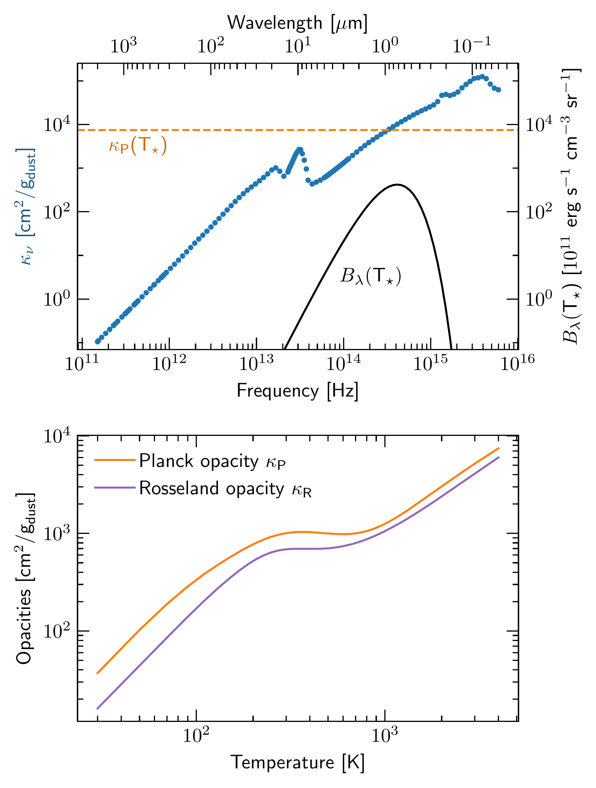

$\newcommand{\ensuremath}{}$
$\newcommand{\xspace}{}$
$\newcommand{\object}[1]{\texttt{#1}}$
$\newcommand{\farcs}{{.}''}$
$\newcommand{\farcm}{{.}'}$
$\newcommand{\arcsec}{''}$
$\newcommand{\arcmin}{'}$
$\newcommand{\ion}[2]{#1#2}$
$\newcommand{\textsc}[1]{\textrm{#1}}$
$\newcommand{\hl}[1]{\textrm{#1}}$
$\newcommand{\footnote}[1]{}$
$\newcommand{\kruti}[1]{\textcolor{ForestGreen}{#1}}$
$\newcommand{\alex}[1]{\textcolor{BurntOrange}{#1}}$
$\newcommand{\mario}[1]{\textcolor{red}{#1}}$
$\newcommand{\david}[1]{\textcolor{JungleGreen}{#1}}$
$\newcommand{\editor}[1]{#1}$
$\newcommand{\referee}[1]{#1}$
$\newcommand{\alexreplace}[2]{\alex{\st{#1}{~#2}}}$
$\newcommand{\alexnote}[1]{\alex{\textbf{#1}}}$
$\newcommand{\davidnote}[1]{\david{\textbf{#1}}}$
$\newcommand{\DP}[2]{\frac{\partial{#1}}{\partial{#2}}}$
$\newcommand{\D}[2]{\frac{\text{d}{#1}}{\text{d}{#2}}}$
$\newcommand{\Int}{\int\limits}$
$\newcommand{\rbeg}{r_\text{beg}}$
$\newcommand{\phistar}{\Phi_\star}$
$\newcommand{\Mstar}{M_\star}$
$\newcommand{\Msun}{\text{M}_{\odot}}$
$\newcommand{\Rsun}{\text{R}_{\odot}}$
$\newcommand{\Fstar}{F_\star}$
$\newcommand{\Rstar}{R_\star}$
$\newcommand{\Tstar}{T_\star}$
$\newcommand{\Lstar}{L_\star}$
$\newcommand{\Etot}{E_\text{tot}}$
$\newcommand{\Erad}{E_\text{rad}}$
$\newcommand{\Frad}{F_\text{rad}}$
$\newcommand{\bmFrad}{\bm{F}_\text{rad}}$
$\newcommand{\arad}{a_\text{R}}$
$\newcommand{\kp}{\kappa_\text{P}}$
$\newcommand{\kr}{\kappa_\text{R}}$
$\newcommand{\knu}{\kappa_\nu}$
$\newcommand{\G}{\text{G}}$
$\newcommand{\sigsb}{\sigma_\text{SB}}$
$\newcommand{\csiso}{c_\mathrm{s,iso}}$
$\newcommand{\cs}{c_\mathrm{s}}$
$\newcommand{\csadb}{c_\mathrm{s}^\mathrm{ad}}$
$\newcommand{\OmegaK}{\Omega_\mathrm{K}}$
$\newcommand{\mean}[1]{\langle{#1} \rangle}$
$\newcommand{\cv}{c_\mathrm{v}}$
$\newcommand{\Rgas}{\mathcal{R}}$
$\newcommand{\St}{\text{St}}$
$\newcommand{\edg}{\epsilon_\text{dg}}$

# Starlight-driven flared-staircase geometry in radiation hydrodynamic models of protoplanetary disks

<mark>Appeared on: 2025-11-19</mark> -  _17 pages, 16 figures, re-submitted to A&A after referee comments; abstract shortened for arXiv submission_

<mark>P. Sudarshan</mark>, et al. -- incl., <mark>M. Flock</mark>, <mark>D. M. Fuksman</mark>

**Abstract:** Protoplanetary disks observed in millimeter continuum and scattered light show a variety of substructures. While embedded planets are a common explanation, during the early planet formation phase, various physical processes in the disk could also trigger such features. One such possibility that has been previously theorized for passive disks is the the thermal wave instability or the stellar irradiation instability---the flared disk may become unstable as directly illuminated regions puff up and cast shadows behind them. This would manifest as $\referee{bright and dark rings}$ , and a staircase-like structure in the disk optical surface. We provide a realistic radiation hydrodynamic model to test the limits of the thermal wave instability in starlight-heated protoplanetary disks. We make quantitative comparisons to existing results in literature from simpler linear theory and 1D models to moment transfer methods, elucidating the importance of correct numerical treatment for this problem. We carry out global axisymmetric 2D hydrostatic and dynamic simulations including radiation transport with frequency-dependent ray-traced irradiation and flux-limited diffusion (FLD). We vary dust-to-gas ratios and surface densities. We also highlight the role of small grains and dust settling with the first radiation hydrostatic dust models to study starlight-driven shadowing. We found that starlight-driven shadows are most prominent in optically thick, slow cooling disks, shown by our models with high surface densities and dust-to-gas ratios of sub-micron grains $\edg=0.01$ . We recover that $\referee{thermal waves}$ form and propagate inwards in the hydrostatic limit. In contrast, our hydrodynamic models show $\referee{bumps and shadows}$ within $30$ au that converge to a quasi-steady state on several $\referee{radiative}$ diffusion timescales---indicating a long-lived staircase structure. $\referee{We find that existing thermal pressure bumps could produce and enhance this effect, forming secondary structure due to starlight-driven shadowing downstream.}$ Hydrostatic models with self-consistent dust settling instead show a superheated dust irradiation absorption surface with a radially smooth temperature profile $\referee{without staircases.}$ We conclude that we can recover thermally induced flared-staircase structure in radiation hydrodynamic simulations of irradiated protoplanetary disks using the flux-limited diffusion method. We find that the $\referee{shadowing effect}$ is sensitive to the dust content in the disk. We highlight the importance of modeling dust dynamics consistently to explain starlight-driven shadows.

**Figure 4. -** $\referee${Top: }Time evolution of the temperature profile at the disk midplane against the background power law. We see here that the bumps are not moving inwards chaotically, and while we lose the outer bump, the inner two stabilize at about $t = 400$ orbits. The first bump grows in amplitude, and as a result casts a steeper shadow behind, moving the second shadow further than where it started. The $\referee${dashed} lines (the first corresponds to the opacity transition) indicate the final locations of the temperature bumps. $\referee${Bottom: Time evolution of the radial temperature gradient. In shadowed regions the profile gets less steep, but overall the "bumps" are not strong enough to induce a sign flip.} (*fig:dyn-time-evol*)

**Figure 2. -** Top panel: Frequency-dependent dust absorption opacities (per gram of dust, $\text{g}_\text{dust}$) from tabulated values  ([Krieger and Wolf 2020](https://ui.adsabs.harvard.edu/abs/2020A&A...635A.148K), [Krieger and Wolf 2022](https://ui.adsabs.harvard.edu/abs/2022A&A...662A..99K)) . The blue points denote $\referee${132 frequencies logarithmically sampled in the range $\nu \in [1.5 \times 10^{11}, 6 \times 10^{15}]$ Hz} for the computation of irradiation flux in our models. The black line indicates the black-body function and the orange line is the Planck opacity for $\Tstar = 4000 $K \citep[figure similar to][]{2010Kuiper}. Bottom panel: Temperature–dependent Planck and Rosseland mean opacities used for radiation transfer. $\referee${The local maximum ($\approx$ 250 K) and the subsequent dip in the mean opacities is due to the $10 \mu$m silicate feature.} (*fig:opacfig*)

**Figure 7. -** Comparison of 1D temperature profiles of the hydrostatic models at the end of the simulation for two different radiation methods --- flux-limited diffusion (FLD, used in this work) and moment transfer \citep[M1, ][]{2022FuksmanKlahr}. Overall we see very good agreement with temperatures with FLD and M1, with the optically thin atmosphere being captured quite well. The black dotted line shows the analytical solution for the temperature profile in the optically thin atmosphere  ([Chiang and Goldreich 1997](https://ui.adsabs.harvard.edu/abs/1997ApJ...490..368C)) . The midplane temperatures are also in good agreement, with some minor deviations. The M1 method shows higher amplitude bumps than the FLD method. $\referee${We also include the RADMC-3D calculations corresponding to our FLD model, these correspond to the green lines.} (*fig:tempcomp*)

