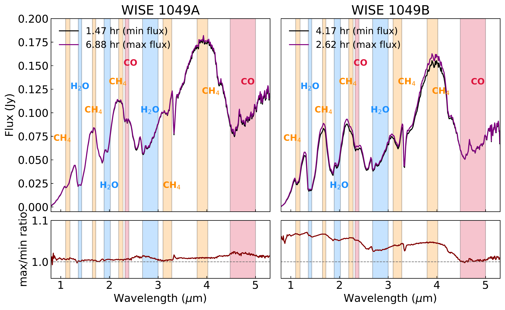

$\newcommand{\ensuremath}{}$
$\newcommand{\xspace}{}$
$\newcommand{\object}[1]{\texttt{#1}}$
$\newcommand{\farcs}{{.}''}$
$\newcommand{\farcm}{{.}'}$
$\newcommand{\arcsec}{''}$
$\newcommand{\arcmin}{'}$
$\newcommand{\ion}[2]{#1#2}$
$\newcommand{\textsc}[1]{\textrm{#1}}$
$\newcommand{\hl}[1]{\textrm{#1}}$
$\newcommand{\footnote}[1]{}$
$\newcommand{\vdag}{(v)^\dagger}$
$\newcommand$
$\newcommand$

# The JWST weather report from the nearest brown dwarfs III: Heterogeneous clouds and Thermochemical instabilities as possible drivers of WISE 1049AB’s spectroscopic variability

<mark>Appeared on: 2025-11-20</mark> -  _Accepted for publication in the Astrophysical Journal (ApJ). 25 pages, 11 figures, 3 tables_

N. Oliveros-Gomez, et al. -- incl., <mark>B. C. Estrada</mark>, <mark>T. Henning</mark>

**Abstract:** We present a new analysis of the spectroscopic variability of WISE J104915.57 $-$ 531906.1AB (WISE 1049AB, L7.5+T0.5), observed using the NIRSpec instrument onboard the James Webb Space Telescope (GO 2965 - PI: Biller).We explored the variability of the dominant molecular bands present in their 0.6--5.3 $\mu$ m spectra ($H_2$ O, $CH_4$ , CO), finding that the B component exhibits a higher maximum deviation than the A component in all the wavelength ranges tested. The light curves reveal wavelength-(atmospheric depth) and possibly chemistry-dependent variability. In particular, for the A component, the variability in the light curves at the wavelengths traced by the $CH_4$ and CO molecular absorption features is higher than that of $H_2$ O, even when both trace similar pressure levels. We concluded that clouds alone are unlikely to explain the increased variability of CO and $CH_4$ with respect to $H_2$ O, suggesting that an additional physical mechanism is needed to explain the observed variability. This mechanism is probably due to thermochemical instabilities.Finally, we provide a visual representation of the 3D atmospheric map reconstructed for both components using the molecular band contributions at different pressure levels and the fit of planetary-scale waves.

**Figure 6. -** _Upper panel:_ Median of the 21 maximum spectra (purple line) and median of the 21 minimum spectra (black line) of WISE 1049A in left panel and WISE 1049B in right panel, taken from "white light curve" (0.6 -- 5.3 $\mu$m) 7 hr NIRSpec/PRISM data. Color segments represent the range of the molecular bands selected in the spectra ($H_2$O-blue, $CH_4$-orange, CO-pink). _Lower panel:_ Max/min flux ratio of the two spectra shown in the upper panel. The horizontal dotted line represents the wavelengths where there is no variability. (*fig:spectrum_A*)

**Figure 8. -** _Left panel:_ WISE 1049A light curves for different molecular bands of $H_2$O - blue, $CH_4$ - orange, CO - pink, each with the best fit (black), next to each is the number of sinusoidal functions found as seen in the best fit. _Right panel:_ the residual fit (data minus fit). (*fig:lc-A*)

**Figure 4. -** Artistic representation of the atmospheric layers of WISE 1049A, traced by each molecular feature. Each degraded band represents one planetary wave in each layer, where contrasting the lighter and darker regions with the rotation would generate the variability. (*fig:pressure-structures_A*)

