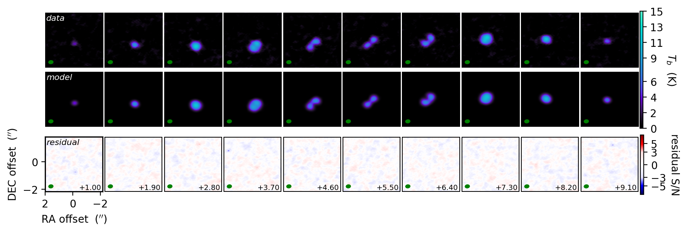
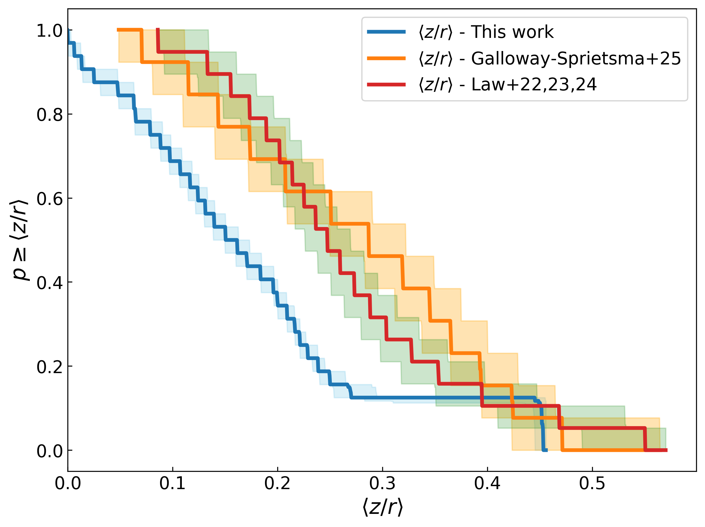

$\newcommand{\ensuremath}{}$
$\newcommand{\xspace}{}$
$\newcommand{\object}[1]{\texttt{#1}}$
$\newcommand{\farcs}{{.}''}$
$\newcommand{\farcm}{{.}'}$
$\newcommand{\arcsec}{''}$
$\newcommand{\arcmin}{'}$
$\newcommand{\ion}[2]{#1#2}$
$\newcommand{\textsc}[1]{\textrm{#1}}$
$\newcommand{\hl}[1]{\textrm{#1}}$
$\newcommand{\footnote}[1]{}$
$\newcommand{\gr}[1]{\textbf{GR: \color{cyan} #1}}$
$\newcommand{\thetable}{A.\arabic{table}}$
$\newcommand{\thefigure}{B.\arabic{figure}}$

# The $^{12}$CO Gas Structures of Protoplanetary Disks in the Upper Scorpius Region  

<mark>Appeared on: 2025-11-24</mark> -  _Accepted for publication in A&A. 20 pages, 7 tables, 21 figures_

L. Zallio, et al. -- incl., <mark>F. Zagaria</mark>

**Abstract:** We present measurements of key protoplanetary disk properties inferred from parametric models of ALMA $^{12}$ CO spectral line visibilities. We derive gas-disk radii, integrated fluxes, optically thick emission layers, and brightness temperature profiles for the disk population of the old ( $4 - 14$ Myr) Upper Scorpius star-forming region. We measure CO emission sizes for 37 disks with bright CO $J=3-2$ emission (S/N > 10 on the integrated flux; out of the 83 disks with CO detections), finding that the median radius containing 90 \% of the flux is $\sim84$ au, with radii spanning from $23$ up to $243$ au.We report a correlation between the $^{12}$ CO brightness temperatures and stellar luminosities, with a Pearson coefficient of 0.6, and we use it to prove that the $^{12}$ CO optically thick emission layer primarily emanates from a region below the super-heated dust, which is optically thin to the stellar irradiation. Moreover, we derive 33 CO emission surface height profiles, finding a median aspect ratio $\langle z/r \rangle \sim 0.16$ in a range from $\sim0.01$ up to $\sim0.45$ over the sample. Finally, we comment on the multiple systems in our sample, of which only some were already known.These results re-affirm how it is possible to derive bulk disk properties by modeling moderate angular resolution ALMA visibilities.

**Figure 5. -** The correlation between the $^{12}$CO brightness temperature at a distance of 10 au from the central star and stellar luminosity. The values of $T_{b,10}$ and $\log_{10}\bigl(\text{L}_*\bigr)$ were taken from Tables \ref{Table:Fits_A}, \ref{Table:Fits_B} and Empey et al., in prep., respectively. The values of $\text{T}_{b,10}$ were converted from cylindrical coordinates to spherical coordinates using the vertical height profile values reported in Table \ref{Table:Fits_A}. The values of F$_{\text{cont}}$ were taken from \cite{Carpenter2025}. (*fig:Tb_L*_corr*)

**Figure 18. -** Residual plot for J16213469-2612269. In the first row, we show the channel maps of the data; in the second row, we show the channel maps of the best-fit model; in the third row we show the channel maps of the residuals (data - model). The residual plots for all the disks analyzed in this work can be found in Appendix \ref{appendix:residuals}, and on \texttt{GitHub}\protect\hyperref[footnote:github]{\textsuperscript{\ref*{footnote:github}}}. (*fig:residuals_example*)

**Figure 4. -** Kaplan-Meier estimator of the radially averaged $^{12}$CO $ \langle z/r \rangle $ values for our sample (in blue), compared with those of \cite{Galloway2025}(in orange), and the combined works of \cite{Law_2022, Law_2023, Law_2024}(in red). (*fig:z_over_r_histo*)

