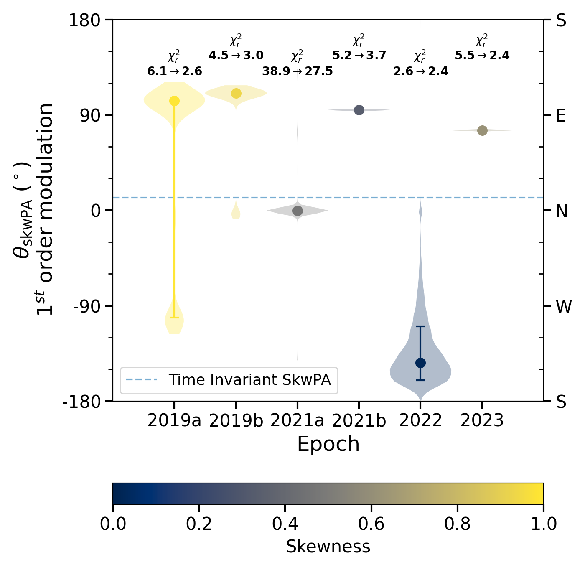
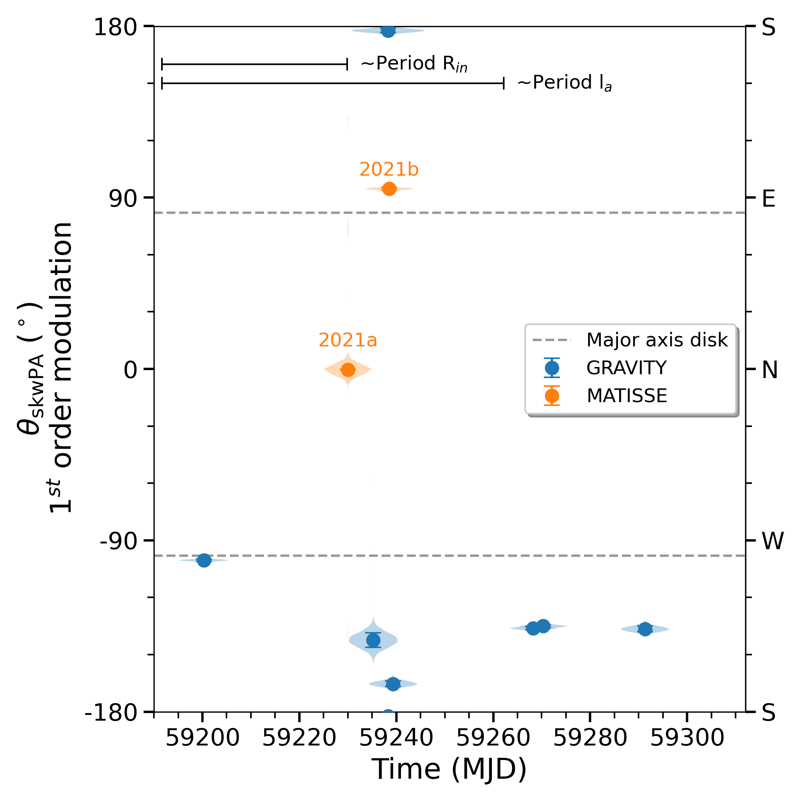

$\newcommand{\ensuremath}{}$
$\newcommand{\xspace}{}$
$\newcommand{\object}[1]{\texttt{#1}}$
$\newcommand{\farcs}{{.}''}$
$\newcommand{\farcm}{{.}'}$
$\newcommand{\arcsec}{''}$
$\newcommand{\arcmin}{'}$
$\newcommand{\ion}[2]{#1#2}$
$\newcommand{\textsc}[1]{\textrm{#1}}$
$\newcommand{\hl}[1]{\textrm{#1}}$
$\newcommand{\footnote}[1]{}$
$\newcommand{\cmark}{\checkmark}$
$\newcommand{\xmark}{--}$
$\newcommand{\arraystretch}{1.1}$
$\newcommand{\arraystretch}{1.1}$
$\newcommand{\arraystretch}{1.4}$
$\newcommand{\arraystretch}{1.4}$
$\newcommand\hyper{@linkstart##1##2 $
$}$
$\newcommand\hyper{@linkstart##1##2 $
$}$
$\newcommand\hyper{@linkstart##1##2 $
$}$
$\newcommand\hyper{@linkstart##1##2 $
$}$

# The complex inner disk of the $\mbox{Herbig Ae}$ star HD 100453 with VLTI/MATISSE

<mark>Appeared on: 2025-11-25</mark> -  _17 pages, 12 figures, accepted for publication in Astronomy & Astrophysics_

L. N. A. v. Haastere, et al. -- incl., <mark>M. Scheuck</mark>, <mark>R. v. Boekel</mark>, <mark>P. Boley</mark>, <mark>T. Henning</mark>

**Abstract:** The inner regions of planet-forming disks hold invaluable insights for our understanding of planet formation. Of particular interest are inner disk regions that may be influenced by already formed planets. The disk around the Herbig star HD 100453 presents one such environment, with an inner disk that is significantly misaligned with respect to the outer disk. This paper expands the existing H-band (PIONIER) and K-band (GRAVITY) interferometric studies of the HD 100453 inner disk to the L-band with the MATISSE VLTI instrument. With snapshot data spanning approximately four years we aim for a more comprehensive understanding of the inner disk structures and their potential time evolution. Based on the MATISSE data obtained, we use a combination of analytical models and image reconstruction to constrain the disk structure. Additionally, we fit a temperature gradient model to the selected wavelength range of PIONIER, GRAVITY and MATISSE to derive physical properties of the inner regions. Our parametric model finds an inclination of $\sim 47.5^\circ$ and a position angle of $\sim 83.6^\circ$ , which corroborates the case of strong inner-outer disk misalignment. From the symmetric temperature gradient we derive an inner disk radius around $\sim0.27$ au, with dust surface densities of $\Sigma_{\rm{subl}} \approx 10^{-3.2}$ g/cm $^2$ and vertical optical depth $\tau_{\rm{z, subl}} \approx 0.1-0.06 $ .   Same-night MATISSE and GRAVITY observations show directional discrepancies not consistent with a first-order azimuthally modulation ring, indicating the necessity for higher-order asymmetries to explain the interferometric signals. This interpretation is further supported by a MATISSE snapshot image reconstruction, which reveals a two-component asymmetric structure. The chromatic interferometric data reveal the likely need for higher-order asymmetries to explain the inner disk of HD 100453, suggesting a possible origin in dynamic interactions or disk instabilities. Coordinated multi-wavelength infrared interferometric observations with GRAVITY and MATISSE will be crucial to confirm these findings and uncover its underlying nature.

**Figure 5. -** Calibrated squared visibilities and closure phases from all the selected MATISSE observations.
            (*Fig:overview_data_all*)

**Figure 2. -** Violin-plot showcasing the time-variable MCMC fitting results of the asymmetry angle ($\theta_{\rm{skwPA}}$) for six epochs of MATISSE data, where the other disk parameters are fixed to the best-fit model-two asymmetric disk parameters from Table \ref{tab:model_fit_onlymatisse}. The horizontal dashed line shows the best fitted value for the asymmetry angle for the time-invariant dataset. Above each violin the change in the respective $\chi^2_r$ is shown compared to the time-invariant value. The error bars indicate the best fit value with 16/84\% percentile intervals.
            (*Fig:Time_Variability*)

**Figure 3. -**  Similar to Fig. \ref{Fig:Time_Variability}, we show the MCMC results for the asymmetry angle of the first-order skewed ring model using MATISSE data from the 2021ab epoch (orange), alongside re-reduced GRAVITY data (blue) obtained close in time. The horizontal dashed lines indicate the averaged H-, K- and L-band estimate for the direction of semi-major axis of the inner dust ring. In the top-left we indicate the approximate Keplerian period, based on the stellar parameters, the best-fit temperature gradient inner radius $R_{in}$ and  parametric half-light radius $l_a$.
            (*Fig:SKWPA_Time_Gravity_fit*)

