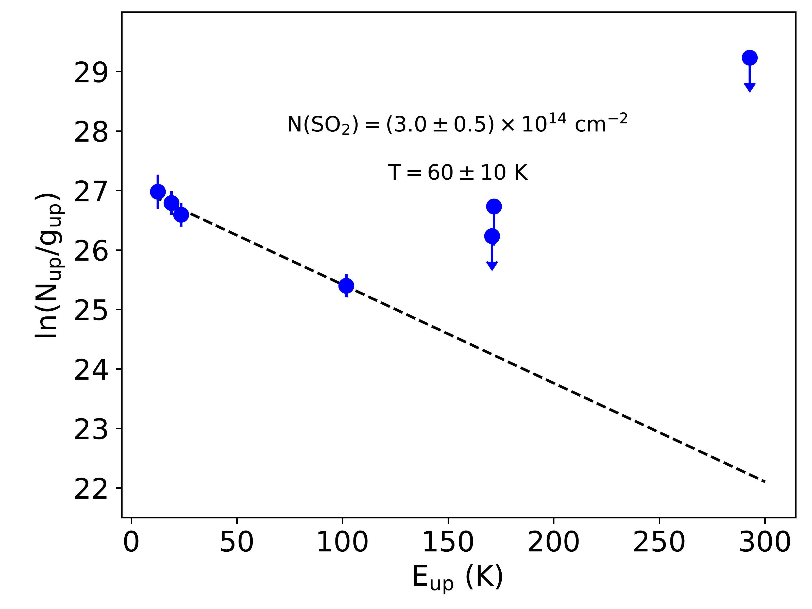
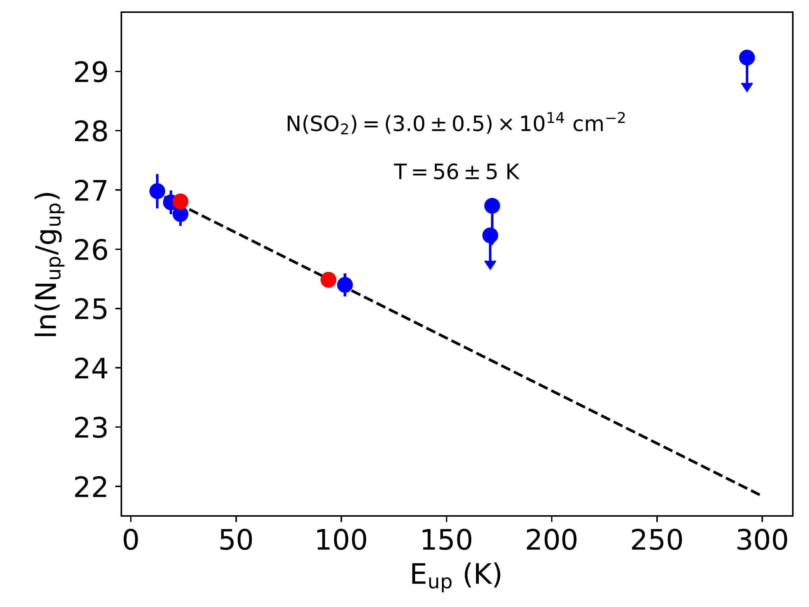
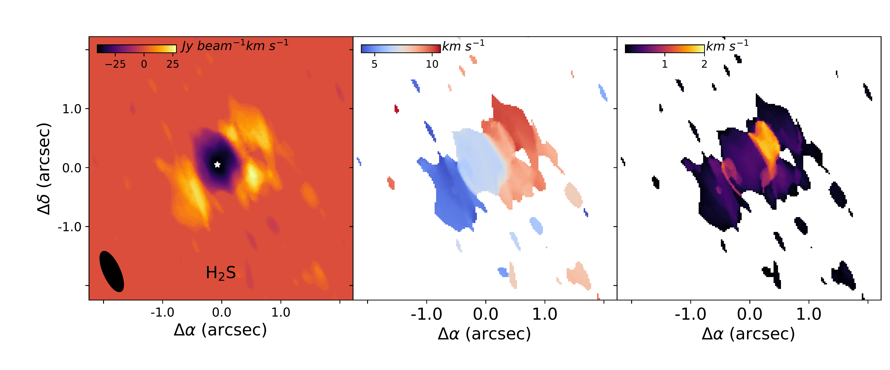
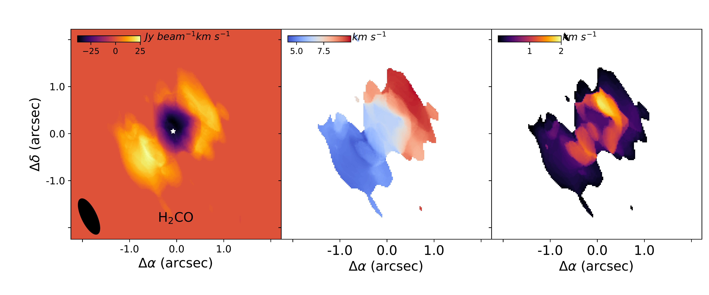
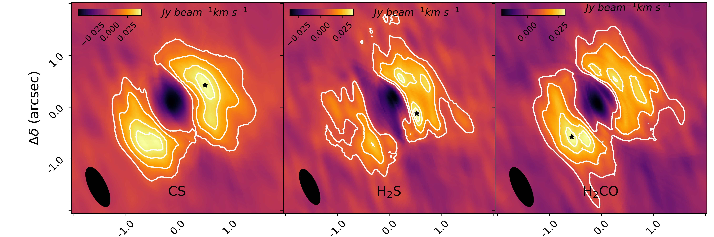

$\newcommand{\ensuremath}{}$
$\newcommand{\xspace}{}$
$\newcommand{\object}[1]{\texttt{#1}}$
$\newcommand{\farcs}{{.}''}$
$\newcommand{\farcm}{{.}'}$
$\newcommand{\arcsec}{''}$
$\newcommand{\arcmin}{'}$
$\newcommand{\ion}[2]{#1#2}$
$\newcommand{\textsc}[1]{\textrm{#1}}$
$\newcommand{\hl}[1]{\textrm{#1}}$
$\newcommand{\footnote}[1]{}$

# Observations of sulfuretted species in HL Tau

<mark>Appeared on: 2025-11-25</mark> - 

P. Rivière-Marichalar, et al. -- incl., <mark>D. Semenov</mark>

**Abstract:** Protoplanetary disks inherit their chemical composition from their natal molecular cloud, although the extent to which this material is preserved versus reset through chemical reprocessing remains an open question. Understanding this balance is a major topic in astrochemistry and star and planet formation. Comparing the chemical composition of the envelope and the protoplanetary disk is key to solving the topic. However, disentangling protoplanetary disk emission from envelope emission is not an easy task. The goal of this paper is to investigate the chemical differences between the disk and the surrounding envelope by comparing the column density ratios of a few selected species in each region. The source we focus on is HL Tau, where molecular absorption lines from the envelope have been detected, thus allowing for the derivation of column densities and molecular abundances. We present new NOEMA observations of HL Tau targeting the following species: CS, H $\rm _2$ CO,  H $\rm _2$ S, and SO $\rm _2$ . We produced zeroth-, first-, and second-moment maps for the species where emission was detected and used them to analyze the spatial distribution and kinematic properties of the different molecules in the disk and the envelope. We derived the column densities and compared the values derived for the envelope and disk. We also computed the rotational diagram for the SO $\rm _2$ detected transitions. Assuming two different temperature regimes, 17 and 58 K, we derived column densities for the species surveyed in the disk and compared them with values derived for the envelope. We find large differences in the derived column density ratios of the surveyed molecules, especially for N(CS)/N(H $\rm _2$ S), which is 40 to 50 times larger in the envelope. We attribute these variations to the different excitation and UV-irradiation regimes in the disk and envelope. We also note strong gradients in the ratios between different positions of the disk and tentatively attribute them to different levels of turbulence at different azimuths. The observed differences in molecular ratios in the envelope and the disk are suggestive of chemical reprocessing of the gas during the formation and evolution of the protoplanetary disk.

**Figure 5. -** Rotational diagram of SO$\rm _2$ transitions detected with NOEMA. The top panel shows the rotational diagram for the transitions reported in this paper alone, while the bottom panel also includes the detections by [Garufi, et. al (2022)](https://ui.adsabs.harvard.edu/abs/2022A&A...658A.104G) in red.  (*Fig:SO2_rot_diag*)

**Figure 9. -** From left to right: Continuum-subtracted zeroth-, first-, and second-moment map of CS 3-2 (top), H$\rm _2$S   1$\rm _{10}$-1$\rm _{01}$(middle), and H$\rm _2$CO $\rm 5_6-4_5$(bottom) observed with NOEMA. Before the moment calculation, a four-sigma clipping mask was applied to the data cubes. The cubes were smoothed by a factor of three before computing the moment maps. Only channels in the range 3 to 11 km s$\rm ^{-1}$ and with a S/N larger than four have been used. (*Fig:moments*)

**Figure 10. -** From left to right: Integrated intensity maps of CS 3-2 (left), H$\rm _2$S 1$\rm _{10}$-1$\rm _{01}$(middle), and H$\rm _2$CO $\rm 5_6-4_5$(right) after a Keplerian mask has been applied. The black star in each map marks the position of the emission peak of the map. (*Fig:moments_KeplerMask*)

