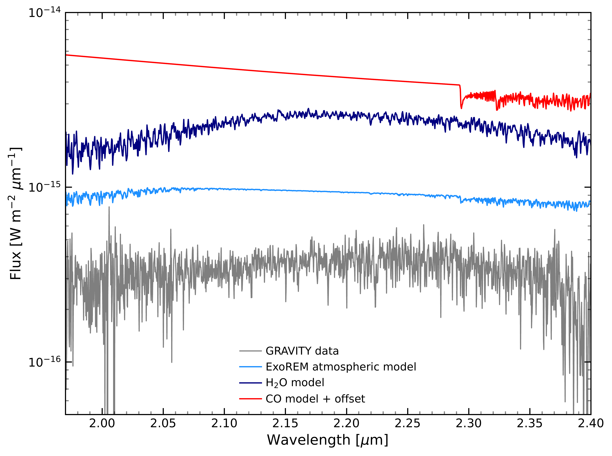
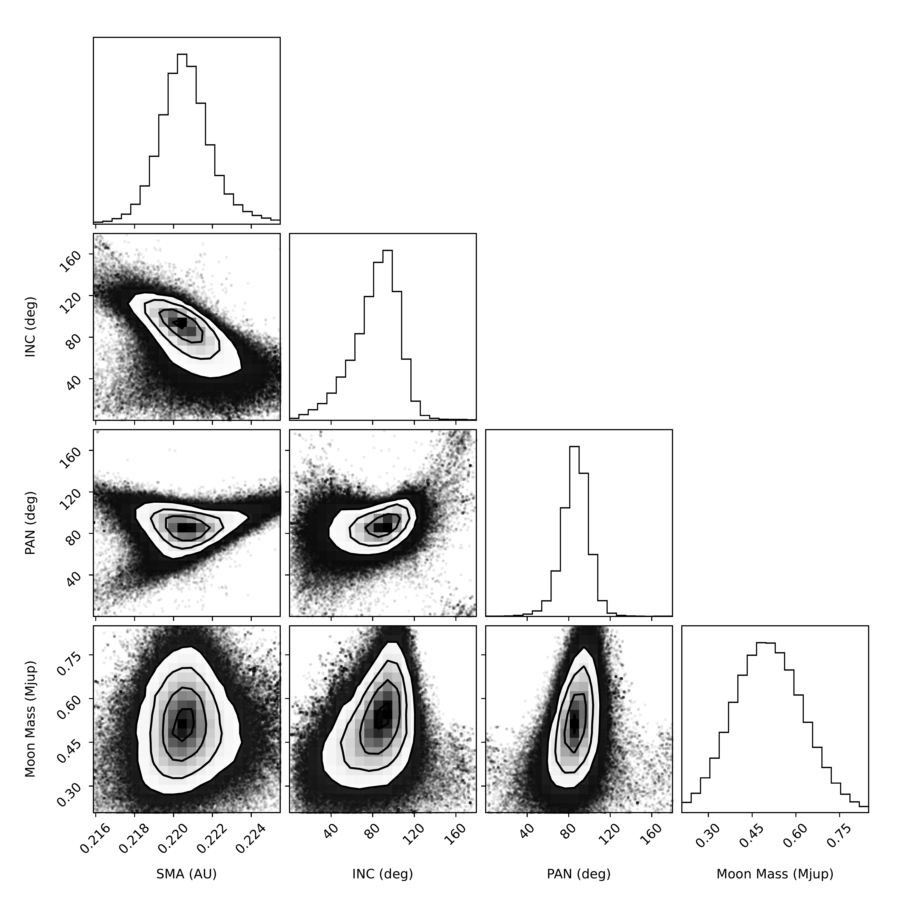

$\newcommand{\ensuremath}{}$
$\newcommand{\xspace}{}$
$\newcommand{\object}[1]{\texttt{#1}}$
$\newcommand{\farcs}{{.}''}$
$\newcommand{\farcm}{{.}'}$
$\newcommand{\arcsec}{''}$
$\newcommand{\arcmin}{'}$
$\newcommand{\ion}[2]{#1#2}$
$\newcommand{\textsc}[1]{\textrm{#1}}$
$\newcommand{\hl}[1]{\textrm{#1}}$
$\newcommand{\footnote}[1]{}$
$\newcommand{\x}{\ensuremath{\mathbf{x}}}$
$\newcommand{\Rm}{\ensuremath{R_m}}$
$\newcommand{\Rr}{\ensuremath{R_c^\text{rad}}}$
$\newcommand{\Rt}{\ensuremath{R_c^\text{turb}}}$
$\newcommand{\pp}{\ensuremath{\mathbf{p}}}$
$\newcommand{\B}{\ensuremath{\mathbf{B}}}$
$\newcommand{\kk}{\ensuremath{\mathbf{k}}}$
$\newcommand{\ii}{\ensuremath{\text{i}}}$
$\newcommand{\w}{\ensuremath{\mathbf{w}}}$
$\newcommand{\ex}{\ensuremath{\mathbf{e}_{x}}}$
$\newcommand{\ey}{\ensuremath{\mathbf{e}_{y}}}$
$\newcommand{\ez}{\ensuremath{\mathbf{e}_{z}}}$
$\newcommand{\ephi}{\ensuremath{\mathbf{e}_{\phi}}}$
$\newcommand{\er}{\ensuremath{\mathbf{e}_{r}}}$
$\newcommand{\irchi}[2]{\raisebox{\depth}{#1\chi}}$
$\newcommand{\Re}{\ensuremath{R_e}}$
$\newcommand{\v}{\ensuremath{\mathbf{v}}}$
$\newcommand{\u}{\ensuremath{\mathbf{u}}}$
$\newcommand{\d}{\ensuremath{\partial}}$
$\newcommand\cesamxx{Cesam2k20\xspace}$
$\newcommand\eos{EoS\xspace}$
$\newcommand\erg{\mbox{erg}}$
$\newcommand\lunit{~\erg \mbox{s}^{-1} \mbox{cm}^{-2}}$
$\newcommand\K{\mbox{K}}$

# Exomoon search with VLTI/GRAVITY around the substellar companion HD 206893 B

<mark>Appeared on: 2025-11-26</mark> -  _accepted for publication in A&A_

Q. Kral, et al. -- incl., <mark>M. Benisty</mark>, <mark>W. Brandner</mark>, <mark>G. Chauvin</mark>, <mark>P. Garcia</mark>, <mark>T. Henning</mark>, <mark>L. Kreidberg</mark>, <mark>P. Mollière</mark>

**Abstract:** Direct astrometric detection of exomoons remains unexplored. This study presents the first application of high-precision astrometry to search for exomoons around substellar companions. We investigate whether the orbital motion of the companion HD 206893 B exhibits astrometric residuals consistent with the gravitational influence of an exomoon or binary planet. Using the VLTI/GRAVITY instrument, we monitored the astrometric positions of HD 206893 B and c across both short (days to months) and long (yearly) timescales. This enabled us to isolate potential residual wobbles in the motion of component B attributable to an orbiting moon. Our analysis reveals tentative astrometric residuals in the HD 206893 B orbit. If interpreted as an exomoon signature, these residuals correspond to a candidate (HD 206893 B I) with an orbital period of approximately 0.76 years and a mass of $\sim$ 0.4 Jupiter masses. However, the origin of these residuals remains ambiguous and could be due to systematics. Complementing the astrometry, our analysis of GRAVITY $R=4000$ spectroscopy for HD 206893 B confirms a clear detection of water, but no CO is found using cross-correlation. We also find that AF Lep b, and $\beta$ Pic b are the best short-term candidates to look for moons with GRAVITY+. Our observations demonstrate the transformativepotential of high-precision astrometry in the search for exomoons, and proves the feasibility of the technique to detect moons with masses lower than Jupiter and potentially down to less than Neptune in optimistic cases. Crucially, further high-precision astrometric observations with VLTI/GRAVITY are essential to verify the reality and nature of this signal and attempt this technique on a variety of planetary systems.

**Figure 7. -**  Residuals of HD 206893 B orbit after removing the average motion due to HD 206893 B orbiting the star and accounting for the motion induced by the planet c. In the top two plots, the data are phase-folded by a period of 275 days, using MJD 58500 as the starting point. 50 random draws with SMA between 0.21 and 0.26 AU are plotted in cyan for the RA and orange for the Dec Vs time plots, respectively. These model draws have the average motion of HD 206893 B removed, so they show both perturbation from the exomoon model and the residuals in the orbit of B from the average orbit of B.  In the bottom plots, the data are plotted as a function of MJD and not phase-folded. The orbits are colored by orbital phase, where blue is an orbital phase of 0 and green is an orbital phase of 1. Note that the orbital periods vary between each model drawn and are slightly different from an exact 275-day orbital period. (*figresidualsmoon*)

**Figure 9. -**  Comparison between the GRAVITY combined spectrum (gray) and the ExoREM synthetic spectrum for $T=1400$ K (light blue). Each species spectrum is shown with an offset with different colours – dark blue for water, pink for sodium, and red for CO. (*figmodel*)

**Figure 12. -** Fit of the astrometric data of HD 206893 B, looking for an exomoon when we limited the prior to be between 0.21 and 0.26 au. The MCMC analysis finds a tentative exomoon candidate of mass around 0.5 Jupiter masses. (*figmcmcmoonfixed*)

