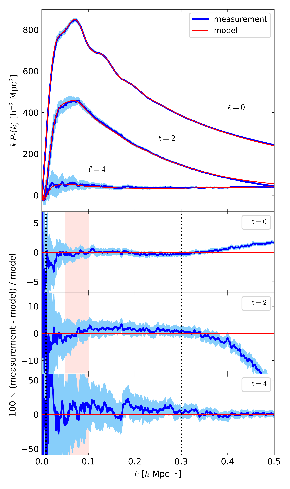
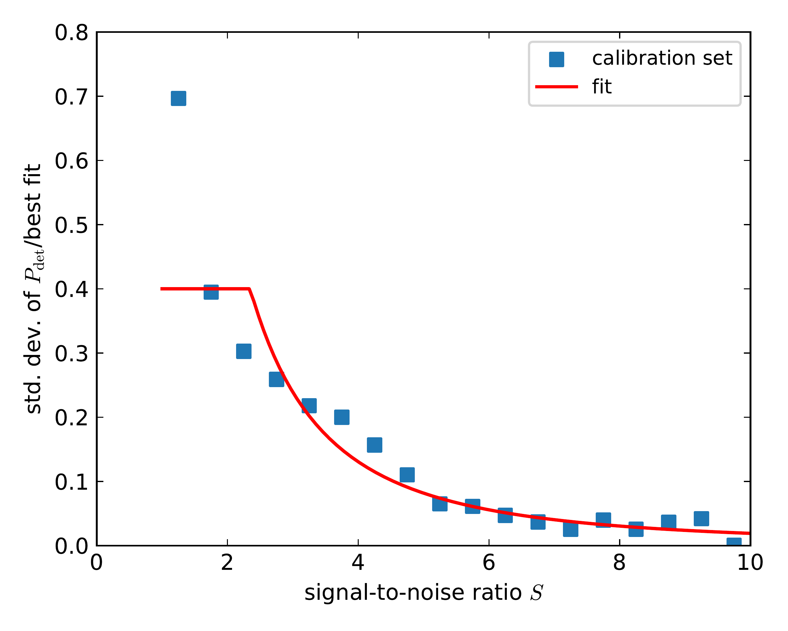

$\newcommand{\ensuremath}{}$
$\newcommand{\xspace}{}$
$\newcommand{\object}[1]{\texttt{#1}}$
$\newcommand{\farcs}{{.}''}$
$\newcommand{\farcm}{{.}'}$
$\newcommand{\arcsec}{''}$
$\newcommand{\arcmin}{'}$
$\newcommand{\ion}[2]{#1#2}$
$\newcommand{\textsc}[1]{\textrm{#1}}$
$\newcommand{\hl}[1]{\textrm{#1}}$
$\newcommand{\footnote}[1]{}$
$\newcommand{\pigi}[1]{\textcolor{orange}{ [Pigi: #1]}}$
$\newcommand{\MYK}[1]{\textcolor{magenta}{ [#1]}}$
$\newcommand{\vx}{\ensuremath{\vec{x}}\xspace}$
$\newcommand{\vk}{\ensuremath{\vec{k}}\xspace}$
$\newcommand{\mc}[1]{\ensuremath{\mathcal{#1}}\xspace}$
$\newcommand{\nh}{\ensuremath{\hat{\vec n}}\xspace}$
$\newcommand{\dd}{\ensuremath{\mathrm{d}}\xspace}$
$\newcommand{\hmpc}{\ensuremath{h^{-1} \text{Mpc}}\xspace}$
$\newcommand{\mpc}{\ensuremath{\text{Mpc}}\xspace}$
$\newcommand{\kmpc}{\ensuremath{h \text{Mpc}^{-1}}\xspace}$
$\newcommand{\dens}{\ensuremath{h^{3} \mathrm{Mpc}^{-3}}\xspace}$
$\newcommand{\cgpc}{\ensuremath{h^{-3} \mathrm{Gpc}^3}\xspace}$
$\newcommand{\hgpc}{\ensuremath{h^{-1} \text{Gpc}}\xspace}$
$\newcommand{\Comp}{\ensuremath{{\cal{C}}}\xspace}$
$\newcommand{\Compa}{\ensuremath{\hat{\cal C}}\xspace}$
$\newcommand{\flux}{erg s^{-1} cm^{-2}\xspace}$
$\newcommand{\pypelid}{\texttt{pypelid}\xspace}$
$\newcommand{\pinocchio}{\texttt{pinocchio}\xspace}$
$\newcommand{\healpix}{\texttt{healpix}\xspace}$
$\newcommand{\tdeg}{30◦ee\xspace}$
$\newcommand{\epixs}{e pix^{-1} s^{-1}\xspace}$
$\newcommand{\sqdeg}{deg^2\xspace}$
$\newcommand{\oiii}{[\ion{O}{III}]\xspace}$
$\newcommand{\oiiib}{[\ion{O}{III}]b\xspace}$
$\newcommand{\siii}{[\ion{S}{III}]\xspace}$
$\newcommand{\oii}{[\ion{O}{II}]\xspace}$
$\newcommand{\sii}{[\ion{S}{II}]\xspace}$
$\newcommand{\nii}{[\ion{N}{II}]\xspace}$
$\newcommand{\citepype}{Euclid Collaboration: Granett et al. (in prep.)\xspace}$
$\newcommand{\citeppype}{(Euclid Collaboration: Granett et al., in prep.)\xspace}$
$\newcommand{\citepk}{Euclid Collaboration: Salvalaggio et al. (in prep.)\xspace}$
$\newcommand{\citeppk}{(Euclid Collaboration: Salvalaggio et al., in prep.)\xspace}$
$\newcommand{\citelee}{Euclid Collaboration: Lee et al. (in prep.)\xspace}$
$\newcommand{\citeplee}{(Euclid Collaboration: Lee et al., in prep.)\xspace}$
$\newcommand{\citebruton}{Euclid Collaboration: Bruton et al. (in prep.)\xspace}$
$\newcommand{\citepbruton}{(Euclid Collaboration: Bruton et al., in prep.)\xspace}$
$\newcommand{\citepassa}{Euclid Collaboration: Passalacqua et al. (in prep.)\xspace}$
$\newcommand{\citeppassa}{(Euclid Collaboration: Passalacqua et al., in prep.)\xspace}$
$\newcommand{\citeapassa}{Euclid Collaboration: Passalacqua et al., in prep.\xspace}$
$\newcommand{\orcid}[1]$
$\newcommand{\linenumbers}[0]$
$\newcommand{\micron}{\mum\xspace}$
$\newcommand{\arraystretch}{1.12}$

# $\Euclid$ preparation: Controlling angular systematics in the ${\Euclid}$ spectroscopic galaxy sample

<mark>Appeared on: 2025-11-28</mark> -  _submitted to A&A; 34 pages, 18 figures, 4 appendices_

E. Collaboration, et al. -- incl., <mark>Y. Wang</mark>, <mark>K. Jahnke</mark>

**Abstract:** We present the strategy to identify and mitigate potential sources of angular  systematics in the _Euclid_ spectroscopic galaxy survey, and we quantify their  impact on galaxy clustering measurements and cosmological parameter estimation. We first  survey the _Euclid_ processing pipeline to identify all evident, potential  sources of systematics, and classify them into two broad classes: angular systematics,  which modulate the galaxy number density across the sky, and catastrophic redshift  errors, which lead to interlopers in the galaxy sample. We then use simulated  spectroscopic surveys to test our ability to mitigate angular systematics by  constructing a random catalogue that represents the visibility mask of the survey; this  is a dense set of intrinsically unclustered objects, subject to the same selection  effects as the data catalogue. The construction of this random catalogue relies on a  detection model, which gives the probability of reliably measuring the galaxy redshift  as a function of the signal-to-noise ratio (S/N) of its emission lines. We demonstrate  that, in the ideal case of a perfect knowledge of the visibility mask, the galaxy power  spectrum in the presence of systematics is recovered, to within sub-percent accuracy, by  convolving a theory power spectrum with a window function obtained from the random  catalogue itself. In the case of only approximate knowledge of the visibility mask, we  test the stability of power spectrum measurements and cosmological parameter posteriors  by using perturbed versions of the random catalogue. We find that significant effects  are limited to very large scales, and parameter estimation remains robust, with the most  impacting effects being connected to the calibration of the detection model.

**Figure 3. -**  Upper panel: power spectra even multipoles ($\ell=0$, 2,
    4) of target galaxies in the $z\in[1.1,1.3]$ redshift bin, averaged over 50
    realisations, with shuffled fluxes to remove luminosity-dependent bias. Blue lines
    give the target measurement, while the lighter blue shaded areas give the error on an
    average of five measurements, covering an area similar to the final EWS. The red line
    gives the best fit model, convolved with the 30$^\circ$ cone window function. Lower
    panels give, for the three multipoles, the relative difference with respect to the
    model fit to the master mocks, convolved with the relative window. The pink shaded
    area highlights the region of the first BAO, while the dotted vertical lines mark the
    range of scales used for the fit. (*fig:pkmodel*)

**Figure 10. -** _Left:_ detection probability $P_{\rm det}(S)$, that is the probability
    of detecting a galaxy in the spectroscopic sample as a function of the S/N of its
    {\ha} line. The points give the measurements from the calibration set used to fix the
    parameters of the detection model. The five curves correspond to the best-fit
    detection model, together with those obtained by varying the two fitting parameters by
    1 $\sigma$(see the legend for the assumed parameter values). _Right:_ the
    standard deviation of the ratio of the measurements from the calibration set and the
    best fit model. (*fig:detmodel*)

**Figure 16. -** Monopole, quadrupole and hexadecapole of the galaxy power spectrum in the case
    of realistic mitigation, for MW extinction on the left, calibration error in the
    middle, and error on the detection model on the right. The lighter blue shaded areas
    give the variance of the target measurement, rescaled to the average of five
    catalogues. Here the $x$-axis scale is logarithmic. The residual panels report the
    ratio of the measurements with respect to the target one, all in per-cent. (*fig:pk_realistic*)

