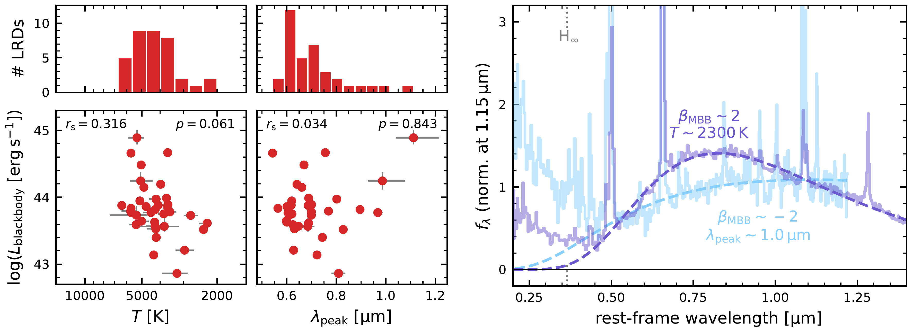
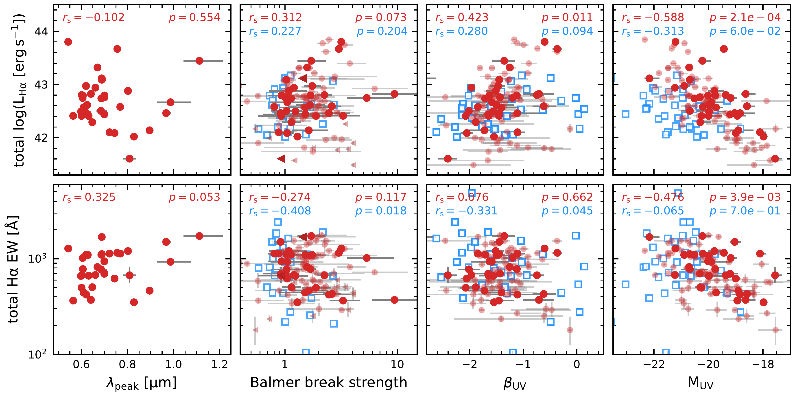
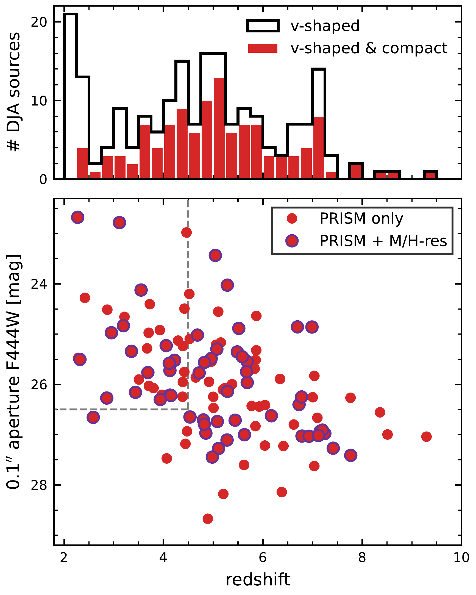

$\newcommand{\ensuremath}{}$
$\newcommand{\xspace}{}$
$\newcommand{\object}[1]{\texttt{#1}}$
$\newcommand{\farcs}{{.}''}$
$\newcommand{\farcm}{{.}'}$
$\newcommand{\arcsec}{''}$
$\newcommand{\arcmin}{'}$
$\newcommand{\ion}[2]{#1#2}$
$\newcommand{\textsc}[1]{\textrm{#1}}$
$\newcommand{\hl}[1]{\textrm{#1}}$
$\newcommand{\footnote}[1]{}$
$\newcommand{\ergs}{\rm erg s^{-1}}$
$\newcommand{\Oi}{O {\sc i}\xspace}$
$\newcommand{\Oii}{[O {\sc ii}]\xspace}$
$\newcommand{\Oiii}{[O {\sc iii}]\xspace}$
$\newcommand{\Hei}{He {\sc i}\xspace}$
$\newcommand{\Hi}{H {\sc i}\xspace}$
$\newcommand{\Hii}{H {\sc ii}\xspace}$
$\newcommand{\Nii}{[N {\sc ii}]\xspace}$
$\newcommand{\Neiii}{[Ne {\sc iii}]\xspace}$
$\newcommand{\Caii}{Ca {\sc ii}\xspace}$
$\newcommand{\Hb}{{\rm H}\beta\xspace}$
$\newcommand$
$\newcommand{\Msun}{\rm M_\odot}$
$\newcommand{\kpc}{ \rm kpc}$
$\newcommand{\kms}{ \rm km s^{-1}}$
$\newcommand{\re}{r_{\rm e,maj}}$
$\newcommand{\rec}{r_{\rm e}}$
$\newcommand{\fdm}{f_{\rm DM}}$
$\newcommand{\fbar}{f_{\rm baryon}}$
$\newcommand{\Mgas}{M_{\rm gas}}$
$\newcommand{\Mdm}{M_{\rm DM}}$
$\newcommand{\Mbar}{M_{\rm baryon}}$
$\newcommand{\Mdyn}{M_{\rmdyn}}$
$\newcommand{\Mbh}{M_{\rm BH}}$
$\newcommand{\reff}{r_{\rm e}}$
$\newcommand{\Ha}{H\alpha\xspace}$
$\newcommand{\Pad}{Pa-\delta\xspace}$
$\newcommand{\Pag}{Pa-\gamma\xspace}$
$\newcommand{\Pab}{Pa-\beta\xspace}$
$\newcommand{\Paa}{Pa-\alpha\xspace}$
$\newcommand{\AG}[1]{{\bf \color{blue}{#1} }}$
$\newcommand{\ruby}{\textit{The Cliff}\xspace}$
$\newcommand{\zspec}{z_{\rm spec}}$
$\newcommand{\zphot}{z_{\rm phot}}$
$\newcommand{\lpeak}{\lambda_{\rm peak}}$
$\newcommand{\Teff}{T_{\rm eff}}$
$\newcommand{\betaBB}{\beta_{\rm MBB}}$
$\newcommand{\buv}{\beta_{\rm UV}}$
$\newcommand{\bopt}{\beta_{\rm opt}}$
$\newcommand{\Muv}{M_{\rm UV}}$
$\newcommand{\Lopt}{L_{5100}}$
$\newcommand{\pix}{\rm pix}$
$\newcommand{\prospector}{\texttt{Prospector}\xspace}$
$\newcommand{\pysersic}{\texttt{pysersic}\xspace}$
$\newcommand{\Av}{A_{\rm V}}$
$\newcommand{\cloudy}{\texttt{Cloudy}\xspace}$
$\newcommand{\mombh}{MoM-BH*-1\xspace}$
$\newcommand$
$\newcommand{\thebibliography}{\DeclareRobustCommand{\VAN}[3]{##3}\VANthebibliography}$

# Little Red Dots host Black Hole Stars: A unified family of gas-reddened AGN revealed by JWST/NIRSpec spectroscopy

<mark>Appeared on: 2025-12-01</mark> -  _22 pages, 18 figures, submitted to MNRAS. LRD sample and measurements are publicly available at this https URL_

<mark>A. d. Graaff</mark>, et al. -- incl., <mark>H.-W. Rix</mark>, <mark>F. Walter</mark>

**Abstract:** We use the DAWN JWST Archive to construct and characterise a sample of 116 little red dots (LRDs) across $\mbox{2.3<z<9.3}$ , selecting all sources with v-shaped UV-optical continua from NIRSpec/PRISM spectra and compact morphologies in NIRCam/F444W imaging. We show that LRD continuum spectra are ubiquitously well described by modified blackbodies across $\sim0.4-1.0 \micron$ , with typical $T\sim5000 $ K or $\lpeak\sim0.65 \micron$ across 2 dex in luminosity, and a tail toward $T\sim2000 $ K. LRDs therefore trace a locus in the Hertzsprung-Russell diagram that is directly analogous to stars on the Hayashi track, strongly supporting the picture that LRDs are AGN embedded in thermalised dense gas envelopes in approximate hydrostatic equilibrium. Hotter LRDs with $\lpeak<0.65 \micron$ typically have strong Balmer breaks, redder UV slopes and high optical luminosities ( $L_{5100}$ ); other LRDs show weak or no Balmer breaks at all, and wide variety in $\buv$ and $L_{5100}$ . Crucially, we demonstrate that the UV-optical continuum shapes and luminosities are strongly linked to the $\Ha$ , $\Hb$ , $\Oiii$ and $\Oi$ line properties. There is a tight linear relation between the $\Ha$ and optical continuum luminosities, as well as $\Ha$ and $\textrm{\Oi}_{\lambda8446}$ , indicating that Balmer, $\Oi$ and optical emission must primarily be powered by the same source. The Balmer decrement increases strongly toward higher $L_{\rm H\alpha}$ , $L_{5100}$ and Balmer break strength, providing key evidence for luminosity-dependent effects of collisional (de-)excitation and resonant scattering in the gaseous envelopes. In contrast, we show that $\Oiii$ emission likely originates from star-forming host galaxies, and that its strong correlation with Balmer break strength arises naturally from variation in the AGN-to-host ratio. Our work presents an empirical description of the nature and structure of LRDs, defining a new benchmark for ongoing LRD model developments.

**Figure 12. -** HR diagram of LRDs at $z<4.5$ for the modified blackbody temperature (left) and peak wavelength (middle). LRDs span a wide range in luminosity, with a lower luminosity limit that may be part physical and part driven by the imposed magnitude limit and depth of the PRISM spectra. The rest-optical continua of LRDs typically peak at a wavelength of $\sim 0.65 \micron$, corresponding to a temperature of $\sim 5000 $K for a perfect blackbody ($\beta=0$), although some systems are as cold as $\sim2000 $K. The right panel shows examples of extremes in the HR diagram: a remarkably cold source ($T\sim2300 $K, $\betaBB\sim2$, $\lpeak\sim0.83 \mu$m; UNCOVER-20698), and a source that peaks in the near-IR ($\lpeak\sim1.05 \mu$m, $\betaBB\sim-2$; CAPERS-COSMOS-30440).  (*fig:HR*)

**Figure 14. -** $\Ha$ line properties as a function of the optical continuum shape parameters ($\lpeak$, Balmer break) and UV continuum properties ($\buv$, $\Muv$). Large (small) circles show the $z<4.5$(full) LRD sample, and blue squares the RUBIES broad line sources of [Hviding, et. al (2025)](https://ui.adsabs.harvard.edu/abs/2025arXiv250605459H) that are not LRDs. Spearman correlation coefficients and p-values are shown in each panel for the LRD sample. The $\Ha$ emission is independent of the rest-optical continuum shape, but is correlated with the rest UV, as LRDs with the reddest UV slopes are most luminous in $\Ha$. The UV luminosities of LRDs correlate with both the $\Ha$ luminosities and EWs, and suggests that a substantial fraction of the UV can be attributed to emission from AGN.   (*fig:LHa_corr*)

**Figure 1. -** Top: Redshift distribution of all PRISM spectra selected from the public DJA that satisfy the spectroscopic v-shape criteria of [Hviding, et. al (2025)](https://ui.adsabs.harvard.edu/abs/2025arXiv250605459H)(black). The sample of v-shaped objects contains both LRDs and a large number of dust-reddened star-forming galaxies at cosmic noon. We define LRDs (116 unique sources; red) as the subset of sources satisfying strict compactness criteria in NIRCam/F444W imaging. Bottom: NIRCam/F444W magnitudes measured in circular apertures of radius $0.1$\arcsec$$(half the MSA slit width) of all LRDs as a function of redshift. Of these sources, $47\%$(55/116) also have medium or high resolution spectra from NIRSpec. Dashed lines indicate the subsample used for the modified blackbody fitting of Section $\re$f{sec:MBB}. (*fig:redshifts*)

