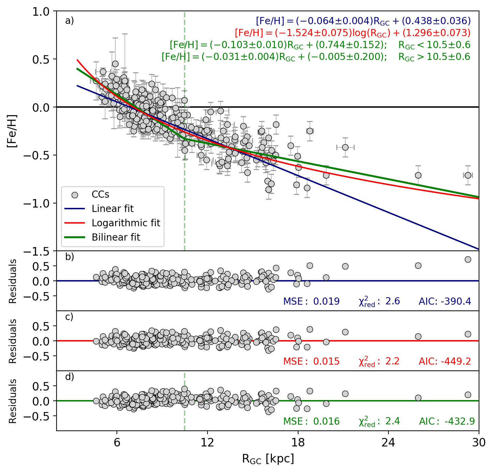
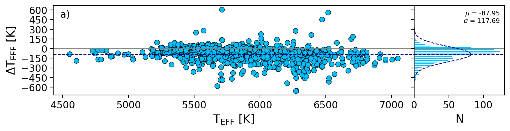
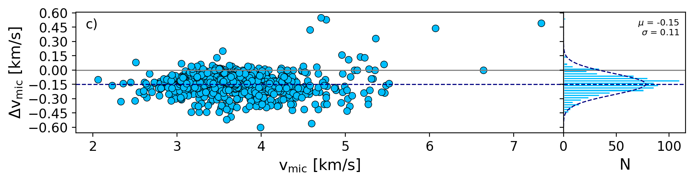
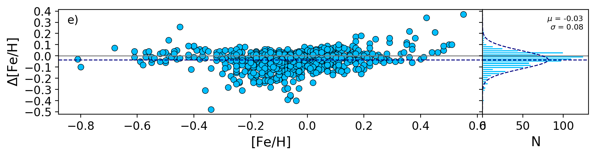
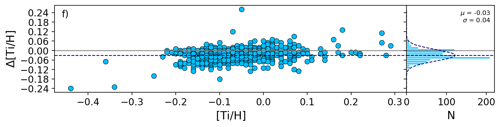
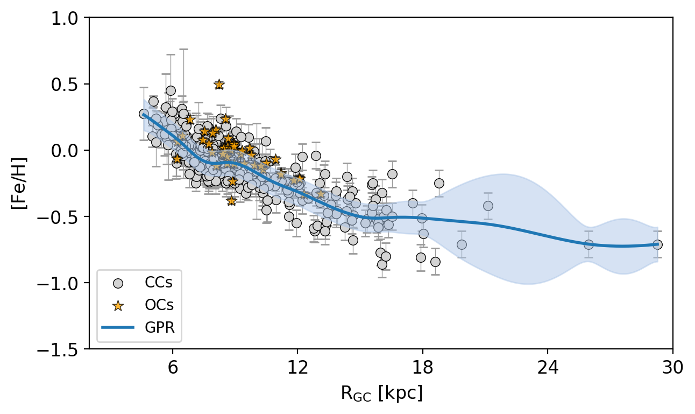

$\newcommand{\ensuremath}{}$
$\newcommand{\xspace}{}$
$\newcommand{\object}[1]{\texttt{#1}}$
$\newcommand{\farcs}{{.}''}$
$\newcommand{\farcm}{{.}'}$
$\newcommand{\arcsec}{''}$
$\newcommand{\arcmin}{'}$
$\newcommand{\ion}[2]{#1#2}$
$\newcommand{\textsc}[1]{\textrm{#1}}$
$\newcommand{\hl}[1]{\textrm{#1}}$
$\newcommand{\footnote}[1]{}$

# Classical Cepheids in the Galactic thin disk.   : I. Abundance gradients through NLTE spectral analysis

<mark>Appeared on: 2025-12-01</mark> -  _Manuscript submitted to A&A. Abstract shortened. Comments are welcome_

A. Nunnari, et al. -- incl., <mark>M. Bergemann</mark>

**Abstract:** Classical Cepheids (CCs) have long been considered excellent tracers of the chemical evolution of the Milky Way's young disk. We present a homogeneous, Non-Local Thermodynamical Equilibrium (NLTE) spectroscopic analysis of 401 Galactic CCs, based on 1,351 high-resolution optical spectra, spanning Galactocentric distances from 4.6 to 29.3 kpc. Using PySME with MARCS atmospheres and state-of-the-art grids of NLTE departure coefficients, we derive atmospheric parameters and abundances for key species tracing multiple nucleosynthetic channels (O, Na, Mg, Al, Si, S, Ca, Ti, Mn, Fe, Cu). Our sample--the largest CC NLTE dataset to date-- achieves high internal precision and enables robust modeling of present-day thin-disk abundance patterns and radial gradients.  We estimate abundance gradients using three analytic prescriptions (linear, logarithmic, bilinear with a break) within a Bayesian, outlier-robust framework, and we also apply Gaussian Process Regression to capture non-parametric variations. We find that NLTE atmospheric parameters differ systematically from LTE determinations. Moreover, iron and most elemental abundance profiles are better described by non-linear behavior rather than by single-slope linear models: logarithmic fits generally outperform simple linear models, while bilinear fits yield inconsistent break radii across elements.  Gaussian Process models reveal a consistent outer-disk flattening of [ X/H ] for nearly all studied elements. The [ X/Fe ] ratios are largely flat with Galactocentric radius, indicating coherent chemical scaling with iron across the thin disk, with modest positive offsets for Na and Al and mild declines for Mn and Cu.  Finally, Cepheid kinematics confirm thin-disk orbits for the great majority of the sample. Comparison with recent literature shows overall agreement but highlights NLTE-driven differences, especially in outer-disk abundances. These results provide tighter empirical constraints for chemo-dynamical models of the Milky Way and set the stage for future NLTE mapping with upcoming large spectroscopic surveys.

**Figure 5. -** \small{Panel a) -- Iron radial gradient for classical Cepheids as a function of the
      Galactocentric distance. The linear, the logarithmic and the bilinear fits are shown respectively
      in blue, red and green. The vertical green dashed line shows the "knee" of the bilinear fit.
      The coefficients of the fits are labelled.
      Panel b) -- residuals of the linear fit. The values of the mean square error, the reduced chi-squared
      and the AIC score are labelled.
      Panel c) -- Same as panel b), but for the logarithmic fit.
      Panel d) -- Same as panel b), but for the bilinear fit.} (*iron*)

**Figure 2. -** Comparison of atmospheric parameters derived under NLTE and LTE assumptions. Each panel displays the difference (NLTE – LTE) as a function of the corresponding parameter on the left, and the distribution of the difference on the right. A blue-dotted Gaussian fit is overplotted on each histogram, the mean and standard deviation are labelled in the top-right corner. The blue-dashed horizontal line shows the mean difference, while the gray solid line the null difference. (*lte_plots*)

**Figure 8. -** In gray iron abundances of CCs as a function of $\mathrm{R_{GC}$. The orange symbols display open clusters younger than 400 Myr from \citealt{otto25}. GPR applied to the CCs distribution is highlighted in blue, while the shaded region highlights the uncertainties on the model.} (*gpr*)

