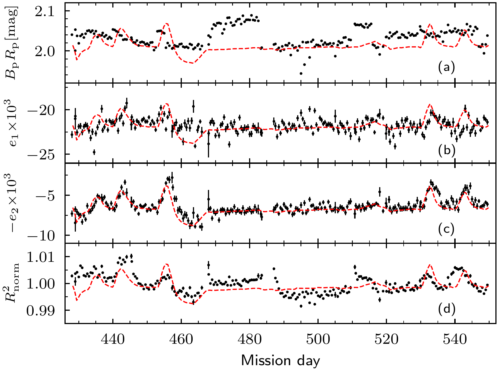
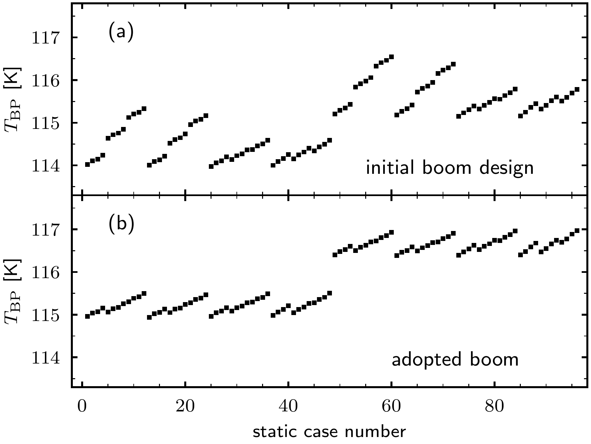

$\newcommand{\ensuremath}{}$
$\newcommand{\xspace}{}$
$\newcommand{\object}[1]{\texttt{#1}}$
$\newcommand{\farcs}{{.}''}$
$\newcommand{\farcm}{{.}'}$
$\newcommand{\arcsec}{''}$
$\newcommand{\arcmin}{'}$
$\newcommand{\ion}[2]{#1#2}$
$\newcommand{\textsc}[1]{\textrm{#1}}$
$\newcommand{\hl}[1]{\textrm{#1}}$
$\newcommand{\footnote}[1]{}$
$\newcommand{\orcid}[1]{\orcidlink{#1}}$

# $\Euclid$: Structural-Thermal-Optical Performance

<mark>Appeared on: 2025-12-02</mark> -  _21 pages, 15 figures, submitted to A&A_

E. Collaboration, et al. -- incl., <mark>K. Jahnke</mark>

**Abstract:** The $\Euclid$ system performance is defined in terms of image quality metrics tuned to the weak gravitational lensing cosmological probe. The weak lensing measurement induces stringent requirements on the shape and stability of the VIS instrument system $\ac{PSF}$ . The $\ac{PSF}$ is affected by error contributions from the telescope, the focal plane and image motion, and is controlled by a global error budget with error allocations to each contributor. During spacecraft development, we verified through a structural-thermal-optical performance (STOP) analysis that the built and verified telescope with its spacecraft interface meets the in-orbit steady-state and transient image quality requirements, under temperature-induced loads, in all permitted spacecraft attitudes after all permitted attitude transitions. In the first year in orbit, we compared the expected with the actual performance. For the purposes of the STOP analysis, a detailed finite-element mathematical model was set up and a standard set of test cases, both steady-state and transient, was defined, comprising combinations of worst-case boundary conditions. Iterations of the analysis were performed in conjunction with the major reviews of the spacecraft verification cycle. After launch, the model is used in sensitivity analyses using realistic boundary conditions. The STOP analysis addressed the interaction of all spacecraft components in transmitting temperature-induced loads that lead to optical train deformation. The results of the prelaunch analysis demonstrated that temperature-induced optical perturbations will be well below the allowable limits for all permitted observing conditions. During the first year in orbit, we used the STOP analysis predictions to help interpret the measured performance as a function of environmental variables. Unpredicted disturbances were discovered (heat pulses from instrument operation propagating into the telescope) and unexpected sensitivities were revealed (high dependence of $T_{\rm BP}$ on $\ac{SAA}$ , nearly absent dependence on $\ac{AA}$ after the attitude domain was redefined for straylight avoidance). In-orbit temperature variations are small (<300 mK) and so are their effects on the telescope structure (displacements < 1 $\mu$ m, rotations < 1 $\mu$ rad), but they are detected in the time histories of the image quality metrics and are a non-negligible factor in the $\ac{PSF}$ stability budget demanded by the weak lensing science ( $\Delta e < 2{\times}10^{-3}$ over 11 000 s). Taking everything into account, our analysis confirms the excellent overall performance of the telescope.

**Figure 14. -** Time histories of spacecraft attitude and key thermal performance parameters obtained from spacecraft telemetry during the \Euclid performance verification phase in the period from 2023-10-01 00:00:00 UTC until 2023-11-26 00:00:00 UTC. ** Upper panel:** the variations in SAA and AA. Dedicated rotations of the SAA (red line) and AA (blue line) were performed to verify the thermal response of the system. ** Upper middle panel:** the history of the cadence (in cycles per hour) of the NISP grism and filter wheel (GFW, red line), and the VIS shutter (RSU, blue line). ** Lower middle panel:** the history of the VIS radiator temperature registered by sensor THM02 (blue line), which is an indicator of the VIS instrument activity by means of its power dissipation. ** Lower panel:** the temperature responses of a baseplate sensor placed near the VIS bracket (THM05, red line) and a sensor mounted directly on the VIS \ac{FPA} bracket (THM01, blue line). (*fig:temp-history-2023*)

**Figure 9. -** Similar as \cref{fig:IQ_history_2023} but for the \ac{IQ} metrics observed in the period shown in \cref{fig:temp-history-2024}, covering 4 months of nominal mission, from 2024-09-01 (mission day 428) until 2024-12-31 (mission day 549). (*fig:IQ_history_2024*)

**Figure 3. -** Baseplate average temperature versus STOP case number, see \cref{subsub:steady-state-thermal} for the sequencing description. ** Upper panel (a):** full-length \ac{MPS} boom, the topside can be illuminated by the Sun. ** Lower panel (b):** half-length \ac{MPS} boom, the topside cannot be illuminated by the Sun. (*FigTBplot*)

