

$\newcommand{\ensuremath}{}$
$\newcommand{\xspace}{}$
$\newcommand{\object}[1]{\texttt{#1}}$
$\newcommand{\farcs}{{.}''}$
$\newcommand{\farcm}{{.}'}$
$\newcommand{\arcsec}{''}$
$\newcommand{\arcmin}{'}$
$\newcommand{\ion}[2]{#1#2}$
$\newcommand{\textsc}[1]{\textrm{#1}}$
$\newcommand{\hl}[1]{\textrm{#1}}$
$\newcommand{\footnote}[1]{}$
$\newcommand{\orcid}[1]$
$\newcommand{\arraystretch}{1.3}$

# $\Euclid$: the first statistical census of dusty and massive objects in the ERO/Perseus field$\thanks{This paper is published on behalf of the Euclid Consortium.}$

<mark>Appeared on: 2025-12-02</mark> -  _23 pages, 8 figures. Accepted for publication in A\&A_

G. Girardi, et al. -- incl., <mark>E. Bañados</mark>, <mark>S. Belladitta</mark>, <mark>K. Jahnke</mark>

**Abstract:** Our comprehension of the history of star formation at $z>3$ strongly relies on rest-frame UV observations. However, this selection systematically misses the most dusty and massive sources, resulting in an incomplete census at earlier times. Infrared facilities such as _Spitzer_ and the _James Webb_ Space Telescope have shed light on a hidden population lying at $z=3$ -- $6$ , characterised by extreme red colours, named HIEROs (HST-to-IRAC extremely red objects), identified by the colour criterion $\HE - \mathrm{ch2} > 2.25$ . Recently, $\Euclid$ Early Release Observations (ERO) have opened the possibility to further study such objects, exploiting the comparison between $\Euclid$ and ancillary _Spitzer_ /IRAC observations. The aim of this paper is to conduct an investigation on a small area of $232$ arcmin $^2$ to investigate the effectiveness of this synergy in characterising this population. We utilize catalogues in the Perseus field across the VIS and NISP bands, supplemented by data from the four _Spitzer_ channels and several ground-based MegaCam bands ( _u_ , _g_ , _r_ , ${\rm H} \alpha$ , _i_ , and _z_ ) already included in the ERO catalogue. We select $121$ HIEROs by applying the $\HE - \mathrm{ch2} > 2.25$ colour cut, clean this sample of globular clusters and brown dwarfs, and then inspect by eye the multiband cutouts of each source, ending with $42$ reliable HIEROs. Photometric redshifts and other physical properties of the final sample have been estimated using the SED-fitting software \texttt{Bagpipes} . From the $z_{\mathrm{phot}}$ and $M_*$ values, we compute the galaxy stellar mass function at $3.5<z<5.5$ . When we exclude all galaxies that could host an AGN, or where the stellar masses might be overestimated, we still find that the high-mass end of the galaxy stellar mass function is similar to previous estimates, indicating that the true value could be even higher. This investigation highlights the importance of a deeper study of this still mysterious population, in particular, to assess its contribution to the cosmic star-formation rate density and its agreement with current galaxy evolution and formation models. Indeed, these early results show $\Euclid$ 's capabilities to push the boundaries of our understanding of obscured star formation across a wide range of epochs.

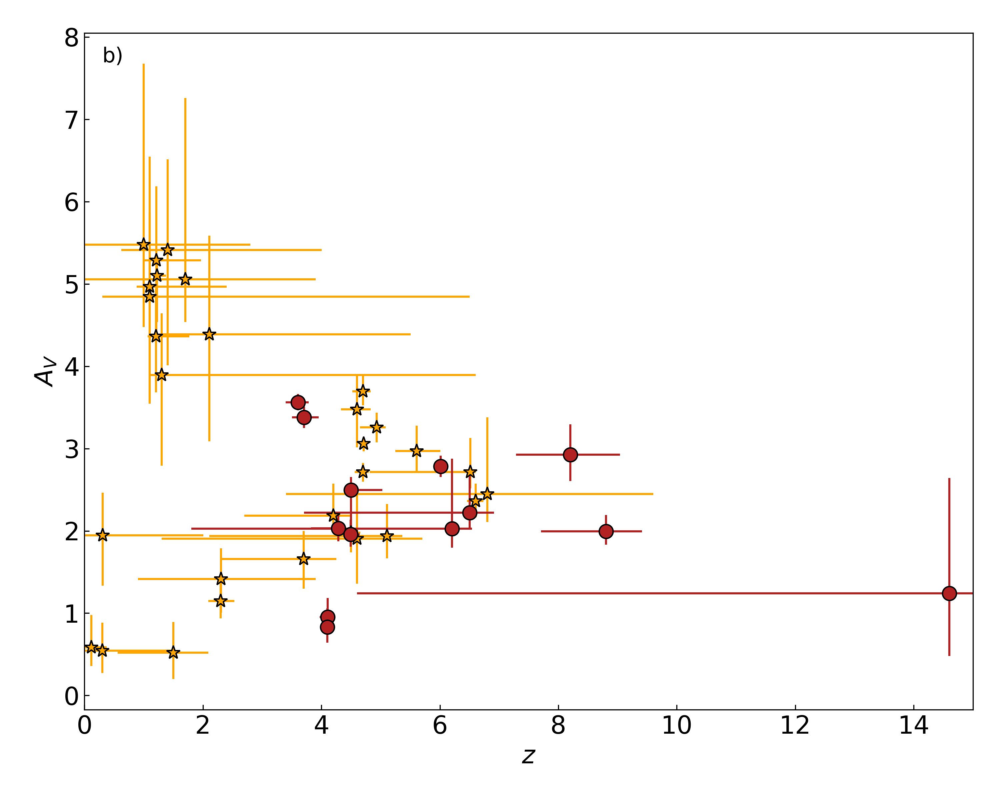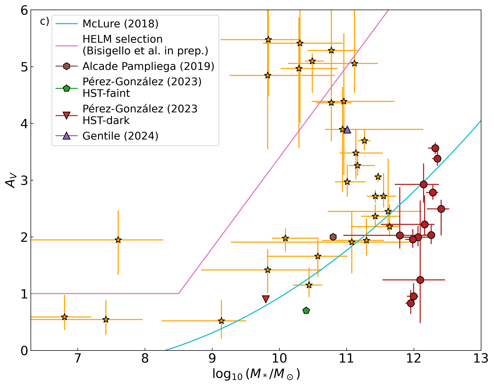

**Figure 3. -** Properties of the HIEROs. Panel a) shows the redshift versus stellar mass. The red circles show the most massive candidates, with stellar mass greater than $10^{11.7} M_\odot$. These objects are from here on defined as `overmassive' and shown with the same symbol, i.e., red circles, in all other panels. The solid lines report the minimum observable stellar mass producing an IRAC ch2 magnitude of $22.7$. All three curves represent star-forming galaxies, the green with an age between the redshift epoch and the burst peak of $200$ Myr, the teal one of $100$ Myr, and the dark blue one of $50$ Myr. In panel b) the redshift versus dust attenuation distribution is reported. Panel c) shows the dust attenuation versus stellar mass. The cyan solid line shows the relation from \cite{mclure2018dust}, while the magenta line delimits the area identifying the so-called HELM galaxies \citep{bisigello2025spectroscopic}. Different symbols report values from previous studies, as indicated in the legend. (*fig:physical_param*)

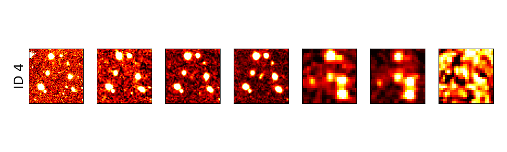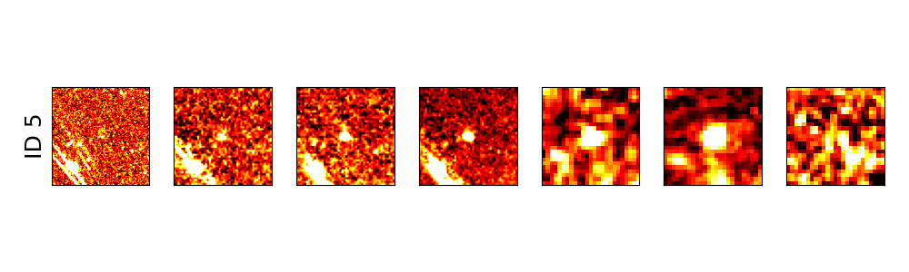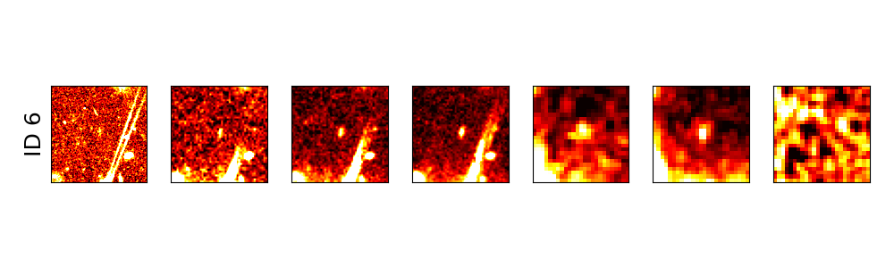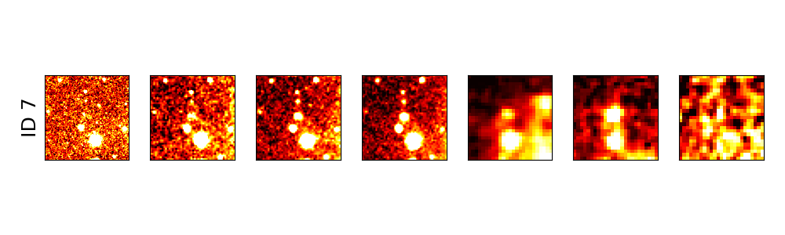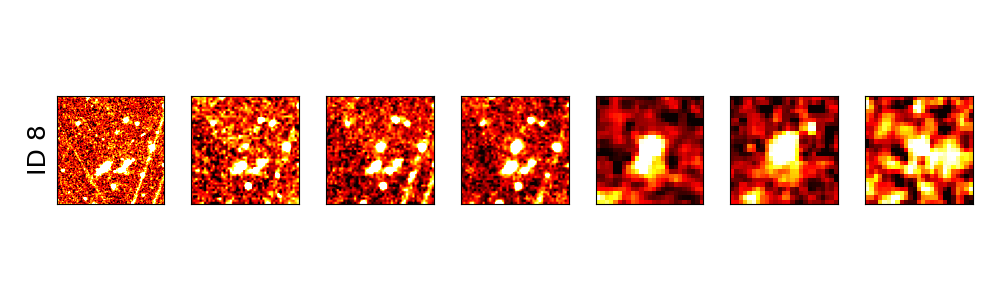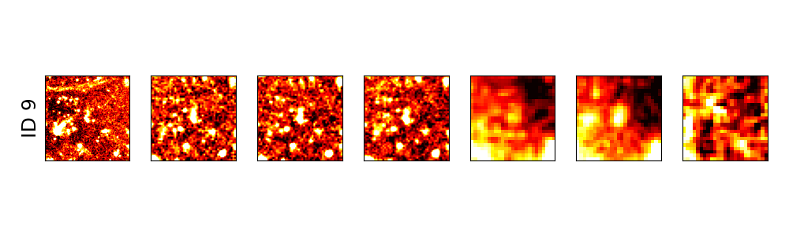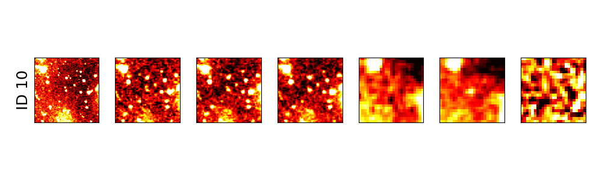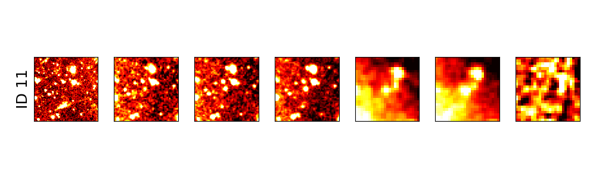

**Figure 9. -** Cutouts of all $42$ sources present in our final sample. ID $=13$ has already been shown in the main text. For IDs $ 1$ to $14$ and ID $=42, 43$, the sources belong to the first pointing, therefore having ch3 and not ch4. From ID $= 15$ until $43$, the objects are observed in ch4 and not in ch3; some of them are missing ch1 data because of the different image sizes (see the explanation in Sect. \ref{photom_analyses}). These cutouts are $15" \times 15"$. (*fig:cutouts*)

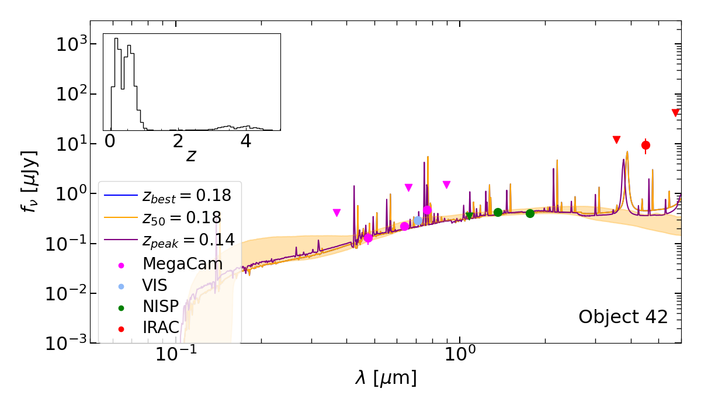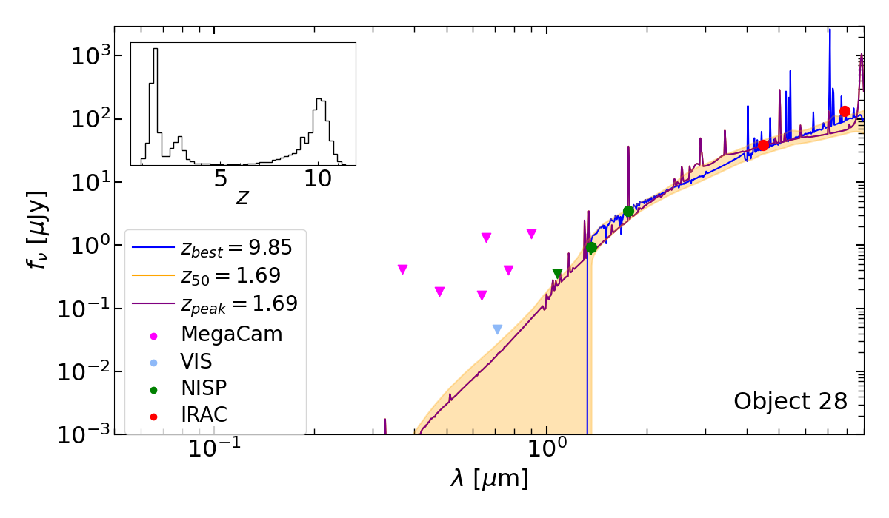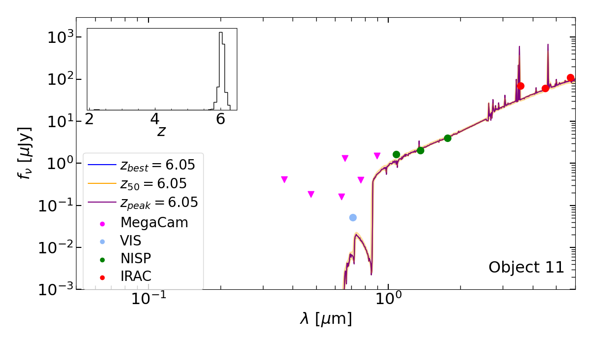

**Figure 2. -** \texttt{Bagpipes} fits to the SEDs for three representative objects, IDs $42$, $28$, and $11$. The posterior probability distributions for the redshifts, PDF($z$), are shown as insets. Photometric detections are shown by the coloured circles and 3$ \sigma$ upper limits are plotted as triangles. The coloured lines show the three different fits described in the text. The PDF for ID $42$ peaks at low redshift, while ID $28$ is bimodal and ID $11$ has a single high-redshift peak, making it representative of the objects that are likely to be HIEROs. (*fig:SED_fitting_examples*)

