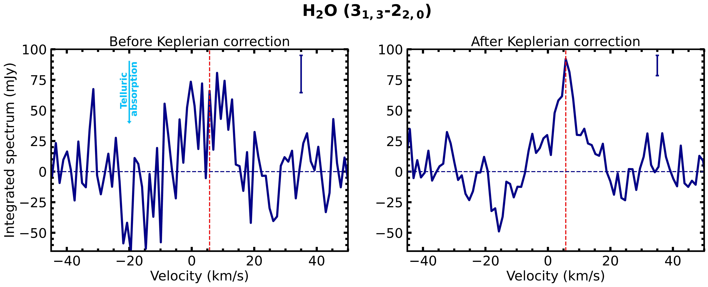

$\newcommand{\ensuremath}{}$
$\newcommand{\xspace}{}$
$\newcommand{\object}[1]{\texttt{#1}}$
$\newcommand{\farcs}{{.}''}$
$\newcommand{\farcm}{{.}'}$
$\newcommand{\arcsec}{''}$
$\newcommand{\arcmin}{'}$
$\newcommand{\ion}[2]{#1#2}$
$\newcommand{\textsc}[1]{\textrm{#1}}$
$\newcommand{\hl}[1]{\textrm{#1}}$
$\newcommand{\footnote}[1]{}$
$\newcommand{\kms}{km~s^{-1} }$
$\newcommand$
$\newcommand{\vdag}{(v)^\dagger}$
$\newcommand$
$\newcommand$

# Water vapor emission at the warm cavity wall of the HD 100546 disk as revealed by ALMA

<mark>Appeared on: 2025-12-09</mark> -  _13 pages, 6 figures. Accepted for publication in ApJ Letters December 5, 2025_

R. Luna, et al.

**Abstract:** We present spatially resolved ALMA observations of the water line at 183 GHz in the disk around the Herbig star HD 100546. The water vapor emission peaks at the inner edge of the warm dust cavity, located $\sim15$ au from the central star. We attribute this to thermal desorption at the water snowline, shifted outward at the dust cavity wall directly heated by the intense radiation. This represents the first spatially resolved image of the water snowline using ALMA observations of the main water isotopologue in a protoplanetary disk. The water emission morphology peaking inside the first dust ring is consistent with previous ALMA detections of oxygen-bearing complex organic molecules in the disk, including thermally desorbed methanol.These findings signal that warm cavities of transition disks provide ideal targets to directly reconstruct the spatial distribution of water vapor and the snowline location with ALMA, and directly connect water vapor emission to ice desorption of complex organic species.

**Figure 2. -** Radial profile of the integrated intensity of the water emission (blue line) compared to the continuum one (dashed black line). Blue ribbons show the uncertainty on the water radial profile. The light blue region indicates the radial extent of the 3$\mu$m water ice absorption band from Gemini observations \citep{honda2016}, and the vertical blue line shows the inner edge of the water emission inferred from _Herschel_ observations \citep[]{vandishoeck2021,pirovano2022}. The hatched region corresponds to the beam semi-major axis of the water cube used to extract the profile. The negative trend of the radial profile beyond 100 au seems to be an artifact due to negative sidelobes in the PSF. (*fig:radial_profile*)

**Figure 3. -** Disk-integrated spectrum of the \ce{H2O} line, extracted from a de-projected circle with a radius of 100 au (left panel), and after correcting for the Keplerian rotation (right panel). The vertical red dashed line indicates the systemic velocity of $5.7$ $\kms$, while the blue line on the top right side of each panel is the uncertainty. The dip in the spectrum in the left panel at $\sim-21$ $\kms$ is due to the low transmission at the peak of the atmospheric telluric water line (see Appendix \ref{app:noise} for details on the bandpass calibration and its effect on the retrieved water spectra). (*fig:spectrum*)

**Figure 6. -** Left: critical density as a function of temperature for the _Herschel_ lines included in \cite{pirovano2022}(solid lines) and the ALMA 183 GHz line (dashed). The colorbar shows the upper state energies of each transition. Right: Water column density from the DALI model of the HD 100546 disk from \cite{leemker2024}. The pink horizontal line indicates the density above which water self-shielding is expected to be important. The brown shaded region indicate the dust ring between 20 and 40 au. (*fig:model_water_ncr*)

