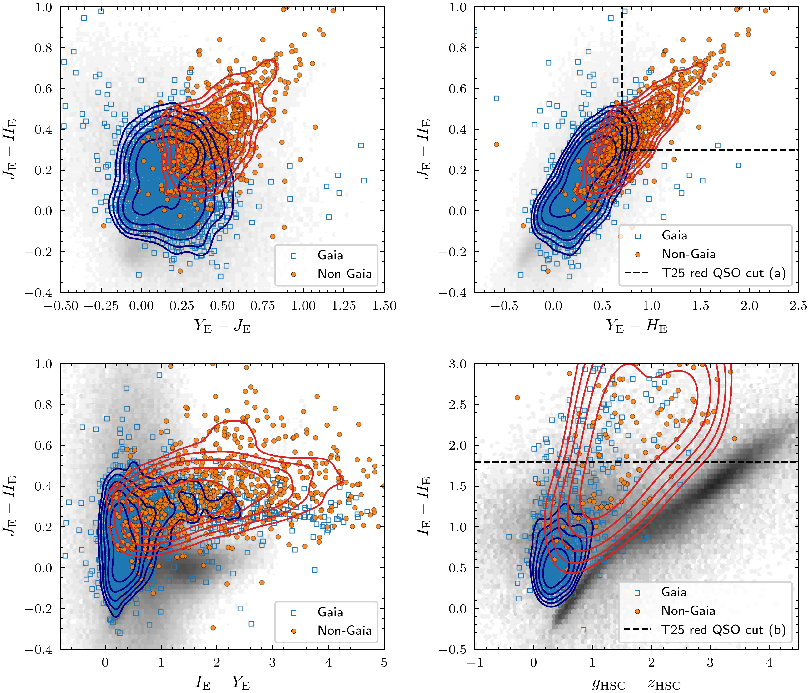

$\newcommand{\ensuremath}{}$
$\newcommand{\xspace}{}$
$\newcommand{\object}[1]{\texttt{#1}}$
$\newcommand{\farcs}{{.}''}$
$\newcommand{\farcm}{{.}'}$
$\newcommand{\arcsec}{''}$
$\newcommand{\arcmin}{'}$
$\newcommand{\ion}[2]{#1#2}$
$\newcommand{\textsc}[1]{\textrm{#1}}$
$\newcommand{\hl}[1]{\textrm{#1}}$
$\newcommand{\footnote}[1]{}$
$\newcommand{\orcid}[1]{\orcidlink{#1}}$
$\newcommand$
$\newcommand$
$\newcommand$
$\newcommand$
$\newcommand$
$\newcommand$
$\newcommand$
$\newcommand$
$\newcommand{\runin}[1]{\noindent\textbf{#1} }$

# Euclid Quick Data Release (Q1): $\Euclid$ spectroscopy of QSOs. 1. Identification and redshift determination of 3500 bright QSOs

<mark>Appeared on: 2025-12-10</mark> -  _24 pages, 15 figures, 5 tables, submitted to A&A Euclid Quick Data Release (Q1) special issue_

E. Collaboration, et al. -- incl., <mark>E. Bañados</mark>, <mark>J. Wolf</mark>, <mark>S. Belladitta</mark>

**Abstract:** The slitless spectroscopy mode of the $\ac{nisp}$ onboard the $\Euclid$ telescope has enabled efficient spectroscopy of objects within a large field of view. Nevertheless, the relatively low spectral resolution, overlapping spectra, and contamination pose challenges to source classification and redshift determination using the $\ac{nisp}$ spectra alone.In this work, we present a large and homogeneous sample of bright quasars identified from the Euclid Quick Data Release (Q1), constructed by combining high-purity candidate selections from $\gaia$ and WISE with the new spectroscopic capabilities of $\Euclid$ .Through visual inspection of the $\Euclid$ spectra of these quasar candidates, we identify approximately 3500 quasars with reliable redshifts in the range of $0< z \lesssim4.8$ . We generate the first $\Euclid$ composite spectrum of quasars covering rest-frame $\ac{nuv}$ to $\ac{nir}$ wavelengths without telluric lines, which will be pivotal to $\ac{nir}$ quasar spectral analysis. We obtain an empirical spectroscopic depth of $\JE \lesssim 21.5$ and $\HE \lesssim 21.3$ at the sensitivity of the Wide Field Survey, beyond which the number of securely identified quasars declines sharply. Accordingly, the sample presented in this paper comprises spectroscopically confirmed quasars brighter than these limits.We analyse VIS morphological parameters using Sérsic and model-independent (CAS) metrics, and a deep-learning $\ac{psf}$ fraction to track nuclear dominance. VIS morphologies show a clear redshift dependence: at low redshift ( $z<0.5$ ), obvious host structures are common and a single Sérsic model fits about half of the sources; at intermediate redshift ( $0.5<z<2$ ), the nuclear component dominates, with 90 \% of the Sérsic fits saturating at the upper index limit. In this intermediate redshift regime, $f_{\sfont{PSF}}$ is available, and we use it as a more reliable compactness measure than the single-Sérsic and CAS parameters to quantify nuclear versus host emission. We also explore the novel $\Euclid$ $\ac{nir}$ colour space and discuss the role of these quasars in refining $\ac{agn}$ selection techniques for future $\Euclid$ data releases. Our results highlight the potential of $\Euclid$ spectroscopy to advance quasar surveys and enable the construction of more complete $\ac{agn}$ catalogues.The spectroscopic bright quasar catalogue of this work, and the composite quasar spectrum, will be available at $\url{https://cdsarc.cds.unistra.fr/}$ .

**Figure 12. -** 
Same as \cref{fig:morph_vis_corner_lowz}, but for 2361 sources at $0.5<z<2$ with measurements of \ac{agn}\ac{psf} contribution fraction ($f_{\sfont{PSF}}$).
 (*fig:morph_vis_corner_fpsf*)

**Figure 14. -** \Euclid\ac{1d} spectra and imaging cutouts for a random sample of 10 low-redshift ($z<0.5$) sources.
Each panel displays the \ac{1d} spectrum (top) and five imaging cutouts with $10"$ sizes (bottom) in the \IE, \YE, \JE, and \HE bands, as well as a VIS-\YE composite. The composite image is generated by mapping the VIS and \YE fluxes into the blue and red channels, respectively, with their mean used for green, and the VIS band used to define overall luminosity in the L*a*b* colour space  (iso11664-4)  to enhance morphological detail. Major emission lines detected in the wavelength range [12 047, 18 734] Å are marked.  (*fig:cutouts-lowz*)

**Figure 7. -** \Euclid and external \citep[Hyper Suprime-Cam, HSC;][]{2018PASJ...70S...1M,2018PASJ...70S...4A} colour-colour diagrams of spectroscopically identified quasars in this work, where \gaia-detected sources are shown as blue open squares, and sources not in \gdr{3} are shown as orange circles. The density distribution of the \gaia-detected sample is indicated with blue contour lines, and that of the non-\gaia sample is indicated with red contour lines. The density of \Euclid point-like sources is shown as grey hexagonal binning plots in the background. (*fig:euclid_ccds*)

