

$\newcommand{\ensuremath}{}$
$\newcommand{\xspace}{}$
$\newcommand{\object}[1]{\texttt{#1}}$
$\newcommand{\farcs}{{.}''}$
$\newcommand{\farcm}{{.}'}$
$\newcommand{\arcsec}{''}$
$\newcommand{\arcmin}{'}$
$\newcommand{\ion}[2]{#1#2}$
$\newcommand{\textsc}[1]{\textrm{#1}}$
$\newcommand{\hl}[1]{\textrm{#1}}$
$\newcommand{\footnote}[1]{}$
$\newcommand$
$\newcommand$
$\newcommand$
$\newcommand{\arraystretch}{1.5}$
$\newcommand\natexlab{#1}$

# CASCADE: Filamentary accretion flows in Cygnus X DR20

<mark>Appeared on: 2025-12-11</mark> -  _16 pages, 14 figures, accepted for A&A_

M. Sawczuck, et al. -- incl., <mark>H. Beuther</mark>, <mark>C. Gieser</mark>, <mark>D. Semenov</mark>, <mark>M. Wells</mark>

**Abstract:** Filamentary gas flows are an important process for funneling gas from cloud scales onto star-forming cores. We investigate the role of filaments in high-mass star formation, whether gas flows from large to small scales along them, and what their properties might reveal about the region they are found in. The Max Planck IRAM Observatory Program (MIOP), the Cygnus Allscale Survey of Chemistry and Dynamical Environments (CASCADE), includes high spatial resolution ( $\sim$ 3 $"$ ) data of $\HCO$ $(1-0)$ and $\HttCO$ $(1-0)$ emission in the star-forming DR20 region in the Cygnus X complex. In this data we identify filaments with the structure identification algorithm DisPerSE. We further analyze these filaments using Gaussian fits to the spectra to determine the line peak velocity and full width half maximum along them. The Python package FilChaP was used to determine filament widths. We find projected velocity gradients inside several filaments between 0.4 to 2.4 $\kms$ over projected length-scales of 0.1 pc toward star-forming cores. This can be interpreted as a sign of gas flowing along the filaments toward the cores. The filament width distributions exhibit median values between 0.06 and 0.14 pc depending on the core, the tracer, and the method. Standard deviations are approximately 0.02 to 0.06 pc. These values are roughly in agreement with the filament width of 0.1 pc typically found in nearby low-mass star-forming regions. This first analysis of filamentary properties within the Cygnus X CASCADE program reveals potential signatures of gas flows along filaments onto star-forming cores. Furthermore, the characteristics of the filaments in this high-mass star-forming region can be compared to those of filaments in low-mass star-forming regions typically studied before. Extending such studies to the entire CASCADE survey will enhance our knowledge of high-mass filament properties on solid statistical grounds.

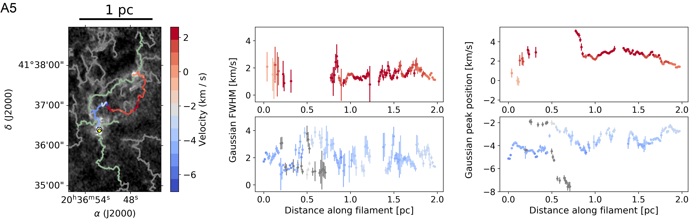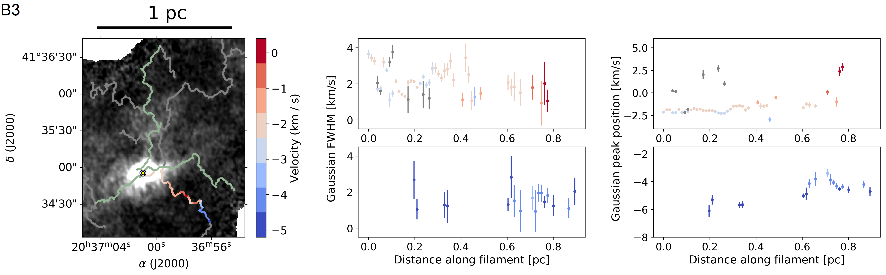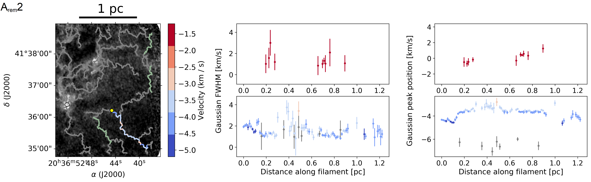

**Figure 8. -** FWHM and peak positions of the Gaussian fits to the spectra within filaments connected to cores A, B, D, and a remote area in \HCO._From top to bottom_: Cores A, B, D, and a remote area close to core A, respectively (A5, B3, D2, A$_{\text{rem}}$2). _Images_: \HCO$(1-0)$ zeroth moment map (see top left of Fig. \ref{plot_MIOP_filaments_0mom}). The white dot within the core indicates the coordinates of the continuum source, while the yellow dot indicates the filament “origin,” as described in the main text. The filament corresponding to the plots is shown in its velocity colors. Other analyzed filaments are shown in green, their plots can be found in supplementary material at Zenodo (Figs. B.1 and B.16). _Plots_: Gaussian fitted HCO$^+$ FWHM (left) and peak positions (right) of the spectra within the corresponding filament, plotted over the distance from the core. The yellow dot in the image corresponds to a distance of zero. If there is a significant amount of data points ($\geq$ 10) for a second spectral Gaussian peak, the positions of the higher velocity peaks (top) and the lower velocity peaks (bottom) are shown in separate plots. The peaks that do not clearly belong to either of the two components are shown in gray. The other data points are colored by their fitted peak positions. (*plot_along_chosen_HCO*)

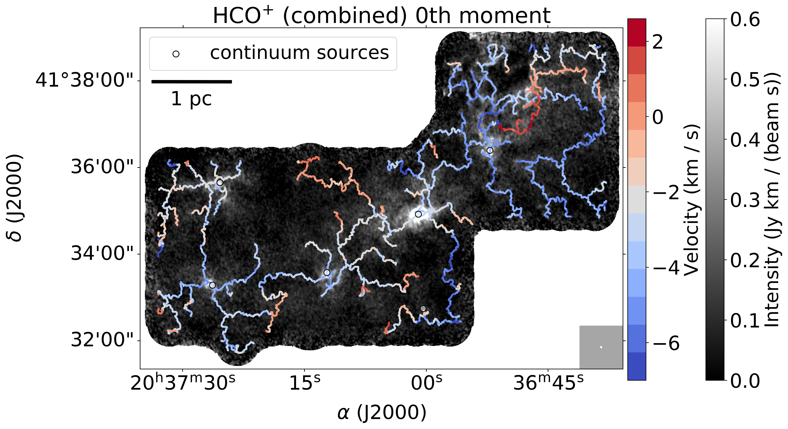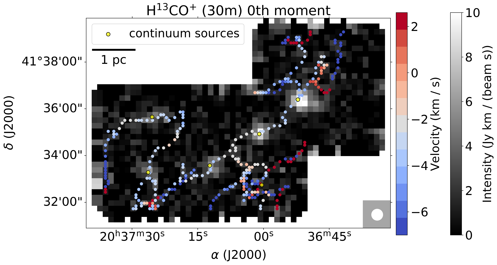

**Figure 6. -** Identified filaments in combined and 30 m \HCO  and \HttCO.Filaments identified with DisPerSE in all velocity channels (from -8.4 km s$^{-1}$ to 6 km s$^{-1}$) overlaid on the respective zeroth moment maps, i.e., the intensity integrated over all velocity channels, of all CASCADE data types. _Top_: Combined \HCO$(1-0)$(left) and \HttCO$(1-0)$(right). _Bottom_: Single-dish \HCO$(1-0)$(left) and \HttCO$(1-0)$(right). The intensity maxima of the 3.6 mm continuum emission are labeled A-F in the upper right panel. The beam is shown in the bottom-right of each panel. (*plot_MIOP_filaments_0mom*)

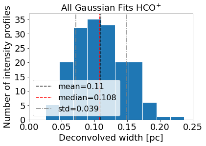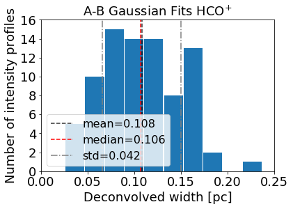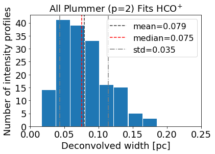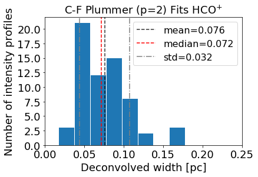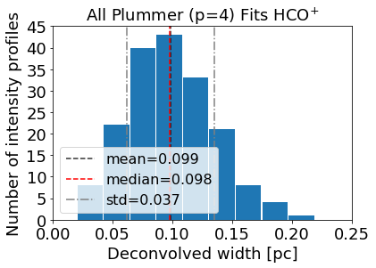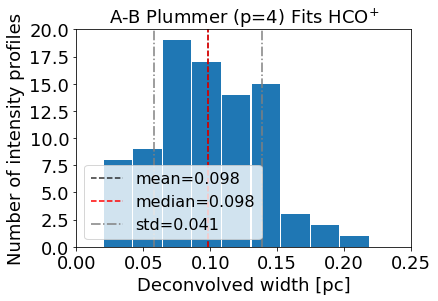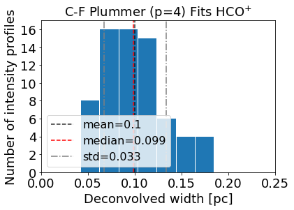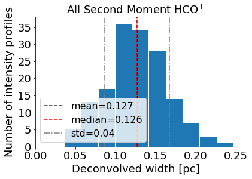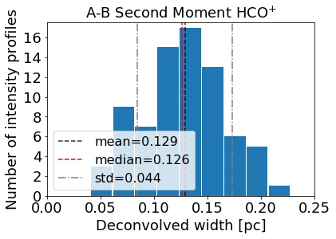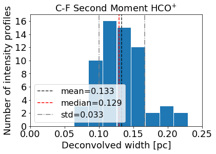

**Figure 12. -** Filament widths in \HCO of all analyzed filaments, and separated into younger and evolved cores, for all methods.All calculated de-convolved filament widths resulting from the different fits performed with FilChaP on the combined \HCO$(1-0)$ data. _Left column_: All regions including cores A to F and the remote filaments close to A and B. _Middle column_: Only filaments directly connected to the evolved regions A and B. _Right column_: Only filaments directly connected to the younger regions C, D, E, and F. _Rows_: Different fits, i.e., Gaussian, Plummer $p$ = 2 and $p$ = 4, and second moment, from top to bottom. (*plot_filchap_AB_CF*)

