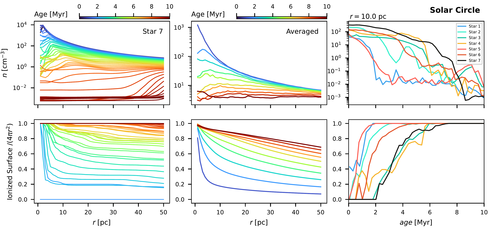
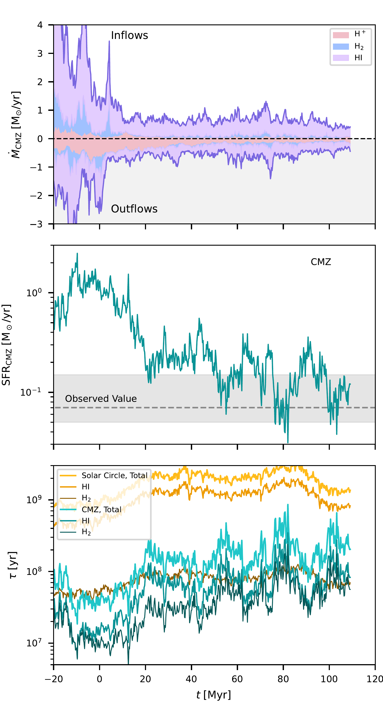

$\newcommand{\ensuremath}{}$
$\newcommand{\xspace}{}$
$\newcommand{\object}[1]{\texttt{#1}}$
$\newcommand{\farcs}{{.}''}$
$\newcommand{\farcm}{{.}'}$
$\newcommand{\arcsec}{''}$
$\newcommand{\arcmin}{'}$
$\newcommand{\ion}[2]{#1#2}$
$\newcommand{\textsc}[1]{\textrm{#1}}$
$\newcommand{\hl}[1]{\textrm{#1}}$
$\newcommand{\footnote}[1]{}$
$\newcommand{\Msun}{M_\odot}$
$\newcommand{ç}{cm^{-3}}$
$\newcommand{\EPFL}{Institute of Physics, Laboratory for Galaxy Evolution and Spectral Modelling, EPFL, Observatoire de Sauverny, Chemin Pegasi 51, 1290 Versoix, Switzerland}$
$\newcommand{\IAPS}{INAF -- Istituto di Astrofisica e Planetologia Spaziali, via Fosso del Cavaliere 100, 00133 Roma, Italy}$
$\newcommand{\IAA}{Instituto de Astrofísica de Andalucía, CSIC, Glorieta de la Astronomía s/n, E-18008 Granada, Spain}$
$\newcommand{\ZAHITA}{Universität Heidelberg, Zentrum für Astronomie, Institut für Theoretische Astrophysik, Albert-Ueberle-Straße 2, D-69120 Heidelberg, Germany}$
$\newcommand{\CLAP}{Como Lake centre for AstroPhysics (CLAP), DiSAT, Universit{à} dell’Insubria, via Valleggio 11, 22100 Como, Italy}$
$\newcommand{\ENSL}{ENS de Lyon, CRAL UMR5574, Universite Claude Bernard Lyon 1, CNRS, Lyon 69007, France}$
$\newcommand{\MPIA}{Max-Planck-Institut für Astronomie, Königstuhl 17, D-69117, Heidelberg, Germany}$
$\newcommand{\UConn}{University of Connecticut, Storrs, CT, USA}$
$\newcommand{\chalmers}{Space, Earth and Environment Department, Chalmers University of Technology, SE-412 96 Gothenburg, Sweden}$
$\newcommand{\UniFi}{University of Florence, Department of Physics and Astronomy, via G. Sansone 1, 50019 Sesto Fiorentino, Firenze, Italy}$
$\newcommand{\IWR}{Universität Heidelberg, Interdisziplinäres Zentrum für Wissenschaftliches Rechnen, Im Neuenheimer Feld 225, 69120 Heidelberg, Germany}$
$\newcommand{\UniWien}{University of Vienna, Department of Astrophysics, Türkenschanzstra{\ss}e 17, 1180 Vienna ,  Austria}$
$\newcommand{\UniStA}{SUPA, School of Physics and Astronomy, University of St Andrews, North Haugh, St Andrews, KY16 9SS, UK}$
$\newcommand{\LJMU}{Astrophysics Research Institute, Liverpool John Moores University, 146 Brownlow Hill, Liverpool, L3 5RF, UK}$

# Rhea-RT: Dynamical impact of Central Molecular Zone conditions on ISM properties and stellar feedback coupling

<mark>Appeared on: 2025-12-12</mark> -  _22 pages, 25 figures, submitted to A&A_

R. Tress, et al. -- incl., <mark>J. Henshaw</mark>

**Abstract:** The Central Molecular Zone (CMZ) is an extreme star formation environment, characterized by higher density, higher turbulence, stronger orbital shear, and stronger magnetic field strength than the Solar neighborhood. Whether classical theories of star formation hold within this extreme environment is still debated. In order to assess the impact of these different conditions on the interstellar medium (ISM) and on star formation, we present radiation MHD ${\sc arepo}$ simulations of a Milky Way-type galaxy. We set up a high-resolution ( $M_{\rm cell}=20$  $\Msun$ ) region in a ring around the Solar radius, as well as in the barred region of the Galaxy to have a coherent comparison between the CMZ and the Solar neighborhood. Although the high densities and strong levels of turbulence influence star formation and feedback, we find that a key difference in the regulation of star formation between the two environments comes from the short orbital times and the strong shear present in the CMZ. In particular, we highlight the role of the quick dynamical decoupling of stars and gas that leads to periodic re-embedding events in the early lifetimes of radiating O stars. Young stellar associations get efficiently sheared apart such that the ISM is deprived of the compounding effect of radiation and supernovae in disrupting molecular clouds. This changes dramatically the evolution of giant molecular clouds and how feedback can regulate star formation in the CMZ. Stellar feedback is no longer directly coupled to the molecular cloud from which they formed and no strong and disruptive superbubbles can develop. Instead, the feedback rather acts as a background source of turbulence.

**Figure 14. -** Schematic representation of the assembly and disruption of a GMC. Stars form as the cloud is assembling (panel a,b and c), until their combined feedback is strong enough to disrupt the cloud from within (panel d). (*fig:SkechDisk*)

**Figure 23. -** Density and ionization profile around O stars. The top two rows are the case for the Solar Circle, and the bottom two rows for the CMZ. For each row, the first column is an example for one selected star, while the second column is the average over all stellar particles in the region (Solar circle or CMZ) that contain at least one O star. For each region, the first row shows the density as a function of distance from the O stars, averaged over spherical shells. The second row depicts the fraction of the surface that the O stars are helping to keep ionized, i.e. the fraction of a surface of a given radius centered on the star for which a ray passes only through ionized gas ($x_{\rm H^+} > 0.5$). These quantities are shown at different ages of the star particles. The last column shows the time evolution of the environment around a selection of seven O stars at a radius of 10 pc. (*fig:HIIRegion*)

**Figure 5. -** Gas inflow/outflow to the CMZ (top), star formation rate in the CMZ (middle) and depletion times for the CMZ and Solar Circle (bottom) as a function of simulation time. Inflows and outflows are shown separately and the different gas phases stacked in different color to show the contribution of each phase to the total gas inflow/outflow shown as the solid purple line. Depletion times for the atomic, molecular and total gas are shown separately. The observed SFR value for the CMZ and its uncertainty is shown as the dashed line and shaded region in the middle panel. (*fig:SFR2*)

